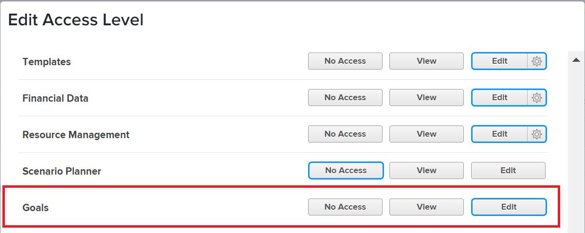

# Concedere l’accesso agli obiettivi di Adobe Workfront

In qualità di amministratore di Adobe Workfront, puoi utilizzare un livello di accesso per definire l&#39;accesso di un utente agli Obiettivi di Adobe Workfront, come spiegato in [Panoramica sui livelli di accesso](../../../administration-and-setup/add-users/access-levels-and-object-permissions/access-levels-overview.md).

## Requisiti di accesso

Per consentire agli utenti di accedere agli obiettivi di Workfront, è necessario disporre dei seguenti elementi:

<table style="table-layout:auto"> 
 <col> 
 <col> 
 <tbody> 
  <tr> 
   <td role="rowheader">piano Workfront</td> 
   <td> 
Pro o superiore
 </td> 
  </tr> 
  <tr> 
   <td role="rowheader">Licenza Adobe Workfront*</td> 
   <td>Piano</td> 
  </tr> 
  <tr> 
   <td role="rowheader">Prodotto</td> 
   <td>Workfront Goals 
Contatta il tuo account manager Workfront per saperne di più su una licenza Workfront Goals. 
 
Workfront Goals è disponibile solo nella nuova esperienza Adobe Workfront.
 </td> 
  </tr> 
  <tr> 
   <td role="rowheader">Configurazione del livello di accesso*</td> 
   <td> 
È necessario disporre del livello di accesso Amministratore di sistema.
 
<b>NOTA</b>: se non disponi ancora dell'accesso, chiedi all'amministratore di Workfront se ha impostato restrizioni aggiuntive nel tuo livello di accesso. Per informazioni su come un amministratore di Workfront può modificare il tuo livello di accesso, consulta <a href="../../../administration-and-setup/add-users/configure-and-grant-access/create-modify-access-levels.md" class="MCXref xref" data-mc-variable-override="">Creare o modificare livelli di accesso personalizzati</a>.
 </td> 
  </tr> 
 </tbody> 
</table>

&#42;Per conoscere il piano, il tipo di licenza o il livello di accesso di cui si dispone, contattare l&#39;amministratore Workfront.

Per ulteriori informazioni sull&#39;accesso agli obiettivi di Workfront, vedere [Requisiti per l&#39;utilizzo degli obiettivi di Workfront](../../../workfront-goals/goal-management/access-needed-for-wf-goals.md).

## Concedere l’accesso agli obiettivi di Workfront tramite un livello di accesso personalizzato

1. Iniziare a creare o modificare il livello di accesso, come descritto in [Creare o modificare livelli di accesso personalizzati](../../../administration-and-setup/add-users/configure-and-grant-access/create-modify-access-levels.md).
1. Fai clic sull&#39;opzione a destra di **Obiettivi** che desideri utilizzare per questo livello di accesso.

   

   >[!NOTE]
   >
   >Il tipo di licenza Esterna non consente l’accesso in Visualizzazione o Modifica agli obiettivi di Workfront.

1. (Facoltativo) Per configurare le impostazioni di accesso per altri oggetti e aree nel livello di accesso su cui stai lavorando, continua con uno degli articoli elencati in [Configura l&#39;accesso ad Adobe Workfront](../../../administration-and-setup/add-users/configure-and-grant-access/configure-access.md), ad esempio [Concedi l&#39;accesso alle attività](../../../administration-and-setup/add-users/configure-and-grant-access/grant-access-tasks.md) e [Concedi l&#39;accesso ai dati finanziari](../../../administration-and-setup/add-users/configure-and-grant-access/grant-access-financial.md).
1. Al termine, fare clic su **Salva**.

## Accesso a Workfront Goals per tipo di licenza

Un amministratore di Workfront può utilizzare un livello di accesso per concedere l’accesso agli obiettivi di Workfront agli utenti con una licenza Pianificazione, Lavoro, Richiesta o Revisione.
