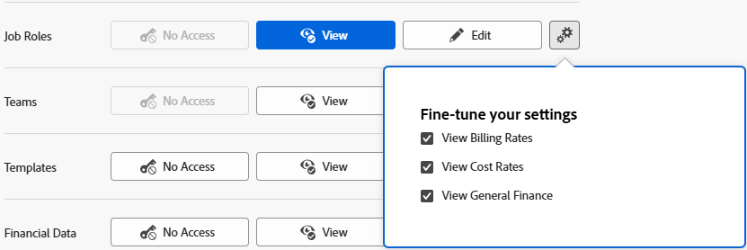

# Concedere l’accesso alle mansioni

In qualità di amministratore di Adobe Workfront, puoi definire l&#39;accesso di un utente alle mansioni tramite il suo livello di accesso, come spiegato in [Panoramica sui livelli di accesso](../../../administration-and-setup/add-users/access-levels-and-object-permissions/access-levels-overview.md).

Per informazioni sui ruoli, vedere [Creare e gestire i ruoli](/help/quicksilver/administration-and-setup/set-up-workfront/organizational-setup/create-manage-job-roles.md).

## Requisiti di accesso

+++ Espandi per visualizzare i requisiti di accesso per la funzionalità descritta in questo articolo.

<table style="table-layout:auto"> 
 <col> 
 <col> 
 <tbody> 
  <tr> 
   <td role="rowheader">Pacchetto Adobe Workfront</td> 
   <td>Qualsiasi</td> 
  </tr> 
  <tr> 
   <td role="rowheader">Licenza di Adobe Workfront</td> 
   <td>   
Standard

   
Piano
</td> 
  </tr> 
  <tr> 
   <td role="rowheader">Configurazioni del livello di accesso</td> 
   <td> 
Devi essere un amministratore di Workfront.
 </td> 
  </tr> 
 </tbody> 
</table>

Per ulteriori dettagli sulle informazioni contenute in questa tabella, consulta [Requisiti di accesso nella documentazione Workfront](/help/quicksilver/administration-and-setup/add-users/access-levels-and-object-permissions/access-level-requirements-in-documentation.md).

+++

## Configurare l’accesso degli utenti per la modifica dei ruoli tramite un livello di accesso personalizzato

1. Iniziare a creare o modificare il livello di accesso, come descritto in [Creare o modificare livelli di accesso personalizzati](../../../administration-and-setup/add-users/configure-and-grant-access/create-modify-access-levels.md).
1. Fai clic sull&#39;icona a forma di ingranaggio  sul pulsante **Visualizza** o **Modifica** a destra dei Ruoli, quindi seleziona le abilità che desideri concedere in **Ottimizza le impostazioni**.

   >[!NOTE]
   >
   >**Visualizza** è l&#39;accesso predefinito per le mansioni.

   

   Gli utenti con l&#39;accesso **Visualizza** possono visualizzare le mansioni esistenti ed effettuare le seguenti operazioni:

   * Visualizza tariffe di fatturazione per mansioni
   * Visualizza tassi di costo per mansioni
   * Visualizza campi contabilità generale (non correlati a fatturazione o tassi di costo) sulle mansioni

   Gli utenti con l&#39;accesso **Modifica** possono visualizzare e modificare le mansioni esistenti e, facoltativamente, eseguire le operazioni seguenti:

   * Crea nuove mansioni
   * Eliminare le mansioni
   * Modifica tariffe di fatturazione per le mansioni
   * Modifica tassi di costo per mansioni
   * Modifica campi contabilità generale (non correlati a fatturazione o tassi di costo) sulle mansioni
   * Visualizza tassi di fatturazione mansione, tassi di costo e campi finanziari generali

1. (Facoltativo) Per configurare le impostazioni di accesso per altri oggetti e aree nel livello di accesso su cui stai lavorando, continua con uno degli articoli elencati in [Configurare l&#39;accesso ad Adobe Workfront](../../../administration-and-setup/add-users/configure-and-grant-access/configure-access.md), ad esempio [Concedere l&#39;accesso alle attività](../../../administration-and-setup/add-users/configure-and-grant-access/grant-access-tasks.md).
1. Al termine, fare clic su **Salva**.

   Dopo aver creato il livello di accesso, puoi assegnarlo a un utente. Per ulteriori informazioni, vedere [Modificare il profilo di un utente](../../../administration-and-setup/add-users/create-and-manage-users/edit-a-users-profile.md).

## Accesso alle mansioni per tipo di licenza

Per informazioni sulle operazioni che gli utenti di ogni livello di accesso possono eseguire con le mansioni, vedere la sezione [Mansioni](/help/quicksilver/administration-and-setup/add-users/how-access-levels-work/functionality-available-for-objects.md#job-roles) nell&#39;articolo [Funzionalità disponibile per ogni tipo di oggetto](../../../administration-and-setup/add-users/access-levels-and-object-permissions/functionality-available-for-each-object-type.md).
