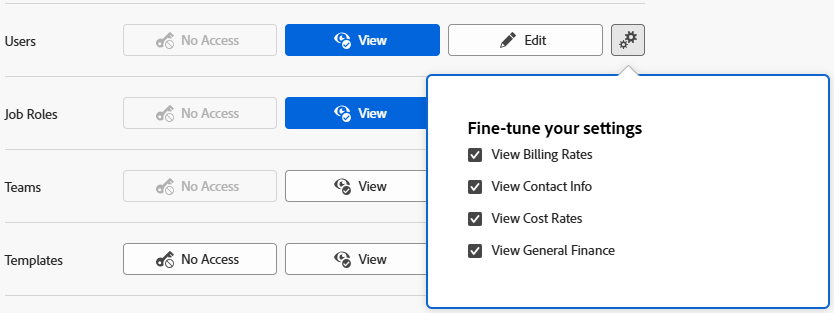

# Concedere l’accesso agli utenti

In qualità di amministratore di Adobe Workfront, puoi utilizzare un livello di accesso per definire l&#39;accesso di un utente ad altri utenti in Workfront, come spiegato in [Panoramica sui livelli di accesso](../../../administration-and-setup/add-users/access-levels-and-object-permissions/access-levels-overview.md).

## Requisiti di accesso

+++ Espandi per visualizzare i requisiti di accesso per la funzionalità descritta in questo articolo.

<table style="table-layout:auto"> 
 <col> 
 <col> 
 <tbody> 
  <tr> 
   <td role="rowheader">Pacchetto Adobe Workfront</td> 
   <td>Qualsiasi</td> 
  </tr> 
  <tr> 
   <td role="rowheader">Licenza di Adobe Workfront</td> 
   <td>
Standard

   
Piano
</td> 
  </tr> 
  <tr> 
   <td role="rowheader">Configurazioni del livello di accesso</td> 
   <td> 
Devi essere un amministratore di Workfront.
 </td> 
  </tr> 
 </tbody> 
</table>

Per ulteriori dettagli sulle informazioni contenute in questa tabella, consulta [Requisiti di accesso nella documentazione Workfront](/help/quicksilver/administration-and-setup/add-users/access-levels-and-object-permissions/access-level-requirements-in-documentation.md).

+++

## Configurazione dell’accesso agli utenti

È possibile gestire le informazioni che gli utenti possono visualizzare e modificare per altri utenti utilizzando un livello di accesso predefinito o personalizzato. Gli utenti con le licenze Standard, Plan e Work predefinite possono visualizzare le informazioni di contatto di altri utenti. Uno dei seguenti utenti può creare e modificare altri utenti:

* Un amministratore Workfront.

  Per ulteriori informazioni, consulta [Concedere a un utente l’accesso amministrativo completo](../../../administration-and-setup/add-users/configure-and-grant-access/grant-a-user-full-administrative-access.md).

* Utente con una licenza Standard o Plan predefinita che ha anche accesso agli utenti, come spiegato in questo articolo.

  Gli utenti che non possono vedere solo gli utenti della propria società o della società principale hanno accesso alla modifica solo per gli utenti che possono vedere. Per ulteriori informazioni, vedere [Creare o modificare livelli di accesso personalizzati](../../../administration-and-setup/add-users/configure-and-grant-access/create-modify-access-levels.md).

* Utente con una licenza Standard o Plan predefinita che è anche specificato come manager di un altro utente.

  Gli utenti che dispongono dell’accesso di modifica al loro livello di accesso possono gestire gli utenti che fanno riferimento a loro. Per informazioni sulla gestione di un utente, vedere [Visualizzare l&#39;organigramma](../../../people-teams-and-groups/work-directly-with-others/view-the-org-chart.md).

* L’utente con una licenza Standard o Plan predefinita che ha creato un utente può disattivare, eliminare o modificare l’utente creato. Per informazioni sulla creazione di nuovi utenti, vedere [Aggiungi utenti](../../../administration-and-setup/add-users/create-and-manage-users/add-users.md).

## Configurare l’accesso degli utenti per la modifica degli utenti utilizzando un livello di accesso personalizzato

1. Iniziare a creare o modificare il livello di accesso, come descritto in [Creare o modificare livelli di accesso personalizzati](../../../administration-and-setup/add-users/configure-and-grant-access/create-modify-access-levels.md).
1. Per modificare la possibilità degli utenti con una licenza Standard, Plan o Work di visualizzare informazioni per altri utenti, fai clic sull&#39;icona a forma di ingranaggio  sul pulsante **Visualizza** a destra di **Utenti**, quindi seleziona le opzioni di visualizzazione che desideri concedere nella casella **Ottimizza le impostazioni**:

   <table style="table-layout:auto"> 
    <col> 
    <col> 
    <tbody> 
     <tr> 
      <td role="rowheader"><strong>Visualizza tariffe di fatturazione</strong> </td> 
      <td> Consente agli utenti di visualizzare le tariffe di fatturazione sui profili utente.</td>  
     </tr> 
     <tr> 
      <td role="rowheader"><strong>Visualizza informazioni contatto</strong> </td> 
      <td> Consente agli utenti di visualizzare le pagine dei dettagli utente di altri utenti.</td> 
     </tr> 
     <tr> 
      <td role="rowheader"><strong>Visualizza tariffe</strong> </td> 
      <td> Consente agli utenti di visualizzare i tassi di costo nei profili utente.</td> 
     </tr> 
     <tr> 
      <td role="rowheader"><strong>Visualizza contabilità generale</strong> </td> 
      <td> Consente agli utenti di visualizzare i campi di contabilità generale (non correlati a fatturazione o tassi di costo) sui profili utente.</td>
     </tr> 
    </tbody> 
   </table>

   

1. Per modificare la possibilità degli utenti con un accesso alla licenza Standard o Plan di modificare altri utenti, fai clic sull&#39;icona a forma di ingranaggio  sul pulsante **Modifica** a destra di **Utenti**, quindi seleziona le opzioni di modifica che desideri concedere nella casella **Ottimizza le impostazioni**:

   <table style="table-layout:auto"> 
    <col> 
    <col> 
    <tbody> 
     <tr> 
      <td role="rowheader"><strong>Creare </strong> </td> 
      <td> 
Consente agli utenti di creare utenti. Questa opzione è attivata per impostazione predefinita.
 
     
<b>NOTA</b>: questa opzione non è disponibile se l'organizzazione è stata integrata in Adobe Admin Console. Per ulteriori informazioni, rivolgersi all'amministratore di rete o IT.<!--Check this October 2026-->

        </td>  
     </tr> 
     <tr> 
      <td role="rowheader"><strong>Elimina</strong> </td> 
      <td> 
 Consente agli utenti di eliminare gli utenti che hanno creato personalmente. Questa opzione è attivata per impostazione predefinita.
 
<b>NOTA</b>: questa opzione non è disponibile se l'organizzazione è stata integrata in Adobe Admin Console. Per ulteriori informazioni, rivolgersi all'amministratore di rete o IT.<!--Check this October 2026-->
 </td> 
     </tr> 
     <tr> 
      <td role="rowheader"><strong>Modifica tariffe di fatturazione</strong> </td> 
      <td> Consente agli utenti di modificare le tariffe di fatturazione sui profili utente.</td>  
     </tr> 
     <tr> 
      <td role="rowheader"><strong>Modifica tariffe</strong> </td> 
      <td> Consente agli utenti di modificare i tassi di costo nei profili utente.</td> 
     </tr> 
     <tr> 
      <td role="rowheader"><strong>Modifica contabilità generale</strong> </td> 
      <td> Consente agli utenti di modificare i campi di contabilità generale (non correlati a fatturazione o tassi di costo) nei profili utente.</td>
     </tr> 
     <tr> 
      <td role="rowheader"><strong>Amministratore utenti (tutti gli utenti)</strong> </td> 
      <td> 
Consente agli utenti di effettuare le seguenti operazioni per qualsiasi utente in Workfront:
 
       <ul> 
        <li>Modifica, elimina o disattiva l'utente</li> 
        <li>Accedi come utente
<b>NOTA</b>: non è possibile accedere come qualsiasi utente che sia un amministratore di sistema.
</li> 
        <li>Reimposta password utente</li> 
       </ul> 
Questa opzione è disabilitata per impostazione predefinita.
 </td> 
     </tr> 
     <tr> 
      <td role="rowheader"><strong>Amministratore utenti (Utenti gruppi)</strong> </td> 
      <td> 
Consente agli utenti di effettuare le seguenti operazioni per qualsiasi utente di un gruppo amministrato: 
        <ul>
         <li>
Modifica, elimina o disattiva l'utente
</li>
         <li>Accedi come utente</li>
         <li>
Reimposta password utente

<b>NOTA</b>: un amministratore di gruppo non può accedere come amministratore di Workfront né reimpostare la password di tale amministratore.
</li>
        </ul>
Questa opzione è disabilitata per impostazione predefinita.

 </td> 
     </tr> 
     <tr> 
      <td role="rowheader"><strong>Visualizza tariffe di fatturazione</strong> </td> 
      <td> Consente agli utenti di visualizzare le tariffe di fatturazione sui profili utente.</td>  
     </tr>
     <tr> 
      <td role="rowheader"><strong>Visualizza tariffe</strong> </td> 
      <td> Consente agli utenti di visualizzare i tassi di costo nei profili utente.</td> 
     </tr> 
     <tr> 
      <td role="rowheader"><strong>Visualizza contabilità generale</strong> </td> 
      <td> Consente agli utenti di visualizzare i campi di contabilità generale (non correlati a fatturazione o tassi di costo) sui profili utente.</td>
     </tr>
    </tbody> 
   </table>

   >[!TIP]
   >
   >Se non si desidera concedere agli amministratori di gruppi l&#39;accesso a tutti i membri dei gruppi da essi amministrati, disattivare entrambe le opzioni Amministratore utenti descritte sopra. Gli amministratori di gruppi potranno comunque accedere ai membri del gruppo che aggiungono a Workfront o che fanno riferimento a loro in Workfront.

1. (Facoltativo) Per configurare le impostazioni di accesso per altri oggetti e aree nel livello di accesso su cui stai lavorando, continua con uno degli articoli elencati in [Configura l&#39;accesso ad Adobe Workfront](../../../administration-and-setup/add-users/configure-and-grant-access/configure-access.md), ad esempio [Concedi l&#39;accesso alle attività](../../../administration-and-setup/add-users/configure-and-grant-access/grant-access-tasks.md) e [Concedi l&#39;accesso ai dati finanziari](../../../administration-and-setup/add-users/configure-and-grant-access/grant-access-financial.md).
1. Al termine, fare clic su **Salva**.

## Accesso agli utenti per tipo di licenza

Per informazioni sulle operazioni che gli utenti possono eseguire con gli utenti in ogni livello di accesso, vedere la sezione [Utenti](../../../administration-and-setup/add-users/access-levels-and-object-permissions/functionality-available-for-each-object-type.md#users) nell&#39;articolo [Funzionalità disponibile per ogni tipo di oggetto](../../../administration-and-setup/add-users/access-levels-and-object-permissions/functionality-available-for-each-object-type.md).
