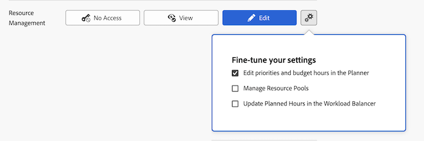

# Concedere l’accesso a Gestione risorse

In qualità di amministratore di Adobe Workfront, puoi utilizzare un livello di accesso per definire l’accesso di un utente alla gestione delle risorse, come spiegato in [Panoramica dei livelli di accesso](../../../administration-and-setup/add-users/access-levels-and-object-permissions/access-levels-overview.md).

## Requisiti di accesso

Per eseguire i passaggi descritti in questo articolo, è necessario disporre dei seguenti diritti di accesso:

<table style="table-layout:auto"> 
 <col> 
 <col> 
 <tbody> 
  <tr> 
   <td role="rowheader">piano Adobe Workfront</td> 
   <td>Qualsiasi</td> 
  </tr> 
  <tr> 
   <td role="rowheader">Licenza Adobe Workfront</td> 
   <td>Piano</td> 
  </tr> 
  <tr> 
   <td role="rowheader">Configurazioni a livello di accesso</td> 
   <td> 
Devi essere un amministratore Workfront.
 
<b>NOTA</b>: Se non disponi ancora dell’accesso, chiedi all’amministratore Workfront se ha impostato ulteriori restrizioni nel livello di accesso. Per informazioni su come un amministratore Workfront può modificare il livello di accesso, consulta <a href="../../../administration-and-setup/add-users/configure-and-grant-access/create-modify-access-levels.md" class="MCXref xref" data-mc-variable-override="">Creare o modificare livelli di accesso personalizzati</a>.
 </td> 
  </tr> 
 </tbody> 
</table>

## Configurare l’accesso degli utenti agli strumenti di gestione delle risorse utilizzando un livello di accesso personalizzato

1. Inizia a creare o modificare il livello di accesso, come spiegato in [Creare o modificare livelli di accesso personalizzati](../../../administration-and-setup/add-users/configure-and-grant-access/create-modify-access-levels.md).
1. Fai clic sull’icona a forma di ingranaggio  sulla **Visualizza** o **Modifica** a destra di Gestione risorse, quindi selezionare le capacità che si desidera concedere in **Ottimizzare le impostazioni**.

   

   <table style="table-layout:auto"> 
    <col> 
    <col> 
    <tbody> 
     <tr> 
      <td role="rowheader">Modifica priorità e ore preventivate nella Programmazione</td> 
      <td> 
Consente agli utenti con questa licenza di eseguire le seguenti operazioni:
 
Assegnare priorità ai progetti nel Planner risorse.
 
Allocazione budget per le risorse negli strumenti di pianificazione delle risorse (la sezione Planner risorse e Budget risorse nel caso aziendale di un progetto).
 
Questa opzione è attivata per impostazione predefinita.
 </td> 
     </tr> 
     <tr> 
      <td role="rowheader">Gestisci gruppi di risorse</td> 
      <td> 
Consente agli utenti con questa licenza di creare, modificare ed eliminare i pool di risorse. Questa opzione è disabilitata per impostazione predefinita.
 </td> 
     </tr> 
     <tr data-mc-conditions=""> 
      <td role="rowheader">Aggiorna le ore pianificate nel Bilanciatore dei carichi di lavoro </td> 
      <td> 
Consente agli utenti con questa licenza di aggiornare l'orario pianificato degli elementi di lavoro quando aggiornano le allocazioni degli utenti nel servizio di bilanciamento del carico di lavoro. Il numero totale di ore assegnate diventa l'orario pianificato degli elementi di lavoro.
 
Questa opzione è disabilitata per impostazione predefinita.
 
 Per ulteriori informazioni, consulta <a href="../../../resource-mgmt/workload-balancer/manage-user-allocations-workload-balancer.md" class="MCXref xref">Gestire le allocazioni di utenti nel load balancer</a>.
 </td> 
     </tr> 
    </tbody> 
   </table>

1. (Facoltativo) Per configurare le impostazioni di accesso per altri oggetti e aree nel livello di accesso su cui stai lavorando, continua con uno degli articoli elencati in [Configurare l’accesso ad Adobe Workfront](../../../administration-and-setup/add-users/configure-and-grant-access/configure-access.md), quali [Concedere l’accesso alle attività](../../../administration-and-setup/add-users/configure-and-grant-access/grant-access-tasks.md) e [Concedere l’accesso ai dati finanziari](../../../administration-and-setup/add-users/configure-and-grant-access/grant-access-financial.md).
1. Al termine, fai clic su **Salva**.

   Una volta creato il livello di accesso, puoi assegnarlo a un utente. Per ulteriori informazioni, consulta [Modificare il profilo di un utente](../../../administration-and-setup/add-users/create-and-manage-users/edit-a-users-profile.md).

## Accesso alla gestione delle risorse per tipo di licenza

Per informazioni sulle operazioni che gli utenti di ciascun livello di accesso possono eseguire con Gestione risorse, consulta la sezione . [Gestione risorse](../../../administration-and-setup/add-users/access-levels-and-object-permissions/functionality-available-for-each-object-type.md#resource) nell&#39;articolo [Funzionalità disponibile per ciascun tipo di oggetto](../../../administration-and-setup/add-users/access-levels-and-object-permissions/functionality-available-for-each-object-type.md).

## Accesso ai problemi condivisi

<!--
If you make changes here, make them also in the "Grant access to" articles where this snippet had to be converted to text:
* reports, dashboards, and calendars
* financial data
* issue
-->

Quando si condivide un oggetto con un altro utente, i diritti del destinatario per il budget o la visualizzazione dell&#39;allocazione delle risorse su di esso sono determinati da una combinazione di 3 elementi:

* Impostazione del livello di accesso del destinatario per Gestione risorse
* Accesso dell&#39;utente ai dati finanziari, come spiegato in [Concedere l’accesso ai dati finanziari](../../../administration-and-setup/add-users/configure-and-grant-access/grant-access-financial.md)
* Qualsiasi autorizzazione ai dati finanziari concessa dall&#39;condivisore per l&#39;oggetto

Per informazioni sulle autorizzazioni che gli utenti possono concedere ai dati finanziari di un oggetto durante la condivisione dell&#39;oggetto, vedere [Condividere le autorizzazioni finanziarie su un oggetto](../../../workfront-basics/grant-and-request-access-to-objects/share-financial-permissions-object.md).
