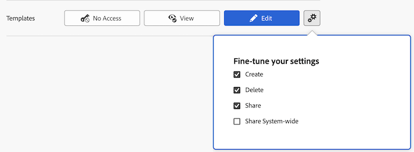

# Concedere l’accesso ai modelli

In qualità di amministratore di Adobe Workfront, puoi utilizzare un livello di accesso per definire l&#39;accesso di un utente ai modelli, come spiegato in [Panoramica sui livelli di accesso](../../../administration-and-setup/add-users/access-levels-and-object-permissions/access-levels-overview.md).

Solo gli utenti con una licenza Standard o Plan possono avere accesso completo ai modelli.

Per informazioni sull&#39;utilizzo dei livelli di accesso personalizzati per gestire l&#39;accesso degli utenti ad altri tipi di oggetti in Workfront, vedere [Creare o modificare livelli di accesso personalizzati](../../../administration-and-setup/add-users/configure-and-grant-access/create-modify-access-levels.md).

## Requisiti di accesso

+++ Espandi per visualizzare i requisiti di accesso per la funzionalità descritta in questo articolo.

<table style="table-layout:auto"> 
 <col> 
 <col> 
 <tbody> 
  <tr> 
   <td role="rowheader">Pacchetto Adobe Workfront</td> 
   <td>Qualsiasi</td> 
  </tr> 
  <tr> 
   <td role="rowheader">Licenza di Adobe Workfront</td> 
   <td>
Standard

   
Piano
</td> 
  </tr> 
  <tr> 
   <td role="rowheader">Configurazioni del livello di accesso</td> 
   <td> 
Devi essere un amministratore di Workfront.
 </td> 
  </tr> 
 </tbody> 
</table>

Per ulteriori dettagli sulle informazioni contenute in questa tabella, consulta [Requisiti di accesso nella documentazione Workfront](/help/quicksilver/administration-and-setup/add-users/access-levels-and-object-permissions/access-level-requirements-in-documentation.md).

+++

## Configurare l’accesso degli utenti ai modelli utilizzando un livello di accesso personalizzato

1. Iniziare a creare o modificare il livello di accesso, come descritto in [Creare o modificare livelli di accesso personalizzati](../../../administration-and-setup/add-users/configure-and-grant-access/create-modify-access-levels.md).
1. Fai clic sull&#39;icona a forma di ingranaggio  sul pulsante **Visualizza** o **Modifica** a destra di Modelli, quindi seleziona le funzionalità che desideri concedere in **Ottimizza le impostazioni**.

   

1. (Facoltativo) Per configurare le impostazioni di accesso per altri oggetti e aree nel livello di accesso su cui stai lavorando, continua con uno degli articoli elencati in [Configura l&#39;accesso ad Adobe Workfront](../../../administration-and-setup/add-users/configure-and-grant-access/configure-access.md), ad esempio [Concedi l&#39;accesso alle attività](../../../administration-and-setup/add-users/configure-and-grant-access/grant-access-tasks.md) e [Concedi l&#39;accesso ai dati finanziari](../../../administration-and-setup/add-users/configure-and-grant-access/grant-access-financial.md).
1. Al termine, fare clic su **Salva**.

   Dopo aver creato il livello di accesso, puoi assegnarlo a un utente. Per ulteriori informazioni, vedere [Modificare il profilo di un utente](../../../administration-and-setup/add-users/create-and-manage-users/edit-a-users-profile.md).

## Accesso ai modelli per tipo di licenza

Per informazioni sulle operazioni che gli utenti di ogni livello di accesso possono eseguire con i modelli, vedere la sezione [Modelli](/help/quicksilver/administration-and-setup/add-users/how-access-levels-work/functionality-available-for-objects.md#templates) nell&#39;articolo [Funzionalità disponibile per ogni tipo di oggetto](/help/quicksilver/administration-and-setup/add-users/how-access-levels-work/functionality-available-for-objects.md).

## Accesso ai modelli condivisi

Come proprietario o creatore di un problema, puoi condividere con altri utenti concedendo loro le autorizzazioni necessarie, come spiegato in [Condividere un modello](../../../workfront-basics/grant-and-request-access-to-objects/share-a-template.md).

<!--
If you make changes here, make them also in the "Grant access to" articles where this snippet had to be converted to text:
* reports, dashboards, and calendars
* financial data
* issue
-->

Quando si condivide un oggetto con un altro utente, i diritti del destinatario su di esso sono determinati da una combinazione di due fattori:

* Autorizzazioni concesse al destinatario per l&#39;oggetto
* Impostazioni del livello di accesso del destinatario per il tipo di oggetto
