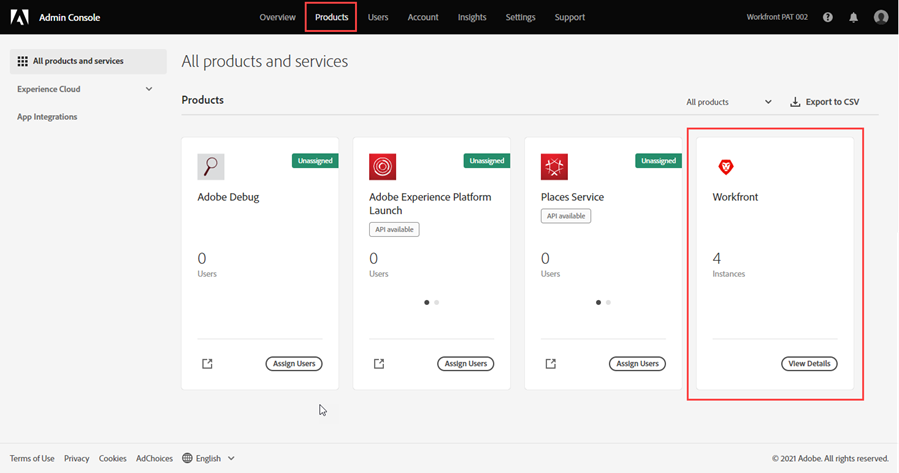

# Gestire gli utenti in Adobe Admin Console

<!--The highlighted information on this page refers to functionality not yet generally available. It is available only in the Preview environment for all customers. After the monthly releases to Production, the same features are also available in the Production environment for customers who enabled fast releases.    

For information about fast releases, see [Enable or disable fast releases for your organization](/help/quicksilver/administration-and-setup/set-up-workfront/configure-system-defaults/enable-fast-release-process.md). -->

>[!IMPORTANT]
>
>La funzionalità di questo articolo è disponibile solo se l’istanza di Workfront dell’organizzazione è stata integrata in Adobe Business Platform.
>
>Per un elenco delle procedure che differiscono a seconda che l’organizzazione abbia effettuato o meno l’onboarding su Adobe Business Platform, consulta [Differenze di amministrazione basate su Platform (Adobe Workfront/Adobe Business Platform)](../../../administration-and-setup/get-started-wf-administration/actions-in-admin-console.md).

In qualità di amministratore Adobe, puoi creare amministratori di sistema di Adobe Workfront utilizzando Adobe Admin Console. La console è il punto centrale per la gestione delle autorizzazioni Adobe in tutta l’organizzazione. Per ulteriori informazioni, consulta la [Panoramica di Admin Console](https://helpx.adobe.com/it/enterprise/using/admin-console.html).

>[!NOTE]
>
>* **Gli amministratori di Workfront devono essere configurati in Adobe Admin Console.** Per informazioni e istruzioni, consulta [Creare amministratori di sistema in Workfront con Adobe Admin Console](#create-system-administrators-in-workfront-with-the-adobe-admin-console) in questo articolo.
>* **Se l’organizzazione utilizza il Single Sign-On (SSO)**, è consigliabile creare utenti e assegnarli a Workfront in Adobe Admin Console. La creazione di questi utenti in Workfront è possibile, ma potrebbero verificarsi problemi durante il trasferimento di tali informazioni ad Adobe Admin Console, in base alla configurazione di Admin Console dell’organizzazione.
>   Dopo aver creato l’utente in Adobe Admin Console, puoi configurare le relative informazioni in Workfront, ad esempio assegnando ruoli, gruppi, team e livelli di accesso.
>* **Se l’organizzazione non utilizza il Single Sign-On (SSO)**, puoi aggiungere utenti non amministratori di sistema direttamente in Workfront. Anche se è possibile aggiungere utenti in Adobe Admin Console, aggiungerli in Workfront consente di configurarne il livello di accesso durante la creazione, con un conseguente risparmio di tempo.

Quando si apportano modifiche ai profili degli utenti da Admin Console, viene aggiunto un aggiornamento alla scheda Attività del sistema dell’utente in Workfront. L’aggiornamento viene visualizzato come effettuato dal “Sistema”. Questo si riferisce all’amministratore di Adobe Admin Console e non all’amministratore principale di Workfront.

## Requisiti di accesso

+++ Espandi per visualizzare i requisiti di accesso per la funzionalità descritta in questo articolo.

<table style="table-layout:auto"> 
 <col> 
 </col> 
 <col> 
 </col> 
 <tbody> 
  <tr> 
   <td role="rowheader">Pacchetto Adobe Workfront</td> 
   <td>
Qualsiasi
</td> 
  </tr> 
  <tr> 
   <td role="rowheader">Diritti di amministratore di Adobe</td> 
   <td> 
È necessario essere amministratore del profilo di prodotto dei prodotti Adobe per l’organizzazione
 </td> 
  </tr> 
 </tbody> 
</table>

Per informazioni, consulta [Requisiti di accesso nella documentazione di Workfront](/help/quicksilver/administration-and-setup/add-users/access-levels-and-object-permissions/access-level-requirements-in-documentation.md).

+++

## Prerequisiti

Prima di utilizzare Admin Console per Workfront, devi ricevere un’e-mail di invito alla console.

1. Se hai appena iniziato a utilizzare Adobe e hai ricevuto un’e-mail che afferma che ora disponi dei diritti di amministrazione per gestire il software e i servizi Adobe per la tua organizzazione, fai clic sul pulsante nell’e-mail per creare un account Adobe e aprire Admin Console.

   Oppure

   Se disponi già di un account Adobe, passa alla [pagina di Adobe Admin Console](https://adminconsole.adobe.com/).

## Dettagli aggiuntivi su Adobe Admin Console

* Gli amministratori di sistema di Workfront possono disattivare un utente dall’interno di Workfront, ma questa operazione non disattiva l’utente in Admin Console.

  <!--
  
For information about deactivating a user in Workfront, see 

  -->

* Il **Gruppo Home** dell’utente è determinato in base all’utente che lo ha creato. Questo non è personalizzabile dall’interno di Admin Console.
* Il livello di accesso Amministratore di sistema di Workfront può essere modificato solo dall’interno di Adobe Admin Console.

  <!--
  DRAFTED IN FLARE:
  How is this done?
  
  -->

* La modifica dell’accesso di un utente da Amministratore di sistema a qualsiasi altro livello di accesso deve essere eseguita prima in Admin Console.

  <!--
   This is not clear
  -->

* Per rimuovere l’accesso come amministratore di sistema da un utente in Workfront, è necessario utilizzare Adobe Admin Console per rimuovere l’utente come amministratore del profilo di prodotto. In questo modo il livello di accesso Workfront dell’utente cambia da Amministratore di sistema a Richiedente.

  >[!IMPORTANT]
  >
  >Non apportare modifiche al profilo di prodotto stesso.

* Gli amministratori di Adobe Admin Console possono configurare regole di assegnazione automatica per automatizzare il processo di assegnazione dei prodotti Adobe agli utenti della propria organizzazione. Per utilizzare questa funzionalità, è necessario effettuare la migrazione dell’organizzazione ad Adobe Unified Experience. Per ulteriori informazioni e istruzioni, consulta [Gestire le regole di assegnazione automatica](https://helpx.adobe.com/it/enterprise/using/automatic-assignment-rules.html) nella documentazione di Adobe.

  >[!NOTE]
  >
  >Se selezioni un’organizzazione attendibile durante la configurazione delle assegnazioni automatiche, l’organizzazione può essere individuata nell’area Utenti nelle directory o nei domini selezionati. Fai clic sulla freccia del menu a discesa accanto al campo **Seleziona directory** e seleziona le organizzazioni. L’organizzazione attendibile è contrassegnata con un badge attendibile.

## Accedi all’area utenti e amministratori per l’istanza di produzione di Workfront {#access-the-user-and-admin-area-for-your-production-instance-of-workfront}

1. Dalla [pagina di Adobe Admin Console](https://adminconsole.adobe.com/), seleziona la scheda **Prodotti** nella barra di navigazione superiore, quindi seleziona **Workfront**.

   <!---->

1. Nell’elenco visualizzato, seleziona il collegamento in alto.

   Questa è l’istanza di Produzione in cui lavorano i tuoi utenti.

   <!---->

   >[!TIP]
   >
   >Il secondo collegamento nell’elenco, l’istanza di Anteprima, è un ambiente di test che replica l’ambiente di produzione live. Per ulteriori informazioni, consulta [Ambiente sandbox di anteprima di Adobe Workfront](../../../administration-and-setup/set-up-workfront/workfront-testing-environments/wf-preview-sandbox-environment.md).
   >
   >
   >Nell’elenco potrebbero essere visualizzati anche i collegamenti agli ambienti sandbox. Per ulteriori informazioni, consulta [Ambiente sandbox di anteprima di Adobe Workfront](../../../administration-and-setup/set-up-workfront/workfront-testing-environments/wf-preview-sandbox-environment.md).

1. Nell’elenco visualizzato, con la scheda **Profili di prodotto** selezionata, fai clic sul nome del collegamento del Profilo di prodotto Workfront.

   

   Questo elenco include tutti gli utenti già assegnati all’istanza di Produzione di Workfront.

   >[!IMPORTANT]
   >
   >Non apportare modifiche al profilo di prodotto stesso.

1. Continua con una delle sezioni seguenti in questo articolo:

   * [Creare utenti in Workfront con Adobe Admin Console](#create-users-in-workfront-with-the-adobe-admin-console)
   * [Creare amministratori di sistema in Workfront con Adobe Admin Console](#create-system-administrators-in-workfront-with-the-adobe-admin-console)

## Creare amministratori di sistema in Workfront con Adobe Admin Console {#create-system-administrators-in-workfront-with-the-adobe-admin-console}

<!--Audited: 12/2023-->

Il livello di accesso Amministratore di sistema è concesso solo su Adobe Admin Console. Non puoi concedere o rimuovere l’accesso come amministratore in Workfront.

Devi aggiungere un utente all’istanza di Produzione di Workfront prima di poter rendere l’utente un amministratore di sistema di Workfront.

1. Passa all’area utenti e amministratori in Admin Console, come descritto nella sezione [Accedere all’area utenti e amministratori per l’istanza di Produzione di Workfront](#access-the-user-and-admin-area-for-your-production-instance-of-workfront) in questo articolo.
1. Seleziona la scheda **Amministratori** sopra l’elenco degli utenti.
1. Seleziona **Aggiungi amministratore**.
1. Nella casella **Aggiungi amministratori profilo di prodotto**, inserisci gli indirizzi e-mail o i nomi degli amministratori che desideri aggiungere, quindi seleziona **Salva**.

   

   Gli amministratori di sistema vengono creati in Workfront.

   >[!IMPORTANT]
   >
   >* Non apportare modifiche al profilo di prodotto stesso.
   >* Assicurati di essere sulla pagina con l’intestazione “Aggiungi amministratori del profilo di prodotto”. Gli amministratori di prodotto svolgono una funzione diversa dagli amministratori dei profili di prodotto in Adobe Admin Console e non sono trattati in questo articolo.

## Creare utenti in Workfront con Adobe Admin Console {#create-users-in-workfront-with-the-adobe-admin-console}

>[!NOTE]
>
>È consigliabile aggiungere utenti non amministratori di sistema direttamente in Workfront. Anche se è possibile aggiungere utenti in Adobe Admin Console, aggiungerli in Workfront consente di configurarne il livello di accesso durante la creazione, con un conseguente risparmio di tempo.

* [Creare utenti in Workfront direttamente in Adobe Admin Console](#create-users-in-workfront-directly-in-the-adobe-admin-console)
* [Creare utenti in Workfront e approvarli per Adobe Admin Console](#create-users-in-workfront-and-approve-them-for-the-adobe-admin-console)

### Creare utenti in Workfront direttamente in Adobe Admin Console

1. Passa all’area utenti e amministratori in Admin Console, come descritto nella sezione [Accedi all’area utenti e amministratori per l’istanza di Produzione di Workfront](#access-the-user-and-admin-area-for-your-production-instance-of-workfront) in questo articolo.
1. Con la scheda **Utenti** selezionata sopra l’elenco, seleziona **Aggiungi utente**.
1. Nella casella **Aggiungi utenti a questo profilo di prodotto**, inserisci l’indirizzo e-mail o il nome di un utente da aggiungere, quindi seleziona **Salva**.

   L’utente viene creato in Workfront con il livello di accesso Richiedente o Collaboratore, a seconda del pacchetto di Workfront della tua organizzazione.

   >[!IMPORTANT]
   >
   >Non apportare modifiche al profilo di prodotto stesso.

1. In Workfront, modifica il livello di accesso dell’utente.

   Per istruzioni su come un amministratore di Workfront può modificare il livello di accesso dell’utente, consulta [Modificare il profilo di un utente](../../../administration-and-setup/add-users/create-and-manage-users/edit-a-users-profile.md).

1. Ripeti i passaggi 3 e 4 per aggiungere altri utenti.

   >[!NOTE]
   >
   >Per i nuovi utenti Adobe, Admin Console fornisce un’e-mail per invitarli a completare il processo di registrazione. Tutti gli utenti devono completare il processo di registrazione per accedere a qualsiasi applicazione Adobe.
   >
   >Per gli utenti Adobe esistenti, l’utente può ricevere o meno un’e-mail sulla disponibilità di Workfront. Questa è una preferenza controllata dall’amministratore Adobe per il prodotto. L’amministratore Adobe potrebbe essere una persona diversa dall’amministratore Workfront.

### Creare utenti in Workfront e approvarli per Adobe Admin Console

Questo flusso di lavoro consente di creare utenti agli amministratori di gruppi che non dispongono dell’accesso ad Adobe Admin Console.

Innanzitutto, l’amministratore del gruppo crea l’utente in Workfront. L’utente viene creato nello stato Disattivato e In attesa di approvazione.

Quindi, un amministratore Workfront approva l’utente. Questa operazione attiva l’utente in Workfront e lo aggiunge ad Adobe Admin Console.

#### Creare l’utente in Workfront (amministratore gruppo)

Per istruzioni sulla creazione di un utente in Workfront, consulta [Aggiungere utenti](/help/quicksilver/administration-and-setup/add-users/create-and-manage-users/add-users.md).

#### Approvare l’utente (amministratore Workfront)

Per approvare un utente:

{{step-1-to-users}}

1. Seleziona l’utente, quindi fai clic sull’icona **Altro** .

1. Per approvare l’utente, fai clic su **Approva**, quindi su **Invia**.

   Oppure

   Per rifiutare l’utente ed eliminarlo da Workfront, fai clic su **Rifiuta**, quindi su **Invia**.

   Gli utenti approvati vengono aggiunti automaticamente ad Adobe Admin Console.

   Gli utenti rifiutati vengono eliminati automaticamente da Workfront.

## Modificare gli utenti esistenti in Adobe Admin Console

In Adobe Admin Console, puoi modificare i seguenti dettagli utente:

* Gruppi di utenti e prodotti associati all’utente
* Diritti amministrativi
* Paese

Per informazioni sulla modifica di un singolo utente in Adobe Admin Console, consulta [Modificare i dettagli dell’utente](https://helpx.adobe.com/it/enterprise/using/manage-users-individually.html#edit-user-details) nell’articolo Gestire gli utenti singolarmente nella documentazione di Adobe.

Per informazioni sulla modifica in blocco degli utenti in Adobe Admin Console, consulta
[Modificare i dettagli dell’utente](https://helpx.adobe.com/it/enterprise/using/bulk-upload-users.html#edit-user-details) nell’articolo Gestire più utenti nella documentazione di Adobe.

## Eliminare un utente

>[!NOTE]
>
>* Se un utente fa parte di uno o più gruppi di utenti di Admin Console e il profilo di prodotto è stato aggiunto a uno o più di tali gruppi, la disattivazione dell’utente da Workfront non ne determina la rimozione effettiva dal prodotto. L’utente deve essere rimosso dai gruppi di utenti in Admin Console.
>* L’eliminazione di un utente da Adobe Admin Console disattiva l’utente in Workfront, ma non lo elimina da Workfront.

Per istruzioni sull&#39;eliminazione di utenti in Adobe Admin Console, vedere [Gestione degli utenti della directory](https://helpx.adobe.com/enterprise/using/manage-directory-users.html) nella documentazione di Adobe.

<!--

&nbsp;

&nbsp;

&nbsp;

You can create Adobe Workfront users and system administrators with the <a href="https://adminconsole.adobe.com/" alt="Admin Console link">Adobe Admin Console</a>. The console is a central location for managing the Adobe entitlements across your organization. For more information, see the <a href="https://helpx.adobe.com/enterprise/using/admin-console.html" alt="Admin Console Overview">Admin Console Overview</a>.

Before using the Admin Console for Workfront, you should receive a receive an email inviting you to the console. Click in the invitation to accept it and create an account. You can also use an existing account, if already available.

<h2>Create users</h2>

Create users in WF with the Adobe admin console

-->

<!--

May need to add something about oging throug WF -- check with Jonah

To create users in Workfront with the Admin Console:

<ol>
<li value="1"> 
From the <a href="https://adminconsole.adobe.com/">Admin Console page</a>, select the <b>Products</b> tab and then select the <b>Workfront</b> product tile.
 </li>
<li value="2"> 
Select the link to the Workfront instance you want to change.
 </li>
<li value="3"> 
Select the Product profile link. This shows a list of the currently-assigned users. If the list is very long, you can also search for users in the search field above the list.
 </li>
<li value="4"> 
Select the <b>Add User</b> button.
 </li>
<li value="5"> 
In the <b>Add users</b> box, enter the email address or name of the user you want to add. Select <b>Save</b>. The administrator is created in Workfront with <b>Requestor</b> access level.
 </li>
</ol>
<h2>Create system administrators</h2>

To create system administrators:

<ol>
<li value="1"> 
Make product profile assignments first. To be a Workfront System Administrator, the user must be assigned the Workfront product profile and be an admin for that product profile.
 </li>
<li value="2"> 
From the console, select the <b>Products</b> tab and then select the <b>Admins</b> tab. 
 </li>
<li value="3"> 
Select <b>Add Admin</b>.
 </li>
<li value="4"> 
In the <b>Add product profile administrators</b> box, enter the email address or name of the administrator you want to add. Select <b>Save</b>. The user is created in Workfront with <b>Requestor</b> access level.
 </li>
</ol>
<h2>Additional details for the Admin Console</h2>
<ul>
<li> 
System Administrator access level is granted only on the Admin Console. You cannot grant or remove admin access from within Workfront.
 </li>
</ul>
<ul>
<li> 
Creating and deleting users inside Workfront is only possible through the Admin Console.
 </li>
<li> 
Workfront System Administrators can deactivate Workfront users from within Workfront, but this does not deactivate the user in the Admin Console.
 </li>
<li> 
All new users are are assigned <b>Requestor</b> access level upon creation. Also, the user <b>Home Group</b> is determined based on the user who created them. This is currently not customizable from within the Admin Console.
 </li>
<li> 
The Workfront System Administrator access level can only be edited from within the Adobe Admin Console.
 </li>
<li> 
Editing a user who is a system admin to any other access level must be done through the Admin Console first.
 </li>
<li> 
To remove Workfront system admin access, remove users as Product Profile Administrators. This action changes the user access level in Workfront from a system admin to a <b>Requestor</b>.
 </li>
</ul>

-->
