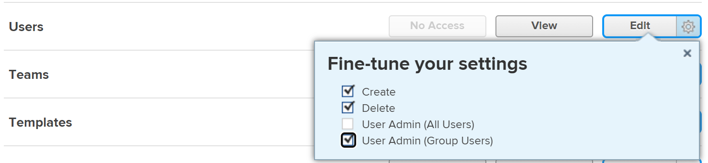

# Modificare il profilo di un utente

{{highlighted-preview}}

<!--

>[!IMPORTANT]
>
>The procedure described on this page applies only to organizations that have not yet been onboarded to the Admin Console. If your organization has been onboarded to the Adobe Admin Console, you must perform this action through the Adobe Admin Console.
>
>For instructions on editing a user's profile in the Adobe Admin Console, see the section "Edit user details" in the article [Manage users individually](https://helpx.adobe.com/it/enterprise/using/manage-users-individually.html) or contact your Adobe Admin Console Administrator.
>
>For a list of procedures that differ based on whether your organization has been onboarded to the Adobe Admin Console, see [Platform-based administration differences (Adobe Workfront/Adobe Business Platform)](../../../administration-and-setup/get-started-wf-administration/actions-in-admin-console.md).
-->

In qualità di amministratore di Adobe Workfront, puoi creare utenti e gestire i profili di quelli esistenti. Per informazioni sulla creazione di utenti, vedere [Aggiungi utenti](../../../administration-and-setup/add-users/create-and-manage-users/add-users.md).

Per informazioni sugli utenti che aggiornano i propri profili, vedere [Configurare le impostazioni personali](/help/quicksilver/workfront-basics/manage-your-account-and-profile/configuring-your-user-profile/configure-my-settings.md).

## Requisiti di accesso

+++ Espandi per visualizzare i requisiti di accesso per la funzionalità in questo articolo.

<table style="table-layout:auto"> 
 <col> 
 <col> 
 <tbody> 
  <tr> 
   <td>Pacchetto Adobe Workfront</td> 
   <td>
Qualsiasi
</td> 
  </tr> 
  <tr> 
   <td>Licenza Adobe Workfront</td> 
   <td>
Standard

Piano
</td> 
  </tr> 
  <tr> 
   <td>Configurazioni del livello di accesso</td> 
   <td> 
È necessario disporre di uno dei seguenti elementi:
 
    <ul> 
     <li> 
Livello di accesso Amministratore di sistema. </li> 
     <li> 
Impostazione di <b>Utenti</b> nel livello di accesso configurato per l'accesso di <b>Modifica</b>, con <b>Crea</b> e almeno una delle due opzioni di <b>Amministratore utenti</b> abilitate in <b>Ottimizza le impostazioni</b> . 
 
Di queste due opzioni, se <b>User Admin (Group Users)</b> è abilitato, è necessario essere un amministratore di gruppo di un gruppo di cui l'utente è membro.
 </li> 
    </ul> </td> 
  </tr> 
 </tbody> 
</table>

Per informazioni, consulta [Requisiti di accesso nella documentazione di Workfront](/help/quicksilver/administration-and-setup/add-users/access-levels-and-object-permissions/access-level-requirements-in-documentation.md).

+++

## Modificare un profilo utente

{{step-1-to-users}}

1. Seleziona l&#39;utente, quindi fai clic sull&#39;icona **Modifica** .

   Viene visualizzata la casella Modifica utente.

1. Nella casella **Modifica utente**, modifica le informazioni in una delle sezioni e fai clic su **Salva** in qualsiasi momento.

### Informazioni personali

* **Nome**
* **Cognome**

  >[!NOTE]
  >
  >Quando si modifica il nome di un utente in Workfront, il nome dell’utente non viene modificato in Adobe Admin Console.

* **Indirizzo e-mail**: l&#39;indirizzo e-mail di un utente è anche il suo nome utente in Workfront. Questo campo distingue tra maiuscole e minuscole e deve essere univoco. Se un utente tenta di aggiungere un indirizzo e-mail non univoco 3 volte in una finestra di 10 minuti, viene visualizzata una risposta reCAPTCHA.

  Selezionare l&#39;impostazione **Non sono un robot** prima di procedere.

  Se utilizzi il elenco Consentiti di gestione delle e-mail e immetti un dominio e-mail non incluso nell’elenco, l’utente non riceverà notifiche e-mail. Per ulteriori informazioni sul inserisco nell&#39;elenco Consentiti di, vedere [Configurare il proprio inserisco nell&#39;elenco Consentiti di gestione dei messaggi di posta elettronica](/help/quicksilver/administration-and-setup/get-started-wf-administration/configure-your-email-allowlist.md).

  Se la tua organizzazione è stata migrata a Adobe Admin Console, non puoi modificare l’indirizzo e-mail di un utente in Workfront. L’indirizzo e-mail dell’utente è impostato in Adobe Admin Console.

* **Modifica password**: fare clic su questo pulsante per reimpostare la password dell&#39;utente. È necessario immettere la propria password prima di reimpostare quella di un altro utente.

  Per reimpostare la password di un altro utente, è necessario essere un amministratore di Workfront o un amministratore di gruppo.

  Se si è un amministratore di gruppo, è possibile reimpostare le password solo per gli utenti dei gruppi in cui si è designati come amministratore. Inoltre, l’autorizzazione Amministratore utenti (utenti gruppo) deve essere abilitata nel tuo livello di accesso:

  

  Questa impostazione è disabilitata per impostazione predefinita. Per ulteriori informazioni, vedere [Creare o modificare livelli di accesso personalizzati](/help/quicksilver/administration-and-setup/add-users/configure-and-grant-access/create-modify-access-levels.md).

  Non è possibile reimpostare la password di un amministratore Workfront.

* **&lt;Configurazione SSO> Nome utente**: se l&#39;amministratore di Workfront ha abilitato un&#39;integrazione SSO con Workfront, il nome utente SSO viene visualizzato in questo campo. In questo campo è visibile il tipo di configurazione SSO abilitata per l’istanza di Workfront.
* **Consenti solo autenticazione &lt;Configurazione SSO>**: se l&#39;amministratore di Workfront ha abilitato un&#39;integrazione SSO con Workfront e ha aggiornato tutti gli utenti per l&#39;autenticazione SSO, questo campo è selezionato per impostazione predefinita. In questo campo è visibile il tipo di configurazione SSO abilitata per l’istanza di Workfront.

  Quando questo campo è selezionato, l’utente deve accedere a Workfront con le proprie credenziali SSO. Deselezionando questa opzione, gli utenti potranno accedere a Workfront con le credenziali Workfront.

  Per ulteriori informazioni sulla configurazione di Workfront con una soluzione SSO, vedere [Panoramica del single sign-on in Adobe Workfront](/help/quicksilver/administration-and-setup/add-users/single-sign-on/sso-in-workfront.md).

  Per ulteriori informazioni sull&#39;aggiornamento degli utenti per l&#39;SSO, vedere [Aggiornare gli utenti per il Single Sign-On](/help/quicksilver/administration-and-setup/add-users/single-sign-on/update-users-sso.md).

  >[!NOTE]
  >
  >Gli amministratori di gruppi possono modificare i campi &lt;Configurazione SSO> solo per gli utenti dei gruppi in cui sono stati designati come tali. Inoltre, l’autorizzazione Amministratore utenti (utenti gruppo) deve essere abilitata nel tuo livello di accesso.
  >
  >Se sei un amministratore gruppo e nel tuo livello di accesso hai abilitato l&#39;autorizzazione Amministratore utenti (tutti gli utenti), puoi modificare i campi &lt;Configurazione SSO> per tutti gli utenti.

* **Foto profilo**: fare clic su **Carica nuovo** per caricare l&#39;immagine profilo dell&#39;utente. Puoi caricare un file JPG, GIF o PNG. La dimensione massima del file è di 4 MB.

  L&#39;immagine del profilo diventa l&#39;avatar dell&#39;utente ed è visibile ovunque venga visualizzato il nome dell&#39;utente Workfront.

* **Informazioni processo**: informazioni sul processo, come il titolo del processo (nel campo **Titolo**) e l&#39;area di competenza di cui è responsabile l&#39;utente (nel campo **Informazioni su**).
* **Informazioni di contatto**: numero di telefono dell&#39;utente (in **Numero di telefono**, **Est.** e **Campi Numero cellulare**) e indirizzo (nei campi **Indirizzo**, **Città**, **Stato**, **Codice postale** e **Paese**).

  Se l&#39;utente è abilitato per Unified User Management (UUM) o Adobe Identity Management System (IMS), il campo **Paese** nella sezione Informazioni contatto accetta solo i valori del codice paese (ad esempio, US, GB, IN).

### Preferenze

* **Fuso orario**: il fuso orario dell&#39;utente.

  Per informazioni su come aiutare gli utenti a collaborare in Workfront con fusi orari diversi, consulta [Lavorare con fusi orari diversi](/help/quicksilver/workfront-basics/tips-tricks-and-troubleshooting/working-across-timezones.md).

* **Impostazioni locali e-mail**: impostazioni locali e-mail preferite dall&#39;utente. Questo influisce sul formato dei numeri e delle date nelle e-mail inviate da Workfront a questo utente.

  >[!NOTE]
  >
  >Quando la tua organizzazione utilizza Adobe Unified Experience, le preferenze della lingua dell’utente vengono memorizzate nel suo profilo Adobe e le impostazioni locali dell’e-mail non vengono utilizzate. Per informazioni sull&#39;accesso a queste preferenze, vedere [Esperienza unificata Adobe per Workfront](/help/quicksilver/workfront-basics/navigate-workfront/workfront-navigation/adobe-unified-experience.md).

* **Ricevi e-mail da questo ambiente di test**: seleziona questa opzione se desideri ricevere notifiche e-mail dall&#39;ambiente in cui hai effettuato l&#39;accesso.

  >[!NOTE]
  >
  >Questa opzione è disponibile solo negli ambienti di anteprima e sandbox. Per impostazione predefinita, le notifiche e-mail sono abilitate nell’ambiente di produzione.

* **Imposta automaticamente lo stato dell&#39;attività su In corso quando le attività vengono auto-assegnate**: quando questa opzione è selezionata, il lavoro che l&#39;utente auto-assegna viene automaticamente impostato sullo stato In corso invece che su Nuovo.

* **Genera automaticamente le bozze durante il caricamento dei documenti**: seleziona questa opzione se desideri che i documenti caricati dall&#39;utente generino immediatamente una bozza.

### Notifiche

Seleziona le notifiche e-mail da abilitare per il nuovo utente.

Puoi selezionare le notifiche istantanee e giornaliere di riepilogo.

Per ulteriori informazioni, vedere [Configurare le notifiche degli eventi per tutti gli utenti del sistema](/help/quicksilver/administration-and-setup/manage-workfront/emails/configure-event-notifications-for-everyone-in-the-system.md).

### Accesso

* **Utente attivo**: abilitare questa opzione per indicare che l&#39;utente è attivo. Gli utenti attivi utilizzano una licenza di Workfront. La disattivazione del campo disattiva l’utente e impedisce l’accesso a Workfront.

* **Livello di accesso**: selezionare il livello di accesso da assegnare a questo utente.

  Quando si assegna un livello di accesso a un utente, è possibile assegnare un livello uguale o inferiore al proprio livello di accesso. Ad esempio, se il livello di accesso è Standard, non è possibile assegnare il livello di accesso Amministratore.

  Tuttavia, non è possibile assegnare un livello di accesso che, per impostazione predefinita, è inferiore al proprio livello di accesso se l’amministratore di Workfront ha abilitato autorizzazioni non predefinite sul livello di accesso che non sono abilitate anche nel proprio livello di accesso.

  Ad esempio, se si dispone di una licenza Standard senza accesso per eliminare le attività, non è possibile assegnare a un utente una licenza Light con accesso per eliminare le attività, anche se la licenza Light è inferiore alla licenza Standard. Per ulteriori informazioni, vedere [Creare o modificare livelli di accesso personalizzati](/help/quicksilver/administration-and-setup/add-users/configure-and-grant-access/create-modify-access-levels.md).

  Per ulteriori informazioni sui livelli di accesso, vedere [Configurare l&#39;accesso ad Adobe Workfront](/help/quicksilver/administration-and-setup/add-users/configure-and-grant-access/configure-access.md).

  >[!NOTE]
  >
  >Se l’organizzazione utilizza il nuovo modello di accesso (Standard/Light/Contributor), non è possibile riassegnare un utente Standard o Light a un livello di accesso Collaboratore se tale utente ha già raggiunto il limite di decisione per il mese.
  >
  >Per ulteriori informazioni sul nuovo modello di accesso, vedere [Panoramica sui nuovi livelli di accesso](/help/quicksilver/administration-and-setup/add-users/how-access-levels-work/access-level-overview.md).
  >
  >Per informazioni sui limiti di decisione, consulta [Documento limitato e decisione sulla bozza per utenti non pagati, panoramica](/help/quicksilver/review-and-approve-work/proof-doc-decision-limits.md).

* **Modello di layout**: scegliere un modello di layout per l&#39;utente. questo modello di layout ha la precedenza su qualsiasi modello di layout assegnato al Gruppo predefinito, al Team predefinito o al Ruolo principale dell&#39;utente. Per ulteriori informazioni sulla priorità di assegnazione dei modelli di layout, vedere [Creare e gestire modelli di layout](/help/quicksilver/administration-and-setup/customize-workfront/use-layout-templates/create-and-manage-layout-templates.md).

  L’elenco seguente descrive come l’elenco dei modelli disponibili in questo campo dipende dal tuo accesso:

   * In qualità di amministratore di Workfront, puoi visualizzare tutti i modelli di layout a livello di sistema e di gruppo.
   * In qualità di amministratore di gruppo, puoi visualizzare il modello di layout a livello di sistema e quelli associati ai gruppi gestiti.
   * In qualità di utente con una licenza Standard o Plan e con accesso per la modifica degli utenti, puoi visualizzare solo i modelli di layout a livello di sistema.

     Per ulteriori informazioni sui modelli di layout a livello di gruppo, vedere [Creare e modificare i modelli di layout di un gruppo](/help/quicksilver/administration-and-setup/manage-groups/work-with-group-objects/create-and-modify-a-groups-layout-templates.md).

### Organizzazione

* **Società**: la società dell&#39;utente. Gli utenti possono essere associati a una sola azienda. È necessario creare un&#39;azienda prima di associarla a un utente. Nell&#39;elenco vengono visualizzate solo le società attive. Per informazioni sulla creazione di società, vedere [Creare e modificare società](/help/quicksilver/administration-and-setup/set-up-workfront/organizational-setup/create-and-edit-companies.md).
* **Report a**: se è stata specificata una società per l&#39;utente, è possibile specificare anche il responsabile diretto dell&#39;utente in questo campo. Un utente può avere un solo manager. Questo campo non viene visualizzato se l’utente non è prima associato a una società.
* **Report diretti**: se è stata specificata una società per l&#39;utente, è possibile specificare anche i report diretti dell&#39;utente. Un utente può avere più referenti diretti. Questo campo non viene visualizzato se l’utente non è prima associato a una società.
* **Team predefinito**: specificare il team predefinito dell&#39;utente. Gli utenti possono avere un solo team principale. Il team predefinito è importante quando si assegna un modello di layout o quando si definisce il pulsante Lavoraci per le attività e i problemi assegnati all’utente.
* **Altri team**: gli utenti possono appartenere a più team. Un utente può visualizzare gli elementi di lavoro assegnati a qualsiasi team nella propria area Home.
* **Gruppo predefinito corrente**: selezionare un gruppo appropriato per assegnare l&#39;utente. In questo modo l&#39;utente può accedere agli oggetti condivisi con il gruppo. È inoltre possibile condividere i modelli di layout con il Gruppo predefinito dell&#39;utente.

  Questo campo è obbligatorio. Ogni utente deve essere associato a un gruppo predefinito. Se non ne selezioni uno, il Gruppo predefinito viene assegnato come Gruppo predefinito del nuovo utente.

  È possibile assegnare un gruppo a un utente solo se si verifica una delle condizioni seguenti:

   * sei un amministratore di Workfront
   * sei l’amministratore del gruppo
   * il gruppo è pubblico

* **Altri gruppi**: gli utenti possono appartenere a più gruppi. È possibile assegnare un gruppo a un utente solo se si è un amministratore di Workfront, se si è l&#39;amministratore del gruppo o se il gruppo è pubblico.

  >[!IMPORTANT]
  >
  >L’aggiunta di un utente a più di 100 gruppi può causare problemi di prestazioni in qualsiasi area di Workfront che carica l’elenco dei gruppi.

  Per ulteriori informazioni sui gruppi pubblici, vedere [Creare un gruppo](/help/quicksilver/administration-and-setup/manage-groups/create-and-manage-groups/create-a-group.md).

  Per ulteriori informazioni sui gruppi, vedere [Panoramica sui gruppi](/help/quicksilver/administration-and-setup/manage-groups/groups-overview/groups.md).

### Pianificazione risorse

* **Tempo di lavoro**: rappresenta la percentuale del tempo FTE (Full Time Equivalent) a cui l&#39;utente è disponibile per il lavoro effettivo, esclusi i costi comuni. L&#39;orario di lavoro deve essere un numero decimale massimo di 1 e non può essere 0. Ad esempio, una disponibilità del 20% per il lavoro effettivo sarebbe 0,2.

  Il valore predefinito del campo è 1, che indica che un utente spende l’intero FTE per il lavoro effettivo relativo al progetto.

  Il sistema utilizza questo numero per calcolare la disponibilità dell&#39;utente per il lavoro effettivo correlato al progetto.

  Per ulteriori informazioni sulla creazione di pianificazioni in Workfront, vedere [Creare una pianificazione](/help/quicksilver/administration-and-setup/set-up-workfront/configure-timesheets-schedules/create-schedules.md).

  Eccezioni alla pianificazione e indisponibilità possono influire anche sulla capacità dell&#39;utente.

  Workfront calcola la disponibilità di un utente in base alle preferenze di Gestione risorse nell’area Configura. Per ulteriori informazioni, vedere [Configurare le preferenze di Gestione risorse](/help/quicksilver/administration-and-setup/set-up-workfront/configure-system-defaults/configure-resource-mgmt-preferences.md).

  >[!TIP]
  >
  >Impostare il valore Tempo di lavoro su 1 per indicare che l&#39;utente è disponibile per il lavoro correlato al progetto per l&#39;intero equivalente a tempo pieno.

* **Imposta data di disattivazione**: fare clic su questo pulsante se si desidera pianificare la disattivazione dell&#39;utente in una data e in un&#39;ora specifiche.
* **Data disattivazione**: la data e l&#39;ora in cui l&#39;utente viene disattivato. Per informazioni sulla pianificazione della disattivazione degli utenti, vedere [Pianificare la disattivazione degli utenti](/help/quicksilver/administration-and-setup/add-users/create-and-manage-users/deactivate-a-user.md#schedule-users-for-deactivation) in [Disattivare o riattivare un utente](/help/quicksilver/administration-and-setup/add-users/create-and-manage-users/deactivate-a-user.md).
* **Ruolo principale**: questa è la mansione principale che l&#39;utente può svolgere in Workfront. A questa mansione vengono assegnate anche tutte le attività e tutti i problemi a cui è assegnato l’utente. I ruoli sono essenziali nella gestione delle risorse. È possibile aggiornare questo campo solo se si dispone di una licenza Standard o Full con accesso utente amministrativo o se si è un amministratore Workfront. Per ulteriori informazioni sulla configurazione degli utenti con accesso amministrativo, vedere [Concedere l&#39;accesso agli utenti](/help/quicksilver/administration-and-setup/add-users/configure-and-grant-access/grant-access-other-users.md).

  Nell&#39;elenco vengono visualizzati solo i ruoli di lavoro attivi.

* (Condizionale) Se hai selezionato un **Ruolo principale**, viene visualizzato il campo **Percentuale di disponibilità FTE**. Specificare la percentuale di tempo della pianificazione dell&#39;utente allocata a questa mansione. Il valore predefinito per la percentuale di disponibilità FTE per il ruolo principale è 100%.
* **Altri ruoli**: un utente può avere più ruoli in Workfront. I ruoli sono essenziali nella gestione delle risorse. Non esiste alcun limite al numero di mansioni che un utente può svolgere. Tuttavia, si consiglia di non assegnare un utente a un numero eccessivamente elevato di ruoli, perché la gestione delle risorse potrebbe diventare troppo complessa per questi utenti.

  Nell&#39;elenco vengono visualizzati solo i ruoli di lavoro attivi. Per ulteriori informazioni sulle mansioni, vedere [Creare e gestire le mansioni](/help/quicksilver/administration-and-setup/set-up-workfront/organizational-setup/create-manage-job-roles.md).

  È possibile aggiornare questo campo solo se si dispone di una licenza Standard o Full con accesso utente amministrativo o se si è un amministratore Workfront.

  Per ulteriori informazioni sulla configurazione degli utenti con accesso amministrativo, vedere [Concedere l&#39;accesso agli utenti](/help/quicksilver/administration-and-setup/add-users/configure-and-grant-access/grant-access-other-users.md).

* (Condizionale) Se hai selezionato uno o più **Altri ruoli**, per ogni ruolo viene visualizzato il campo **Percentuale di disponibilità FTE**. Specificare la percentuale di tempo della pianificazione dell&#39;utente allocata a ogni mansione. Il valore predefinito per la percentuale di disponibilità FTE per gli altri ruoli è 0%.

  Se Altri ruoli hanno una disponibilità FTE pari a 0%, non vengono visualizzati nella Programmazione delle risorse, a meno che gli utenti non siano assegnati ad attività in questi ruoli.

  

  La somma di tutte le **percentuali di disponibilità FTE** per tutti i ruoli deve essere uguale al 100%. Ogni percentuale di disponibilità FTE calcola le ore disponibili per ogni ruolo per utente nella Programmazione delle risorse. Le ore disponibili per ogni ruolo per utente dipendono dal tempo disponibile per l’utente.

  Il tempo disponibile per l&#39;utente viene calcolato da Workfront in base al metodo selezionato dall&#39;amministratore Workfront per calcolare l&#39;FTE nelle preferenze di gestione delle risorse.

  Per informazioni sul calcolo della disponibilità per l&#39;utente, vedere [Panoramica sul calcolo delle ore e dell&#39;FTE per gli utenti e i ruoli nella Programmazione delle risorse](/help/quicksilver/resource-mgmt/resource-planning/calculate-hours-fte-for-users-roles-resource-planner.md).

  Per informazioni sulla configurazione delle preferenze di Gestione risorse, vedere [Configurare le preferenze di Gestione risorse](/help/quicksilver/administration-and-setup/set-up-workfront/configure-system-defaults/configure-resource-mgmt-preferences.md).

  (Facoltativo) Le assegnazioni di mansioni con data di validità vengono utilizzate nei calcoli finanziari se la mansione dell&#39;utente cambia durante un progetto.

  Fare clic su **Definisci ruoli per data**, selezionare **Ruolo principale** e **Altri ruoli**, quindi immettere la percentuale di allocazione per ogni ruolo. I ruoli possono essere gli stessi dei ruoli esistenti (utilizzando percentuali diverse) o nuovi ruoli. Selezionare la data di inizio in cui questi ruoli diventano attivi. Questa può essere una data futura. Quando i ruoli più recenti diventano attivi, è possibile fare clic su **Mostra ruoli precedenti** per visualizzare i ruoli precedenti inattivi.

* **Pianificazione**: associare una pianificazione all&#39;utente. La pianificazione dell&#39;utente calcola la sequenza temporale delle attività a cui l&#39;utente è assegnato.

  È necessario creare una pianificazione prima di associarla a un utente. Per ulteriori informazioni sulla creazione di pianificazioni, vedere [Creare una pianificazione](/help/quicksilver/administration-and-setup/set-up-workfront/configure-timesheets-schedules/create-schedules.md).

  >[!NOTE]
  >
  >È consigliabile che la pianificazione associata all&#39;utente corrisponda al fuso orario dell&#39;utente.

  >[!IMPORTANT]
  >
  >Workfront utilizza la pianificazione di un utente solo quando l&#39;impostazione **Calcola disponibilità risorse utilizzando** è impostata su **La pianificazione dell&#39;utente**. Per informazioni su come questa impostazione influisce sulla pianificazione utilizzata per Gestione risorse, vedere [Configurare le preferenze di Gestione risorse](/help/quicksilver/administration-and-setup/set-up-workfront/configure-system-defaults/configure-resource-mgmt-preferences.md).

* **Profilo scheda orario**: associa un profilo scheda orario all&#39;utente per garantire che le schede orario vengano generate automaticamente per l&#39;utente.

  L’elenco dei profili disponibili in questo campo dipende dal tuo accesso:

   * In qualità di amministratore di Workfront, puoi visualizzare tutti i profili delle schede orario a livello di sistema e di gruppo.
   * In qualità di amministratore di gruppo, puoi visualizzare i profili delle schede orario a livello di sistema, nonché quelli associati ai gruppi gestiti.
   * In qualità di utente con una licenza Standard o Plan e con accesso in modifica agli utenti, puoi visualizzare solo i profili delle schede orario a livello di sistema. Per ulteriori informazioni sui profili delle schede orario a livello di gruppo, vedere [Creare, modificare e assegnare profili delle schede orario](/help/quicksilver/timesheets/create-and-manage-timesheets/create-timesheet-profiles.md).

* **Tipo di ora predefinito**: selezionare il tipo di ora predefinito per l&#39;utente. Questo è il tipo di ora utilizzato per impostazione predefinita quando l’utente registra l’ora.
* **Tipi di lavoro disponibili**: selezionare i tipi di lavoro disponibili per l&#39;utente. Questi tipi di ore sono visibili ovunque in Workfront, dove l’utente può registrare l’ora. Un utente può visualizzare solo i tipi di ore abilitati a livello di progetto e di utente. Per ulteriori informazioni sui tipi di ore disponibili per gli utenti, vedere [Definire i tipi di ore e la disponibilità](/help/quicksilver/timesheets/create-and-manage-timesheets/define-hour-types-and-availability.md).
* **Tempo di connessione in**: selezionare se l&#39;utente deve registrare il tempo sugli elementi di lavoro in ore o giorni. Per ulteriori informazioni, vedere [Configurare l&#39;ora registrata in ore o giorni](/help/quicksilver/timesheets/config-timesheet-prefs/config-time-logged-hrs-days.md).
* **FTE**: equivalente a tempo pieno dell&#39;utente. Workfront utilizza questo numero per calcolare la disponibilità dell&#39;utente in base alla pianificazione predefinita solo quando le preferenze di gestione delle risorse a livello di sistema sono impostate su Pianificazione predefinita.

  L’FTE indica la quantità di tempo che l’utente può trascorrere al lavoro. Sono inclusi i costi comuni e il tempo dedicato al lavoro del progetto. Ad esempio, nell’FTE è incluso anche il tempo trascorso nelle riunioni o nella formazione.

  L&#39;FTE deve essere un numero decimale massimo di 1 e non può essere 0. Ad esempio, se il valore FTE è 0,5 e la pianificazione predefinita in Workfront è di 40 ore, l’utente è disponibile per 20 ore alla settimana.

  Il valore predefinito del campo è 1.

  Eccezioni alla pianificazione, indisponibilità e il valore dell&#39;orario di lavoro possono influire sulla disponibilità dell&#39;utente.

  Workfront calcola la disponibilità di un utente in base alle preferenze di Gestione risorse nell’area Configura.

  Se le Preferenze di Gestione risorse a livello di sistema sono impostate su La pianificazione dell&#39;utente, il valore specificato in questo campo viene ignorato e l&#39;utente viene considerato disponibile in base a quanto specificato nella programmazione.

  Per ulteriori informazioni, vedere [Configurare le preferenze di Gestione risorse](/help/quicksilver/administration-and-setup/set-up-workfront/configure-system-defaults/configure-resource-mgmt-preferences.md).

  Per ulteriori informazioni sulla creazione di pianificazioni in Workfront, vedere [Creare una pianificazione](/help/quicksilver/administration-and-setup/set-up-workfront/configure-timesheets-schedules/create-schedules.md).

* **Pool di Risorse**: Associa l&#39;utente ai Pool di Risorse. Per ulteriori informazioni, vedere [Associare i pool di risorse agli utenti](/help/quicksilver/resource-mgmt/resource-planning/resource-pools/associate-resource-pools-with-users.md).
* **Tariffa di costo**: importo del costo orario per l&#39;utente.

  Per le tariffe effettive della data, fare clic su **Aggiungi tariffa**. Inserire il valore del tasso di costo per il periodo di tempo e assegnare una data di inizio e una data di fine in base alle esigenze. La tariffa di costo 1 non avrà una data di inizio e l&#39;ultima tariffa di costo non avrà una data di fine.

  Alcune date vengono aggiunte automaticamente. Ad esempio, se il tasso di costo 1 non ha una data di fine e si aggiunge il tasso di costo 2 con una data di inizio del 1° maggio 2023, al tasso di costo 1 verrà aggiunta una data di fine del 30 aprile 2023 in modo che non esistano spazi vuoti.

* **Tariffa di fatturazione**: la quantità di fatturazione all&#39;ora per l&#39;utente.

  Per le tariffe di fatturazione effettive della data, fare clic su **Aggiungi tariffa**. Inserire il valore della tariffa di fatturazione per il periodo di tempo e assegnare una data di inizio e una data di fine in base alle esigenze. La tariffa di fatturazione 1 non avrà una data di inizio e l&#39;ultima tariffa di fatturazione non avrà una data di fine.

  Alcune date vengono aggiunte automaticamente. Ad esempio, se la Tariffa di fatturazione 1 non ha una data di fine e aggiungi un secondo con una data di inizio del 1° maggio 2023, alla Tariffa di fatturazione 1 viene aggiunta una data di fine del 30 aprile 2023 in modo che non esistano spazi vuoti.

  

### Moduli personalizzati

Associa a questo utente un modulo personalizzato esistente. È necessario creare un modulo personalizzato prima di associarlo a un utente. Nell’elenco vengono visualizzati solo i moduli personalizzati attivi. I campi ai quali non si dispone dell&#39;accesso per la modifica non vengono visualizzati in un singolo modulo personalizzato.

>[!NOTE]
>
>Le funzioni avanzate dei moduli personalizzati, ad esempio i campi di ricerca esterni e i campi nativi di Workfront, sono disponibili solo quando si apre il record utente nella pagina dei dettagli e non nella finestra di dialogo Modifica utente. Dall’elenco degli utenti, fai clic sul nome utente per aprire i dettagli.

Per informazioni sulla creazione di moduli personalizzati, vedere [Creare un modulo personalizzato](/help/quicksilver/administration-and-setup/customize-workfront/create-manage-custom-forms/form-designer/design-a-form/design-a-form.md).

### Commento

Digita il commento da inviare all’utente e alla sezione Aggiornamenti del suo profilo utente.

<!--
   <table style="table-layout:auto"> 
    <col> 
    <col> 
    <tbody> 
     <tr> 
      <td role="rowheader">Personal Info </td> 
      <td> 
       <ul> 
        <li>
<b>First Name</b>
</li>
        <li>
<b>Last Name</b>

<b>NOTE:</b>

Editing a user's name in Workfront does not edit the user's name in the Adobe Admin Console.
</li> 
        <li> 
<b>Email Address:</b> The email address for a user is also their username in Workfront. This field is case-sensitive and must be unique. If any user attempts to add a non-unique email address 3 times within a 10-minute window, a reCAPTCHA response appears.
 
 Select the <b>I am not a robot</b> setting before you can proceed.

If you use the email allowlist and enter an email domain not on the list, the user will not receive email notifications. For more information about the allowlist, see <a href="../../../administration-and-setup/get-started-wf-administration/configure-your-email-allowlist.md" class="MCXref xref">Configure your email allowlist</a>.

If your organization has been migrated to the Adobe Admin Console, you cannot edit a user's email address in Workfront. The user's email address is set in the Adobe Admin Console. </li> 
        <li> 
<b>Reset Password</b>: Click this link to reset the user's password. You must enter your own password before you can reset another user's password.
 
To reset another user's password, you must be a Workfront administrator, or a group administrator.
 
<b>NOTE</b>:  
          <ul> 
           <li> 
If you are a group administrator, you can reset passwords only for users in the groups where you are designated as an administrator. Also, the User Admin (Group Users) permission must be enabled in your access level:
 
  
 
This setting is disabled by default. For more information, see <a href="../../../administration-and-setup/add-users/configure-and-grant-access/create-modify-access-levels.md" class="MCXref xref">Create or modify custom access levels</a>.
 </li> 
           <li> 
You cannot reset the password of a Workfront administrator.
 </li> 
          </ul> 
 </li> 
        <li><b>&lt;SSO Configuration&gt; Username</b>: If your Workfront administrator enabled an SSO integration with Workfront, the SSO Username displays in this field. The type of SSO configuration enabled for your Workfront instance is visible in this field. </li> 
        <li> 
<b>OnlyAllow &lt;SSO Configuration&gt; Authentication</b>: If your Workfront administrator enabled an SSO integration with Workfront and has updated all users for SSO, this field is selected by default. The type of SSO configuration enabled for your Workfront instance is visible in this field.
 
When this field is selected, the user is required to log into Workfront with their SSO credentials. Unchecking it will allow them to log in to Workfront with their Workfront credentials.
 
For more information about configuring Workfront with an SSO solution, see <a href="../../../administration-and-setup/add-users/single-sign-on/sso-in-workfront.md" class="MCXref xref">Overview of single sign-on in Adobe Workfront</a>
 
For more information about updating users for SSO, see <a href="../../../administration-and-setup/add-users/single-sign-on/update-users-sso.md" class="MCXref xref">Update users for single sign-on</a>.
 
        
<b>NOTE</b>:
 
        
 If you are a group administrator, you can edit the &lt;SSO Configuration&gt; fields only for users in the groups where you are designated as such. Also, the User Admin (Group Users) permission must be enabled in your access level.
        
If you are a group administrator and you have the User Admin (All Users) permission enabled in your access level, you can edit the &lt;SSO Configuration&gt; fields for all users.
 </li> 
        <li><b>Job Info:</b> Information about the job, like the job title (in the <b>Title</b> field), and what area of expertise the user is responsible for (in the <b>Talk to Me About</b> field).</li> 
        <li>
<b>Contact Info</b>: The user's phone number (in the <b>Phone number, Ext.</b>, and <b>Mobile number</b> fields) and address (in the <b>Address, City, State, Postal Code, Country</b> fields ).

        
If the user is enabled for Unified User Management (UUM) or Adobe Identity Management System (IMS), the <b>Country</b> field in the Contact Info section only accepts country code values (for example, US, GB, IN).
</li>
       </ul> </td> 
     </tr> 
     <tr> 
      <td role="rowheader">Preferences </td> 
      <td> 
       <ul> 
      <li> 
<b>Time Zone:</b> The user's time zone.
 
For information about helping users collaborate in Workfront across time zones, see <a href="../../../workfront-basics/tips-tricks-and-troubleshooting/working-across-timezones.md" class="MCXref xref">Working across time zones</a>.
 </li>

      <li>
<b>Email Locale</b>: The user's preferred email locale. This affects the format of numbers and dates in the emails that come from Workfront to this user.

      
<b>NOTE:</b> When your organization is on the Adobe Unified Experience, the user's language preferences are stored in their Adobe profile and the email locale is not used. For information about accessing these preferences, see <a href="/help/quicksilver/workfront-basics/navigate-workfront/workfront-navigation/adobe-unified-experience.md">Adobe Unified Experience for Workfront</a>.
</li> 
      
      <li><b>Receive emails from this test environment</b>: Check this option if you want to receive email notifications from the environment that you are currently logged in.
      
<b>NOTE</b>

      
This option is available only in the Preview and Sandbox environments. Email notifications are enabled in the Production environment by default. 

      </li> 
      
      </li> 
       <li><b>Send work I assign to myself to my Working On tab</b>: This setting refers to a deprecated feature that has been removed from Workfront.</li> 
       <li><b>Automatically generate proofs when uploading documents</b>: Check this option if you want the documents that the user uploads to immediately generate a proof. </li>
       </ul> </td> 
     </tr> 
     <tr> 
      <td role="rowheader">Notifications</td> 
      <td> 
Select the email notifications which should be enabled for the new user.
 
You can select instant as well as daily digest notifications.
 
For more information, see <a href="../../../administration-and-setup/manage-workfront/emails/configure-event-notifications-for-everyone-in-the-system.md" class="MCXref xref">Configure event notifications for everyone in the system</a>.
 </td> 
     </tr> 
     <tr> 
      <td role="rowheader">Access</td> 
      <td> 
       <ul> 
      <li><b>Is Active:</b> Select this box to indicate that the user is active. Active users use a Workfront license. Clearing the box deactivates the user and prevents them from logging in to Workfront.</li> 
       <li> 
<b>Access Level:</b> Select the access level to assign to this user.
 
       
When you assign an access level to a user, you can assign a level equal to or lower than your own access level.

       
For example, if your access level is Plan, you cannot assign the Administrator access level. However, you cannot assign an access level that by default is lower than your own access level if the Workfront administrator has enabled non-default permissions on the access level that are not also enabled in your own access level. 

       
For example, if you have a Plan license with no access to delete tasks, you cannot assign someone a Work license with access to delete tasks, although the Work license is lower than the Plan license. For more information, see  <a href="../../../administration-and-setup/add-users/configure-and-grant-access/create-modify-access-levels.md" class="MCXref xref">Create or modify custom access levels</a>. 
 
       
For more information about access levels, see <a href="../../../administration-and-setup/add-users/configure-and-grant-access/configure-access.md" class="MCXref xref">Configure access to Adobe Workfront</a>.

       
 <b>NOTE:</b>
 
       
 If your organization uses the new access model (Standard/Light/Contributor), you cannot reassign a Standard or Light user to a Contributor access level if that user has already reached their decision limit for the month. 

For more information on the new access model, see <a href="../how-access-levels-work/access-level-overview.md" class="MCXref xref">New access levels overview</a>. 

For information on decision limits, see <a href="/help/quicksilver/review-and-approve-work/proof-doc-decision-limits.md" class="MCXref xref">Limited document and proof decision for non-paid users overview</a>.
</li> 
       <li> 
<b>Layout Template</b>: Choose a Layout Template for the user. This Layout Template takes precedence over any Layout Template assigned to the user's Home Group, Home Team or Primary Role. For more information about the assignment priority of Layout Templates, see <a href="../../../administration-and-setup/customize-workfront/use-layout-templates/create-and-manage-layout-templates.md" class="MCXref xref">Create and manage layout templates</a>.
 
<b>NOTE</b>:  
The following list describes how the list of templates you have available in this field depends on your access:
 
       <ul> 
       <li>As a Workfront administrator, you can see all system-level and group-level Layout Templates.</li> 
       <li>As a group administrator, you can see system-level layout template, as well as those associated with the groups that you manage.</li> 
       <li>As a user with a Plan license and access to edit users, you can see only system-level Layout Templates.</li> 
       </ul> 
For more information about group-level Layout Templates, see <a href="../../../administration-and-setup/customize-workfront/use-layout-templates/create-and-manage-layout-templates.md" class="MCXref xref">Create and manage layout templates</a>.
 
 </li> 
       </ul> </td> 
     </tr> 
     <tr> 
      <td role="rowheader">Organization </td> 
      <td> 
       <ul> 
      <li><b>Company</b>: The company of the user. Users can be associated only with one company. You must create a company before you can associate it with a user. Only active companies display in the list. For information about creating companies, see <a href="../../../administration-and-setup/set-up-workfront/organizational-setup/create-and-edit-companies.md" class="MCXref xref">Create and edit companies</a>.</li> 
      <li><b>Reports to:</b> If you specified a company for the user, you can also specify the direct manager of the user in this field. A user can have only one manager. This field does not display if the user is not associated with a company first. </li> 
      <li><b>Direct Reports:</b> If you specified a company for the user, you can also specify the direct reports of the user. A user can have multiple direct reports. This field does not display if the user is not associated with a company first.</li> 
      <li><b>Home Team</b>: Specify the home team for the user. Users can only have one home team. The Home Team is important when assigning a layout template or when defining the Work On It button for the tasks and issues assigned to the user. </li> 
      <li><b>Other Teams</b>: Users can belong to multiple teams. A user can view work items assigned to any of their teams in their Home area. </li> 
      <li> 
<b>Home Group:</b> Select an appropriate group to assign the user. This gives the user the ability to access objects that are shared with the group. You can also share layout templates with the user's Home Group.
 
This is a required field. Every user must be associated with a home group. If you don't select one, your Home Group is assigned as the new user's Home Group.
 
<b>NOTE</b>:
 
      
 You can assign a group to a user only if one of the following is true:

      <ul><li>you are a Workfront administrator</li>
      <li>you are the administrator of the group</li>
      <li>the group is public.</li></ul> 
      <li> 
<b>Other Groups</b>: Users can belong to multiple groups. You can assign a group to a user only if you are a Workfront administrator, you are the administrator of the group, or the group is public.
 
<b>IMPORTANT</b>:
 
      
Adding a user to more than 100 groups may cause performance issues in any area of Workfront that loads the list of groups.
 
For more information about public groups, see <a href="../../../administration-and-setup/manage-groups/create-and-manage-groups/create-a-group.md" class="MCXref xref">Create a group</a>.
 
For more information about groups, see <a href="../../../administration-and-setup/manage-groups/groups-overview/groups.md" class="MCXref xref">Groups overview</a>.
 </li> 
       </ul> </td> 
     </tr> 
     <tr> 
      <td role="rowheader">Resource Planning </td> 
      <td> 
       <ul>
       <li>
       <b>Work Time</b>: Represents the percentage of the Full Time Equivalent (FTE) time that the user is available for actual work, not including overhead. Work Time must be a decimal number up to 1, and it cannot be 0. For example, a 20% availability for actual work would be 0.2.

      The field's default is 1, indicating that a user spends their entire FTE on actual, project-related work.  

      The system uses this number to calculate the availability of the user for actual, project-related work. 

      For more information about creating schedules in Workfront, see <a href="../../set-up-workfront/configure-timesheets-schedules/create-schedules.md">Create a schedule</a>.

      Schedule exceptions and time off might also affect the user's capacity. 

      Workfront calculates a user's availability depending on the Resource Management preferences in your Setup area. For more information, see <a href="../../set-up-workfront/configure-system-defaults/configure-resource-mgmt-preferences.md">Configure Resource Management preferences</a>. 

      <b>TIP</b>

      Set the Work Time value to 1 to indicate that the user is available for project-related work their entire full-time equivalent.
      </li> 
      <li> <b>Schedule Deactivation</b>: Check this box if you want to schedule this user to be deactivated on a certain date and at a certain time. </li> 
       <li><b>Scheduled Deactivation Date</b>: The date and time on which the user becomes deactivated. For information about scheduling users for deactivation, see the <a href="../../../administration-and-setup/add-users/create-and-manage-users/deactivate-a-user.md#scheduling-users-for-deactivation" class="MCXref xref">Schedule users for deactivation</a> in <a href="../../../administration-and-setup/add-users/create-and-manage-users/deactivate-a-user.md" class="MCXref xref">Deactivate or reactivate a user</a>.</li> 
       <li> 
<b>Primary Role</b>: This is the primary job role that the user can fulfill in Workfront. Every task and issue that the user is assigned to is also assigned to this job role. Job roles are essential in resource management. You can update this field only if you have a Plan license with administrative user access, or if you are a Workfront administrator. For more information about setting up users with administrative user access, see <a href="../../../administration-and-setup/add-users/configure-and-grant-access/grant-access-other-users.md" class="MCXref xref">Grant access to users</a>.
 
Only active job roles display in the list. 
 </li> 
       <li>If you selected a <b>Primary Role</b>, the <b>Percentage of FTE Availability</b> field displays. Specify what percentage of time of the user's schedule is allocated to this job role. The default value for the Percentage of FTE Availability for the Primary Role is 100%. </li> 
       <li> 
<b>Other Roles</b>: A user can have multiple job roles in Workfront. Job roles are essential in resource management. There is no limit for how many job roles a user can fulfill. However, we recommend to not assign one user to an excessively large number of job roles, because resource management might become too complex for these users.
Only active job roles display in the list. For more information about job roles, see <a href="../../../administration-and-setup/set-up-workfront/organizational-setup/create-manage-job-roles.md" class="MCXref xref">Create and manage job roles</a>.
 
You can update this field only if you have a Plan license with administrative user access, or if you are a Workfront administrator.  For more information about setting up users with administrative user access, see <a href="../../../administration-and-setup/add-users/configure-and-grant-access/grant-access-other-users.md" class="MCXref xref">Grant access to users</a>.
 </li> 
       <li> 
(Conditional) If you selected one or multiple <b>Other Roles</b>, the <b>Percentage of FTE Availability</b> field displays for each role. Specify what percentage of time of the user's schedule is allocated to each job role. The default value for the Percentage of FTE Availability for the Other Roles is 0%.
 
<b>NOTE</b>:  If Other Roles have a 0% FTE Availability, they do not display in the Resource Planner, unless the users are assigned to tasks in these roles.
 
  
 
<b>NOTE</b>: 
The sum of all <b>Percentages of FTE Availability</b> for all roles must equal 100%. Each Percentage of FTE Availability calculates the Available Hours for each role per user in the Resource Planner. The Available Hours for each role per user depends on the available time for the user.
 
The available time for the user is calculated by Workfront depending on the method that has been selected by the Workfront administrator to calculate the FTE in the Resource Management Preferences.
 
For information about calculating availability for the user, see <a href="../../../resource-mgmt/resource-planning/calculate-hours-fte-for-users-roles-resource-planner.md" class="MCXref xref">Overview of calculating hours and FTE for users and roles in the Resource Planner</a>.
 
For information about configuring Resource Management preferences, see <a href="../../../administration-and-setup/set-up-workfront/configure-system-defaults/configure-resource-mgmt-preferences.md" class="MCXref xref">Configure Resource Management preferences</a>.
 

       
(Optional) Date effective job role assignments are used in financial calculations if the user's job role changes during a project.

Click <b>Define roles by date</b>, select the <b>Primary Role</b> and <b>Other Roles</b>, and enter the allocation percentage for each role. The roles could be the same as the existing roles (using different percentages), or new roles. Select the <b>Start date</b> when these roles become active. This can be a future date. When the newest roles become active, you can click <b>Show previous roles</b> to see the previous, inactive roles.
 </li>
       <li> 
<b>Schedule</b>: Associate a schedule with the user. The schedule of the user calculates the timeline of the tasks the user is assigned to.
 
You must create a schedule before you can associate it with a user. For more information about creating schedules, see <a href="../../../administration-and-setup/set-up-workfront/configure-timesheets-schedules/create-schedules.md" class="MCXref xref">Create a schedule</a>.
 
<b>NOTE</b>: We recommend that the schedule you associate with the user matches the user's Time Zone.
 </li> 
       <li> 
<b>Timesheet Profile</b>: Associate a Timesheet Profile with the user to ensure that timesheets generate automatically for the user.
 
<b>NOTE</b>:  The list of profiles you have available in this field depends on your access:
       <ul>
       <li>As a Workfront administrator, you can see all system-level and all group-level Timesheet Profiles.</li>
       <li>As a group administrator, you can see system-level Timesheet Profiles, as well as those associated with the groups that you manage.</li>
       <li>As a user with a Plan license and access to edit users, you can see only system-level Timesheet Profiles. For more information about group-level Timesheet Profiles, see <a href="../../../timesheets/create-and-manage-timesheets/create-timesheet-profiles.md" class="MCXref xref">Create, edit, and assign timesheet profiles</a>.</li>
      </ul>
 </li> 
       <li><b>Default Hour Type</b>: Select the default hour type for the user. This is the hour type that is used by default when the user logs time.</li> 
       <li><b>Available Hour Types</b>: Select the hour types that should be available to the user. These hour types are visible everywhere in Workfront where the user can log time. A user can only see the hour types that are enabled at the project level as well as the user level. For more information about what hour types are available to users, see <a href="../../../timesheets/create-and-manage-timesheets/define-hour-types-and-availability.md" class="MCXref xref">Define hour types and availability</a>.</li> 
       <li><b>Log Time in:</b> Select whether the user should log time on work items in hours or days. For more information, see <a href="../../../timesheets/config-timesheet-prefs/config-time-logged-hrs-days.md" class="MCXref xref">Configure whether time is logged in hours or days</a>.</li>
       
      <li> <b>FTE</b>: This is the Full Time Equivalent of the user. Workfront uses this number to calculate the availability of the user based on the Default Schedule only when the Resource Management Preferences at the system level are set to The Default Schedule. 

      
The FTE indicates the amount of time that the user can spend at work. This includes overhead, as well as time spent on project work. For example, time that is spent in meetings, or training is also included in the FTE.
 

      The FTE must be a decimal number up to 1, and it cannot be 0. For example, if the FTE value is 0.5 and the Default Schedule in Workfront is 40 hours, the user is available for 20 hours a week. 

      The field's default is 1.

      Schedule exceptions, time off might, and the value of Work Time may affect the availability of the user. 

      Workfront calculates a user's availability depending on the Resource Management preferences in your Setup area.

      If the Resource Management Preferences at the system level are set to The User's Schedule, the value you specify here is ignored and the user is considered to be available according to what is specified in their schedule. 

      For more information, see <a href="../../set-up-workfront/configure-system-defaults/configure-resource-mgmt-preferences.md">Configure Resource Management preferences</a>. 

      For more information about creating schedules in Workfront, see <a href="../../set-up-workfront/configure-timesheets-schedules/create-schedules.md">Create a schedule</a>.
      </li> 
      
      <li><b>Resource Pools</b>: Associate the user with Resource Pools. For more information, see <a href="../../../resource-mgmt/resource-planning/resource-pools/associate-resource-pools-with-users.md" class="MCXref xref">Associate resource pools with users </a>.</li> 
      
      <li><b>Cost Rate</b>: The amount of cost per hour for the user.
      
For date effective cost rates, click <strong>Add Rate</strong>. Enter the value of the cost rate for the time period, and assign a Start Date and End Date as needed. Cost Rate 1 will not have a start date and the last cost rate will not have an end date.

Some dates are added automatically. For example, if Cost Rate 1 does not have an end date, and you add Cost Rate 2 with a start date of May 1, 2023, an end date of April 30, 2023 is added to Cost Rate 1 so that no gaps exist.
</li> 
      
      <li><b>Billing Rate</b>: The amount of billing per hour for the user.
      
For date effective billing rates, click <strong>Add Rate</strong>. Enter the value of the billing rate for the time period, and assign a Start Date and End Date as needed. Billing Rate 1 will not have a start date and the last billing rate will not have an end date.
 
Some dates are added automatically. For example, if Billing Rate 1 does not have an end date, and you add a second with a start date of May 1, 2023, an end date of April 30, 2023 is added to Billing Rate 1 so that no gaps exist.

  
</li>

      </ul> </td> 
     </tr> 
     <tr> 
      <td role="rowheader">Custom Forms</td> 
      <td>
Associate an existing user custom form with this user. You must create a custom form before you can associate it with a user. Only active custom forms display in the list. Fields you do not have access to edit are not displayed in an individual custom form.
 
<strong>Note:</strong> Advanced custom form features such as External lookup fields and Workfront native fields are only available when you open the user record on the details page, not on the Edit User dialog. (From the list of users, click the user name to open the details.)
 
For information about creating custom forms, see <a href="/help/quicksilver/administration-and-setup/customize-workfront/create-manage-custom-forms/form-designer/design-a-form/design-a-form.md" class="MCXref xref">Create a custom form</a>.
</td> 
     </tr> 
     <tr> 
      <td role="rowheader">Comment</td> 
      <td>Type the comment you want to send to the users and to the Updates area of their user profiles.</td> 
     </tr> 
    </tbody> 
   </table>
-->
