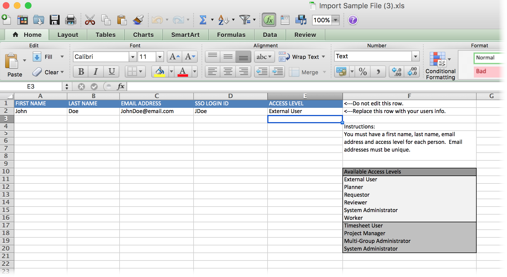

# Importa utenti

<!--

>[!IMPORTANT]
>
>The procedure described on this page applies only to organizations that have not yet been onboarded to the Admin Console. If your organization has been onboarded to the Adobe Admin Console, you must perform this action through the Adobe Admin Console.
>
>For instructions on editing a user's profile in the Adobe Admin Console, see the section "Add users" in the article [Bulk Upload Users](https://helpx.adobe.com/enterprise/using/bulk-upload-users.html) or contact your Adobe Admin Console Administrator.
>
>For a list of procedures that differ based on whether your organization has been onboarded to the Adobe Admin Console, see [Platform-based administration differences (Adobe Workfront/Adobe Business Platform)](../../../administration-and-setup/get-started-wf-administration/actions-in-admin-console.md).

-->

Puoi importare gli utenti utilizzando un file di importazione foglio di calcolo.

Prima di creare un nuovo utente, verificare di aver creato tutti gli oggetti che si desidera associare all&#39;utente. Se ad esempio non è stata creata una pianificazione, non sarà possibile assegnarla al nuovo utente e il campo utilizzato per associare una pianificazione al nuovo utente non verrà visualizzato nella schermata Nuovo utente.

## Requisiti di accesso

+++ Espandi per visualizzare i requisiti di accesso per la funzionalità in questo articolo.

Per eseguire i passaggi descritti in questo articolo, è necessario disporre dei seguenti elementi:

<table style="table-layout:auto"> 
 <col> 
 <col> 
 <tbody> 
  <tr> 
   <td role="rowheader">piano Adobe Workfront</td> 
   <td>Qualsiasi</td> 
  </tr> 
  <tr> 
   <td role="rowheader">Licenza Adobe Workfront</td> 
   <td>Piano</td> 
  </tr> 
  <tr> 
   <td role="rowheader">Configurazioni del livello di accesso</td> 
   <td> 
È necessario disporre di uno dei seguenti elementi:
 
    <ul> 
     <li> 
Livello di accesso Amministratore di sistema. Per informazioni, vedere <a href="../../../administration-and-setup/add-users/configure-and-grant-access/grant-a-user-full-administrative-access.md" class="MCXref xref">Concedere a un utente l'accesso amministrativo completo</a>. 
 </li> 
     <li> 
Impostazione di <b>Utenti</b> nel livello di accesso configurato per l'accesso di <b>Modifica</b>, con <b>Crea</b> e almeno una delle due opzioni di <b>Amministratore utenti</b> abilitate in <b>Ottimizza le impostazioni</b> . 
 
Di queste due opzioni, se l'utente <b>Amministratore (utenti gruppo)</b> è abilitato, è necessario essere un amministratore di gruppo di un gruppo di cui l'utente è membro.
 
Per ulteriori informazioni sull'impostazione <b>Utenti</b> in un livello di accesso, vedere <a href="../../../administration-and-setup/add-users/configure-and-grant-access/grant-access-other-users.md" class="MCXref xref">Concedere l'accesso agli utenti</a>.
 </li> 
    </ul> </td> 
  </tr> 
 </tbody> 
</table>

+++

## Utilizzare un file di importazione foglio di calcolo per importare gli utenti

{{step-1-to-users}}

1. Fai clic sulla freccia a discesa **Nuovo utente**, quindi fai clic su **Importa utenti**.

1. Nella casella **Importa utenti** visualizzata, scarica il file di esempio, quindi aggiorna il file di esempio in modo da includere le informazioni personali dell&#39;utente.

   Ogni riga include i campi seguenti:

   * **Nome**
   * **Cognome**
   * **Indirizzo e-mail**

     Gli indirizzi e-mail devono essere univoci.

   * **Livello d&#39;Accesso**

     I livelli di accesso distinguono tra maiuscole e minuscole.

   * **ID accesso SSO**

     Questo campo è incluso solo se SSO è abilitato nel sistema. Aggiungere l&#39;ID federazione in questo campo per ogni utente. Quando si crea un utente dalla scheda Persone, è possibile impostare una password per l&#39;utente se si desidera consentire agli utenti di accedere senza SSO. Tuttavia, la funzione di importazione non consente di lasciare vuoto l’ID ACCESSO SSO.

   * Assicurati che non siano presenti spazi aggiuntivi prima o dopo l’indirizzo e-mail di un utente.

   Una volta terminata la riga, dovrebbe essere simile alla seguente:

   

1. Salvare il file in una posizione sulla workstation.
1. Fare clic su **Scegli file** nella casella **Importa utenti**.

1. Individua e seleziona il file salvato.
1. (Facoltativo) Selezionare l&#39;opzione **Invia un&#39;e-mail di invito a questo utente** per inviare un invito e-mail all&#39;utente, avvisandolo che è stato creato un account Workfront e richiedendo di impostare la password.

   Deselezionare questa opzione se si desidera impostare la password per l&#39;utente.

1. Fai clic su **Importa**.

   Nella parte superiore della schermata viene visualizzato un messaggio di conferma che indica che l’importazione dell’utente è avvenuta correttamente.
