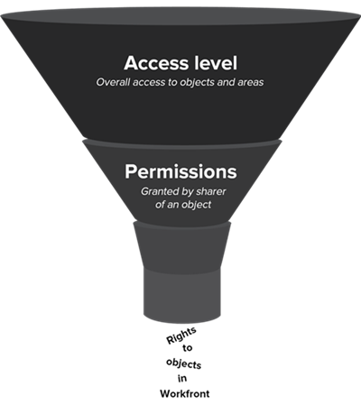

# Panoramica dei nuovi livelli di accesso

>[!NOTE]
>
>Le informazioni contenute in questo articolo si riferiscono ai livelli di accesso correnti. Per informazioni sui livelli di accesso legacy, vedere [Panoramica dei livelli di accesso](/help/quicksilver/administration-and-setup/add-users/access-levels-and-object-permissions/access-levels-overview.md).

In qualità di amministratore di Adobe Workfront, puoi assegnare un livello di accesso a un utente per due scopi:

* Per accedere e lavorare in Workfront, ogni utente deve disporre di un livello di accesso.
* Il livello di accesso consente di controllare cosa un utente può vedere e cosa può fare con determinati oggetti e aree di Workfront.

## Nuovi livelli di accesso incorporati in Adobe Workfront {#built-in-access}

Workfront dispone di 5 nuovi livelli di accesso incorporati:

* Amministratore di Sistema
* Standard
* Light
* Collaboratore
* Esterno

A seconda del livello di accesso, sono disponibili fino a 3 autorizzazioni per la maggior parte dei tipi di oggetto Workfront:

<table style="table-layout:auto">
    <tr>
        <td>Modifica</td>
        <td>Gli utenti possono creare, modificare, eliminare e condividere l’oggetto Workfront</td>
    </tr>
    <tr>
        <td>Visualizzazione</td>
        <td>Gli utenti possono rivedere e condividere l’oggetto Workfront</td>
    </tr>
    <tr>
        <td>Nessun accesso</td>
        <td>Gli utenti non possono accedere all’oggetto Workfront</td>
    </tr>
</table>

Se è necessario un livello di accesso personalizzato, è possibile copiare il livello di accesso incorporato e regolare la quantità di accesso che si desidera consentire per i vari tipi di oggetti di Workfront. Per informazioni sulla creazione di un livello di accesso personalizzato, vedere [Creare o modificare livelli di accesso personalizzati](../../../administration-and-setup/add-users/configure-and-grant-access/create-modify-access-levels.md).

>[!IMPORTANT]
>
>È consigliabile lasciare invariati i livelli di accesso incorporati in modo da potervi fare riferimento dopo aver configurato gli utenti.

### Livello di accesso Amministratore di sistema

Collegato alla licenza Standard, questo livello di accesso integrato è progettato per un utente che è responsabile dell’amministrazione del sistema Adobe Workfront. Impossibile modificare questo livello di accesso predefinito.

Gli utenti con il livello di accesso Amministratore di sistema possono eseguire tutte le operazioni all&#39;interno di Workfront. Possono visualizzare e modificare tutti gli oggetti e le informazioni di Workfront immesse in Workfront da tutti gli altri utenti.

Ha inoltre accesso all&#39;area Setup (Configurazione) completa, in cui può modificare qualsiasi impostazione a livello di sistema e accedere a tutte le aree nel Main Menu (Menu principale).

Per ulteriori informazioni, vedere [Concedere a un utente l&#39;accesso amministrativo completo](../../../administration-and-setup/add-users/configure-and-grant-access/grant-a-user-full-administrative-access.md).

### Livello di accesso standard

Collegato alla licenza Standard, questo livello di accesso è progettato per gli utenti che:

* Pianificare, creare e tenere traccia di tutti i progetti in un&#39;unica posizione
* Automatizzare i processi di routine
* Gestire le risorse
* Tracciare e collaborare alle richieste
* Monitoraggio e creazione di report sulla situazione finanziaria dei progetti
* Richieste di lavoro in entrata di avvio
* Collaborazione su progetti, attività e problemi

>[!NOTE]
>
>È possibile creare una versione personalizzata del livello di accesso predefinito Standard e regolare la quantità di accesso consentito per i vari tipi di oggetti Workfront. Per informazioni sulla creazione di un livello di accesso personalizzato, vedere [Creare o modificare livelli di accesso personalizzati](../../../administration-and-setup/add-users/configure-and-grant-access/create-modify-access-levels.md).

#### **Dettagli di accesso**

Di seguito sono riportate le impostazioni di accesso più elevate disponibili per gli oggetti nel livello di accesso Standard:

| Tipo di oggetto Workfront | Nessun accesso | Visualizza accesso | Modifica accesso |
|---|---|---|---|
| Progetti |   |   | ✓ |
| Attività |   |   | ✓ |
| Problemi |   |   | ✓ |
| Portfolio |   |   | ✓ |
| Programmi |   |   | ✓ |
| Report (inclusi dashboard e report calendario) |   |   | ✓ |
| Filtri, viste e raggruppamenti |   |   | ✓ |
| Documenti |   |   | ✓ |
| Utenti |   |   | ✓ |
| Modelli |   |   | ✓ |
| Dati finanziari |   |   | ✓ |
| Gestione risorse |   |   | ✓ |
| Pianificazione scenario |   |   | ✓ (l&#39;impostazione predefinita è Nessun accesso). |
| Obiettivi |   |   | ✓ |

{style="table-layout:auto"}

### Livello di accesso alla luce

Collegato alla licenza Light, questo livello di accesso è progettato per gli utenti che:

* Visualizza tutti gli elementi e gli aggiornamenti associati al lavoro
* Approva progetti, attività e problemi
* Visualizzare dashboard e rapporti
* Tracciare il tempo dedicato ad attività e problemi e approvare le schede orario
* Creare e gestire i problemi

Utenti con il livello di accesso Light:

* Possono essere assegnati elementi di lavoro ma non possono completarli.
* Può accedere a richieste e documenti nel menu principale.
* Hanno capacità limitate di creare oggetti, non possono creare progetti, portfolio, programmi o report.

>[!NOTE]
>
>È possibile creare una versione personalizzata del livello di accesso integrato Light e regolare la quantità di accesso consentito per i vari tipi di oggetti Workfront. Per informazioni sulla creazione di un livello di accesso personalizzato, vedere [Creare o modificare livelli di accesso personalizzati](../../../administration-and-setup/add-users/configure-and-grant-access/create-modify-access-levels.md).

#### **Dettagli di accesso**

Di seguito sono riportate le impostazioni di accesso più elevate disponibili per gli oggetti nel livello di accesso Luce:

<table style="table-layout:auto"> 
 <col> 
 <col> 
 <col> 
 <col> 
 <thead> 
  <tr> 
   <th>Tipo di oggetto Workfront</th> 
   <th>Nessun accesso</th> 
   <th>Visualizza accesso</th> 
   <th>Modifica accesso</th> 
  </tr> 
 </thead> 
 <tbody> 
  <tr> 
   <td>Progetti</td> 
   <td> </td> 
   <td>✓</td> 
   <td> </td> 
  </tr> 
  <tr> 
   <td>Attività</td> 
   <td> </td> 
   <td></td> 
   <td>✓ (limitato)</td> 
  </tr> 
  <tr> 
   <td>Problemi</td> 
   <td> </td> 
   <td> </td> 
   <td>✓</td> 
  </tr> 
  <tr> 
   <td>Portfolio</td> 
   <td> </td> 
   <td>✓ (l'impostazione predefinita è Nessun accesso).</td> 
   <td> </td> 
  </tr> 
  <tr> 
   <td>Programmi</td> 
   <td> </td> 
   <td>✓ (l'impostazione predefinita è Nessun accesso).</td> 
   <td> </td> 
  </tr> 
  <tr> 
   <td>Report (inclusi dashboard e report calendario)</td> 
   <td> </td> 
   <td>✓</td> 
   <td> </td> 
  </tr> 
  <tr> 
   <td>Filtri, viste e raggruppamenti</td> 
   <td> </td> 
   <td> </td> 
   <td>✓</td> 
  </tr> 
  <tr> 
   <td>Documenti</td> 
   <td> </td> 
   <td> </td> 
   <td>✓</td> 
  </tr> 
  <tr> 
   <td>Utenti</td> 
   <td> </td> 
   <td>✓</td> 
   <td> </td> 
  </tr> 
    <tr> 
   <td>Team</td> 
   <td> </td> 
   <td>✓</td> 
   <td> </td> 
  </tr>
  <tr> 
   <td>Modelli</td> 
   <td>✓</td> 
   <td> </td> 
   <td> </td> 
  </tr> 
  <tr> 
   <td>Dati finanziari</td> 
   <td></td> 
   <td> 
✓ (l'impostazione predefinita è Nessun accesso)
 </td> 
   <td> </td> 
  </tr> 
  <tr> 
   <td>Gestione risorse</td> 
   <td> </td> 
   <td>✓</td> 
   <td> </td> 
  </tr> 
  <tr> 
   <td>Pianificazione scenario </td> 
   <td> </td> 
   <td> </td> 
   <td>✓ (l'impostazione predefinita è Nessun accesso).</td> 
  </tr>

<tr>   
   <td>Obiettivi </td> 
   <td> </td> 
   <td> </td> 
   <td>✓ (l'impostazione predefinita è Nessun accesso)</td> 
 </tbody> 
</table>

### Livello di accesso Collaboratore

Associato alla licenza Collaboratore, questo livello di accesso è progettato per gli utenti che:

* Inviare richieste
* Tracciare le richieste
* Aggiornare e rivedere le richieste
* Approvare le richieste

Utenti con questo livello di accesso integrato:

* Può effettuare richieste e aggiornarle
* Può caricare e approvare i documenti
* Può approvare progetti, attività e problemi

  >[!NOTE]
  >
  >I collaboratori possono partecipare alle approvazioni, ma non possono accedere alla scheda Approvazioni per visualizzare o gestire i processi di approvazione.

* Può rivedere lo stato dei problemi che ha inviato
* Può essere assegnato ad elementi di lavoro ma non può completarli
* Può accedere alle richieste solo dal menu principale. Per ulteriori informazioni sulle code di richieste, vedere [Creare una coda di richieste](../../../manage-work/requests/create-and-manage-request-queues/create-request-queue.md).

>[!NOTE]
>
>È possibile creare una versione personalizzata del livello di accesso predefinito Collaboratore e regolare la quantità di accesso consentito per i vari tipi di oggetti di Workfront. Per informazioni sulla creazione di un livello di accesso personalizzato, vedere [Creare o modificare livelli di accesso personalizzati](../../../administration-and-setup/add-users/configure-and-grant-access/create-modify-access-levels.md).

#### **Dettagli di accesso**

Di seguito sono riportate le impostazioni di accesso più elevate disponibili per gli oggetti nel livello di accesso Collaboratore:

| Tipo di oggetto Workfront | Nessun accesso | Visualizza accesso | Modifica accesso |
|---|---|---|---|
| Progetto |   | ✓ (limitato) |   |
| Attività |   | ✓(limitato) |   |
| Problema |   |   | ✓ |
| Portfolio |   | ✓ |   |
| Programmi |   | ✓ |   |
| Report (inclusi dashboard e report calendario) |   | ✓ (solo la scheda Dettagli) |   |
| Filtri, viste e raggruppamenti |   |   | ✓ |
| Documento |   |   | ✓ |
| Utente |   | ✓ |   |
| Team |   | ✓ |   |
| Modelli | ✓ |   |   |
| Dati finanziari | ✓ |   |   |
| Gestione risorse | ✓ |   |   |
| Pianificazione scenario | ✓ |   |   |
| Obiettivi |   |   | ✓ (l&#39;impostazione predefinita è Nessun accesso) |

{style="table-layout:auto"}

>[!IMPORTANT]
>
>A partire dalla versione 24.7, per impostazione predefinita i collaboratori hanno accesso in visualizzazione a programmi e portafogli.
>
> 
>Per impostazione predefinita, i collaboratori avviati prima della versione 24.7 continueranno a non avere accesso a programmi e portafogli. Se necessario, puoi aggiornarne l’accesso per la visualizzazione manuale.

### Livello di accesso utente esterno

Questo livello di accesso non è collegato a una licenza Workfront a pagamento. È il livello di accesso più restrittivo, progettato principalmente per collaboratori come consulenti esterni che non accedono a Workfront, ma che devono rivedere, scaricare o visualizzare documenti di tanto in tanto.

Utenti con il livello di accesso Utente esterno:

* È possibile visualizzare solo i documenti e i report del calendario condivisi con gli altri
* Visualizzare gli utenti che condividono con loro documenti e report del calendario
* Approva i documenti condivisi con gli altri

Gli utenti esterni non possono essere assegnati ad elementi di lavoro.

Non puoi modificare questo livello di accesso.

>[!IMPORTANT]
>
>L’utente esterno è disponibile solo se l’opzione &quot;Collaborazione con persone senza account Workfront utilizzando il loro indirizzo e-mail&quot; è abilitata nell’area Preferenze di sistema in Configurazione. Per ulteriori informazioni, vedere [Configurare le preferenze di sicurezza del sistema](/help/quicksilver/administration-and-setup/manage-workfront/security/configure-security-preferences.md).

#### **Dettagli di accesso**

Di seguito sono riportate le impostazioni di accesso più elevate disponibili per gli oggetti nel livello di accesso Utente esterno.

| Tipo di oggetto Workfront | Nessun accesso | Visualizza accesso | Modifica accesso |
|---|---|---|---|
| Progetto | ✓ |   |   |
| Attività | ✓ |   |   |
| Problema | ✓ |   |   |
| Portfolio | ✓ |   |   |
| Programmi | ✓ |   |   |
| Report (inclusi dashboard e report calendario) |   | ✓ (solo per i report calendario; impossibile condividere i report) |   |
| Filtri, viste e raggruppamenti | ✓ |   |   |
| Documento |   | ✓ (impossibile condividere i documenti) |   |
| Utente |   | ✓ |   |
| Team | ✓ |   |   |
| Modelli | ✓ |   |   |
| Dati finanziari | ✓ |   |   |
| Gestione risorse | ✓ |   |   |
| Pianificazione scenario | ✓ |   |   |
| Obiettivi | ✓ |   |   |

## Funzionamento congiunto dei livelli di accesso e delle autorizzazioni

I livelli di accesso definiscono ciò che gli utenti possono vedere e fare con i tipi di oggetti e le aree generali del sistema, come progetti, attività e problemi. Le autorizzazioni definiscono ciò a cui hai accesso su oggetti specifici creati da altre persone nel sistema, come un progetto creato per eseguire una campagna di marketing.

Nella tabella seguente viene confrontato l&#39;accesso generale di un utente agli oggetti (definito dal livello di accesso dell&#39;utente) con le autorizzazioni per un oggetto condiviso specifico:

<table style="table-layout:auto"> 
 <col> 
 <col> 
 <col> 
 <thead> 
  <tr> 
   <th> </th> 
   <th>Livello di accesso </th> 
   <th>Autorizzazioni </th> 
  </tr> 
 </thead> 
 <tbody> 
  <tr> 
   <td>Concessi da un amministratore Workfront nel livello di accesso di un utente</td> 
   <td>✓</td> 
   <td> </td> 
  </tr> 
  <tr> 
   <td>Concesso da un utente che condivide un oggetto a livello di oggetto</td> 
   <td> </td> 
   <td>✓</td> 
  </tr> 
  <tr> 
   <td> 
Ereditato da un oggetto condiviso di livello superiore 
   </td> 
   <td> </td> 
   <td>✓</td> 
  </tr> 
 </tbody> 
</table>

Le attività che un utente può svolgere con un oggetto sono definite da una combinazione del proprio livello di accesso e delle autorizzazioni assegnate.

### Concedere autorizzazioni tramite la condivisione di oggetti

Gli utenti possono accedere a singoli oggetti quando altri utenti condividono e concedono determinate autorizzazioni su tali oggetti.

>[!NOTE]
>
>* Se un utente condivide un oggetto con determinate autorizzazioni e tale oggetto ha oggetti figlio al di sotto di esso, il destinatario eredita le stesse autorizzazioni per tali oggetti figlio.
>* Se un livello di accesso impedisce agli utenti di eliminare determinati oggetti, ciò non impedisce loro di eliminare gli oggetti secondari contenuti in tali oggetti.

Un utente può concedere al destinatario le seguenti autorizzazioni per il singolo oggetto:

* **Visualizzazione**: questo livello di autorizzazione consente al destinatario di condividere l&#39;oggetto in uno dei modi seguenti:

   * A livello di sistema, in modo che tutti gli utenti possano visualizzarlo (non disponibile per tutti gli oggetti)
   * Con utenti esterni che non dispongono di una licenza Workfront (non disponibile per tutti gli oggetti)
   * Con un indirizzo e-mail (disponibile solo per documenti e calendari)

* **Contribute**: (non disponibile per tutti gli oggetti)
* **Gestisci**: quando qualcuno condivide un oggetto, i diritti del destinatario sull&#39;oggetto sono determinati da una combinazione del livello di accesso del destinatario e delle autorizzazioni per l&#39;oggetto concesse dal condivisore. Il livello di accesso più basso disponibile in tale combinazione è quello che determina il comportamento del destinatario con l’oggetto.

### Scenari di esempio

#### **Scenario 1**

Se il livello di accesso del destinatario non consente la modifica del progetto, l’utente non può modificare o eliminare un progetto anche se il condivisore ha concesso le autorizzazioni per gestirlo.

In alternativa, se il livello di accesso del destinatario consente la modifica del progetto, ma il condivisore concede autorizzazioni di sola visualizzazione a un progetto, l’utente non può modificare o eliminare il progetto.

#### **Scenario 2**

Quando Olivia condivide un progetto Workfront con Tony, l’accesso di quest’ultimo è determinato da una combinazione di due fattori:

* Livello di accesso di Tony assegnato dall’amministratore Workfront
* Autorizzazioni di Tony per il progetto, specificate da Olivia

Le azioni di Tony sul progetto possono essere ulteriormente limitate sul progetto, ma non possono essere illimitate al di là di ciò che è consentito sul suo livello di accesso:

* Se il livello di accesso di Tony non gli consente di creare attività, non può aggiungere attività al progetto , anche se Olivia gli ha dato le autorizzazioni per aggiungervi attività.
* Se il livello di accesso di Tony non gli consente di creare attività, ma Olivia non concede le autorizzazioni per aggiungere attività al progetto, non può aggiungere attività a tale progetto, ma può aggiungere attività ad altri progetti per i quali dispone delle autorizzazioni necessarie.
