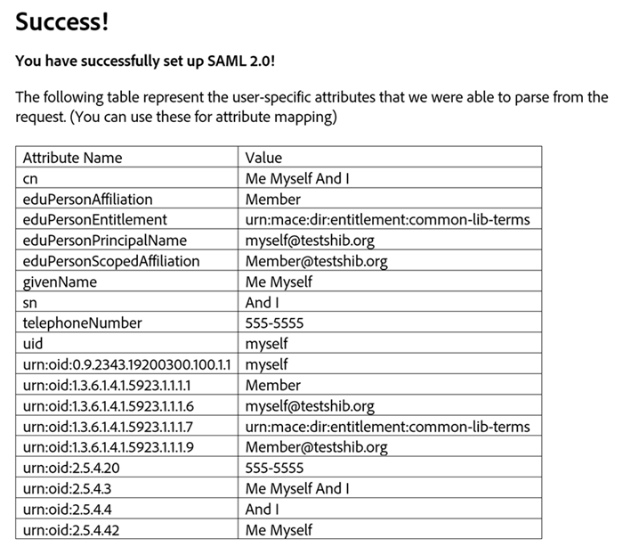

# Configurare Adobe Workfront con SAML 2.0

<!--
**DON'T DELETE, DRAFT OR HIDE THIS ARTICLE. IT IS LINKED TO THE PRODUCT, THROUGH THE CONTEXT SENSITIVE HELP LINKS.** 

-->

<!-- Audited: 12/2023 -->

{{important-admin-console-onboard}}

In qualità di amministratore di Adobe Workfront, puoi configurare le applicazioni web e mobili Workfront per l’integrazione con una soluzione SAML (Security Assertion Markup Language) 2.0 per il Single Sign-On (SSO).

Dopo aver configurato SAML 2.0 in Workfront, come descritto nelle sezioni seguenti, è possibile mantenere la configurazione, come descritto in [Aggiornare i metadati SAML 2.0 nel provider di identità](../../../administration-and-setup/add-users/single-sign-on/update-saml-2-metadata-ip.md).

## Requisiti di accesso

+++ Espandi per visualizzare i requisiti di accesso per la funzionalità in questo articolo.

Per eseguire i passaggi descritti in questo articolo, è necessario disporre dei seguenti diritti di accesso:

<table style="table-layout:auto"> 
 <col> 
 <col> 
 <tbody> 
  <tr> 
   <td role="rowheader">piano Adobe Workfront</td> 
   <td>Qualsiasi</td> 
  </tr> 
  <tr> 
   <td role="rowheader">Licenza Adobe Workfront</td> 
   <td>
Nuovo: Standard 

       
oppure
 
       
Corrente: Piano 

   </td> 
  </tr> 
  <tr> 
   <td role="rowheader">Configurazioni del livello di accesso</td> 
   <td> 
Devi essere un amministratore di Workfront.
 </td> 
  </tr> 
 </tbody> 
</table>

Per ulteriori dettagli sulle informazioni contenute in questa tabella, vedere [Requisiti di accesso nella documentazione di Workfront](/help/quicksilver/administration-and-setup/add-users/access-levels-and-object-permissions/access-level-requirements-in-documentation.md).

+++

## Abilitare l’autenticazione in Workfront con SAML 2.0

{{step-1-to-setup}}

1. Fare clic su **Sistema** > **Single Sign-On (SSO).**

1. Nell&#39;elenco a discesa **Tipo** selezionare **SAML 2.0.**

1. Nella parte superiore delle opzioni visualizzate, fai clic su **Scarica metadati SAML 2.0** per scaricare il file sul computer.

   Il provider di identità SAML 2.0 richiede un file XML con le informazioni generate nell&#39;istanza di Workfront. Dopo aver scaricato il file, devi accedere al server del provider di identità SAML 2.0 e caricare il file XML dei metadati SAML 2.0 di Workfront.

1. Specifica le seguenti informazioni in Workfront:

   <table style="table-layout:auto">
    <col>
    <col>
    <tbody>
     <tr>
      <td role="rowheader">ID provider servizi </td>
      <td> Questo URL, già compilato per te, identifica Workfront nel tuo provider di identità. Esempio: <code>&lt;yourcompany&gt;.com/SAML2</code>.</td>
     </tr>
     <tr>
      <td role="rowheader">Tipo di associazione </td>
      <td> 
Selezionare il metodo supportato dal server IDP per l'invio delle informazioni di autenticazione:

       <ul>
       <li>POST</li>
       <li>REINDIRIZZAMENTO</li>
       </ul> </td>
     </tr>
     <tr>
      <td role="rowheader">Compila i campi dai metadati del provider di identità </td> 
      <td>Nella soluzione SAML 2.0 Identity Provider, esportare un file XML dei metadati del provider di servizi e salvarlo in una posizione temporanea nel computer. Seleziona <strong>Scegli file</strong>, quindi individua e seleziona il file salvato per aggiungerlo alla configurazione di Workfront.</td> 
     </tr> 
     <tr> 
      <td role="rowheader">URL portale di accesso </td> 
      <td>Inserisci il portale di accesso comune della tua organizzazione. Questo è l’URL in cui gli utenti accedono per accedere a Workfront e a tutte le altre applicazioni integrate con SAML 2.0.</td> 
     </tr>
     <tr>
      <td role="rowheader">URL disconnessione </td> 
      <td> 
Immettere l'URL di disconnessione per il server IDP. Workfront invia una richiesta HTTP a questo URL prima di uscire da Workfront. Questa operazione consente di chiudere la sessione dell'utente sul server remoto quando viene chiusa la sessione di Workfront.
 
<b>NOTA</b>: l'utente viene reindirizzato all'URL di disconnessione solo se nel profilo utente è abilitata l'opzione <strong>Consenti solo autenticazione SAML 2.0</strong>.
 </td>
     </tr>
     <tr>
      <td role="rowheader">Cambia URL password </td> 
      <td> 
 Specifica l’URL a cui verranno reindirizzati gli utenti per modificare le password. 
 
Poiché le credenziali SAML 2.0 vengono utilizzate per accedere a Workfront, gli utenti devono essere reindirizzati a una pagina in cui possono modificare la password SAML 2.0 invece di completare questa attività tramite Workfront.
 </td> 
     </tr> 
     <tr> 
      <td role="rowheader">Algoritmodi Hash sicuro </td> 
      <td> 
Selezionare l'algoritmo SHA (Secure Hash Algorithm) supportato dall'IDP:
 
       <ul> 
       <li>SHA-1</li> 
       <li>SHA-256</li> 
       </ul> </td> 
     </tr> 
     <tr> 
      <td role="rowheader">Provisioning automatico utenti </td> 
      <td> 
Questa opzione crea automaticamente un utente nel sistema quando un nuovo utente con nome utente e password della directory tenta di accedere a Workfront per la prima volta.
 
Per creare utenti in Workfront, è necessario mappare gli attributi dei dati di Workfront con i seguenti attributi dei dati utente nel provider di directory:
 
       <ul> 
       <li>Nome</li> 
       <li>Cognome</li> 
       <li>Indirizzo email</li> 
       </ul> 
       
Quando si seleziona la casella di controllo, vengono visualizzate le seguenti opzioni:
 
       
  
 
       
Selezionare l'attributo utente di Workfront che si desidera mappare dall'elenco a discesa, quindi specificare l'attributo di directory corrispondente nella directory utente.
 
       
Il campo <strong>Attributo directory</strong> deve contenere il nome dell'attributo di directory della tabella degli attributi utente salvata durante il test della configurazione SAML 2.0.
 
       
È possibile impostare un valore Workfront predefinito nel campo <strong>Valore predefinito</strong>. Puoi anche impostare regole in base ai valori del provider di identità SAML 2.0.
 
       
<b>AVVISO</b>: Workfront tenta di mappare gli attributi elencati di seguito ogni volta che un utente accede al sistema. Per questo motivo, si sconsiglia di mappare i livelli di accesso. Se un attributo è mappato in modo errato, è possibile rimuovere facilmente l'accesso amministrativo. Fai clic su <strong>Aggiungi mapping</strong> per aggiungere altre regole.
       
 
       
Puoi mappare i seguenti attributi di Workfront:
 
      <ul> 
      <li> 
Livello di accesso
 </li> 
      <li> 
Indirizzo
 </li> 
      <li> 
Indirizzo2
 </li> 
      <li> 
Fatturazione oraria
 </li> 
      <li> 
Città
 </li> 
      <li> 
Azienda
 </li> 
      <li> 
Costo orario
 </li> 
      <li> 
Indirizzo email
 </li> 
      <li> 
Estensione
 </li> 
      <li> 
Nome
 </li> 
      <li> 
Gruppo Predefinito
 </li> 
      <li> 
Team predefinito
 </li> 
      <li> 
Ruolo
 </li> 
      <li> 
Cognome
 </li> 
      <li> 
Modello di layout
 </li> 
      <li> 
Manager
 </li> 
      <li> 
Cellulare
 </li> 
      <li> 
Numero di telefono
 </li> 
      <li> 
Codice postale
 </li> 
      <li> 
Pianificazione
 </li> 
      <li> 
Stato
 </li> 
      <li> 
Profilo scheda orario
 </li> 
      <li> 
Titolo
 </li> 
      </ul>
      
Fai clic su <strong>Salva</strong> al termine della mappatura degli attributi utente.
 </td> 
     </tr> 
     <tr> 
      <td role="rowheader">Certificato </td> 
      <td> 
Carica un certificato SSL valido per garantire una connessione sicura tra il servizio di autenticazione e Workfront. Per gli account On Demand, è sempre necessario un certificato. Puoi ottenere questo certificato dal tuo amministratore di sistema SAML 2.0.
 </td> 
     </tr> 
     <tr> 
      <td role="rowheader">Eccezione amm. </td> 
      <td> 
Consente agli amministratori di Workfront di accedere a Workfront con il proprio accesso a Workfront. Se questa opzione non è selezionata, gli amministratori di Workfront devono utilizzare il nome utente e la password SAML 2.0.
 
      
Workfront tenta innanzitutto di accedere a Workfront tramite SAML 2.0 per gli utenti con il livello di accesso Amministratore di sistema di Workfront. Se l'autenticazione SAML 2.0 non riesce, Workfront utilizza l'autenticazione locale per gli amministratori di Workfront.
 
      
È consigliabile selezionare sempre questa opzione in modo che l'amministratore di Workfront possa accedere a Workfront se il provider SAML 2.0 non è temporaneamente disponibile.
 </td> 
     </tr> 
     <tr> 
      <td role="rowheader">Abilita </td> 
      <td> 
Attiva l'SSO sul sistema Workfront. Assicurati di aver comunicato le istruzioni di accesso agli utenti.
 
Dopo aver abilitato la configurazione SSO in Workfront, è necessario abilitare l'impostazione <strong>Consenti solo autenticazione SAML 2.0</strong> per tutti gli utenti in modo che possano utilizzare SSO.
 
Per ulteriori informazioni sull'aggiornamento degli utenti per l'SSO, vedere <a href="../../../administration-and-setup/add-users/single-sign-on/update-users-sso.md" class="MCXref xref">Aggiornare gli utenti per il Single Sign-On</a>.
 
Per ulteriori informazioni sulle impostazioni utente, vedere <a href="../../../administration-and-setup/add-users/create-and-manage-users/edit-a-users-profile.md" class="MCXref xref">Modificare il profilo di un utente</a>.
 </td> 
     </tr> 
     <tr> 
      <td role="rowheader">Conferma configurazione </td> 
      <td> 
      
Fare clic su <strong>Verifica connessione</strong> per verificare che Workfront e il provider di identità SAML 2.0 possano comunicare tra loro. Questa connessione ha esito positivo solo se sono stati scambiati i file XML.
      
 
      
Dopo aver verificato correttamente il collegamento tra il provider di identità SAML 2.0 e Workfront, verrà visualizzata una schermata simile a quella riportata di seguito.

      
<b>NOTA</b>: questa schermata viene visualizzata in un pop-up del browser, quindi accertati di disabilitare i blocchi pop-up nel browser.

      
Salvare le informazioni visualizzate nella tabella per utilizzarle successivamente.

      

</td> 
     </tr> 
    </tbody> 
   </table>

1. Fai clic su **Salva** per salvare la configurazione SAML 2.0.
