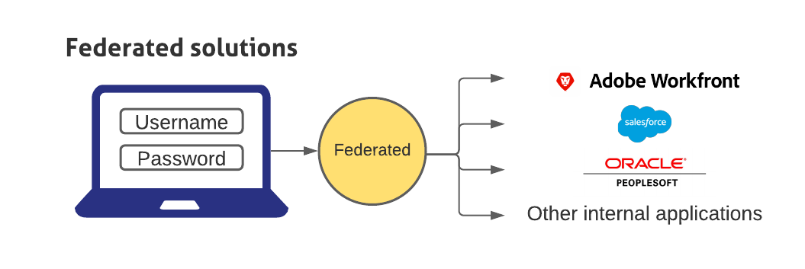

# Panoramica del single sign-on in Adobe Workfront

<!--Audited: 12/2023-->

{{important-admin-console-onboard}}

Workfront fornisce una configurazione Single Sign-On (SSO) gestita centralmente che integra Workfront con la soluzione SSO aziendale esistente. Questa configurazione è disponibile sia per i clienti OnDemand che per i clienti OnPremise Enterprise.

Per utilizzare la funzionalità SSO in Workfront, l’organizzazione deve configurare un’applicazione SSO. È quindi possibile configurare Workfront in modo che possa comunicare con la soluzione SSO.

Le soluzioni federate consentono agli utenti di accedere a tutte le applicazioni immettendo il nome utente e la password in un portale di accesso centralizzato.

## Configurare il firewall

Quando si utilizza una soluzione SSO, Workfront avvia una connessione al server sulla porta specificata.

Se il firewall o il server di posta è configurato in modo da consentire l&#39;accesso solo a fornitori specifici, è necessario aggiungere determinati indirizzi IP di Workfront al inserisco nell&#39;elenco Consentiti di autenticazione del firewall. Per ulteriori informazioni, consulta [Configurare il inserisco nell&#39;elenco Consentiti di configurazione del firewall per l’accesso a un sistema di protezione da attacchi di tipo](../../../administration-and-setup/get-started-wf-administration/configure-your-firewall.md).

## Configurare il Single Sign-On

Workfront si integra con le seguenti soluzioni SSO:

* Soluzioni federate che supportano SAML 2.0

  Per informazioni sull’integrazione di Workfront con SAML 2.0, consulta [Configurare Adobe Workfront con SAML 2.0](../../../administration-and-setup/add-users/single-sign-on/configure-workfront-saml-2.md).

* Soluzioni federate che supportano SAML 2.0 tramite ADFS

  Per informazioni sull&#39;integrazione di Workfront con SAML 2.0 tramite ADFS, vedere [Configurare Adobe Workfront con SAML 2.0 utilizzando ADFS](../../../administration-and-setup/add-users/single-sign-on/configure-workfront-saml-2-adfs.md).
