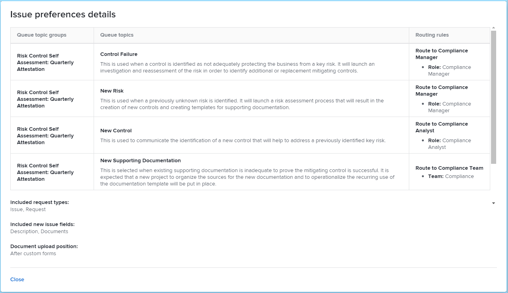

# Configurare una blueprint

Puoi configurare i dettagli di una blueprint prima di installarla. I tipi di blueprint per modelli di progetto e strutture organizzative in genere richiedono l’impostazione di alcune preferenze e la mappatura di alcune proprietà. Altri tipi di blueprint potrebbero non richiedere la configurazione e verranno installati così come sono. Per ulteriori informazioni sull&#39;installazione, vedere [Installare una blueprint](/help/quicksilver/administration-and-setup/blueprints/blueprints-install.md).

## Requisiti di accesso

Per eseguire i passaggi descritti in questo articolo, è necessario disporre dei seguenti diritti di accesso:

<table style="table-layout:auto"> 
 <col> 
 <col> 
 <tbody> 
  <tr> 
   <td role="rowheader"><strong>[!DNL Adobe Workfront] piano</strong></td>
   <td>Qualsiasi</td> 
  </tr> 
  <tr> 
   <td role="rowheader"><strong>Licenza Adobe [!DNL Workfront]</strong></td>
   <td>[!UICONTROL Plan]</td> 
  </tr> 
  <tr> 
   <td role="rowheader"><strong>Configurazioni del livello di accesso</strong></td>
   <td> 
[!UICONTROL Amministratore di sistema]
 </td> 
  </tr> 
 </tbody> 
</table>

## Configurare una blueprint per modelli di progetto

1. Trova la blueprint da utilizzare.
1. Fai clic su **[!UICONTROL Installa]**, quindi scegli un ambiente:

   <table style="table-layout:auto">
        <tr>
        <td><strong>Production</strong></td>
        <td>La produzione è il tuo ambiente live.</td>
    </tr>
    <tr>
        <td><strong>Anteprima sandbox</strong></td>
        <td>L’anteprima sandbox è un ambiente di test che funge da replica dell’ambiente live e viene aggiornato ogni fine settimana da Workfront.</td>
    </tr>
    <tr>
        <td><strong>Sandbox 1 e 2</strong></td>
        <td>La sandbox di aggiornamento personalizzata è un ambiente di test separato che viene aggiornato manualmente dall’utente. Per ottenere la Sandbox di aggiornamento personalizzata è necessario un costo aggiuntivo.</td>
    </tr>
   </table>

1. Procedi con le sezioni seguenti:

   * [[!UICONTROL Preferenze modello]](#template-preferences)
   * [[!UICONTROL Mappatura ruoli]](#role-mapping)
   * [[!UICONTROL Mappatura team]](#team-mapping)
   * [[!UICONTROL Mappatura società]g](#company-mapping)
   * [[!UICONTROL Mappatura gruppo]](#group-mapping)

## [!UICONTROL Preferenze modello] {#template-preferences}

Scegliere come installare il modello.

Puoi anche designare la proprietà del modello prima di installare la blueprint. Puoi apportare modifiche a questi campi dopo l’installazione del modello. Per ulteriori informazioni, vedere [Modifica modelli di progetto](../../manage-work/projects/create-and-manage-templates/edit-templates.md).

![[!UICONTROL Preferenze modello] sezione](assets/Blueprints_TemplatePreferences.png)

1. Nella sezione [!UICONTROL Preferenze modello], specifica un nuovo nome di modello.
1. Specifica quanto segue:

   <table style="table-layout:auto">
    <tr>
        <td><strong>[!UICONTROL Proprietario modello]<strong></td>
        <td>Questa persona riceve le autorizzazioni [!UICONTROL Manage] per il modello e diventerà il proprietario del progetto quando il modello verrà utilizzato per creare un progetto.</td>
    </tr>
    <tr>
        <td><strong>[!UICONTROL sponsor modello]</strong></td>
        <td>Questa persona è in genere un manager, un dirigente o un stakeholder che deve sapere cosa sta succedendo con il progetto. Lo sponsor del progetto non ottiene alcun accesso aggiuntivo al progetto, ma viene aggiunto alle notifiche e-mail del progetto.</td>
    </tr>
    <tr>
        <td><strong>[!UICONTROL Portfolio]</strong></td>
        <td>Questo è il portfolio a cui apparterrà il progetto quando sarà creato.</td>
    </tr>
    <tr>
        <td><strong>[!UICONTROL Program]</strong></td>
        <td>Questo è il programma a cui apparterrà il progetto al momento della creazione.</td>
    </tr>
   </table>

1. Seleziona se il modello deve essere installato come attivo o inattivo.
1. Seleziona se desideri utilizzare le preferenze definite per i nuovi problemi, se le preferenze sono disponibili.

   Fai clic su **[!UICONTROL Visualizza preferenze problema]** per esaminare le preferenze specifiche che verranno installate con la blueprint. I progetti creati dal modello importato utilizzano queste preferenze per i nuovi problemi aggiunti nella sezione [!UICONTROL Problemi].

   <table style="table-layout:auto"> 
    <col> 
    <col> 
    <tbody> 
     <tr> 
      <td role="rowheader"><strong>Gruppi di argomenti coda</strong></td> 
      <td> 
I gruppi di argomenti della coda definiscono il livello più alto di categorie per i problemi o le richieste. Gli utenti visualizzano i gruppi di argomenti come opzioni di menu quando selezionano dove inviare le richieste. Un gruppo di argomenti può contenere più argomenti della coda. Per ulteriori informazioni, vedere <a href="../../manage-work/requests/create-and-manage-request-queues/create-topic-groups.md" class="MCXref xref">Creare gruppi di argomenti</a>. 
 </td> 
     </tr> 
     <tr> 
      <td role="rowheader"><strong>Argomenti per coda</strong></td> 
      <td> 
Gli argomenti della coda funzionano insieme alle regole di instradamento per assegnare problemi o richieste. Si tratta delle opzioni di menu selezionate dagli utenti quando inseriscono un problema o una richiesta, dopo aver selezionato un gruppo di argomenti. Per ulteriori informazioni, vedere <a href="../../manage-work/requests/create-and-manage-request-queues/create-queue-topics.md" class="MCXref xref">Creare argomenti coda</a>. 
 </td> 
     </tr> 
     <tr> 
      <td role="rowheader"><strong>Regole di instradamento</strong></td> 
      <td>Le regole di instradamento inviano problemi o richieste a mansioni, utenti o team specifici. Possono anche inviare le richieste a progetti specifici, diversi da quello associato alla coda di richieste. Per ulteriori informazioni, vedere <a href="../../manage-work/requests/create-and-manage-request-queues/create-routing-rules.md" class="MCXref xref">Creare regole di routing</a>. </td> 
     </tr> 
    </tbody> 
   </table>

   >[!INFO]
   >
   >**Esempio:** Le nuove preferenze relative ai problemi in questo blueprint forniscono quattro argomenti in coda. L’utente seleziona uno di questi argomenti durante la creazione di un problema. Poiché esiste un solo gruppo di argomenti, questo viene applicato automaticamente e l&#39;utente non deve selezionarlo. Quando l&#39;utente completa e invia il problema, le regole di instradamento determinano la mansione o il team a cui è assegnato.
   >
   >
   >

   >[!TIP]
   >
   >* L’utilizzo delle preferenze relative ai problemi consente di creare coerenza nell’acquisizione dei nuovi problemi o richieste nei progetti.
   >* L’impostazione di queste preferenze non fa sì che i progetti creati dal modello vengano automaticamente inseriti nelle code di richiesta. Per informazioni sulla configurazione di una coda richieste, vedere [Creare una coda richieste](../../manage-work/requests/create-and-manage-request-queues/create-request-queue.md).
   >* Non tutti i blueprint contengono nuove preferenze per i problemi.

## [!UICONTROL Mappatura ruoli] {#role-mapping}

>[!NOTE]
>
>Questa sezione potrebbe non essere visualizzata in alcuni blueprint.

Alcuni modelli includono i ruoli prescritti. I ruoli consentono di assegnare le persone giuste quando il modello viene convertito in un progetto. Prima di installare la blueprint, puoi personalizzare il modo in cui i ruoli vengono mappati. Fai clic su **[!UICONTROL Consulta le descrizioni dei ruoli]** per ulteriori informazioni sui ruoli disponibili nella blueprint.

La blueprint esegue una ricerca in base al nome del ruolo per vedere se uno dei ruoli esistenti corrisponde. La ricerca fa distinzione tra maiuscole e minuscole, pertanto i nomi devono corrispondere esattamente. Se nessun ruolo esistente corrisponde, puoi chiedere alla blueprint di crearlo.

![[!UICONTROL Mappatura ruoli] sezione](assets/Blueprints_RoleMapping.png)

1. Se esiste un ruolo, è possibile scegliere una delle opzioni seguenti:

   1. Creare un nuovo ruolo con un nome diverso, quindi digitare il nome nella casella di testo.
   1. Utilizza il ruolo esistente, quindi seleziona un ruolo nella casella di selezione.
   1. Non utilizzare ruolo mappato. Questa opzione non è consigliata perché ad alcune attività non verranno assegnati ruoli.

1. Se un ruolo non esiste, è possibile scegliere una delle opzioni seguenti:

   1. Crea un nuovo ruolo. Questa opzione crea il ruolo consigliato dalla blueprint.
   1. Creare un nuovo ruolo con un nome diverso, quindi digitare il nome nella casella di testo.
   1. Utilizza il ruolo esistente, quindi seleziona un ruolo nella casella di selezione.
   1. Non utilizzare ruolo mappato. Questa opzione non è consigliata perché ad alcune attività non verranno assegnati ruoli.

>[!NOTE]
>
>Il processo di installazione non applica ruoli a persone specifiche. Dopo aver installato la soluzione blueprint, devi verificare le persone in tali ruoli e, se necessario, assegnarle. Per informazioni, vedere [Azioni da eseguire dopo l&#39;installazione di una blueprint](../../administration-and-setup/blueprints/best-next-actions-after-install.md).

Per ulteriori informazioni sulle mansioni in [!DNL Workfront], vedere [Creare e gestire le mansioni](../../administration-and-setup/set-up-workfront/organizational-setup/create-manage-job-roles.md).

## [!UICONTROL Mappatura team] {#team-mapping}

>[!NOTE]
>
>Questa sezione potrebbe non essere visualizzata in alcuni blueprint.

Alcuni modelli includono i team prescritti. Il lavoro assegnato a un team può essere completato da qualsiasi membro del team. Puoi personalizzare la mappatura dei team prima di installare la blueprint. Fai clic su **[!UICONTROL Consulta le descrizioni dei team]** per ulteriori informazioni sui team disponibili nella blueprint.

La blueprint esegue una ricerca in base al nome del team per vedere se uno dei team esistenti corrisponde. La ricerca fa distinzione tra maiuscole e minuscole, pertanto i nomi devono corrispondere esattamente. Se nessun team esistente corrisponde, puoi chiedere alla blueprint di crearli al posto tuo.

![[!UICONTROL Mappatura team] sezione](assets/Blueprints_TeamMapping.png)

1. Se esiste un team, è possibile scegliere una delle opzioni seguenti:

   1. Creare un nuovo team con un nome diverso, quindi digitare il nome nella casella di testo.
   1. Utilizza [!UICONTROL team esistente], quindi seleziona un team nella casella di selezione.
   1. Non utilizzare team mappato. Questa opzione non è consigliata perché ad alcune attività non verranno assegnati team.

1. Se non esiste un team, è possibile scegliere una delle opzioni seguenti:

   1. Crea un nuovo team. Questa opzione crea il team consigliato dalla blueprint.
   1. Creare un nuovo team con un nome diverso, quindi digitare il nome nella casella di testo.
   1. Utilizza [!UICONTROL team esistente], quindi seleziona un team nella casella di selezione.
   1. Non utilizzare team mappato. Questa opzione non è consigliata perché ad alcune attività non verranno assegnati team.

>[!NOTE]
>
>Il processo di installazione non aggiunge persone ai team. Dopo aver installato la soluzione blueprint, devi verificare le persone nei team e, se necessario, assegnarle. Per informazioni, vedere [Azioni da eseguire dopo l&#39;installazione di una blueprint](../../administration-and-setup/blueprints/best-next-actions-after-install.md).

Per ulteriori informazioni sul funzionamento dei team in [!DNL Workfront], vedere [Creare e gestire i team](../../people-teams-and-groups/create-and-manage-teams/create-and-mange-teams.md).

## Mappatura società {#company-mapping}

>[!NOTE]
>
>Questa sezione potrebbe non essere visualizzata in alcuni blueprint.

Alcuni progetti includono le aziende prescritte. Un’azienda è un’unità organizzativa che può rappresentare la tua organizzazione, un reparto all’interno dell’organizzazione o un cliente con cui lavori. Prima di installare la blueprint, puoi personalizzare il modo in cui vengono mappate le aziende. Fai clic su **[!UICONTROL Visualizza la descrizione dell&#39;azienda]** per ulteriori informazioni sulle aziende disponibili nella blueprint.

Il blueprint esegue una ricerca in base al nome dell’azienda per verificare se le aziende esistenti corrispondono. La ricerca fa distinzione tra maiuscole e minuscole, pertanto i nomi devono corrispondere esattamente. Se nessuna azienda esistente corrisponde, puoi chiedere al blueprint di crearle al posto tuo. L’azienda principale nella blueprint viene mappata all’azienda principale nel tuo ambiente, anche se non hanno lo stesso nome.

![[!UICONTROL Mappatura società] sezione](assets/Blueprints_CompanyMapping.png)

1. Se esiste una società, puoi scegliere una delle seguenti opzioni:

   1. Crea una nuova società con un nome diverso, quindi digita il nome nella casella di testo.
   1. Utilizza la società esistente, quindi seleziona una società nella casella di selezione.\

      L’azienda principale nella blueprint viene mappata all’azienda principale nel tuo ambiente, anche se non hanno lo stesso nome.
   1. Non utilizzare società mappata. Questa opzione non è consigliata, perché i riferimenti aziendali in altri oggetti saranno vuoti.

1. Se non esiste una società, è possibile scegliere una delle opzioni seguenti:

   1. Crea una nuova società. Questa opzione crea l’azienda consigliata dal blueprint.
   1. Crea una nuova società con un nome diverso, quindi digita il nome nella casella di testo.
   1. Utilizza la società esistente, quindi seleziona una società nella casella di selezione.
   1. Non utilizzare società mappata. Questa opzione non è consigliata, perché i riferimenti aziendali in altri oggetti saranno vuoti.

>[!NOTE]
>
>Per configurare le aziende dopo l&#39;installazione del blueprint, vedi [Azioni da intraprendere dopo l&#39;installazione di un blueprint](../../administration-and-setup/blueprints/best-next-actions-after-install.md).

Per informazioni sull&#39;associazione di un modello a un&#39;azienda, vedere [Modifica modelli di progetto](../../manage-work/projects/create-and-manage-templates/edit-templates.md).

Per informazioni sul funzionamento delle società in [!DNL Workfront], vedere [Creare e modificare le società](../../administration-and-setup/set-up-workfront/organizational-setup/create-and-edit-companies.md).

## [!UICONTROL Mappatura gruppo] {#group-mapping}

>[!NOTE]
>
>Questa sezione potrebbe non essere visualizzata in alcuni blueprint.

Alcuni progetti includono i gruppi prescritti. Un gruppo è un gruppo di utenti che coincide con la struttura del reparto. I gruppi sono simili ma distinti dai team e dalle aziende di Workfront. Puoi personalizzare la mappatura dei gruppi prima di installare la blueprint. Fai clic su **[!UICONTROL Consulta le descrizioni dei gruppi]** per ulteriori informazioni sui gruppi disponibili nella blueprint.

La blueprint esegue una ricerca in base al nome del gruppo per vedere se alcuni gruppi esistenti corrispondono. La ricerca fa distinzione tra maiuscole e minuscole, pertanto i nomi devono corrispondere esattamente. Se nessun gruppo esistente corrisponde, puoi chiedere alla blueprint di crearlo.

![[!UICONTROL Mappatura gruppo] sezione](assets/Blueprints_GroupMapping.png)

1. Se esiste un gruppo, è possibile selezionare **[!UICONTROL Gruppo di rimappatura]** e scegliere una delle opzioni seguenti:

   1. **[!UICONTROL Creare un nuovo gruppo con un nome diverso]**, quindi digitare il nome da assegnare al gruppo. Al nuovo gruppo verranno invece associati i riferimenti al gruppo nella definizione blueprint.
   1. **[!UICONTROL Sostituisci con un gruppo esistente]**, quindi cerca e seleziona un gruppo nella casella di selezione.

      >[!NOTE]
      >
      >Impossibile rinominare un gruppo esistente.

1. Se un gruppo non esiste, è possibile:

   1. Modificare il nome del gruppo suggerito digitandolo nella casella di testo.
   1. Seleziona **[!UICONTROL Gruppo di rimappatura]** e scegli [!UICONTROL Sostituisci con gruppo esistente], quindi cerca e seleziona un gruppo nella casella di selezione.
   1. Seleziona **[!UICONTROL Gruppo di rimappatura]** e scegli **[!UICONTROL Inserisci in un gruppo esistente]**, quindi cerca e seleziona un gruppo nella casella di selezione. Questa opzione crea un nuovo sottogruppo nel gruppo esistente.

>[!NOTE]
>
>Per configurare i gruppi dopo l&#39;installazione della blueprint, vedi [Azioni da intraprendere dopo l&#39;installazione di una blueprint](../../administration-and-setup/blueprints/best-next-actions-after-install.md).

Per informazioni sull&#39;utilizzo dei gruppi in [!DNL Workfront], vedere [Panoramica sui gruppi](../../administration-and-setup/manage-groups/groups-overview/groups.md).
