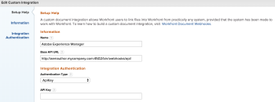

# Configura [!DNL Workfront] con il connettore legacy [!DNL Adobe Experience Manager]

<!-- Audited: 4/2025 -->

In qualità di amministratore di [!DNL Adobe Workfront], puoi integrare [!DNL Workfront] con [!UICONTROL Adobe Experience Manager (AEM) Assets] e fornire alla tua organizzazione una soluzione completa per la gestione dei contenuti per la creazione, la condivisione e la manutenzione delle risorse all&#39;interno del flusso di lavoro.

## Requisiti di accesso

+++ Espandi per visualizzare i requisiti di accesso per la funzionalità in questo articolo.

<table>
  <tr>
   <td>Pacchetto Adobe Workfront
   </td>
   <td> <p>PRIME o ULTIMATE</p>
    <p>Flusso di lavoro Ultimate</p>
   </td>
  </tr>
  <tr>
   <td>Licenze Adobe Workfront
   </td>
   <td><p>Standard</p>
   <p>Piano</p>
   </td>
  </tr>
   <tr>
   <td>Configurazioni del livello di accesso
   </td>
   <td>Devi essere un amministratore [!DNL Workfront].
   </td>
  </tr>
</table>

Per informazioni, consulta [Requisiti di accesso nella documentazione di Workfront](/help/quicksilver/administration-and-setup/add-users/access-levels-and-object-permissions/access-level-requirements-in-documentation.md).

## [!DNL Workfront for AEM Assets]

[!DNL Workfront for AEM Assets connector] consente all&#39;organizzazione di eseguire le operazioni seguenti:

* Collabora e gestisci contenuti creativi collegando risorse e cartelle AEM a progetti, attività, problemi e richieste in [!DNL Workfront].

  Per ulteriori informazioni sulla configurazione delle integrazioni di documentazione con applicazioni di terze parti, vedere [Configurare le integrazioni di documenti](../../administration-and-setup/configure-integrations/configure-document-integrations.md).

* Integrare con l&#39;archivio [!DNL AEM Digital Asset Managemen]t (DAM), consentendo di utilizzare [!DNL Workfront] per gestire e condividere le risorse digitali archiviate in DAM.

  Per ulteriori informazioni sul collegamento di documenti e cartelle di risorse, consulta   [Collega documenti da applicazioni esterne](../../documents/adding-documents-to-workfront/link-documents-from-external-apps.md).

* Combina e applica metadati da entrambe le applicazioni a una risorsa.
* Visualizzare un flusso di comunicazione completo per una risorsa. Gli aggiornamenti e i commenti aggiunti a una risorsa in [!DNL Workfront] o [!UICONTROL AEM Assets] sono sincronizzati con l&#39;altra applicazione, creando una cronologia completa delle comunicazioni effettuate alla risorsa.

  Per ulteriori informazioni sulla creazione di commenti in [!DNL Workfront], vedere [Aggiungere un aggiornamento a un documento](../../documents/managing-documents/add-update-documents.md).

## Prerequisiti per l&#39;installazione del connettore [!DNL AEM Assets]

Prima di installare il connettore [!DNL Workfront] per [!UICONTROL AEM Assets], verifica che siano soddisfatti i seguenti prerequisiti:

* [!UICONTROL AEM Assets] è installato e configurato, versione 6.5 o successiva. Per informazioni sull&#39;installazione di [!UICONTROL AEM Assets], vedere la [[!DNL Adobe Experience Manager] documentazione](https://experienceleague.adobe.com/it/docs/experience-manager).
* (Condizionale) Se le regole del firewall non consentono il traffico come previsto, aggiungi l&#39;indirizzo IP e/o il dominio del cluster al elenco Consentiti di gestione del sistema di gestione del traffico. Per ulteriori informazioni, vedere [Configurare il inserisco nell&#39;elenco Consentiti di protezione del firewall](../../administration-and-setup/get-started-wf-administration/configure-your-firewall.md).

## Installa il pacchetto del connettore [!DNL Workfront for AEM Assets] {#install-the-workfront-for-aem-assets-connector-package}

>[!IMPORTANT]
>
>Le istruzioni seguenti sono per un connettore legacy [!DNL Workfront with AEM Assets], che è stato sostituito dal [[!DNL Workfront for Experience Manager] connettore avanzato](../../documents/workfront-and-experience-manager-integrations/workfront-for-experience-manager-enhanced-connector/workfront-for-aem-enhanced-connector.md). Per ulteriori informazioni, contatta il tuo Account Manager.

Per installare il connettore [!DNL Workfront for AEM Assets], è necessario importare il connettore in AEM as a package utilizzando [!UICONTROL Gestione pacchetti CRX].

1. In una workstation in cui è già stato installato AEM, scaricare il file di installazione del connettore [!DNL Workfront for AEM Assets].

   Puoi ottenere il connettore [!DNL Workfront for AEM Assets] dal tuo rappresentante [!DNL Workfront].

1. Accedi ad AEM utilizzando un account amministratore.
1. Fai clic su **[!UICONTROL Strumenti]** > **[!UICONTROL Distribuzione]** > **[!UICONTROL Pacchetti]**. Verrà aperto [!UICONTROL Gestione pacchetti CRX].

1. Fare clic su **[!UICONTROL Carica pacchetto].**

1. Nella finestra di dialogo **[!UICONTROL Carica pacchetto]** cercare e selezionare il pacchetto **[!UICONTROL Connettore Workfront]**, quindi fare clic su **[!UICONTROL OK]**. Il pacchetto viene visualizzato in [!UICONTROL Gestione pacchetti CRX].

1. Fare clic su **[!UICONTROL Installa].**

1. Nella finestra di dialogo **[!UICONTROL Pacchetto]** ignorare le impostazioni avanzate e fare clic su **[!UICONTROL Installa]**.
1. (Facoltativo) Per verificare che il connettore sia stato installato correttamente, verificare che nel [!UICONTROL registro attività] venga visualizzata l&#39;istruzione seguente:

   ```
   Package installed in <time>
   ```

1. Chiudere [!UICONTROL Gestione pacchetti CRX]. Il connettore è installato ed è ora possibile configurare [!DNL AEM Assets] per l&#39;integrazione con [!DNL Workfront].

1. Continua con [Configura [!DNL AEM Assets] per integrare con [!DNL Workfront]](#configure-aem-assets-to-integrate-with-workfront).

## Configura [!DNL AEM Assets] per l&#39;integrazione con [!DNL Workfront] {#configure-aem-assets-to-integrate-with-workfront}

Dopo aver installato il connettore, importare il pacchetto del connettore in AEM e configurare AEM per il collegamento ai documenti in [!DNL Workfront].

Per informazioni sull&#39;installazione del connettore, vedere [Installare il  [!DNL Workfront for AEM Assets] pacchetto del connettore](#install-the-workfront-for-aem-assets-connector-package).

* [Prerequisiti](#prerequisites)
* [Integra AEM con  [!DNL Workfront]](#integrate-aem-with-workfront)
* [Configura [!UICONTROL AEM Externalizer]](#configure-the-aem-externalizer)

### Prerequisiti {#prerequisites}

Prima di iniziare, è necessario abilitare le autorizzazioni per workfront-service:

1. In AEM, vai a **[!UICONTROL Strumenti]** > **[!UICONTROL Sicurezza]** > **[!UICONTROL Autorizzazioni]**.
1. Nell&#39;angolo in alto a sinistra, scegli **[!UICONTROL Utenti]**&#x200B; nel menu a discesa e immetti *[!UICONTROL workfront-service]* nel campo **[!UICONTROL Ricerca]**&#x200B;. Selezionare l&#39;utente [!UICONTROL workfront-service].
1. Sul lato destro della schermata, selezionare **[!UICONTROL Aggiungi ACE]** per creare nuove voci.
1. Nella finestra &#x200B;**[!UICONTROL Aggiungi nuova voce]**&#x200B;, seleziona l&#39;icona della casella di controllo nel campo **[!UICONTROL Percorso]**&#x200B; e scegli la cartella: */conf*
1. Nel campo **Privilegi** immettere: *jcr:read*
1. Nell&#39;angolo in alto a destra, seleziona **Aggiungi**.
1. (Facoltativo) Ripeti i passaggi precedenti per creare altre voci.

### Integrare AEM con [!DNL Workfront] {#integrate-aem-with-workfront}

1. Accedi ad AEM Assets come amministratore.
1. Fai clic su **[!UICONTROL Strumenti]** > **[!UICONTROL Servizi cloud]** > **[!UICONTROL Configurazione integrazione Workfront]** > **[!UICONTROL Global-Workfront].**&#x200B;**&#x200B;**

1. (Condizionale) Se non lo hai ancora fatto, crea un file di configurazione cloud [!DNL Workfront]:

   1. Nell&#39;angolo superiore destro della pagina [!DNL Global-Workfront], fare clic su **[!UICONTROL Crea]**.
   1. Nella casella **[!UICONTROL URL Workfront]**, specifica l&#39;URL per l&#39;istanza [!DNL Workfront].

      Ad esempio, [!DNL https]://`<account>`.my.workfront.com, dove `<account>` è l&#39;account utilizzato per le integrazioni con AEM.

   1. Nel campo&#x200B;**[!UICONTROL Cartella base]**, seleziona l&#39;icona della casella di controllo.
   1. Nel menu a discesa, selezionare il percorso in cui sono archiviati i documenti collegati a [!DNL Workfront] oggetti.
   1. Nel modale AEM visualizzato, seguire il percorso della cartella con i documenti connessi agli oggetti [!DNL Workfront]. Scegli la cartella e premi **[!UICONTROL Seleziona]**&#x200B;nell&#39;angolo in alto a destra.

      Puoi creare un collegamento a qualsiasi cartella sotto la directory principale /content/dam/.

   1. Nella casella **[!UICONTROL Chiave API Workfront]**, specifica la chiave API [!UICONTROL Workfront].

      Per recuperare la chiave API [!DNL Workfront]:

      1. Apri una scheda del browser e accedi al tuo account [!DNL Workfront] come amministratore [!DNL Workfront].

      {{step-1-to-setup}}

      1. Fai clic su **[!UICONTROL Sistema]** > **[!UICONTROL Informazioni cliente]**.

         Se hai già generato una chiave API, la chiave API [!DNL Workfront] viene visualizzata sotto l&#39;etichetta **Chiave API dell&#39;utente**.

      1. (Condizionale) Se non hai ancora generato una chiave API, devi generarne una:

         1. Nella sezione **[!UICONTROL Impostazioni chiave API]**, verifica che l&#39;opzione **[!UICONTROL Dopo la creazione, le chiavi API scadano tra]** sia impostata su **Nessuna**.

            Se selezioni un periodo di scadenza, il connettore smetterà di funzionare dopo la scadenza della chiave API. Sarà quindi necessario rigenerare una chiave API e aggiornare la configurazione di [!DNL Workfront].

         1. Sotto l&#39;etichetta **[!UICONTROL Chiave API dell&#39;utente]**, fare clic su **[!UICONTROL Genera chiave API]**. Viene generata e visualizzata una chiave API per [!DNL Workfront].
      1. Copia la chiave API negli Appunti.
      1. Apri la scheda del browser per AEM Connector e nella casella **[!DNL Workfront API Key]**, quindi incolla la chiave API copiata.
   1. (Condizionale) Fare clic sulla scheda **[!UICONTROL Avanzate]** nell&#39;angolo superiore sinistro della pagina Configurazione integrazione [!UICONTROL [!DNL Workfront]] e selezionare le opzioni seguenti, se applicabili:

      **[!UICONTROL Consenti esplorazione raccolta]:**&#x200B;Selezionare questa opzione se l&#39;organizzazione consente a [!DNL Workfront] utenti di collegare raccolte AEM Assets a [!DNL Workfront] oggetti.

      **[!UICONTROL Utente Federated ID]:** Selezionare questa opzione se l&#39;organizzazione utilizza Federated ID o Single Sign-On (SSO) durante l&#39;accesso a Workfront.

      **[!UICONTROL Ignora dominio e-mail]:** Seleziona questa opzione se gli utenti AEM non utilizzano il nome di dominio nel loro ID utente.

      **[!UICONTROL Limita l&#39;accesso]:** Selezionare questa opzione per specificare gli indirizzi IP [!DNL Workfront] appropriati da aggiungere al inserisco nell&#39;elenco Consentiti di. Per ulteriori informazioni sul inserisco nell&#39;elenco Consentiti di, vedere [Configurare il inserisco nell&#39;elenco Consentiti di configurazione del firewall](../../administration-and-setup/get-started-wf-administration/configure-your-firewall.md).

   1. Nell&#39;angolo superiore sinistro della pagina Configurazione integrazione Workfront fare clic sulla scheda **[!UICONTROL Base]** e quindi su **[!UICONTROL Connetti]**.

      >[!NOTE]
      >
      >L&#39;applicazione delle modifiche potrebbe richiedere del tempo. Il riavvio del bundle potrebbe accelerare il processo.


1. (Condizionale) Se hai già creato un file di configurazione cloud [!DNL Workfront], seleziona **[!UICONTROL Globale-[!DNL Workfront]]**, quindi fai clic su **[!UICONTROL Proprietà]** nell&#39;angolo superiore sinistro.

1. Genera la chiave API AEM facendo clic su **[!UICONTROL Genera chiave],** quindi copia la chiave API AEM negli Appunti.

   La chiave API AEM sarà necessaria in seguito quando configurerai [!UICONTROL Workfront] per l&#39;integrazione con [!UICONTROL AEM Assets]. Per ulteriori informazioni, consulta [Configurare Workfront per l&#39;integrazione con AEM assets](#configure-workfront-to-integrate-with-aem-assets).

1. Nell&#39;angolo superiore destro fare clic su **[!UICONTROL Salva]**. Viene visualizzata la finestra [!UICONTROL Global-[!DNL Workfront]].

   

1. (Facoltativo) Sincronizzazione della comunicazione bidirezionale tra AEM e [!DNL Workfront]:

   1. Fai clic su **[!UICONTROL Globale-[!DNL Workfront]].**
   1. Nell&#39;angolo superiore sinistro della finestra fare clic su **[!UICONTROL Proprietà]**. Viene visualizzata la pagina Configurazione integrazione **[!UICONTROL [!DNL Workfront]]**.

      

   1. (Facoltativo) Per abilitare la sincronizzazione dei commenti tra [!UICONTROL AEM Assets] e [!DNL Workfront], fare clic su **[!UICONTROL Abilita sincronizzazione commenti]**.

      >[!IMPORTANT]
      >
      >Devi abilitare [!UICONTROL Document Sync] per sincronizzare le risorse.

   1. (Facoltativo) Per disattivare la sincronizzazione dei commenti, fare clic su **[!UICONTROL Disattiva sincronizzazione commenti].**

      Oppure

      Elimina la sottoscrizione all&#39;evento [!UICONTROL NOTE CREATE] registrata nell&#39;istanza AEM.

      Per informazioni sulle sottoscrizioni di eventi, vedere [API sottoscrizione eventi](../../wf-api/general/event-subs-api.md).

1. Continua con [Configura [!UICONTROL AEM Externalizer]](#configure-the-aem-externalizer).

### Configura [!UICONTROL AEM Externalizer] {#configure-the-aem-externalizer}

[!UICONTROL AEM Externalizer] consente ad AEM di trasmettere gli URL in un formato utilizzabile in [!DNL Workfront]. Se non è configurato correttamente, [!DNL Workfront] non può effettuare chiamate all&#39;API AEM e gli URL che collegano i documenti AEM in Workfront non funzioneranno.

1. In AEM, fai clic su **[!UICONTROL Strumenti]** > **[!UICONTROL Operazioni]** > **[!UICONTROL Console Web]**.

1. Fai clic su **[!UICONTROL OSGI]**, quindi fai clic su **[!UICONTROL Configurazione]** nel menu a discesa.

1. Nell&#39;elenco di configurazione, selezionare&#x200B;**[!UICONTROL Day CQ Link Externalizer].** Viene visualizzata la pagina **[!UICONTROL Externalizer]**.

1. Nella sezione **[!UICONTROL Domini]**, assicurati che il dominio elencato nel campo **[!UICONTROL Autore]** sia il nome di dominio accessibile esternamente agli utenti di AEM.

   Il nome di dominio nel campo [!UICONTROL author] deve corrispondere al dominio elencato nella riga URL della tua istanza di AEM.

   ![[!DNL Extenalizer].png](assets/extenalizer-350x128.png)

1. (Condizionale) Se necessario, aggiorna il dominio nel campo **[!UICONTROL Autore]**.
1. Fai clic su **[!UICONTROL Salva]**. [!UICONTROL AEM Assets] è ora configurato per collegare documenti con [!DNL Workfront].

1. Continua con [Configura [!DNL Workfront] per integrare con [!DNL AEM assets]](#configure-workfront-to-integrate-with-aem-assets).

## Configura [!DNL Workfront] per l&#39;integrazione con [!DNL AEM assets] {#configure-workfront-to-integrate-with-aem-assets}

Dopo aver installato il connettore [!UICONTROL Workfront per AEM Assets] (come descritto in [Installare il pacchetto del connettore [!UICONTROL Workfront per AEM Assets]](#install-the-workfront-for-aem-assets-connector-package)) e configurato [!UICONTROL AEM Assets] (come descritto in [Configurare [!UICONTROL AEM Assets] per l&#39;integrazione con [!DNL Workfront]](#configure-aem-assets-to-integrate-with-workfront)), è necessario configurare [!DNL Workfront] per collegare i documenti tra [!DNL Workfront] e [!DNL AEM Assets].

1. Accedi a Workfront come amministratore.

   >[!TIP]
   >
   >[!UICONTROL Workfront] consiglia di creare un amministratore [!UICONTROL Workfront] dedicato esclusivamente alla tua integrazione con AEM. Per ulteriori informazioni sull&#39;assegnazione del livello di accesso amministratore [!UICONTROL Workfront] a un utente, vedere [Concedere agli utenti l&#39;accesso amministrativo a determinate aree](../../administration-and-setup/add-users/configure-and-grant-access/grant-users-admin-access-certain-areas.md).

{{step-1-to-setup}}

1. Fai clic su **[!UICONTROL Documenti]** > **[!UICONTROL Integrazione personalizzata].**

1. Fare clic su **[!UICONTROL Aggiungi integrazione personalizzata]**.
1. Nella casella **[!UICONTROL Nome]** immettere il nome dell&#39;integrazione personalizzata.

   Questo è il nome visualizzato dagli utenti quando utilizzano l&#39;integrazione all&#39;interno di [!UICONTROL Workfront].

1. Nella casella **[!UICONTROL URL API base]**, immetti l&#39;URL per l&#39;istanza di AEM.

   L’URL API di base è costituito dall’URL dell’istanza AEM seguito dal percorso: /bin/webhooks/api/

   

1. Nel menu a discesa **[!UICONTROL Tipo di autenticazione]**, seleziona **[!UICONTROL ApiKey].**

1. Nella casella&#x200B;**[!UICONTROL Chiave API]**, incolla la chiave API AEM copiata quando hai configurato [!UICONTROL AEM Assets].
1. Fai clic su **[!UICONTROL Salva]**.
1. (Facoltativo) Verifica che l&#39;integrazione sia contrassegnata come [!UICONTROL Attiva].\
   

   [!DNL Workfront] è ora configurato per funzionare con [!DNL AEM Assets].

   Per accedere alle risorse in AEM, ogni utente [!DNL Workfront] che deve utilizzare il connettore deve essere configurato come utente in AEM. Per informazioni sulla creazione di utenti, vedere [Configurare gli utenti per l&#39;utilizzo del connettore](#set-up-users-to-use-the-connector).

## Impostare gli utenti per l&#39;utilizzo del connettore {#set-up-users-to-use-the-connector}

Per poter accedere al connettore, gli utenti devono disporre di un profilo utente in AEM e appartenere a un gruppo [!DNL Workfront] con livelli di accesso che includono le autorizzazioni [!UICONTROL Create] e [!UICONTROL Delete].

Per ulteriori informazioni sulle autorizzazioni di [!DNL Workfront], vedere [Creare o modificare livelli di accesso personalizzati](../../administration-and-setup/add-users/configure-and-grant-access/create-modify-access-levels.md).

* [Configura utenti in [!DNL AEM assets]](#set-up-users-in-aem-assets)

### Configura utenti in [!DNL AEM assets] {#set-up-users-in-aem-assets}

1. Accedere a [!DNL AEM Assets] come amministratore Workfront.
1. Fai clic su **[!UICONTROL Strumenti]** > **&#x200B;**&#x200B;**[!UICONTROL Sicurezza]** > **[!UICONTROL Utenti]**.

1. (Condizionale) Se l’utente non dispone di un profilo utente in AEM, crea un profilo utente di AEM.

   1. Fai clic su **[!UICONTROL Crea utente].**
   1. Immettere le informazioni personali dell&#39;utente.

      

      L&#39;unico campo obbligatorio è il campo **ID**. L&#39;ID AEM dell&#39;utente deve corrispondere al proprio ID [!DNL Workfront], che è l&#39;indirizzo e-mail [!DNL Workfront] dell&#39;utente.

      Se hai selezionato l&#39;opzione **[!UICONTROL Ignora dominio e-mail]** quando hai configurato AEM per l&#39;integrazione con [!DNL Workfront], l&#39;ID AEM non corrisponderà all&#39;indirizzo e-mail [!DNL Workfront].

1. (Condizionale) Se l’utente dispone di un profilo AEM, apri il profilo AEM dell’utente:

   1. Fare clic su&#x200B;**[!UICONTROL Utente]**. Viene visualizzata la pagina **[!UICONTROL Gestione utente]**.

   1. Fare clic sull&#39;utente che si desidera aggiungere, quindi fare clic su **[!UICONTROL Proprietà]**. Viene visualizzata la pagina delle impostazioni dell’utente.

1. Fare clic sulla scheda **[!UICONTROL Gruppi]**.

   

1. Assicurarsi che l&#39;utente appartenga ad almeno un gruppo [!DNL Workfront] con livelli di accesso che includono le autorizzazioni **[!UICONTROL Crea]** e **[!UICONTROL Elimina]**.

   1. Per aggiungere l&#39;utente a un gruppo esistente, iniziare a digitare il nome del gruppo nella casella **[!UICONTROL Digita nome gruppo]**, quindi selezionare il gruppo quando viene visualizzato nel menu a discesa.

      Oppure

      Per selezionare un gruppo di cui l&#39;utente è membro, selezionare un gruppo nella sezione **[!UICONTROL Gruppi di cui l&#39;utente è membro]**.

1. Fai clic su **[!UICONTROL Salva].**
