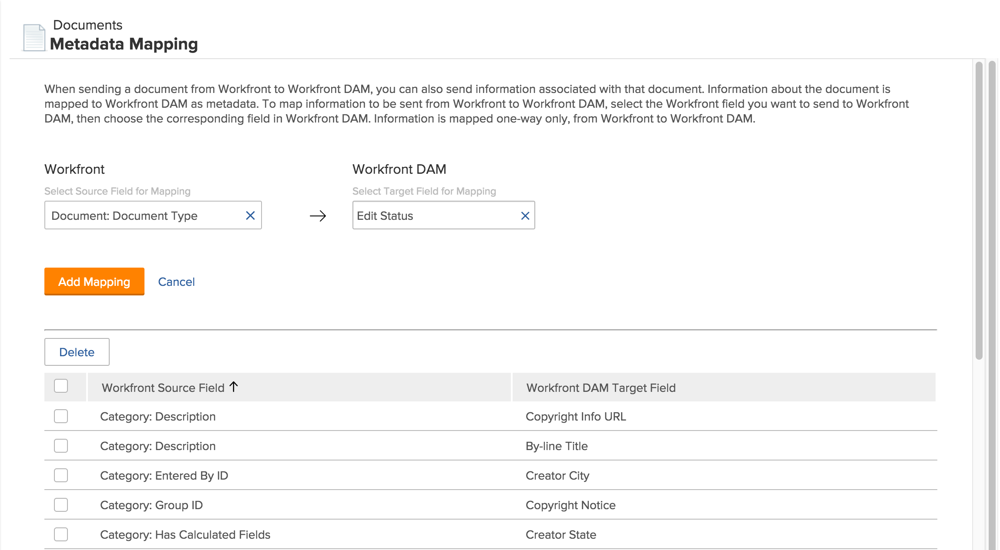

# Impostare la mappatura dei metadati

I metadati sono informazioni descrittive associate a un documento. È possibile configurare [!DNL Adobe Workfront] per includere metadati con i documenti inviati a [!DNL Workfront] applicazioni.

## Requisiti di accesso

Per eseguire i passaggi descritti in questo articolo, è necessario disporre dei seguenti diritti di accesso:

<table style="table-layout:auto"> 
 <col> 
 <col> 
 <tbody> 
  <tr> 
   <td role="rowheader">[!DNL Adobe Workfront] piano</td> 
   <td>Qualsiasi</td> 
  </tr> 
  <tr> 
   <td role="rowheader">[!DNL Adobe Workfront] licenza</td> 
   <td>[!UICONTROL Plan]</td> 
  </tr> 
  <tr> 
   <td role="rowheader">Configurazioni a livello di accesso</td> 
   <td> 
Devi essere un [!DNL Workfront] amministratore. Per ulteriori informazioni, consulta <a href="../../administration-and-setup/add-users/configure-and-grant-access/grant-a-user-full-administrative-access.md" class="MCXref xref">Concedere a un utente pieno accesso amministrativo</a>.
 
<b>NOTA</b>: Se non hai ancora accesso, chiedi [!DNL Workfront] amministratore se imposta ulteriori restrizioni nel livello di accesso. Per informazioni su come [!DNL Workfront] l'amministratore può modificare il livello di accesso, vedi <a href="../../administration-and-setup/add-users/configure-and-grant-access/create-modify-access-levels.md" class="MCXref xref">Creare o modificare livelli di accesso personalizzati</a>.
 </td> 
  </tr> 
 </tbody> 
</table>

## Informazioni [!DNL Workfront] metadati

Metadati dei documenti in [!DNL Workfront] possono includere informazioni quali il nome del progetto correlato, la descrizione dell&#39;attività o la data di completamento pianificata. Come [!DNL Workfront] amministratore, puoi configurare [!DNL Workfront] per includere metadati con documenti inviati da [!DNL Workfront] a quanto segue [!DNL Workfront] applicazioni:

* [!DNL Workfront DAM]

Prima di poter inviare i metadati con i documenti, è necessario specificare o mappare i metadati da includere. Puoi mappare qualsiasi campo utilizzato in [!DNL Workfront]. Una volta impostata la mappatura dei metadati, tutti i documenti caricati in un [!DNL Workfront] l&#39;applicazione includerà i metadati mappati.

Quando un utente invia un documento da [!DNL Workfront] a [!DNL Workfront] applicazione, i metadati mappati vengono trasferiti lungo il documento. Mentre la versione del documento nel [!DNL Workfront] l&#39;applicazione è collegata a [!DNL Workfront], modifiche apportate ai metadati del documento in [!DNL Workfront] non sono riflessi nei metadati del documento nel [!DNL Workfront] applicazione. Se un campo mappato in [!DNL Workfront] viene modificato, devi inviare una nuova versione del documento con i metadati aggiornati al [!DNL Workfront] applicazione.

>[!NOTE]
>
>Puoi mappare i metadati in una sola direzione: da [!DNL Workfront] a [!DNL Workfront DAM]. Metadati dei documenti collegati a [!DNL Workfront] da [!DNL Workfront DAM] non può essere trasferito in Workfront.

Puoi eseguire la stessa mappatura [!DNL Workfront] campi per vari campi di metadati in [!DNL Workfront DAM], ma non è possibile utilizzare un campo metadati in una di queste applicazioni per più [!DNL Workfront] campi di metadati.

Per configurare più [!DNL Workfront] campi da esportare in un campo di metadati in una [!DNL Workfront] applicazione, creare prima un campo personalizzato calcolato in [!DNL Workfront] per visualizzare tutti i singoli campi personalizzati di un oggetto. Quindi, mappa il calcolato [!DNL Workfront] a un campo di metadati nel [!DNL Workfront] applicazione. Per ulteriori informazioni sui campi personalizzati calcolati, consulta [Aggiungere dati calcolati a un modulo personalizzato](../../administration-and-setup/customize-workfront/create-manage-custom-forms/add-calculated-data-to-custom-form.md).

Prima di poter mappare i campi per il processo di mappatura dei metadati, devi abilitare l’applicazione in [!DNL Workfront]. Per ulteriori informazioni, consulta [Configurare le integrazioni di documenti](../../administration-and-setup/configure-integrations/configure-document-integrations.md).

## Configura [!DNL Workfront] invio dei metadati

1. Fai clic sul pulsante **[!UICONTROL Menu principale]** icona  nell&#39;angolo superiore destro di [!DNL Adobe Workfront], quindi fai clic su **[!UICONTROL Configurazione]** .

1. Nel pannello a sinistra, fai clic su **[!UICONTROL Documenti]** > **[!UICONTROL Mappatura metadati]**.

   

1. In **[!UICONTROL Selezionare il campo di origine per la mappatura]** inizia a digitare il nome del campo Workfront a cui si desidera eseguire la mappatura [!DNL Workfront DAM], quindi selezionalo quando lo vedi nell’elenco.
1. In **[!UICONTROL Selezionare il campo di destinazione per la mappatura]** selezionare il campo da compilare con le informazioni selezionate [!DNL Workfront] campo .

1. Fai clic su **[!UICONTROL Aggiungi mappatura]**.

   Il campo mappato viene visualizzato nei campi mappati elencati nella parte inferiore della pagina.

1. Ripetere i passaggi 5 e 6 fino a quando non si aggiungono tutti i passaggi desiderati [!DNL Workfront] campi e loro corrispondenti [!DNL Workfront DAM] campi.

## Elimina campi mappati

1. Accedi a [!DNL Workfront] come amministratore.
1. Fai clic sul pulsante **[!UICONTROL Menu principale]** icona  nell&#39;angolo superiore destro di [!DNL Adobe Workfront], quindi fai clic su **[!UICONTROL Configurazione]** .

1. Nel pannello a sinistra fai clic su **[!UICONTROL Documenti]** > **[!UICONTROL Mappatura metadati]**.

1. Nell’elenco dei campi mappati, seleziona i campi da rimuovere dalla mappatura metadati.
1. Fai clic su **[!UICONTROL Elimina]**.

   I campi designati non sono più mappati. Ora quando un utente invia un documento da [!DNL Workfront] a [!DNL Workfront DAM], i metadati contenuti nei campi eliminati non vengono trasferiti con il documento.

   Un documento inviato prima dell&#39;eliminazione dei campi mappati conserva i metadati originali inviati con esso, inclusi i metadati per i campi eliminati.
