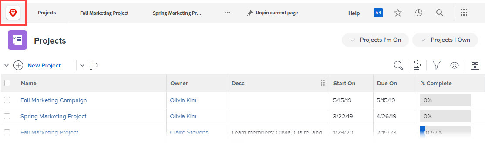

# Brand your Adobe Workfront instance

<!--
**DON'T DELETE, DRAFT OR HIDE THIS ARTICLE. IT IS LINKED TO THE PRODUCT, THROUGH THE CONTEXT SENSITIVE HELP LINKS. **
-->

In qualità di amministratore di Workfront, puoi assegnare a Workfront un marchio con i logo nelle seguenti posizioni:

* Schermata di accesso

   

* Area di navigazione superiore

   

* Menu principale

   

Puoi anche modificare l’immagine di sfondo e il colore della schermata di accesso:

>[!NOTE]
>
>* La modifica dell&#39;immagine e del colore di sfondo dell&#39;accesso non è disponibile se l&#39;istanza Workfront della tua organizzazione utilizza un portale SSO personalizzato. Per ulteriori informazioni, rivolgiti al tuo amministratore di rete o IT.

><!--
>or is enabled with Adobe IMS  >
>  >
>-->
>
>* Un amministratore di Workfront o un amministratore di gruppo può inoltre assegnare a Workfront un marchio per determinati gruppi e utenti utilizzando un modello di layout. Il branding in un modello di layout sostituisce il branding a livello di sistema illustrato in questo articolo. Per istruzioni sul branding in un modello di layout, consulta [Marchio Adobe Workfront utilizzando un modello di layout](../../../administration-and-setup/customize-workfront/use-layout-templates/brand-wf-using-a-layout-template.md).

## Requisiti di accesso

Per eseguire i passaggi descritti in questo articolo, è necessario disporre dei seguenti diritti di accesso:

<table style="table-layout:auto"> 
 <col> 
 <col> 
 <tbody> 
  <tr> 
   <td role="rowheader">piano Adobe Workfront</td> 
   <td>Qualsiasi</td> 
  </tr> 
  <tr> 
   <td role="rowheader">Licenza Adobe Workfront</td> 
   <td>Piano</td> 
  </tr> 
  <tr> 
   <td role="rowheader">Configurazioni a livello di accesso</td> 
   <td> 
Devi essere un amministratore Workfront.
 
<b>NOTA</b>: Se non disponi ancora dell’accesso, chiedi all’amministratore Workfront se ha impostato ulteriori restrizioni nel livello di accesso. Per informazioni su come un amministratore Workfront può modificare il livello di accesso, consulta <a href="../../../administration-and-setup/add-users/configure-and-grant-access/create-modify-access-levels.md" class="MCXref xref">Creare o modificare livelli di accesso personalizzati</a>.
 </td> 
  </tr> 
 </tbody> 
</table>

## Marchio la schermata di accesso

1. Fai clic sul pulsante **Menu principale** icona  nell’angolo in alto a destra di Adobe Workfront, quindi fai clic su **Configurazione** .

1. Fai clic su **Sistema** > **Branding**.

1. Apporta una delle seguenti modifiche per personalizzare Workfront con le immagini di branding.

   <table style="table-layout:auto"> 
    <col> 
    <col> 
    <tbody> 
     <tr> 
      <td role="rowheader"> 
Icona Marchio (viene visualizzato all’estrema sinistra dell’area di navigazione superiore)
 </td> 
      <td> 
In <strong>Area di navigazione superiore</strong> sezione <strong>Icona Home</strong>, fai clic in un punto qualsiasi della casella, quindi trova e seleziona l’immagine del logo. Oppure trascina un’immagine nella casella.
 
Per ritagliare l'immagine, utilizzate i controlli di scorrimento e trascinate l'immagine nella posizione desiderata all'interno dello spazio prescritto.
 
Si consiglia un'immagine 120 x 120. Può essere in uno dei seguenti formati: GIF, JPG, PNG, SVG.
 
Questa icona viene visualizzata anche nei rapporti, negli elenchi, nelle dashboard e nei rapporti consegnati esportati dagli utenti come file PDF.
 </td> 
     </tr> 
     <tr> 
      <td role="rowheader"> 
Marchio del menu principale  logo (viene visualizzato nell'angolo superiore destro del menu principale)
 </td> 
      <td> 
In <strong>Area di navigazione superiore</strong> sezione <strong>Logo del menu principale</strong>, fai clic in un punto qualsiasi della casella, quindi trova e seleziona l’immagine del logo. Oppure trascina un’immagine nella casella.
 
Per ritagliare l'immagine, utilizzate i controlli di scorrimento e trascinate l'immagine nella posizione desiderata all'interno dello spazio prescritto.
 
Si consiglia un'immagine di 300 x 120 pixel. Può essere in uno dei seguenti formati: GIF, JPG, PNG, SVG.
 </td> 
     </tr> 
     <tr> 
      <td role="rowheader">Marchio del logo della schermata di accesso (viene visualizzato in alto a sinistra nella casella in cui gli utenti digitano le credenziali di accesso)</td> 
      <td> 
Sotto <strong>Schermata di accesso</strong>, fai clic in un punto qualsiasi della casella, quindi trova e seleziona l’immagine del logo. Per ritagliare l'immagine, utilizzate i controlli di scorrimento e trascinate l'immagine nella posizione desiderata all'interno dello spazio prescritto.
 
Si consiglia un'immagine di 300 x 120 pixel. Può essere in uno dei seguenti formati: GIF, JPG, PNG, SVG.
 </td> 
     </tr> 
     <tr> 
      <td role="rowheader">Marchio del colore di sfondo della schermata di accesso (viene visualizzato dietro la casella in cui gli utenti digitano le credenziali di accesso)</td> 
      <td> 
Sotto <strong>Schermata di accesso</strong>, imposta un <strong>Colore di sfondo</strong>. 
 
È possibile utilizzare codici colore RGB o HEX.
 
Il colore di sfondo è visibile solo se lo sfondo della schermata di accesso è maggiore dell’immagine di sfondo della schermata di accesso (vedi la riga successiva in questa tabella) o se l’immagine è trasparente.
 </td> 
     </tr> 
     <tr> 
      <td role="rowheader">Marchio dell’immagine di sfondo della schermata di accesso (viene visualizzato dietro la casella in cui gli utenti digitano le credenziali di accesso)</td> 
      <td> 
       <ol style="list-style-type: lower-alpha;"> 
        <li value="1"> 
 In <strong>Schermata di accesso</strong> zona, sotto <strong>Immagine di sfondo</strong>, fai clic sulla casella , quindi trova e seleziona l’immagine o le immagini JPG o PNG (fino a 20 ). 
 
Le immagini di sfondo multiple vengono visualizzate in ordine casuale, cambiando ogni volta che gli utenti aggiornano la pagina di accesso. Si consiglia di utilizzare immagini di dimensioni non superiori a 2 MB.
 </li> 
        <li value="2"> 
Passa il puntatore del mouse su ciascuna immagine di sfondo caricata, fai clic sull’icona Impostazioni (ingranaggio) e utilizza una delle seguenti opzioni per specificare dove e come deve essere visualizzata l’immagine nello sfondo della schermata di accesso:
 
         <ul> 
          <li> 
<strong>Schermo di riempimento</strong>: Adatta l'immagine allo sfondo della schermata di accesso, che potrebbe ingrandire l'immagine. Utilizza un'immagine ad alta risoluzione (fino a 2 MB) per ottenere risultati ottimali.
 
Quando utilizzi questa opzione, il banner Workfront, che non è personalizzabile, oscura parte dell’immagine.
 </li> 
          <li> 
<strong>Tessera</strong>: Affianca l'immagine nell'area di sfondo della schermata di accesso, nelle sue dimensioni originali. Questa funzione è utile per creare un pattern. Selezionate un'opzione di allineamento blu per avviare l'inclinazione dall'angolo in alto a sinistra, dal centro in alto o dall'alto a destra dell'area di sfondo.
 </li> 
          <li> 
<strong>Posizione</strong>: Posiziona l'immagine nella dimensione originale nella posizione scelta utilizzando una delle opzioni di allineamento blu: in alto a sinistra, al centro in alto o in alto a destra dell’area di sfondo della schermata di login.
 
Il colore di sfondo riempie il resto dell’area di sfondo della schermata di accesso. Per ulteriori informazioni sul colore di sfondo, vedere la riga precedente in questa tabella.
 </li> 
         </ul> </li> 
       </ol> </td> 
     </tr> 
     <tr> 
      <td role="rowheader">Ripristina il branding predefinito</td> 
      <td> 
Il ripristino del marchio predefinito elimina tutte le foto e le immagini caricate.
 
Fai clic su <strong>Reimposta tutte le impostazioni predefinite del branding su Workfront</strong> nell’angolo in basso a destra dello schermo, quindi fai clic su <strong>Sì</strong>.
 </td> 
     </tr> 
    </tbody> 
   </table>

   >[!NOTE]
   >
   >Questa opzione non è disponibile se l&#39;istanza Workfront della tua organizzazione utilizza un portale SSO personalizzato.
   ><!--   >
   >or is enabled with Adobe IMS   >
   >   >
   >-->
   >
   >Per ulteriori informazioni, rivolgiti al tuo amministratore di rete o IT.

1. Fai clic su **Salva**.
