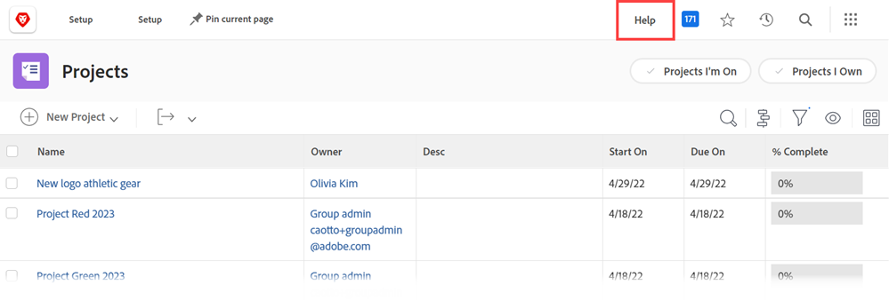

# Configurare un URL guida personalizzato

Se crei un sito di assistenza interno personalizzato contenente informazioni sull’utilizzo di Workfront da parte dell’organizzazione, puoi configurare l’icona Aiuto del menu principale per passare a tale sito.

Ciò non influisce sul collegamento della Guida principale nel menu principale e sui collegamenti di assistenza sensibili al contesto presenti in Workfront, che portano gli utenti al sito della Guida di Workfront.

Per informazioni sul modo in cui gli utenti accedono sia a un URL della guida personalizzato configurato in Workfront che al normale sito della guida di Workfront, vedere [Accesso alla guida di Workfront nella nuova esperienza Adobe Workfront](/help/quicksilver/workfront-basics/navigate-workfront/workfront-navigation/access-workfront-help.md).

## Requisiti di accesso

+++ Espandi per visualizzare i requisiti di accesso per la funzionalità in questo articolo.

Per eseguire i passaggi descritti in questo articolo, è necessario disporre dei seguenti diritti di accesso:

<table style="table-layout:auto"> 
 <col> 
 <col> 
 <tbody> 
  <tr> 
   <td role="rowheader">piano Adobe Workfront</td> 
   <td>Qualsiasi</td> 
  </tr> 
  <tr> 
   <td role="rowheader">Licenza Adobe Workfront</td> 
   <td>Piano</td> 
  </tr> 
  <tr> 
   <td role="rowheader">Configurazioni del livello di accesso</td> 
   <td> 
Devi essere un amministratore di Workfront.
 
<b>NOTA</b>: se non disponi ancora dell'accesso, chiedi all'amministratore di Workfront se ha impostato restrizioni aggiuntive nel tuo livello di accesso. Per informazioni su come un amministratore di Workfront può modificare il tuo livello di accesso, consulta <a href="../../../administration-and-setup/add-users/configure-and-grant-access/create-modify-access-levels.md" class="MCXref xref">Creare o modificare livelli di accesso personalizzati</a>.
 </td> 
  </tr> 
 </tbody> 
</table>

+++

## Configurare un URL guida personalizzato

{{step-1-to-setup}}

1. Fare clic su **Sistema** > **Preferenze**.
1. Nella sezione **Preferenze generali**, nel campo **URL Guida personalizzato**, digita l&#39;URL in cui si trova il sito della Guida personalizzato.

   Se il percorso della Guida personalizzato richiede credenziali di accesso, tali credenziali sono necessarie per gli utenti che accedono al sito da Workfront. Se non si utilizza il Single Sign-On (SSO), potrebbe essere necessario gestire separatamente le credenziali per il sito di assistenza personalizzato e le credenziali di Workfront.

1. Fai clic su **Salva**.
