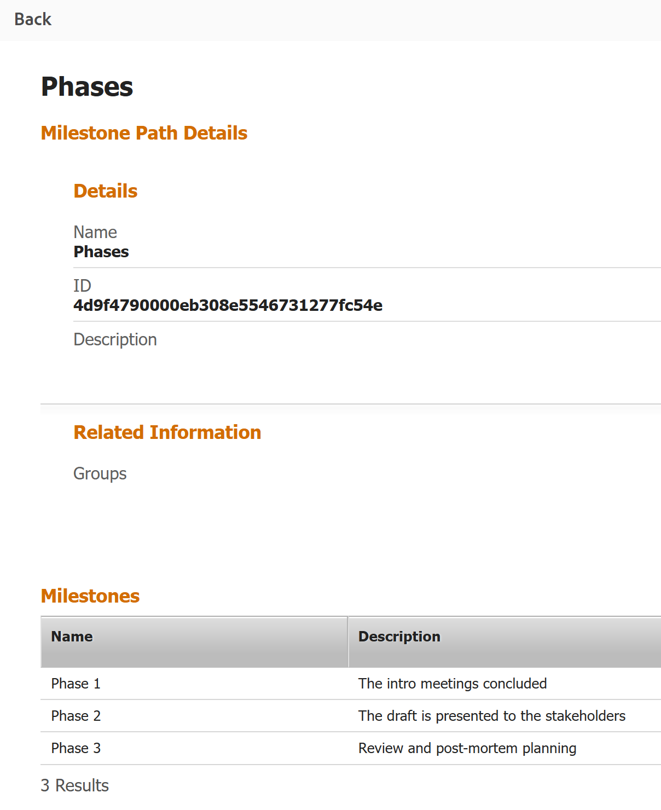

# Creare un percorso milestone

<!--Audited: 07/2024-->

<!--
NOTE: DON'T DELETE, DRAFT OR HIDE THIS ARTICLE. IT IS LINKED TO THE PRODUCT, THROUGH THE CONTEXT SENSITIVE HELP LINKS.
-->

Le informazioni evidenziate in questa pagina si riferiscono a funzionalità non ancora generalmente disponibili. È disponibile solo nell’ambiente di anteprima per tutti i clienti. Dopo i rilasci mensili in Produzione, le stesse funzioni sono disponibili nell’ambiente di Produzione per i clienti che hanno abilitato i rilasci rapidi. 

Per informazioni sulle versioni rapide, vedere [Abilitare o disabilitare le versioni rapide per l&#39;organizzazione](/help/quicksilver/administration-and-setup/set-up-workfront/configure-system-defaults/enable-fast-release-process.md). 

In qualità di amministratore di Adobe Workfront, puoi creare percorsi milestone che possono quindi essere applicati a qualsiasi progetto del sistema. Le modifiche apportate ai percorsi milestone in quest&#39;area hanno effetto sull&#39;intero sistema Workfront.

## Requisiti di accesso

+++ Espandi per visualizzare i requisiti di accesso per la funzionalità in questo articolo.

Per eseguire i passaggi descritti in questo articolo, è necessario disporre dei seguenti diritti di accesso:

<table style="table-layout:auto"> 
 <col> 
 <col> 
 <tbody> 
  <tr> 
   <td role="rowheader">piano Adobe Workfront</td> 
   <td>Qualsiasi</td> 
  </tr> 
  <tr> 
   <td role="rowheader">Licenza Adobe Workfront</td> 
   <td>Piano</td> 
  </tr> 
  <tr> 
   <td role="rowheader">Configurazioni del livello di accesso</td> 
   <td> 
Devi essere un amministratore di Workfront.
 
<b>NOTA</b>: se non disponi ancora dell'accesso, chiedi all'amministratore di Workfront se ha impostato restrizioni aggiuntive nel tuo livello di accesso. Per informazioni su come un amministratore di Workfront può modificare il tuo livello di accesso, consulta <a href="../../../administration-and-setup/add-users/configure-and-grant-access/create-modify-access-levels.md" class="MCXref xref">Creare o modificare livelli di accesso personalizzati</a>.
 </td> 
  </tr> 
 </tbody> 
</table>

+++

## Milestone e percorsi milestone

È possibile associare le attività chiave di un progetto alle attività cardine predefinite. Questa funzione può fornire ai manager e ad altre parti interessate una panoramica di alto livello sullo stato di avanzamento di un progetto.

La somma di tutte le milestone predefinite è chiamata percorso milestone.

Il primo passo nella creazione di un percorso milestone consiste nell&#39;identificare le fasi cardine e nel definirne le tappe. Poiché è possibile associare un percorso milestone a più progetti, i passaggi milestone devono essere fasi generali o fasi di qualsiasi progetto.

Per ulteriori informazioni su come associare un percorso milestone a un progetto e un milestone a un&#39;attività, vedere [Associare i milestone alle attività](../../../manage-work/tasks/manage-tasks/associate-milestones-with-tasks.md).

## Creare un percorso milestone

{{step-1-to-setup}}

1. Fai clic su **Processi** > **Percorsi milestone**.
1. Fai clic su **Nuovo percorso milestone.**
1. Specificare le informazioni seguenti nell&#39;area **Informazioni di base**:

   <table style="table-layout:auto">
    <tr>
      <td>Nome percorso milestone</td>
       <td>Immettere un nome per il percorso milestone.</td>
    </tr>
    <tr>
      <td>Descrizione</td>
      <td>Immettere una descrizione per definire il percorso della milestone.</td>
    </tr>
    <tr>
       <td>È attivo</td>
      <td>Selezionare questa casella di controllo se si desidera che il percorso milestone sia attivo. Altri utenti possono trovare questo percorso e allegarlo ai progetti durante la creazione o la modifica dei progetti. I percorsi delle milestone inattivi non possono essere associati ai progetti. Questa opzione è attivata per impostazione predefinita.</td>
    </tr>
    <tr>
      <td>Gruppi</td>
      <td>Seleziona i gruppi elencati per consentire agli utenti di questi gruppi di visualizzare e applicare questo percorso milestone ai loro progetti. Per impostazione predefinita, viene selezionato il gruppo predefinito dell'utente che immette il percorso milestone.</td>
    </tr>
   </table>

1. Specifica le seguenti informazioni nell&#39;area **Milestones**:

   <table style="table-layout:auto"> 
    <col> 
    <col> 
    <tbody> 
     <tr> 
      <td role="rowheader">Nome</td> 
      <td>Digita nomi descrittivi per ogni milestone.</td> 
     </tr> 
     <tr> 
      <td role="rowheader">Descrizione</td> 
      <td>Digitare una descrizione per la fase cardine.</td> 
     </tr> 
     <tr> 
      <td role="rowheader">Colore</td> 
      <td> 
Scegliere un colore da associare alla milestone. 
 
Se non scegliete un colore, il sistema sceglie l'ultimo colore utilizzato in un percorso milestone. È consigliabile scegliere un colore univoco per ogni fase cardine. Il colore viene utilizzato a scopo visivo e di reporting.
 </td> 
     </tr> 
    </tbody> 
   </table>

1. Fai clic su **Aggiungi milestone** e continua ad aggiungere le milestone necessarie fino al completamento del percorso.

1. Fai clic su **Crea percorso milestone** per salvare le modifiche.

   Il percorso milestone è pronto per essere associato a un progetto.

   Per ulteriori informazioni su come associare percorsi milestone a progetti e milestone ad attività, vedere [Associare milestone ad attività](../../../manage-work/tasks/manage-tasks/associate-milestones-with-tasks.md).

1. (Facoltativo) Fare clic sull&#39;icona **Esporta** , quindi selezionare uno dei formati seguenti per esportare l&#39;elenco dei percorsi milestone in un file: 

   * PDF
   * Excel
   * Excel (xlsx)
   * Delimitato in tabella

1. (Facoltativo) Selezionare un&#39;attività cardine nell&#39;elenco delle attività cardine, quindi fare clic sull&#39;icona **Modifica**  per modificare le informazioni sulle attività cardine. 
1. (Facoltativo) Selezionare un&#39;attività cardine nell&#39;elenco delle attività cardine, quindi fare clic sull&#39;icona **Elimina**  per eliminarla. 
1. Fare clic su **Sì, eliminarlo**. 
   La milestone è stata eliminata e non può essere recuperata. Vengono eliminate anche tutte le informazioni sul progetto associate alla fase cardine e tutte le informazioni sull&#39;attività associate ai percorsi delle fasi cardine. 

## Visualizzare i dettagli del percorso milestone in un rapporto

Puoi visualizzare i dettagli di un percorso milestone in un rapporto di progetto.

È necessario associare un percorso milestone a un progetto prima di visualizzarne i dettagli in un report di progetto.

Per informazioni sull&#39;associazione dei percorsi milestone ai progetti, vedere [Modifica progetti](/help/quicksilver/manage-work/projects/manage-projects/edit-projects.md).

{{step1-to-reports}}

1. Fai clic su **Nuovo report**, quindi fai clic su **Progetto**.
1. Fai clic su **Aggiungi colonna**.
1. Nell&#39;area **Mostra in questa colonna**, inizia a digitare **Percorso milestone**, quindi fai clic su **Nome percorso milestone**.
1. (Facoltativo) Fai clic su **Filtri** e aggiungi il seguente filtro al rapporto: **L&#39;ID percorso milestone del progetto non è vuoto**.

   Il filtro assicura che nel rapporto vengano visualizzati solo i progetti associati a un percorso milestone.

1. Fai clic su **Salva e Chiudi**.
1. Aggiungi un nome per il report, quindi fai clic su **Applica**.

   Viene visualizzato il report del progetto. I percorsi milestone associati a ciascun progetto vengono visualizzati nell’ultima colonna del rapporto.
1. Fare clic sul nome di un percorso milestone nell&#39;ultima colonna del report.

   Vengono visualizzati i dettagli del percorso milestone.

   

   

   Nella pagina dei dettagli del percorso della milestone vengono visualizzate le seguenti informazioni:

   * Nome, ID e descrizione del percorso di Milestone
   * Gruppi di percorsi milestone
   * Nomi milestone, descrizioni, colori e icone colore

1. (Facoltativo) Fai clic su **Indietro** per tornare al report del progetto.

