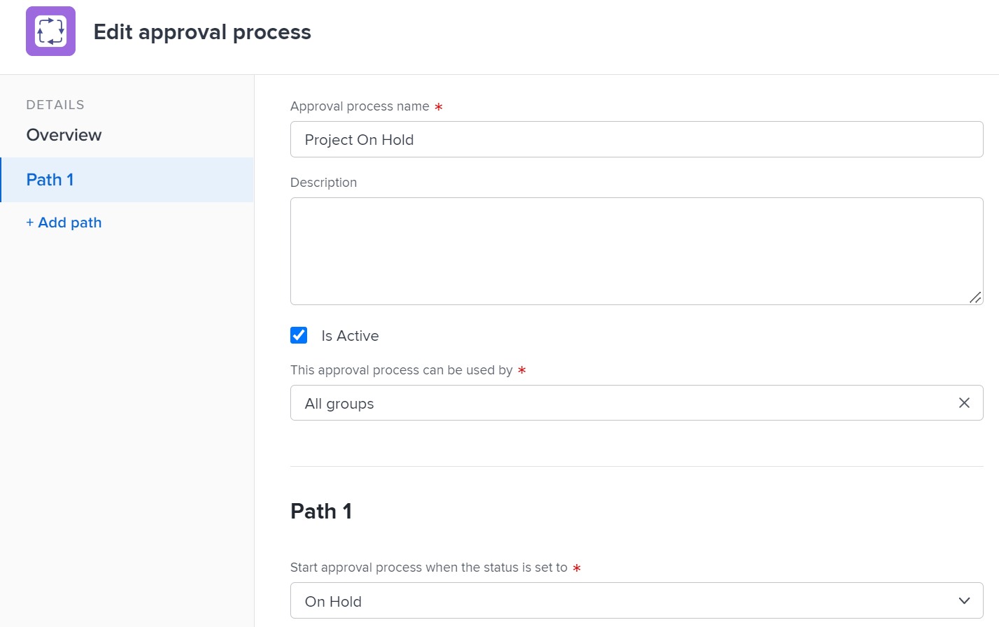

# Modificare un processo di approvazione

Se sei un amministratore di Adobe Workfront o disponi di accesso amministrativo ai processi di approvazione, puoi visualizzare e modificare tutti i processi di approvazione nel sistema.

Se sei un amministratore di gruppo, puoi visualizzare e modificare i processi di approvazione associati al gruppo o ai gruppi gestiti.

Per informazioni sulla creazione dei processi di approvazione, consulta [Creazione di un processo di approvazione per gli elementi di lavoro](../../../administration-and-setup/customize-workfront/configure-approval-milestone-processes/create-approval-processes.md).

>[!NOTE]
>
>* Quando si modifica un processo di approvazione globale già in uso, le modifiche apportate vengono applicate a tutti gli oggetti del sistema già associati.
>* Se si aggiunge un nuovo approvatore alla fase corrente in un processo di approvazione già avviato su un oggetto, il processo per tale oggetto viene ripristinato e gli approvatori devono ricominciare.
>
>  Tuttavia, se si apportano le seguenti modifiche in un processo di approvazione già avviato su un oggetto, tale processo continua senza interruzioni:
>
>* Aggiungere un’area di visualizzazione oltre la fase corrente
>* Aggiungi un approvatore aggiuntivo prima della fase corrente

## Requisiti di accesso

Devi disporre dei seguenti elementi:

<table style="table-layout:auto"> 
 <col> 
 <col> 
 <tbody> 
  <tr> 
   <td role="rowheader">piano Adobe Workfront*</td> 
   <td>Qualsiasi</td> 
  </tr> 
  <tr> 
   <td role="rowheader">Licenza Adobe Workfront*</td> 
   <td>Piano</td> 
  </tr> 
  <tr> 
   <td role="rowheader">Configurazioni a livello di accesso*</td> 
   <td> 
Accesso amministrativo ai processi di approvazione se non si è un amministratore di sistema
 
<b>NOTA</b>: Se non disponi ancora dell’accesso, chiedi all’amministratore Workfront se ha impostato ulteriori restrizioni nel livello di accesso. Per informazioni su come un amministratore Workfront può modificare il livello di accesso, consulta <a href="../../../administration-and-setup/add-users/configure-and-grant-access/create-modify-access-levels.md" class="MCXref xref">Creare o modificare livelli di accesso personalizzati</a>.
 </td> 
  </tr> 
 </tbody> 
</table>

&#42;Per informazioni sul piano, il tipo di licenza o l&#39;accesso, contattare l&#39;amministratore Workfront.

## Modificare un processo di approvazione esistente

1. Fai clic sul pulsante **Menu principale** icona  nell’angolo in alto a destra di Adobe Workfront, quindi fai clic su **Configurazione** .
1. (Condizionale) Se stai modificando un processo di approvazione a livello di sistema, fai clic su **Processi** > **Approvazioni** nel pannello a sinistra.

   Oppure

   Se stai modificando un processo di approvazione a livello di gruppo, procedi come segue:

   1. Nel pannello a sinistra, fai clic su **Gruppi** .
   1. Fare clic sul nome del gruppo per il quale si desidera elencare o gestire i processi di approvazione del gruppo.
   1. Nel pannello a sinistra, fai clic su **Approvazioni**. Potrebbe essere necessario fare clic su **Mostra altro** prima.

1. Fai clic sul pulsante **Approvazioni del progetto**, **Approvazioni attività** oppure **Approvazione del rilascio** a seconda del tipo di processo di approvazione che si desidera modificare.

1. Seleziona il processo di approvazione da modificare, quindi fai clic su **Modifica** in cima all&#39;elenco. Viene visualizzata la casella Modifica processo di approvazione.

   

1. Nella casella visualizzata, specifica le seguenti informazioni:

   <table style="table-layout:auto"> 
    <col> 
    <col> 
    <tbody> 
     <tr> 
      <td role="rowheader">Nome processo di approvazione</td> 
      <td>Digitare un nome descrittivo per il processo di approvazione. Gli utenti visualizzano questo nome quando applicano il processo di approvazione a un oggetto, come descritto in <a href="../../../review-and-approve-work/manage-approvals/associate-approval-with-work.md" class="MCXref xref">Associa un processo di approvazione nuovo o esistente al lavoro</a>.</td> 
     </tr> 
     <tr> 
      <td role="rowheader">Descrizione</td> 
      <td>Digitare una descrizione del processo di approvazione. Viene visualizzato nel <b>Approvazioni</b> nella sezione <b>Configurazione</b> area accanto al nome del processo di approvazione.</td> 
     </tr> 
     <tr> 
      <td role="rowheader">È attivo</td> 
      <td> 
Mantieni questa opzione attivata se desideri che altri utenti possano allegare il processo di approvazione a progetti, attività e problemi creati. 
 
Questa opzione è attivata per impostazione predefinita.
 
Suggerimento: Contrassegnare un processo di approvazione come inattivo è utile quando l'organizzazione non deve più utilizzarlo, ma si desidera conservare le informazioni cronologiche relative al suo utilizzo.
 </td> 
     </tr> 
     <tr data-mc-conditions=""> 
      <td role="rowheader">Questa approvazione è utilizzabile da </td> 
      <td> 
Se si desidera che il processo di approvazione sia disponibile per progetti, attività, problemi e modelli appartenenti solo a un gruppo specifico, iniziare a digitare il nome del gruppo, quindi selezionare il nome quando viene visualizzato:
 
       <ul> 
        <li>Se si è un amministratore di sistema o si dispone dell'accesso amministrativo ai processi di approvazione, è possibile visualizzare qualsiasi gruppo nel sistema quando si digita il nome. <b>Tutti i gruppi</b> è selezionato per impostazione predefinita. </li> 
        <li>Se si è un amministratore di gruppo senza accesso amministrativo ai processi di approvazione, è possibile assegnare il processo di approvazione a qualsiasi gruppo gestito quando si digita il nome. La <b>Tutti i gruppi</b> opzione non disponibile.</li> 
       </ul> 
Questa opzione non è disponibile per i processi di approvazione a uso singolo.
 
<b>AVVISO</b>: Quando si apportano modifiche al processo di approvazione specifico per gruppo, è possibile che vengano modificati i processi di approvazione esistenti già associati agli elementi di lavoro. Per informazioni su queste modifiche, vedi <a href="../../../administration-and-setup/customize-workfront/configure-approval-milestone-processes/how-changes-affect-group-approvals.md" class="MCXref xref">Effetti delle modifiche al processo di approvazione e di gruppo sui processi di approvazione assegnati</a>.
 
Per informazioni sull'elenco e sulla gestione dei processi di approvazione del gruppo dalla pagina del gruppo, consulta <a href="../../../administration-and-setup/manage-groups/work-with-group-objects/create-and-modify-groups-approval-processes.md" class="MCXref xref">Processi di approvazione a livello di gruppo</a>. 
 
Per informazioni sull'accesso amministrativo ai processi di approvazione, vedi <a href="../../../administration-and-setup/add-users/configure-and-grant-access/grant-users-admin-access-certain-areas.md" class="MCXref xref">Consentire agli utenti l'accesso amministrativo a determinate aree</a>.
 </td> 
     </tr> 
    </tbody> 
   </table>

1. Configura un percorso per il processo di approvazione utilizzando le opzioni seguenti.

   Un percorso è il percorso in cui specificare cosa deve accadere nel processo di approvazione. Si creano le fasi in un percorso per indicare chi deve eseguire il lavoro di approvazione e in quale ordine.

   <table style="table-layout:auto"> 
    <col> 
    <col> 
    <tbody> 
     <tr> 
      <td role="rowheader"> 
Avvia il processo di approvazione quando lo stato è impostato su
 </td> 
      <td> 
Selezionare lo stato che attiverà il processo di approvazione per gli elementi di lavoro. Quando un utente aggiorna un elemento di lavoro a questo stato, inizia il processo di approvazione. 
 
Impossibile selezionare lo stesso stato per più percorsi del processo di approvazione.
 
Gli stati disponibili si basano su quelli selezionati nell’opzione . <b>Questa approvazione può essere utilizzata da</b> (spiegato nella tabella precedente):
 
      <ul> 
      <li> Se <b>Tutti i gruppi</b> è selezionato, sono disponibili solo gli stati bloccati a livello di sistema. <!--Remove "locked" when story about using an unlocked status in approval processes goes to preview-->
      </li> 
      <li> 
Se è selezionato un gruppo specifico, sono disponibili solo gli stati disponibili per tale gruppo
 </li> 
      </ul> 
Per informazioni sul funzionamento del processo di approvazione con gli stati, consulta la sezione . <a href="../../../review-and-approve-work/manage-approvals/approval-process-in-workfront.md#how2" class="MCXref xref">Come i processi di approvazione si basano sugli stati</a> nell'articolo <a href="../../../review-and-approve-work/manage-approvals/approval-process-in-workfront.md" class="MCXref xref">Panoramica del processo di approvazione</a>.
 </td> 
     </tr> 
     <tr> 
      <td role="rowheader">Nome fase</td> 
      <td>(Facoltativo) Digita un nome che descrive il primo passaggio del percorso. Se non si specifica un nome di area di visualizzazione, il nome predefinito è <b>Fase 1</b>.</td> 
     </tr> 
     <tr> 
      <td role="rowheader">Approvatori</td> 
      <td> 
Inizia a digitare il nome dell’utente, del team o del ruolo di lavoro che desideri designare come approvatore per questa fase, quindi fai clic sul nome quando viene visualizzato nell’elenco a discesa. È possibile aggiungere solo utenti attivi, ruoli e team. 

   
<b>SUGGERIMENTO</b>:

   
Quando aggiungi un utente come approvatore, osserva l’avatar, il ruolo principale dell’utente o il relativo indirizzo e-mail per distinguere tra utenti con nomi identici. Gli utenti devono essere associati ad almeno un ruolo di lavoro per visualizzarlo durante l'aggiunta.

   
<b>NOTA</b>:

   L&#39;aggiunta di un utente, un team o un ruolo come approvatore non concede automaticamente le autorizzazioni all&#39;oggetto associato a tale approvazione. Essi ricevono le autorizzazioni per l&#39;oggetto quando viene attivato il passaggio di approvazione. In caso contrario, gli oggetti devono essere condivisi con loro prima di poter prendere una decisione di approvazione. 

   
Puoi anche designare una persona come approvatore specificando il ruolo della persona. Ad esempio, è possibile assegnare come approvatore un Proprietario progetto, Sponsor progetto, Proprietario Portfolio, Proprietario programma o Manager. Queste opzioni vengono visualizzate automaticamente all'inizio della digitazione.
 
      
<b>IMPORTANTE</b>:  
      <ul> 
      <li> Quando si assegna un'approvazione allo sponsor del progetto e nessuno viene designato come sponsor di un progetto, l'approvazione viene riassegnata al proprietario del progetto. Se nessuno è designato come proprietario del progetto, l’approvazione viene assegnata all’amministratore Workfront. </li> 
      <li> Quando assegni un'approvazione a un ruolo e a un'opzione <b>L’approvatore non deve far parte del team di progetto</b> è disabilitato, ma nessun ruolo nel team di progetto corrisponde al ruolo nell'approvazione, l'approvazione viene riassegnata al proprietario del progetto. Per informazioni sulle impostazioni di approvazione, vedi <a href="../../../administration-and-setup/customize-workfront/configure-approval-milestone-processes/establish-approval-settings.md" class="MCXref xref">Configurare le impostazioni di approvazione globali</a>.
      </li> 
      <li>Quando si assegna un'approvazione al proprietario del progetto e nessuno viene designato come proprietario di un progetto, l'approvazione viene riassegnata all'amministratore principale di Workfront come indicato nella sezione Informazioni cliente nell'area Configurazione. Per informazioni, consulta <a href="../../../administration-and-setup/get-started-wf-administration/configure-basic-info.md" class="MCXref xref">Configurare le informazioni di base per il sistema</a>.</li> 
      

 
      <li>
Quando si assegnano ruoli di lavoro come approvatori, tutti gli utenti associati a tale ruolo di lavoro che fanno parte anche del team di progetto possono decidere in merito all'approvazione. 
 
      
Quando assegni un team come approvatore, qualsiasi utente del team può prendere una decisione sull'approvazione. 
 
      
Per ulteriori informazioni sul team di progetto, consulta <a href="../../../manage-work/projects/planning-a-project/project-team-overview.md" class="MCXref xref">Panoramica del team di progetto</a>. Per ulteriori informazioni sull'approvazione del lavoro, vedi <a href="../../../review-and-approve-work/manage-approvals/approving-work.md" class="MCXref xref">Approvazione del lavoro </a>.

      </li>
      </ul>  
      </td> 
   </tr> 
     <tr> 
      <td role="rowheader">È necessaria solo una decisione</td> 
      <td>(Visualizza solo se si aggiungono più approvatori all'area di visualizzazione) Selezionare questa opzione se uno degli approvatori sullo stadio può approvare o rifiutare l'elemento di lavoro durante questa fase. Questa azione consente all’elemento di lavoro di uscire dall’area di visualizzazione.  
      
Se questa opzione non è selezionata, tutti gli approvatori identificati devono approvare o rifiutare lo stadio (in qualsiasi ordine) prima che l'articolo lasci lo stadio. Se uno degli approvatori rifiuta la fase, il processo interrompe e inizia di nuovo in modo da poter apportare le modifiche necessarie. Gli approvatori possono quindi approvare o rifiutare nuovamente lo stadio.
 
      
Quando un team viene designato come approvatore, qualsiasi membro del team può concedere o rifiutare una fase.
 
      </td> 
     </tr> 
     <tr> 
      <td role="rowheader"> 
Aggiungi fase
 </td> 
      <td>(Facoltativo) Aggiungi un altro passaggio al percorso, utilizzando le opzioni illustrate nelle tre righe precedenti. Puoi aggiungere al percorso tutti gli stadi necessari.</td> 
     </tr>
     <tr> 
      <td role="rowheader"> Scegli cosa succede quando l’approvazione viene rifiutata</td> 
      <td> 
Selezionare l'azione da eseguire se l'elemento di lavoro viene rifiutato in una qualsiasi fase del percorso:
 
      <ul> <li><strong>Creare un problema</strong>: (Disponibile solo per i processi di approvazione di progetti e task) Viene creato un problema nel progetto o nell'attività in cui è in esecuzione il processo di approvazione. Al problema viene assegnata la risorsa assegnata predefinita sull'attività o il proprietario del progetto. Per impostazione predefinita, il nome del problema creato è <strong>Approvazione rifiutata (nome progetto o attività)</strong>. Si tratta di un problema di rifiuto, inserito nell'attività o nel progetto, a seconda del processo di approvazione in cui si è verificato il rifiuto.</li> 
      <li> 
<strong>Imposta stato su</strong>: Scegliere una delle seguenti opzioni:
 
      <ul> <li><strong>Stato precedente</strong>: Il progetto, l'attività o il problema rifiutati viene ripristinato allo stato precedente allo stato che attiva il processo di approvazione.</li> 
      <li> 
<strong>Qualsiasi altro stato dell’elenco</strong>: L'oggetto rifiutato si sposta sullo stato scelto, ad esempio Bloccato. È possibile scegliere uno degli stati predefiniti o uno stato personalizzato aggiunto al sistema Workfront.
 
Se si seleziona uno stato associato a un processo di approvazione come stato di rifiuto per un percorso di approvazione, l’oggetto rifiutato si sposta sullo stato selezionato e verrà contrassegnato come “In attesa di approvazione”. 

      
Ad esempio, selezionando In sospeso con lo stato In sospeso associato a un processo di approvazione, l’oggetto rifiutato passa allo stato “In sospeso - In attesa di approvazione” e richiede l’approvazione.
    
Per un processo di approvazione a livello di sistema, sono disponibili solo gli stati a livello di sistema.
 
Per un processo di approvazione specifico per gruppo, sono disponibili tutti gli stati del gruppo. Ciò include tutti gli stati personalizzati creati dall'amministratore del gruppo in modo specifico per il gruppo, nonché tutti gli stati a livello di sistema. 
 
Per informazioni sul funzionamento del processo di approvazione con gli stati, consulta la sezione . <a href="../../../review-and-approve-work/manage-approvals/approval-process-in-workfront.md#how2" class="MCXref xref">Come i processi di approvazione si basano sugli stati</a> nell'articolo <a href="../../../review-and-approve-work/manage-approvals/approval-process-in-workfront.md" class="MCXref xref">Panoramica del processo di approvazione</a>.
 </li>
      </ul> 
     </tr> 
    </tbody> 
   </table>

1. (Facoltativo) Fai clic su **Aggiungi percorso** per aggiungere un altro percorso al processo di approvazione, facendo riferimento all&#39;elenco delle opzioni del passaggio precedente.

   Il nuovo percorso deve essere associato a un altro stato. Il percorso si attiva quando l&#39;elemento viene aggiornato per mostrare questo stato. Non puoi avere due percorsi per lo stesso stato.

1. Fai clic su **Salva**.
1. (Facoltativo) Effettua una delle seguenti operazioni:

   * Associa il processo di approvazione a progetti, attività o problemi specifici in tutto il sistema, come descritto in [Associa un processo di approvazione nuovo o esistente al lavoro](../../../review-and-approve-work/manage-approvals/associate-approval-with-work.md).
   * Al di fuori di Workfront, notifica agli utenti che il processo di approvazione è disponibile per essere associati ai loro progetti, attività o problemi, come descritto in [Associa un processo di approvazione nuovo o esistente al lavoro](../../../review-and-approve-work/manage-approvals/associate-approval-with-work.md).
   * Crea un altro processo di approvazione che viene attivato se questo processo di approvazione viene rifiutato e l&#39;elemento assume un altro stato. Questo consente di collegare insieme i processi di approvazione.
