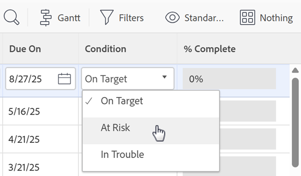

# Modificare l&#39;ordine di visualizzazione delle condizioni

È possibile modificare l’ordine di visualizzazione delle condizioni nei progetti, nelle attività e nei problemi:

* Quando un utente modifica un progetto

  

* Quando un utente modifica la condizione di un’attività o di un problema

  

  >[!NOTE]
  >
  >Nella visualizzazione Condizione predefinita, il campo **Condizione** è un tipo di campo che non può essere modificato in linea. Il campo **Condizione** aggiunto separatamente a una visualizzazione può essere modificato. Per informazioni sulla modifica in linea, vedere [Elementi di modifica in linea in un elenco in Adobe Workfront](/help/quicksilver/workfront-basics/navigate-workfront/use-lists/inline-edit-objects.md).

## Requisiti di accesso

+++ Espandi per visualizzare i requisiti di accesso per la funzionalità in questo articolo.

<table style="table-layout:auto"> 
 <col> 
 <col> 
 <tbody> 
  <tr> 
   <td>Pacchetto Adobe Workfront</td> 
   <td>
Qualsiasi
</td> 
  </tr> 
  <tr> 
   <td>Licenza Adobe Workfront</td> 
   <td>
Standard

       
Piano
</td>
  </tr> 
  <tr> 
   <td>Configurazioni del livello di accesso</td> 
   <td>Amministratore di Sistema</td> 
  </tr> 
 </tbody> 
</table>

Per informazioni, consulta [Requisiti di accesso nella documentazione di Workfront](/help/quicksilver/administration-and-setup/add-users/access-levels-and-object-permissions/access-level-requirements-in-documentation.md).

+++

## Modificare l&#39;ordine di visualizzazione delle condizioni

{{step-1-to-setup}}

1. Fai clic su **Preferenze progetto** > **Condizioni**.

1. Selezionare la scheda **Progetti**, **Attività** o **Problemi**.

1. Trascina  le condizioni per modificarne l&#39;ordine.

   Il nuovo ordine viene salvato automaticamente.

Per ulteriori informazioni sulla personalizzazione delle condizioni, vedere [Condizioni personalizzate](../../../administration-and-setup/customize-workfront/create-manage-custom-conditions/custom-conditions.md).
