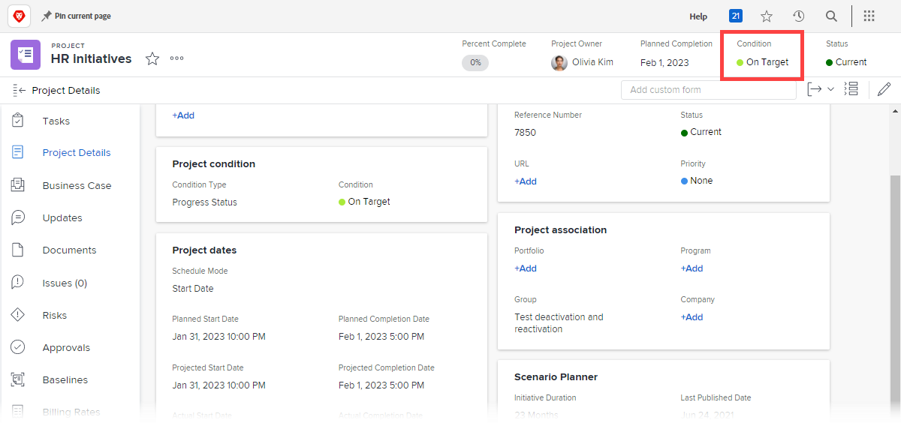

# Impostare una condizione personalizzata come predefinita per i progetti

Se il tipo di condizione di un progetto è impostato su Stato di avanzamento anziché su Manuale, Adobe Workfront visualizza automaticamente una delle tre condizioni predefinite integrate nel progetto (Su Target, A rischio o Nei problemi) mentre procede, come spiegato in [Panoramica del tipo di condizione e condizione del progetto](../../../manage-work/projects/manage-projects/project-condition-and-condition-type.md).

È possibile impostare le condizioni personalizzate come condizioni predefinite anziché utilizzare queste tre condizioni predefinite incorporate. Ad esempio, puoi modificare la condizione predefinita Su Target in modo che venga visualizzata come Esame tracciamento in tutti i progetti.

## Requisiti di accesso

Per eseguire i passaggi descritti in questo articolo, è necessario disporre dei seguenti diritti di accesso:

<table style="table-layout:auto"> 
 <col> 
 <col> 
 <tbody> 
  <tr> 
   <td role="rowheader">piano Adobe Workfront</td> 
   <td>Qualsiasi</td> 
  </tr> 
  <tr> 
   <td role="rowheader">Licenza Adobe Workfront</td> 
   <td>Piano</td> 
  </tr> 
  <tr> 
   <td role="rowheader">Configurazioni a livello di accesso</td> 
   <td> 
Devi essere un amministratore Workfront.
 
<b>NOTA</b>: Se non disponi ancora dell’accesso, chiedi all’amministratore Workfront se ha impostato ulteriori restrizioni nel livello di accesso. Per informazioni su come un amministratore Workfront può modificare il livello di accesso, consulta <a href="../../../administration-and-setup/add-users/configure-and-grant-access/create-modify-access-levels.md" class="MCXref xref">Creare o modificare livelli di accesso personalizzati</a>.
 </td> 
  </tr> 
 </tbody> 
</table>

## Imposta una condizione personalizzata come condizione predefinita per tutti i progetti:

1. Fai clic sul pulsante **Menu principale** icona  nell’angolo in alto a destra di Adobe Workfront, quindi fai clic su **Configurazione** .

1. Fai clic su **Preferenze del progetto** > **Condizioni**.

1. Fai clic sul pulsante **Progetto** scheda .
1. Fai clic su **Imposta condizioni predefinite**.
1. Nel menu a discesa accanto alla condizione predefinita che si desidera modificare, fare clic sulla condizione personalizzata che si desidera utilizzare.
1. Ripetere il passaggio precedente per qualsiasi altra condizione predefinita che si desidera modificare.
1. Fai clic su **Salva**.

Per informazioni sull’impostazione di una condizione personalizzata come condizione predefinita per attività e problemi, consulta [Imposta una condizione personalizzata come predefinita per le attività e i problemi](../../../administration-and-setup/customize-workfront/create-manage-custom-conditions/set-custom-condition-default-tasks-issues.md).

Per informazioni sulla configurazione di un progetto in modo che gli utenti possano aggiornarne manualmente la condizione, consulta [Aggiorna condizione per attività e problemi](../../../manage-work/projects/updating-work-in-a-project/update-condition-for-tasks-and-issues.md).

Per informazioni sulle condizioni personalizzate, consulta [Condizioni personalizzate](../../../administration-and-setup/customize-workfront/create-manage-custom-conditions/custom-conditions.md).
