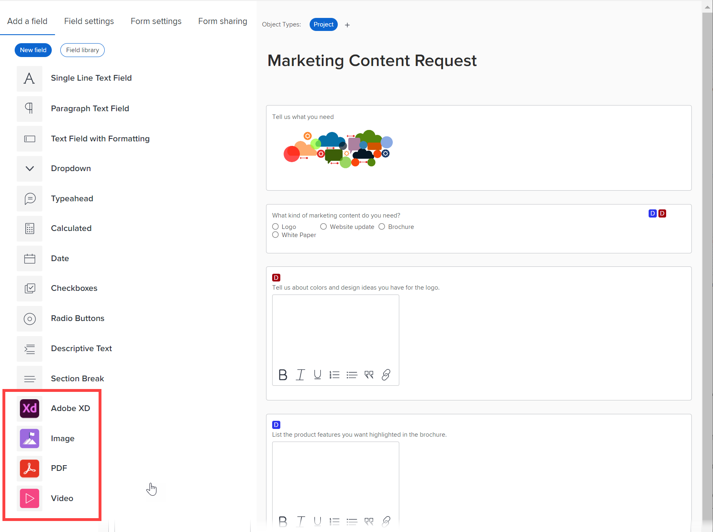

# Aggiungere o modificare un’immagine o un altro widget di risorse in un modulo personalizzato

Puoi aggiungere o modificare le proprietà di uno dei seguenti widget di risorse in un modulo personalizzato:

* Immagine
* Video
* file PDF
* File Adobe XD

Questa funzione è utile quando devi includere contenuti visivi come immagini di branding, video di istruzioni o prototipo interattivo per un’app che stai progettando.

Quando un modulo personalizzato contenente un widget è associato a un oggetto, gli utenti che lavorano con esso possono visualizzarlo nelle seguenti aree:

* Area Dettagli dell’oggetto (ad esempio, per un progetto, l’area Dettagli progetto)
* La casella Modifica per l’oggetto, se presenta il nuovo aspetto dell’esperienza Adobe Workfront (ad esempio, le caselle Modifica progetto e Modifica attività)

Attualmente, gli utenti non possono visualizzare il widget nelle seguenti aree: &#x200B;

* Elenchi e rapporti
* Home e Riepilogo
* La casella Modifica per l’oggetto, se non presenta il nuovo aspetto dell’esperienza Adobe Workfront (ad esempio, la casella Modifica spesa)
* L&#39;app Workfront Mobile

## Requisiti di accesso

Per eseguire i passaggi descritti in questo articolo, è necessario disporre dei seguenti elementi:

<table style="table-layout:auto"> 
 <col> 
 <col> 
 <tbody> 
  <tr data-mc-conditions=""> 
   <td role="rowheader"> 
piano Adobe Workfront*
 </td> 
   <td>Qualsiasi</td> 
  </tr> 
  <tr> 
   <td role="rowheader">Licenza Adobe Workfront*</td> 
   <td>Piano</td> 
  </tr> 
  <tr data-mc-conditions=""> 
   <td role="rowheader">Configurazioni a livello di accesso*</td> 
   <td> 
Accesso amministrativo ai moduli personalizzati
 
Per informazioni su come gli amministratori di Workfront concedono questo accesso, consulta <a href="../../../administration-and-setup/add-users/configure-and-grant-access/grant-users-admin-access-certain-areas.md" class="MCXref xref">Consentire agli utenti l'accesso amministrativo a determinate aree</a>.
 </td> 
  </tr>  
 </tbody> 
</table>

&#42;Per sapere quale piano, tipo di licenza o configurazioni del livello di accesso si dispone, contattare l&#39;amministratore Workfront.

## Aggiunta o modifica di un widget di risorse in un modulo personalizzato

1. Inizia a lavorare su un modulo personalizzato come descritto in [Creare o modificare un modulo personalizzato](../../../administration-and-setup/customize-workfront/create-manage-custom-forms/create-or-edit-a-custom-form.md).
1. Con la **Aggiungi un campo** aprire la scheda ed effettuare una delle seguenti operazioni:

   * Se stai aggiungendo un nuovo widget, seleziona **Immagine**, **PDF** oppure **Video** per aggiungerlo nella parte inferiore del modulo, oppure trascinarlo nel punto desiderato del modulo.

      

   * Se si desidera aggiungere un widget già aggiunto a un altro modulo personalizzato, fare clic su **Libreria campi**, quindi fai clic sul nome del widget nell’elenco visualizzato. Per ulteriori informazioni, consulta [Riutilizzare un campo o un widget personalizzato in un modulo personalizzato](../../../administration-and-setup/customize-workfront/create-manage-custom-forms/reuse-an-existing-field.md).

   * Se stai modificando un widget già aggiunto al modulo personalizzato, selezionalo.

1. Digita o modifica una delle seguenti proprietà per il widget:

   <table style="table-layout:auto"> 
    <col> 
    <col> 
    <tbody> 
     <tr> 
      <td role="rowheader">Etichetta</td> 
      <td> 
(Obbligatorio) Immetti un'etichetta descrittiva da visualizzare sopra il widget. Puoi modificare l’etichetta in qualsiasi momento.
 
<b>IMPORTANTE</b>: Evita di utilizzare caratteri speciali in questa etichetta. Non vengono visualizzati correttamente nei rapporti.
 </td> 
     </tr> 
     <tr> 
      <td role="rowheader">Nome</td> 
      <td> 
(Obbligatorio) Questo nome è il modo in cui il sistema identifica il widget.
 
Quando si configura il widget per la prima volta e si digita l’etichetta, il campo Nome viene compilato automaticamente in modo da corrispondere a esso. Tuttavia, i campi Etichetta e Nome non sono sincronizzati, in quanto consentono di modificare l’etichetta visualizzata dagli utenti senza dover modificare il nome visualizzato dal sistema.
 
<b>IMPORTANTE</b>: Anche se è possibile farlo, ti consigliamo di non modificare questo nome dopo che tu o altri utenti iniziate a utilizzare il modulo personalizzato in widget. In questo caso, il sistema non riconoscerà più il widget dove potrebbe ora essere referenziato in altre aree di Workfront. 
 
Ogni nome di widget deve essere univoco nell'istanza Workfront della tua organizzazione. In questo modo è possibile riutilizzare uno già creato per un altro modulo personalizzato. 
 </td> 
     </tr> 
     <tr> 
      <td role="rowheader">URL</td> 
      <td> 
(Obbligatorio) Digita o incolla l'URL del widget in cui è memorizzato su Internet.
 
       
<strong>Importante</strong>: L'URL per deve essere un URL pubblico. 

      
Se stai aggiungendo un widget video, al momento puoi farlo aggiungendo quanto segue nella casella URL:
 
      <ul> 
      <li> 
Collegamento YouTube o Vimeo
 </li> 
      <li> 
Collegamento video a Google Drive
 </li> 
      <li> 
Collegamento a video con estensione MP4 e MOV
 </li> 
      <li> 
Collega a video già caricato nell’area Documenti nella tua istanza Workfront. Per istruzioni, consulta <a href="#add-a-video-widget-to-a-custom-form-from-the-documents-area" class="MCXref xref">Aggiungere un widget video a un modulo personalizzato dall’area Documenti</a> in questo articolo.
 
      </li> 
      </ul> 
       </td> 
     </tr> 
     <tr> 
      <td role="rowheader">Istruzioni</td> 
      <td> 
Inserisci eventuali informazioni aggiuntive sul widget. Quando gli utenti compilano il modulo personalizzato, possono passare il cursore sull’icona del punto interrogativo per visualizzare una descrizione comandi contenente le informazioni digitate qui.
 </td> 
     </tr> 
     <tr> 
      <td role="rowheader">Dimensione</td> 
      <td>Modifica le dimensioni di visualizzazione del widget in base alle esigenze.</td> 
     </tr> 
    </tbody> 
   </table>

1. Fai clic su **Applica**.
1. Per continuare a creare il modulo personalizzato in altri modi, procedere con uno dei seguenti articoli:

   * [Posizionare campi e widget personalizzati in un modulo personalizzato](../../../administration-and-setup/customize-workfront/create-manage-custom-forms/position-fields-in-a-custom-form.md)
   * [Aggiungere un campo personalizzato a un modulo personalizzato](../../../administration-and-setup/customize-workfront/create-manage-custom-forms/add-a-custom-field-to-a-custom-form.md)
   * [Riutilizzare un campo o un widget personalizzato in un modulo personalizzato](../../../administration-and-setup/customize-workfront/create-manage-custom-forms/reuse-an-existing-field.md)
   * [Aggiungere dati calcolati a un modulo personalizzato](../../../administration-and-setup/customize-workfront/create-manage-custom-forms/add-calculated-data-to-custom-form.md)
   * [Riutilizzare un campo personalizzato calcolato esistente in un modulo personalizzato](../../../administration-and-setup/customize-workfront/create-manage-custom-forms/use-existing-calc-field-new-custom-form.md)
   * [Aggiungere logica di visualizzazione e ignorare la logica in un modulo personalizzato](../../../administration-and-setup/customize-workfront/create-manage-custom-forms/display-or-skip-logic-custom-form.md)
   * [Anteprima e compilazione di un modulo personalizzato](../../../administration-and-setup/customize-workfront/create-manage-custom-forms/preview-and-complete-a-custom-form.md)

## Aggiungere un file XD a un modulo personalizzato

1. Inizia a lavorare su un modulo personalizzato come descritto in [Creare o modificare un modulo personalizzato](../../../administration-and-setup/customize-workfront/create-manage-custom-forms/create-or-edit-a-custom-form.md).
1. Con la **Aggiungi un campo** apri scheda, seleziona **Adobe XD**.
1. Digita o modifica una delle seguenti proprietà per il widget:

   <table style="table-layout:auto"> 
    <col> 
    <col> 
    <tbody> 
     <tr> 
      <td role="rowheader">Etichetta</td> 
      <td> 
(Obbligatorio) Immetti un'etichetta descrittiva da visualizzare sopra il widget. Puoi modificare l’etichetta in qualsiasi momento.
 
<b>IMPORTANTE</b>: Evita di utilizzare caratteri speciali in questa etichetta. Non vengono visualizzati correttamente nei rapporti.
 </td> 
     </tr> 
     <tr> 
      <td role="rowheader">Nome</td> 
      <td> 
(Obbligatorio) Questo nome è il modo in cui il sistema identifica il widget.
 
Quando si configura il widget per la prima volta e si digita l’etichetta, il campo Nome viene compilato automaticamente in modo da corrispondere a esso. Tuttavia, i campi Etichetta e Nome non sono sincronizzati, in quanto consentono di modificare l’etichetta visualizzata dagli utenti senza dover modificare il nome visualizzato dal sistema.
 
<b>IMPORTANTE</b>: Anche se è possibile farlo, ti consigliamo di non modificare questo nome dopo che tu o altri utenti iniziate a utilizzare il modulo personalizzato in widget. In questo caso, il sistema non riconoscerà più il widget dove potrebbe ora essere referenziato in altre aree di Workfront. 
 
Ogni nome di widget deve essere univoco nell'istanza Workfront della tua organizzazione. In questo modo è possibile riutilizzare uno già creato per un altro modulo personalizzato. 
 </td> 
     </tr> 
     <tr> 
      <td role="rowheader">URL</td> 
      <td> 
(Obbligatorio) Digitare o incollare un collegamento XD prototipo valido.
 
      
Nota: L’impostazione Accesso collegamento nella scheda Condividi di Adobe XD deve essere impostata su Chiunque disponga del collegamento. In caso contrario, gli utenti non potranno visualizzare il prototipo. 
   </td> 
     </tr> 
     <tr> 
      <td role="rowheader">Istruzioni</td> 
      <td> 
(Facoltativo) Immetti eventuali informazioni aggiuntive sul widget. Quando gli utenti compilano il modulo personalizzato, possono passare il cursore sull’icona del punto interrogativo per visualizzare una descrizione comandi contenente le informazioni digitate qui.
 </td> 
     </tr> 
     <tr> 
      <td role="rowheader">Dimensione</td> 
      <td>(Facoltativo) Se necessario, modifica le dimensioni di visualizzazione del widget.</td> 
     </tr> 
    </tbody> 
   </table>

1. Per continuare a creare il modulo personalizzato in altri modi, procedere con uno dei seguenti articoli:

   * [Posizionare campi e widget personalizzati in un modulo personalizzato](../../../administration-and-setup/customize-workfront/create-manage-custom-forms/position-fields-in-a-custom-form.md)
   * [Aggiungere un campo personalizzato a un modulo personalizzato](../../../administration-and-setup/customize-workfront/create-manage-custom-forms/add-a-custom-field-to-a-custom-form.md)
   * [Riutilizzare un campo o un widget personalizzato in un modulo personalizzato](../../../administration-and-setup/customize-workfront/create-manage-custom-forms/reuse-an-existing-field.md)
   * [Aggiungere dati calcolati a un modulo personalizzato](../../../administration-and-setup/customize-workfront/create-manage-custom-forms/add-calculated-data-to-custom-form.md)
   * [Riutilizzare un campo personalizzato calcolato esistente in un modulo personalizzato](../../../administration-and-setup/customize-workfront/create-manage-custom-forms/use-existing-calc-field-new-custom-form.md)
   * [Aggiungere logica di visualizzazione e ignorare la logica in un modulo personalizzato](../../../administration-and-setup/customize-workfront/create-manage-custom-forms/display-or-skip-logic-custom-form.md)
   * [Anteprima e compilazione di un modulo personalizzato](../../../administration-and-setup/customize-workfront/create-manage-custom-forms/preview-and-complete-a-custom-form.md)

## Aggiungere un widget video a un modulo personalizzato dall’area Documenti {#add-a-video-widget-to-a-custom-form-from-the-documents-area}

>[!IMPORTANT]
>
>Quando si aggiunge un video a un modulo personalizzato in questo modo, solo le autorizzazioni impostate per il modulo personalizzato vengono applicate al video quando gli utenti accedono al modulo su un oggetto e non alle autorizzazioni impostate per il video nell’area Documenti.

1. Passa al video nell’area Documenti e genera una bozza per esso, come descritto in [Creare una bozza interattiva per un sito web o altro contenuto web](../../../review-and-approve-work/proofing/creating-proofs-within-workfront/generate-interactive-proof-for-website-or-other-web-content.md).
1. Apri la bozza.
1. Fai clic con il pulsante destro del mouse in un punto qualsiasi del video, quindi seleziona **Copia indirizzo video**.
1. Nel modulo personalizzato in cui si sta aggiungendo il widget video, incolla l’indirizzo copiato nel **URL** scatola.
