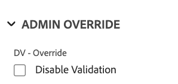

# Esempi di logica avanzata nei moduli personalizzati

Le regole logiche consentono di personalizzare ulteriormente i campi in un modulo personalizzato.

Questo articolo fornisce esempi di espressioni utilizzate per creare una logica avanzata sui campi personalizzati.

Per ulteriori informazioni sull&#39;aggiunta di logica a un modulo personalizzato, vedere [Aggiungere regole di logica a moduli e campi personalizzati](/help/quicksilver/administration-and-setup/customize-workfront/create-manage-custom-forms/form-designer/design-a-form/display-skip-logic-form-designer.md).

## Requisiti di accesso

+++ Espandi per visualizzare i requisiti di accesso per la funzionalità in questo articolo.

Per eseguire i passaggi descritti in questo articolo, è necessario disporre dei seguenti diritti di accesso:

<table style="table-layout:auto"> 
 <col> 
 <col> 
 <tbody> 
  <tr data-mc-conditions=""> 
   <td role="rowheader">piano Adobe Workfront </td> 
   <td>Qualsiasi</td> 
  </tr> 
  <tr> 
   <td role="rowheader">Licenza Adobe Workfront</td> 
   <td>
   <p>Nuovo: Standard</p>
   <p>oppure</p>
   <p>Corrente: Piano</p></td> 
  </tr> 
  <tr data-mc-conditions=""> 
   <td role="rowheader">Configurazioni del livello di accesso</td> 
   <td>Accesso amministrativo ai moduli personalizzati </td> 
  </tr>  
 </tbody> 
</table>

Per ulteriori dettagli sulle informazioni contenute in questa tabella, vedere [Requisiti di accesso nella documentazione di Workfront](/help/quicksilver/administration-and-setup/add-users/access-levels-and-object-permissions/access-level-requirements-in-documentation.md).

+++

## Esempi di logica di convalida

La logica di convalida viene creata utilizzando le formule e può essere resa semplice o complessa in base alle esigenze. La convalida può essere basata sui valori di altri campi o sullo stato degli oggetti ed è possibile fornire un messaggio di errore per i casi in cui la convalida non riesce.

Se il campo con la logica applicata soddisfa le condizioni di convalida definite quando un utente compila il modulo personalizzato, il campo viene evidenziato e viene visualizzato il messaggio di errore.

È possibile applicare la logica di convalida ai seguenti tipi di campi: testo a riga singola, paragrafo, elenco a discesa a selezione singola, elenco a discesa a selezione multipla, ricerca esterna, completamento automatico, data, gruppo di caselle di controllo e pulsanti di scelta.

### Consenti solo al proprietario del progetto di selezionare &quot;Rush&quot; SLA

In questo esempio, un campo a discesa a selezione singola include opzioni per il SLA di Standard: 14 giorni, Priorità: 7 giorni e Rush: 2 giorni.

Espressione di convalida:

```
IF({ownerID}!=$$USER&&{DE:DV - Dropdown - Control Dates}="2",CONCAT("Only ",{owner}.{name}," may select X Rush"))
```

Quando un utente che non è il proprietario del progetto (incluso l&#39;amministratore di sistema) tenta di selezionare **X Rush**, viene visualizzato un errore:


### Convalida della data in base alla scelta nel campo precedente

Continuando con l’esempio di SLA, puoi aggiungere un campo data convalidato in base alle impostazioni del campo a discesa precedente.

Espressione di convalida:

```
IF({DE:DV - Date - Dropdown SLA}<ADDDAYS($$TODAY,{DE:DV - Dropdown - Control Dates}),CONCAT("Earliest: ",ADDDAYS($$TODAY,{DE:DV - Dropdown - Control Dates})))
```

Se l’utente seleziona una data precedente alla data consentita, il messaggio mostra la prima data selezionabile:


### Numero minimo di caratteri con l’opzione da escludere

In questo esempio, viene applicato un numero minimo di caratteri in un campo di testo, con il numero di caratteri visualizzato. Inoltre, viene impostata una casella di controllo separata per disabilitare la convalida del conteggio dei caratteri.

Espressione di convalida:

```
IF({DE:DV - Override}!="Disable Validation"&&LEN({DE:DV - Text - Min Length})<"7",CONCAT(LEN({DE:DV - Text - Min Length})," characters / ",("7"-LEN({DE:DV - Text - Min Length}))," remaining"))
```

L’applicazione della convalida può essere ignorata selezionando la casella di controllo:



Nel campo di testo è incluso un conteggio di caratteri in esecuzione:


### Blocca un campo in modo che solo il proprietario possa modificarlo

In questo esempio, un campo può essere modificato solo dal proprietario del progetto. Nemmeno l&#39;amministratore di sistema può modificare il campo.

Espressione di convalida:

```
IF({ownerID}!=$$USER,IF(ISBLANK({ownerID}),"Project Owner will provide this.",CONCAT("Only ",{owner}.{name}," can edit this.")))
```

Se un utente che non è il proprietario del progetto tenta di digitare nel campo, visualizza un messaggio che indica che solo il proprietario del progetto può modificare il campo.


### Automatico consente o rifiuta valori basati su altri valori di campo

In questo esempio, un campo typeahead consente o rifiuta dinamicamente i valori in base al valore immesso in un altro campo del modulo.

Espressione di convalida:

```
IF({DE:DV - Text - Budget}>"10000",
   IF({DE:DV - TA User - by Budget}.{role}!="Director","Requires Director Approver")
)
```

Se il valore nel campo del budget è superiore a $ 10.000, è possibile selezionare dal typeahead solo gli utenti con un ruolo Director, anche se non è abilitato alcun filtro di ruolo nella configurazione typeahead.


### Non consentire valori inferiori a 10 giorni dalla data di immissione

In questo esempio, la convalida consente solo valori che sono 10 giorni nel futuro dalla data di immissione. Nella formula è inclusa anche l’opzione per ignorare la convalida (in un campo casella di controllo separato), consentendo al campo data di essere vuoto.

Espressione di convalida:

```
IF({DE:DV - Override}!="Disable Validation"&&ISBLANK({DE:DV - Date - Deadline})!="true"&&{DE:DV - Date - Deadline}<ADDDAYS({entryDate},"10"),CONCAT("Earliest: ",ADDDAYS({entryDate},"10")))
```

Qualsiasi valore inferiore a 10 giorni dalla data di inserimento attiva la convalida:


Un valore vuoto non attiva il messaggio di convalida:


### Applicare selezioni esatte/minime/massime in un campo a selezione multipla

In questo esempio, un campo a selezione multipla, ad esempio un gruppo di caselle di controllo, richiede che l&#39;utente scelga un determinato numero di opzioni.

Espressione di convalida (scegliere esattamente due):

```
IF({DE:DV - Override}!="Disable Validation"&&ARRAYLENGTH(ARRAY({DE:DV - Checkbox - Pick exactly 2},","))!="2","Pick Exactly 2 Options")
```

Espressione di convalida (scegliere almeno due):

```
IF({DE:DV - Override}!="Disable Validation"&&ARRAYLENGTH(ARRAY({DE:DV - Checkbox - Pick at least 2},","))<"2","Pick at least 2 choices")
```

Espressione di convalida (scegliere un massimo di due):

```
IF({DE:DV - Override}!="Disable Validation"&&ARRAYLENGTH(ARRAY({DE:DV - Checkbox - Pick no more than 2},","))>"2","Pick no more than 2 choices")
```

L’utente visualizza gli errori di convalida se non seleziona il numero corretto di opzioni.


