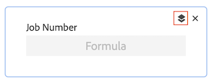

# Progettare un modulo con il progettista del modulo

È possibile progettare un modulo personalizzato con il progettista del modulo. È possibile allegare moduli personalizzati a diversi oggetti di Workfront per acquisire dati su tali oggetti.

## Requisiti di accesso

Per eseguire i passaggi descritti in questo articolo, è necessario disporre dei seguenti elementi:

<table style="table-layout:auto"> 
 <col> 
 <col> 
 <tbody> 
  <tr data-mc-conditions=""> 
   <td role="rowheader"> 
Piano Adobe Workfront*
 </td> 
   <td>Qualsiasi</td> 
  </tr> 
  <tr> 
   <td role="rowheader">Licenza Adobe Workfront*</td> 
   <td>
   
Piano corrente: Standard

   
oppure

   
Piano legacy: piano
</td> 
  </tr> 
  <tr data-mc-conditions=""> 
   <td role="rowheader">Configurazioni del livello di accesso*</td> 
   <td> 
Accesso amministrativo ai moduli personalizzati
 
Per informazioni sulle modalità di concessione dell'accesso da parte degli amministratori di Workfront, vedere <a href="/help/quicksilver/administration-and-setup/add-users/configure-and-grant-access/grant-users-admin-access-certain-areas.md" class="MCXref xref">Concedere agli utenti l'accesso amministrativo a determinate aree</a>.
 </td> 
  </tr>  
 </tbody> 
</table>

&#42;Per informazioni sulle configurazioni di piano, tipo di licenza o livello di accesso disponibili, contattare l&#39;amministratore Workfront.

## Inizia a progettare un modulo personalizzato

1. Fai clic su **Menu principale** icona  nell’angolo superiore destro di Adobe Workfront, quindi fai clic su **Configurazione** .

1. Clic **Forms personalizzato** nel pannello a sinistra.

   <!-- >[!TIP]
    >
    >In the view that appears, you can review all custom forms and custom fields that have been created for your organization. You can also see who created each form and the fields that are associated with it. -->

1. Clic **Nuovo modulo personalizzato.**
1. Seleziona i tipi di oggetto a cui desideri allegare il modulo personalizzato, quindi fai clic su **Continua**.

   

1. In **Il titolo è obbligatorio** , digitare il titolo del modulo personalizzato.
1. (Facoltativo) Se si desidera aggiungere altri tipi di oggetto al modulo in modo che possa essere allegato a più oggetti, fare clic sul pulsante **Aggiungi** icona  dopo **Tipi di oggetto**, quindi seleziona il tipo desiderato nel menu visualizzato. È possibile ripetere questa operazione per aggiungere tutti i tipi di oggetto desiderati.

   È inoltre possibile fare clic sulla X su un tipo di oggetto per eliminarlo dal modulo.

   >[!CAUTION]
   >
   >L’eliminazione di un modulo personalizzato comporta anche l’eliminazione di tutti i dati personalizzati sugli oggetti associati al modulo. Non è possibile recuperare i dati eliminati. Valuta invece la possibilità di disattivare un modulo personalizzato: quando disattivi un modulo personalizzato che non utilizzi più, vengono conservati tutti i dati storici associati.
   >
   >Per ulteriori informazioni, consulta [Eliminare tipi di oggetto in un modulo personalizzato](/help/quicksilver/administration-and-setup/customize-workfront/create-manage-custom-forms/delete-object-type-on-a-custom-form.md).

1. Successivamente, puoi iniziare ad aggiungere campi al modulo personalizzato. Vedere le sezioni seguenti:
   * [Riutilizzare un campo o un widget esistente già utilizzato in un altro modulo personalizzato](#reuse-an-existing-field-or-widget-already-used-in-another-custom-form)
   * [Aggiungi campi di testo](#add-text-fields)
   * [Aggiungere campi calcolati](#add-calculated-fields)
   * [Aggiungi pulsanti di scelta, gruppo di caselle di controllo e elenchi a discesa](#add-radio-buttons-checkboxes-and-dropdowns)
   * [Aggiungere campi di tipo typeahead e date](#add-typeahead-and-date-fields)
   * [Aggiungere immagini, PDF e video](#add-images-pdfs-and-videos)
   * [Aggiungere file Adobe XD](#add-adobe-xd-files)

## Aggiungere campi nuovi o esistenti al modulo personalizzato

È possibile utilizzare campi nuovi o esistenti durante la progettazione del modulo personalizzato.

## Riutilizzare un campo o un widget esistente già utilizzato in un altro modulo personalizzato

1. In alto a sinistra nella schermata, fai clic su **Libreria campi**.

1. Trascina qui il campo o il widget desiderato nel modulo personalizzato.
1. (Facoltativo) Ripeti il passaggio precedente per aggiungere altri campi o widget.

   >[!NOTE]
   >
   >È possibile aggiungere fino a 500 campi e widget in un singolo modulo personalizzato. Tuttavia, il calo delle prestazioni può verificarsi quando in un modulo esistono più di 100 moduli, a seconda della complessità.
   >
   >
   >Esempi di moduli complessi includono moduli con parametri a catena, campi di dati personalizzati calcolati e opzioni con più valori in un singolo campo.

1. Per salvare le modifiche, fai clic su **Applica** e passare a un&#39;altra sezione per continuare a creare il modulo.

   oppure

   Clic **Salva e chiudi**.

### Aggiungi campi di testo

È possibile aggiungere diversi campi di testo a un modulo personalizzato.

+++ **Espandi per visualizzare le descrizioni dei campi di testo disponibili**

* **Campo di testo a riga singola**: consente agli utenti di digitare una singola riga di testo nel campo.
* **Campo di testo paragrafo**: consente agli utenti di digitare più righe di testo nel campo.
* **Campo di testo con formattazione**: consente agli utenti di digitare più righe di testo nel campo e formattare il testo con grassetto, corsivo, sottolineato, punti elenco, numerazione, collegamenti ipertestuali e virgolette. Un limite di caratteri di 15.000 consente di inserire testo e formattazione in modo molto ampio.

  Per informazioni sull’accesso a questo campo tramite l’API, consulta Archiviazione di campi in formato Rich text nell’API.

  >[!NOTE]
  >
  >I campi di testo con formattazione non sono disponibili per le app Workfront per dispositivi mobili (disponibili nelle prossime versioni).

* **Testo descrittivo**: ti consente di includere istruzioni e collegamenti a pagine esterne a Workfront.

+++

Per aggiungere un campo di testo:

1. Nella parte sinistra dello schermo, individua uno dei campi di testo seguenti e trascinalo in una sezione dell’area di lavoro:

   * Testo su riga singola
   * Testo paragrafo
   * Campo di testo con formattazione
   * Testo descrittivo

   

1. Sul lato destro della schermata, configura le opzioni disponibili per il tipo di campo personalizzato che stai aggiungendo:

   <table>
    <tr>
    <td>Input in</td>
    <td>Descrizione</td>
    <td>Disponibile per </td>
    </tr>
    <tr>
    <td>Dimensione</td>
    <td>
Modificare le dimensioni dei campi di testo nel modulo.

   </td>
    <td><ul>
    <li>Testo su riga singola</li>
    <li>Testo paragrafo</li>
    <li>Testo con formattazione</li>
    <li>Testo descrittivo in arrivo</li>
    </ul></td>
    </tr>
    <tr>
    <td>Etichetta</td>
    <td>
Digita un’etichetta descrittiva da visualizzare sopra il widget. Puoi modificare l’etichetta in qualsiasi momento.

    
IMPORTANTE: evita di utilizzare caratteri speciali in questa etichetta. Non vengono visualizzati correttamente nei rapporti.
</td>
    <td><ul>
    <li>Testo su riga singola</li>
    <li>Testo paragrafo</li>
    <li>Testo con formattazione</li>
    </ul></td>
    </tr>
    <tr>
     <td>Nome</td>
    <td>
(Obbligatorio) Questo nome indica il modo in cui il sistema identifica il campo. Quando configuri il widget per la prima volta e digiti l’etichetta, il campo Nome si popola automaticamente in modo che corrisponda a esso. Tuttavia, i campi Etichetta e Nome non sono sincronizzati. In questo modo è possibile modificare l'etichetta visualizzata dagli utenti senza dover cambiare il nome visualizzato dal sistema.

    
<b>IMPORTANTE</b>:   
      <ul> 
      <li>Sebbene sia possibile farlo, si consiglia di non modificare questo nome dopo che l’utente o altri utenti hanno iniziato a utilizzare il modulo personalizzato in Workfront. In questo caso, il sistema non riconoscerà più il campo personalizzato a cui potrebbe ora fare riferimento in altre aree di Workfront. 
Ad esempio, se aggiungi il campo personalizzato a un rapporto e successivamente ne modifichi il nome, Workfront non lo riconosce nel rapporto e non funzionerà più correttamente a meno che non lo aggiungi nuovamente al rapporto utilizzando il nuovo nome.
 </li>
      <li> 
È consigliabile non digitare un nome già utilizzato per i campi Workfront incorporati.
 </li>
      <li>
È consigliabile non utilizzare il carattere punto/punto nel nome del campo personalizzato, per evitare errori quando si utilizza il campo in aree diverse di Workfront.
</li>
    </td>
    <td><ul>
    <li>Testo su riga singola</li>
    <li>Testo paragrafo</li>
    <li>Testo con formattazione</li>
    <li>Testo descrittivo</li>
    </ul></td>
    </tr>
    <tr>
    <td>Istruzioni</td>
    <td>Digita eventuali informazioni aggiuntive sul widget. Quando gli utenti compilano il modulo personalizzato, possono passare il cursore sull’icona del punto interrogativo per visualizzare una descrizione comando contenente le informazioni digitate qui.
    
    </td>
    <td><ul>
    <li>Testo su riga singola</li>
    <li>Testo paragrafo</li>
    <li>Testo con formattazione</li>
    </ul></td>
    </tr>
    <tr>
    <td>Formato</td>
    <td>
Seleziona il tipo di dati che verranno acquisiti nel campo personalizzato.
 
<b>NOTA</b>:   
    <ul> 
    <li>Questo campo non può essere modificato dopo il salvataggio del modulo. Se si desidera utilizzare il campo nei calcoli matematici, assicurarsi di selezionare un formato Numerico o Valuta. </li> 
    <li>Quando selezionate Numero (Number) o Valuta (Currency), il sistema tronca automaticamente i numeri che iniziano con 0.</li> 
     </ul>
</td> </td>
    <td><ul>
    <li>Testo su riga singola</li>
    <li>Testo paragrafo</li>
    </ul></td>
    </tr>
    <tr>
    <td>Tipo di Disposizione</td>
    <td>Passa da un campo di testo a riga singola a un campo di testo di paragrafo e viceversa.</td>
    <td><ul>
    <li>Testo su riga singola</li>
    <li>Testo paragrafo</li>
    </ul></td>
    </tr>
    <tr>
    <td>Collegamento ipertestuale</td>
    <td> Se si desidera applicare un collegamento ipertestuale al testo descrittivo digitato, aggiungerlo qui. Il testo descrittivo viene visualizzato come collegamento sugli oggetti a cui è allegato il modulo.</td>
    <td><ul><li>Testo descrittivo</li></ul></td>
    </tr>
   </table>

1. (Facoltativo) Ripeti il passaggio precedente per aggiungere altri campi o widget.

   oppure

   Per copiare un campo, posiziona il cursore del mouse su un campo e fai clic sull’icona Copia.

   

1. Per salvare le modifiche, fai clic su **Applica** e passare a un&#39;altra sezione per continuare a creare il modulo.

   oppure

   Clic **Salva e chiudi**.

### Aggiungere campi calcolati

In un modulo personalizzato è possibile aggiungere un campo personalizzato calcolato che utilizza dati esistenti per generare nuovi dati quando il modulo personalizzato viene allegato a un oggetto.

Per aggiungere un campo calcolato, vedi [Aggiungere campi calcolati con il progettista del modulo](/help/quicksilver/administration-and-setup/customize-workfront/create-manage-custom-forms/form-designer/design-a-form/add-a-calculated-field.md).

### Aggiungi pulsanti di scelta, caselle di controllo e menu a discesa

È possibile aggiungere pulsanti di scelta, caselle di controllo e menu a discesa a un modulo personalizzato.

+++ **Espandi per visualizzare le descrizioni dei campi disponibili**

* **Pulsanti di scelta**: richiede agli utenti di selezionare una sola scelta.
* **Gruppo di caselle di controllo**: consente agli utenti di selezionare più scelte.
* **A discesa**: fornisce un elenco di scelte a discesa.

+++

>[!NOTE]
>
>I campi che consentono selezioni multiple, come il gruppo di caselle di controllo e il menu a discesa, sono difficili da tracciare e raggruppare nei rapporti. Per semplificare la creazione di grafici e il raggruppamento nei report, è possibile creare campi separati per ogni scelta, ad esempio un campo di testo a riga singola.

Per aggiungere pulsanti di scelta e caselle di controllo:

1. Nella parte sinistra dello schermo, individua uno dei campi seguenti e trascinalo in una sezione dell’area di lavoro.

   * Pulsanti di opzione
   * Gruppo di caselle di controllo
   * A discesa

   

1. Sul lato destro della schermata, configura le opzioni disponibili per il tipo di campo personalizzato che stai aggiungendo:

   <table style="table-layout:auto"> 
    <tbody> 
    <tr>
    <td>Input in</td>
    <td>Descrizione</td>
    <td>Disponibile per </td>
    </tr>
    <tr> 
     <td role="rowheader">Etichetta</td> 
     <td> 
(Obbligatorio) Digita un’etichetta descrittiva da visualizzare sopra il campo personalizzato. Puoi modificare l’etichetta in qualsiasi momento.
 
<b>IMPORTANTE</b>: evita di utilizzare caratteri speciali in questa etichetta. Non vengono visualizzati correttamente nei rapporti.
 </td> 
     <td><ul>
    <li>Pulsanti di opzione</li>
    <li>Gruppo di caselle di controllo</li>
    <li>A discesa</li>
    </ul></td>
     </tr> 
     <tr> 
    <td role="rowheader">Nome</td> 
     <td> 
(Obbligatorio) Questo nome indica il modo in cui il sistema identifica il campo personalizzato quando lo si aggiunge a varie aree in Workfront, ad esempio report, Home e interazioni API.
 
Quando configuri il campo personalizzato per la prima volta e digiti l’etichetta, il campo Nome si popola automaticamente in modo che corrisponda a esso. Tuttavia, i campi Etichetta e Nome non sono sincronizzati. In questo modo è possibile modificare l'etichetta visualizzata dagli utenti senza dover cambiare il nome visualizzato dal sistema.
 
    
<b>IMPORTANTE</b>:   
     <ul> 
    <li>Sebbene sia possibile farlo, si consiglia di non modificare questo nome dopo che l’utente o altri utenti hanno iniziato a utilizzare il modulo personalizzato in Workfront. In questo caso, il sistema non riconoscerà più il campo personalizzato a cui potrebbe ora fare riferimento in altre aree di Workfront. 
Ad esempio, se aggiungi il campo personalizzato a un rapporto e successivamente ne modifichi il nome, Workfront non lo riconosce nel rapporto e non funzionerà più correttamente a meno che non lo aggiungi nuovamente al rapporto utilizzando il nuovo nome.
 </li>
    <li> 
È consigliabile non digitare un nome già utilizzato per i campi Workfront incorporati.
 </li>
     <li>
È consigliabile non utilizzare il carattere punto/punto nel nome del campo personalizzato, per evitare errori quando si utilizza il campo in aree diverse di Workfront.
</li>
     </ul> 
Ogni nome di campo personalizzato deve essere univoco nell’istanza Workfront della tua organizzazione. In questo modo, è possibile riutilizzare un modulo già creato per un altro modulo personalizzato. Per ulteriori informazioni, consulta <a href="#Add" class="MCXref xref">Aggiungere un campo personalizzato a un modulo personalizzato</a> in questo articolo.
 </td>
     <td><ul>
    <li>Pulsanti di opzione</li>
    <li>Gruppo di caselle di controllo</li>
    <li>A discesa</li>
    </ul></td>
    </tr> 
    <tr> 
    <td role="rowheader">Istruzioni</td> 
    <td> 
Inserisci eventuali informazioni aggiuntive sul campo personalizzato. Quando gli utenti compilano il modulo personalizzato, possono passare il cursore sull’icona del punto interrogativo per visualizzare una descrizione comando contenente le informazioni digitate qui.
 
    
   

    </td> 
    <td><ul>
    <li>Pulsanti di opzione</li>
    <li>Gruppo di caselle di controllo</li>
    <li>A discesa</li>
    </ul></td>
    </tr> 
    <tr> 
    <td role="rowheader">Formato</td> 
    <td> 
Seleziona il tipo di dati che verranno acquisiti nel campo personalizzato.
 
<b>NOTA</b>:   
     <ul> 
    <li>Questo campo non può essere modificato dopo il salvataggio del modulo. Se si desidera utilizzare il campo nei calcoli matematici, assicurarsi di selezionare un formato Numerico o Valuta. </li> 
    <li>Quando selezionate Numero (Number) o Valuta (Currency), il sistema tronca automaticamente i numeri che iniziano con 0.</li> 
     </ul>
</td> 
     <td><ul>
    <li>Pulsanti di opzione</li>
    <li>Gruppo di caselle di controllo</li>
    <li>A discesa</li>
    </ul></td>
    </tr> 
    <tr> 
     <td role="rowheader">Tipo di Disposizione</td> 
    <td>Passa da un pulsante di opzione a un altro, da un gruppo di caselle di controllo a un altro, da un elenco a discesa a un altro o da un elenco a discesa a selezione multipla per il campo.</td> 
    <td><ul>
    <li>Pulsanti di opzione</li>
    <li>Gruppo di caselle di controllo</li>
    <li>A discesa</li>
    </ul></td>
    </tr> 
     <tr> 
    <td role="rowheader">Rendi il campo obbligatorio</td> 
    <td>Seleziona questa opzione se desideri che il campo sia obbligatorio per consentire all’utente di completare il modulo personalizzato. </td> 
    <td><ul>
    <li>Pulsanti di opzione</li>
    <li>Gruppo di caselle di controllo</li>
    <li>A discesa</li>
    </ul></td>
     </tr> 
    <tr> 
    <td role="rowheader">Scelte </td> 
    <td> 
    <ol> 
    <li> 
Clic <b>Opzioni</b>, quindi attiva uno dei seguenti elementi:
 
    <ul> 
    <li><strong>Mostra valori</strong>: mostra i valori di ciascuna scelta nel campo. L’etichetta di ciascuna scelta viene visualizzata per impostazione predefinita.</li> 
     <li><strong>Ordina le scelte dalla A alla Z</strong>: Ordina le scelte aggiunte in ordine alfabetico nel campo.</li> 
    </ul> 
    </li> 
    <li> 
Per ogni scelta aggiunta per l’utente, fai clic sull’icona a forma di ingranaggio , quindi seleziona una delle seguenti opzioni:
 
    <ul> 
    <li><strong>Seleziona per impostazione predefinita</strong>: seleziona la scelta per impostazione predefinita nel campo.</li> 
    <li> 
<strong>Nascondi scelta</strong>: nasconde la scelta nel campo. Le scelte nascoste rimangono accessibili nei rapporti.
 </li> 
    <li> 
<strong>Rimuovi scelta</strong>: rimuovi la scelta dal campo.
 
<b>AVVISO</b>: se gli oggetti correnti utilizzano questa scelta, non rimuoverla dal campo. Rimuovendola, i dati storici andranno perduti. Al contrario, seleziona l’opzione per nasconderlo, impedendo agli utenti di selezionarlo in futuro.
 </li> 
    </ul> 
     </li> 
    </ol> </td> 
    <td><ul>
    <li>Pulsanti di opzione</li>
    <li>Gruppo di caselle di controllo</li>
    <li>A discesa</li>
    </ul></td>
     </tr> 
    </tbody> 
    </table>

1. (Facoltativo) Ripeti il passaggio precedente per aggiungere altri campi o widget.

   oppure

   Per copiare un campo, posiziona il cursore del mouse su un campo e fai clic sull’icona Copia.

   

1. Per salvare le modifiche, fai clic su **Applica** e passare a un&#39;altra sezione per continuare a creare il modulo.

   oppure

   Clic **Salva e chiudi**.

### Aggiungere campi di tipo typeahead e date

È possibile aggiungere campi di tipo typeahead e date a un modulo personalizzato.

+++ **Espandi per visualizzare le descrizioni dei campi disponibili**

* **Automatico**: consente agli utenti di digitare il nome di un oggetto esistente in Workfront. Quando l’utente inizia a digitare, viene visualizzato un elenco di suggerimenti. Questo tipo di campo supporta i seguenti oggetti:
   * Utente
   * Gruppo
   * Ruolo
   * Portfolio
   * Programma
   * Progetto
   * Team
   * Modello
   * Azienda
* **Campo data**: visualizza un calendario in cui gli utenti possono selezionare una data e un’ora.

+++

Per aggiungere campi data di completamento automatico:

1. Nella parte sinistra dello schermo, individua uno dei campi seguenti e trascinalo in una sezione dell’area di lavoro.

   * Automatico
   * Campo Data

   

1. Sul lato destro della schermata, configura le opzioni disponibili per il tipo di campo personalizzato che stai aggiungendo:

   <table style="table-layout:auto"> 
    <tbody> 
     <tr>
    <td>Impostazione campo</td>
    <td>Descrizione</td>
    <td>Disponibile per </td>
    </tr>
     <tr> 
      <td role="rowheader">Etichetta</td> 
      <td> 
(Obbligatorio) Digita un’etichetta descrittiva da visualizzare sopra il campo personalizzato. Puoi modificare l’etichetta in qualsiasi momento.
 
<b>IMPORTANTE</b>: evita di utilizzare caratteri speciali in questa etichetta. Non vengono visualizzati correttamente nei rapporti.
 </td> 
       <td><ul>
    <li>Automatico</li>
    <li>Campo Data</li>
    </ul></td>
     </tr> 
     <tr> 
      <td role="rowheader">Nome</td> 
      <td> 
(Obbligatorio) Questo nome indica il modo in cui il sistema identifica il campo personalizzato quando lo si aggiunge a varie aree in Workfront, ad esempio report, Home e interazioni API.
 
Quando configuri il campo personalizzato per la prima volta e digiti l’etichetta, il campo Nome si popola automaticamente in modo che corrisponda a esso. Tuttavia, i campi Etichetta e Nome non sono sincronizzati. In questo modo è possibile modificare l'etichetta visualizzata dagli utenti senza dover cambiare il nome visualizzato dal sistema.
 
      
<b>IMPORTANTE</b>:   
      <ul> 
      <li>Sebbene sia possibile farlo, si consiglia di non modificare questo nome dopo che l’utente o altri utenti hanno iniziato a utilizzare il modulo personalizzato in Workfront. In questo caso, il sistema non riconoscerà più il campo personalizzato a cui potrebbe ora fare riferimento in altre aree di Workfront. 
Ad esempio, se aggiungi il campo personalizzato a un rapporto e successivamente ne modifichi il nome, Workfront non lo riconosce nel rapporto e non funzionerà più correttamente a meno che non lo aggiungi nuovamente al rapporto utilizzando il nuovo nome.
 </li>
      <li> 
È consigliabile non digitare un nome già utilizzato per i campi Workfront incorporati.
 </li>
      <li>
È consigliabile non utilizzare il carattere punto/punto nel nome del campo personalizzato, per evitare errori quando si utilizza il campo in aree diverse di Workfront.
</li>
      </ul> 
Ogni nome di campo personalizzato deve essere univoco nell’istanza Workfront della tua organizzazione. In questo modo, è possibile riutilizzare un modulo già creato per un altro modulo personalizzato. Per ulteriori informazioni, consulta <a href="#Add" class="MCXref xref">Aggiungere un campo personalizzato a un modulo personalizzato</a> in questo articolo.
 </td>
         <td><ul>
    <li>Automatico</li>
    <li>Campo Data</li>
    </ul></td>
     </tr> 
     <tr> 
      <td role="rowheader">Istruzioni</td> 
      <td> 
Inserisci eventuali informazioni aggiuntive sul campo personalizzato. Quando gli utenti compilano il modulo personalizzato, possono passare il cursore sull’icona del punto interrogativo per visualizzare una descrizione comando contenente le informazioni digitate qui.
 
      
  

      </td> 
         <td><ul>
    <li>Automatico</li>
    <li>Campo Data</li>
    </ul></td>
     </tr> 
     <tr> 
      <td role="rowheader">Visualizza ora del giorno</td> 
      <td>Seleziona questa opzione se desideri visualizzare l’ora del giorno insieme alla data nel campo.</td> 
         <td><ul>
    <li>Campo Data</li>
    </ul></td>
     </tr> 
     <tr> 
      <td role="rowheader">Tipo di oggetto di riferimento</td> 
      <td> 
Selezionare il tipo di oggetto da associare al campo.
 
Dopo aver fatto clic su Applica o su Salva+Chiudi, non è possibile modificare il tipo di oggetto per il campo.
 
<b>NOTA</b>:   
        <ul> 
         <li>Se l'amministratore di Workfront ha personalizzato il nome di Portfoli, Programmi o Progetti nell'interfaccia utente di Workfront, in questo elenco a discesa viene visualizzato il nome Workfront predefinito per l'oggetto e non il nome personalizzato. Se hai bisogno di assistenza, rivolgiti all’amministratore di Workfront. </li> 
         <li>Nelle app mobili iOS e Android Workfront sono supportati i seguenti tipi di oggetti: Utente, Società, Gruppo, Mansione, Portfolio, Programma, Progetto e Modello.</li> 
        </ul> 
 </td> 
         <td><ul>
    <li>Automatico</li>
    </ul></td>
     </tr>
     <tr> 
      <td role="rowheader">Rendi il campo obbligatorio</td> 
      <td>Seleziona questa opzione se desideri che il campo sia obbligatorio per consentire all’utente di completare il modulo personalizzato. </td> 
       <td><ul>
    <li>Automatico</li>
    <li>Campo Data</li>
    </ul></td>
     </tr> 
    </tbody> 
   </table>

1. (Facoltativo) Ripeti il passaggio precedente per aggiungere altri campi o widget.

   oppure

   Per copiare un campo, posiziona il cursore del mouse su un campo e fai clic sull’icona Copia.

   

1. Per salvare le modifiche, fai clic su **Applica** e passare a un&#39;altra sezione per continuare a creare il modulo.

   oppure

   Clic **Salva e chiudi**.

### Aggiungere campi di ricerca esterni

Un campo di ricerca esterno richiama un’API esterna e restituisce i valori come opzioni in un campo a discesa. Gli utenti che utilizzano l’oggetto a cui è associato il modulo personalizzato possono selezionare una o più di queste opzioni dal menu a discesa.

Per aggiungere una ricerca esterna:

1. Sul lato sinistro dello schermo, trovare **Ricerca esterna** e trascinarlo in una sezione dell’area di lavoro.
1. Sul lato destro della schermata, configura le opzioni per il campo personalizzato:

   <table style="table-layout:auto"> 
    <col> 
    <col> 
    <tbody> 
     <tr> 
      <td role="rowheader">Etichetta</td> 
      <td> 
(Obbligatorio) Digita un’etichetta descrittiva da visualizzare sopra il campo personalizzato. Puoi modificare l’etichetta in qualsiasi momento.
 
<b>IMPORTANTE</b>: evita di utilizzare caratteri speciali in questa etichetta. Non vengono visualizzati correttamente nei rapporti.
 </td> 
     </tr> 
     <tr> 
      <td role="rowheader">Nome</td> 
      <td> 
(Obbligatorio) Questo nome indica il modo in cui il sistema identifica il campo personalizzato.
 
Quando configuri il campo personalizzato per la prima volta e digiti l’etichetta, il campo Nome si popola automaticamente in modo che corrisponda a esso. Tuttavia, i campi Etichetta e Nome non sono sincronizzati. In questo modo è possibile modificare l'etichetta visualizzata dagli utenti senza dover cambiare il nome visualizzato dal sistema.
 
      
<b>IMPORTANTE</b>:   
      <ul> 
      <li>Sebbene sia possibile farlo, si consiglia di non modificare questo nome dopo che l’utente o altri utenti hanno iniziato a utilizzare il modulo personalizzato in Workfront. In questo caso, il sistema non riconoscerà più il campo personalizzato a cui potrebbe ora fare riferimento in altre aree di Workfront. 
Ad esempio, se aggiungi il campo personalizzato a un rapporto e successivamente ne modifichi il nome, Workfront non lo riconosce nel rapporto e non funzionerà più correttamente a meno che non lo aggiungi nuovamente al rapporto utilizzando il nuovo nome.
 </li>
      <li> 
È consigliabile non digitare un nome già utilizzato per i campi Workfront incorporati.
 </li>
      <li>
È consigliabile non utilizzare il carattere punto/punto nel nome del campo personalizzato, per evitare errori quando si utilizza il campo in aree diverse di Workfront.
</li>
      </ul> 
Ogni nome di campo personalizzato deve essere univoco nell’istanza Workfront della tua organizzazione. In questo modo, è possibile riutilizzare un modulo già creato per un altro modulo personalizzato. Per ulteriori informazioni, consulta <a href="#Add" class="MCXref xref">Aggiungere un campo personalizzato a un modulo personalizzato</a> in questo articolo.
 </td>
     </tr> 
      <td role="rowheader">Istruzioni</td> 
      <td> 
Inserisci eventuali informazioni aggiuntive sul campo personalizzato. Quando gli utenti compilano il modulo personalizzato, possono passare il cursore sull’icona del punto interrogativo per visualizzare una descrizione comando contenente le informazioni digitate qui.
 </td> 
     </tr> 
     <tr> 
      <td role="rowheader">Formato</td>
      <td>
Seleziona il tipo di dati che verranno acquisiti nel campo personalizzato.

      
<strong>NOTA:</strong>

      <ul><li>È possibile modificare il tipo di formato dopo il salvataggio del modulo, con un limite: tutti i valori esistenti sugli oggetti devono poter essere convertiti nel nuovo tipo. Ad esempio, se il tipo di formato è Testo e un oggetto memorizza il valore "abc", non è possibile convertire il campo e viene visualizzato un errore che indica che il sistema non può convertire "abc" in numero/valuta. Se si desidera utilizzare il campo nei calcoli matematici, assicurarsi di selezionare un formato Numerico o Valuta.</li>
      <li>Quando selezionate Numero (Number) o Valuta (Currency), il sistema tronca automaticamente i numeri che iniziano con 0.</li></ul></td>
     </tr> 
     <tr> 
      <td role="rowheader">URL API base</td> 
      <td>
Digita o incolla l’URL per l’API.

L’URL API deve restituire il contenuto JSON delle opzioni che desideri visualizzare nel menu a discesa. Puoi utilizzare il campo Percorso JSON per selezionare i valori specifici dal JSON restituito come opzioni a discesa.

Quando immetti l’URL API, puoi facoltativamente trasmettere i seguenti valori nell’URL:

      <ul><li>$$QUERY - Rappresenta il testo di ricerca digitato dall'utente finale nel campo e consente di implementare il filtro delle query per gli utenti finali. L’utente cercherà il valore nel menu a discesa.</li>
      <li>$$HOST - Rappresenta l'host Workfront corrente e può essere utilizzato per effettuare chiamate API /search all'API Workfront. Quando si utilizza questo carattere jolly, l'autenticazione viene gestita e gli utenti non devono inviare intestazioni di autenticazione. Ad esempio, gli utenti possono cercare le attività utilizzando l’URL di base "$$HOST/attask/api/task/search", che consente di cercare le attività e selezionare i valori da un elenco di attività restituito.</li>
      <li>{fieldName} : dove fieldName è un campo personalizzato o nativo in Workfront. In questo modo puoi implementare i filtri delle opzioni a discesa a cascata, quando trasmetti il valore di un campo già selezionato al campo Ricerca esterna per filtrare le opzioni. Ad esempio, il campo Regione esiste già nel modulo e stai restringendo un elenco di paesi dall’API a quelli che si trovano in un’area specifica.</li></ul>
      
<strong>NOTA:</strong> Consulta la documentazione dell’API con cui stai lavorando per le query specifiche che puoi definire.
</td> 
     </tr>
     <tr> 
      <td role="rowheader">Metodo HTTP</td> 
      <td>Seleziona <strong>Ottenere</strong>, <strong>Pubblica</strong>, o <strong>Inserisci</strong> per il metodo.</td> 
     </tr>
     <tr> 
      <td role="rowheader">Percorso JSON</td>
      <td>
Digita o incolla il percorso JSON per l’API.
 
Questa opzione consente di estrarre i dati dal JSON restituito dall’URL API. Serve come modo per selezionare quali valori dall’interno del JSON appariranno nelle opzioni a discesa.

Ad esempio, se l’URL API restituisce JSON in questo formato: 
      <pre>
      { dati: { name: "USA"}, { name: "Canada"} } }
      </pre>
      

      
quindi puoi utilizzare "$.data[*].name" per selezionare Stati Uniti e Canada come opzioni a discesa.
 
Per ulteriori informazioni sul percorso JSON e sulla verifica della scrittura del percorso JSON corretto, consulta <a href="https://jsonpath.com/">https://jsonpath.com/</a>.
</td>
     </tr>
     <tr> 
      <td role="rowheader">Intestazioni</td>
      <td>
Clic <strong>Aggiungi intestazione</strong>e digita o incolla la coppia chiave-valore richiesta per l’autenticazione con l’API.

<strong>NOTA:</strong> I campi Intestazione non rappresentano un luogo sicuro in cui archiviare le credenziali. È necessario prestare attenzione a ciò che si immette e si salva.
</td>
     </tr>
     <tr> 
      <td role="rowheader">Elenco a discesa multi-selezione</td>
      <td>
Seleziona questa opzione per consentire all’utente di selezionare più di un valore nel menu a discesa.
</td>
     </tr>
     </tr>
     <tr> 
      <td role="rowheader">Rendi il campo obbligatorio</td>
      <td>
Seleziona questa opzione se desideri che il campo sia obbligatorio per consentire all’utente di completare il modulo personalizzato.
</td>
     </tr>       
    </tbody>
   </table>

1. Per salvare le modifiche, fai clic su **Applica** e passare a un&#39;altra sezione per continuare a creare il modulo.

   oppure

   Clic **Salva e chiudi**.

>[!NOTE]
>
>Gli elementi seguenti sono limitazioni tecniche della chiamata all’API esterna:
>
>* Numero massimo di opzioni: 200 (vengono visualizzate solo le prime 200 opzioni del JSON restituito)
>* Timeout: 3 secondi
>* Numero di nuovi tentativi: 3
>* Durata attesa tra nuovi tentativi: 500 ms
>* Stati di risposta previsti: 2xx
>* Gli utenti possono visualizzare il valore selezionato (e modificarlo) negli elenchi e nei rapporti di Workfront, ma non il menu a discesa con le opzioni provenienti dall’API esterna.

### Aggiungere immagini, PDF e video

È possibile aggiungere immagini, PDF e video a un modulo personalizzato. Gli utenti che utilizzano l&#39;oggetto a cui è associato il modulo personalizzato possono visualizzare l&#39;immagine, il PDF o il video solo nelle seguenti aree:

* L’area Dettagli dell’oggetto (ad esempio, per un progetto, l’area Dettagli progetto)
* La casella Modifica dell’oggetto, se presenta il nuovo aspetto dell’esperienza Adobe Workfront (ad esempio le caselle Modifica progetto e Modifica attività)

<!-- Do we need to tell them where they can't see it if we tell them where they can see it?
Currently, users cannot see the widget in the following areas:​
Lists and reports
Home and Summary
The Edit box for the object, if it doesn't have the new Adobe Workfront experience look and feel (for example, the Edit Expense box)
The Workfront Mobile app -->

+++ **Espandi per visualizzare le descrizioni dei campi disponibili**

* **Immagine**: consente agli utenti di aggiungere file di immagine _____.
* **PDF**: consente agli utenti di aggiungere PDF
* **Video**: consente agli utenti di aggiungere file video ____.

+++

Per aggiungere immagini, PDF o video:

1. Nella parte sinistra dello schermo, individua uno dei campi seguenti e trascinalo in una sezione dell’area di lavoro.

   * Immagine
   * PDF
   * Video

   

1. Digitate o modificate una delle seguenti proprietà per il widget:

   <table style="table-layout:auto"> 
    <col> 
    <col> 
    <tbody> 
     <tr> 
      <td role="rowheader">Etichetta</td> 
      <td> 
(Obbligatorio) Digita un’etichetta descrittiva da visualizzare sopra il widget. Puoi modificare l’etichetta in qualsiasi momento.
 
<b>IMPORTANTE</b>: evita di utilizzare caratteri speciali in questa etichetta. Non vengono visualizzati correttamente nei rapporti.
 </td> 
     </tr> 
     <tr> 
      <td role="rowheader">Nome</td> 
      <td> 
(Obbligatorio) Questo nome indica il modo in cui il sistema identifica il widget.
 
Quando configuri il widget per la prima volta e digiti l’etichetta, il campo Nome si popola automaticamente in modo che corrisponda a esso. Tuttavia, i campi Etichetta e Nome non sono sincronizzati. In questo modo è possibile modificare l'etichetta visualizzata dagli utenti senza dover cambiare il nome visualizzato dal sistema.
 
<b>IMPORTANTE</b>: anche se è possibile farlo, ti consigliamo di non modificare questo nome dopo che tu o altri utenti iniziate a utilizzare il modulo personalizzato in widget. In questo caso, il sistema non riconoscerà più il widget a cui potrebbe ora fare riferimento in altre aree di Workfront. 
 
Ogni nome di widget deve essere univoco nell’istanza Workfront della tua organizzazione. In questo modo, è possibile riutilizzare un modulo già creato per un altro modulo personalizzato. 
 </td> 
     </tr> 
     <tr> 
      <td role="rowheader">URL</td> 
      <td> 
(Obbligatorio) Digita o incolla l’URL del widget in cui è memorizzato su Internet.
 
      
Se stai aggiungendo un widget video, al momento puoi farlo aggiungendo quanto segue nella casella URL:
 
      <ul> 
      <li> 
Collegamento YouTube o Vimeo
 </li> 
      <li> 
Collegamento video Google Drive
 </li> 
      <li> 
Collegamento a video con estensione MP4 e MOV
 </li> 
      <li> 
Collegamento a un video già caricato nell’area Documenti della tua istanza di Workfront. Per istruzioni, consulta <a href="#add-a-video-widget-to-a-custom-form-from-the-documents-area" class="MCXref xref">Aggiungere un widget video a un modulo personalizzato dall’area Documenti</a> in questo articolo.
 </li> 
      </ul> 
       </td> 
     </tr> 
     <tr> 
      <td role="rowheader">Istruzioni</td> 
      <td> 
Digita eventuali informazioni aggiuntive sul widget. Quando gli utenti compilano il modulo personalizzato, possono passare il cursore sull’icona del punto interrogativo per visualizzare una descrizione comando contenente le informazioni digitate qui.
 </td> 
     </tr> 
     <tr> 
      <td role="rowheader">Dimensione</td> 
      <td>Modifica le dimensioni di visualizzazione del widget in base alle esigenze.</td> 
     </tr> 
    </tbody> 
   </table>

1. (Facoltativo) Ripeti il passaggio precedente per aggiungere altri campi o widget.

   oppure

   Per copiare un campo, posiziona il cursore del mouse su un campo e fai clic sull’icona Copia.

   

1. Per salvare le modifiche, fai clic su **Applica** e passare a un&#39;altra sezione per continuare a creare il modulo.

   oppure

   Clic **Salva e chiudi**.

#### **Aggiungere un widget video a un modulo personalizzato dall’area Documenti**{#add-a-video-widget-to-a-custom-form-from-the-documents-area}

>[!IMPORTANT]
>
>Quando si aggiunge un video a un modulo personalizzato in questo modo, al video vengono applicate solo le autorizzazioni impostate per il modulo personalizzato quando gli utenti accedono al modulo su un oggetto, non le autorizzazioni impostate per il video nell&#39;area Documenti.

1. Vai al video nell’area Documenti e genera una bozza per esso, come descritto in [Creare una bozza interattiva per un sito web o altro contenuto web](/help/quicksilver/review-and-approve-work/proofing/creating-proofs-within-workfront/generate-interactive-proof-for-website-or-other-web-content.md).
1. Apri la bozza.
1. Fai clic con il pulsante destro del mouse in un punto qualsiasi del video, quindi seleziona **Copia indirizzo video**.
1. Nel modulo personalizzato in cui stai aggiungendo il widget video, incolla l’indirizzo copiato nel **URL** casella.
1. Per salvare le modifiche, fai clic su **Applica** e passare a un&#39;altra sezione per continuare a creare il modulo.

   oppure

   Clic **Salva e chiudi**.

### Aggiungere file Adobe XD

Puoi aggiungere un prototipo Adobe XD direttamente a un modulo personalizzato. Gli utenti che utilizzano l’oggetto a cui è allegato il modulo personalizzato possono visualizzare il file Adobe XD solo nelle seguenti aree:

* L’area Dettagli dell’oggetto (ad esempio, per un progetto, l’area Dettagli progetto)
* La casella Modifica dell’oggetto, se presenta il nuovo aspetto dell’esperienza Adobe Workfront (ad esempio le caselle Modifica progetto e Modifica attività)

Per aggiungere un file Adobe XD:

1. Sul lato sinistro dello schermo, trovare **Adobe XD** e trascinarlo in una sezione dell’area di lavoro.
1. Digitate o modificate una delle seguenti proprietà per il widget:

   <table style="table-layout:auto"> 
    <col> 
    <col> 
    <tbody> 
     <tr> 
      <td role="rowheader">Etichetta</td> 
      <td> 
(Obbligatorio) Digita un’etichetta descrittiva da visualizzare sopra il widget. Puoi modificare l’etichetta in qualsiasi momento.
 
<b>IMPORTANTE</b>: evita di utilizzare caratteri speciali in questa etichetta. Non vengono visualizzati correttamente nei rapporti.
 </td> 
     </tr> 
     <tr> 
      <td role="rowheader">Nome</td> 
      <td> 
(Obbligatorio) Questo nome indica il modo in cui il sistema identifica il widget. Quando configuri il widget per la prima volta e digiti l’etichetta, il campo Nome si popola automaticamente in modo che corrisponda a esso. Tuttavia, i campi Etichetta e Nome non sono sincronizzati. In questo modo è possibile modificare l'etichetta visualizzata dagli utenti senza dover cambiare il nome visualizzato dal sistema.

    
<b>IMPORTANTE</b>:   
      <ul> 
      <li>Sebbene sia possibile farlo, si consiglia di non modificare questo nome dopo che l’utente o altri utenti hanno iniziato a utilizzare il modulo personalizzato in Workfront. In questo caso, il sistema non riconoscerà più il campo personalizzato a cui potrebbe ora fare riferimento in altre aree di Workfront. 
Ad esempio, se aggiungi il campo personalizzato a un rapporto e successivamente ne modifichi il nome, Workfront non lo riconosce nel rapporto e non funzionerà più correttamente a meno che non lo aggiungi nuovamente al rapporto utilizzando il nuovo nome.
 </li>
      <li> 
È consigliabile non digitare un nome già utilizzato per i campi Workfront incorporati.
 </li>
      <li>
È consigliabile non utilizzare il carattere punto/punto nel nome del campo personalizzato, per evitare errori quando si utilizza il campo in aree diverse di Workfront.
</td> 
     </tr> 
     <tr> 
      <td role="rowheader">URL</td> 
      <td> 
(Obbligatorio) Digita o incolla un collegamento valido per il prototipo XD.
 
      
Nota: l’impostazione Accesso link nella scheda Condividi di Adobe XD deve essere impostata su Chiunque abbia il link. In caso contrario, gli utenti non potranno visualizzare il prototipo. 
   </td> 
     </tr> 
     <tr> 
      <td role="rowheader">Istruzioni</td> 
      <td> 
Digita eventuali informazioni aggiuntive sul widget. Quando gli utenti compilano il modulo personalizzato, possono passare il cursore sull’icona del punto interrogativo per visualizzare una descrizione comando contenente le informazioni digitate qui.
    
 </td> 
     </tr> 
     <tr> 
      <td role="rowheader">Dimensione</td> 
      <td>(Facoltativo) Modifica la dimensione di visualizzazione del widget in base alle esigenze.</td> 
     </tr> 
    </tbody> 
   </table>

1. (Facoltativo) Ripeti il passaggio precedente per aggiungere altri campi o widget.

   oppure

   Per copiare un campo, posiziona il cursore del mouse su un campo e fai clic sull’icona Copia.

   

1. Per salvare le modifiche, fai clic su **Applica** e passare a un&#39;altra sezione per continuare a creare il modulo.

   oppure

   Clic **Salva e chiudi**.

## Organizzare e visualizzare in anteprima un modulo con il progettista del modulo

Per informazioni su come organizzare e visualizzare un&#39;anteprima del modulo, vedere [Organizzare e visualizzare in anteprima un modulo con il progettista del modulo](/help/quicksilver/administration-and-setup/customize-workfront/create-manage-custom-forms/form-designer/design-a-form/organize-a-form.md).
