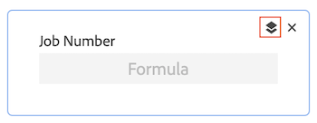
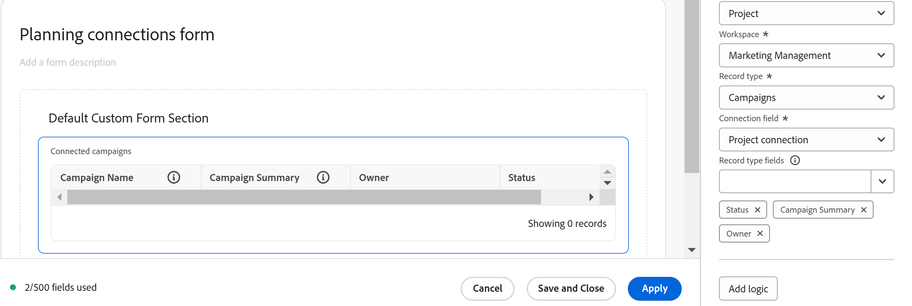

# Creare un modulo personalizzato

<!-- Audited: 6/2025 -->

{{preview-fast-release-general}}

Puoi progettare un modulo personalizzato con il designer dei moduli di Adobe Workfront. Puoi allegare moduli personalizzati a diversi oggetti di Workfront per acquisire dati su tali oggetti.

## Requisiti di accesso

+++ Espandi per visualizzare i requisiti di accesso per la funzionalità descritta in questo articolo.

<table style="table-layout:auto"> 
 <col> 
 <col> 
 <tbody> 
  <tr> 
   <td>Pacchetto Adobe Workfront</td> 
   <td> 
Per creare moduli personalizzati per ruoli, schede di valutazione e assegnazioni: Ultimate del flusso di lavoro

      
Per creare moduli personalizzati per tutti gli altri oggetti supportati: qualsiasi pacchetto Workfront o Workflow
 </td> 
  </tr>  
  <tr> 
   <td>Licenza di Adobe Workfront</td> 
   <td>
Standard

       
Piano
</td>
  </tr> 
  <tr> 
   <td>Configurazioni del livello di accesso</td> 
   <td>Accesso amministrativo ai moduli personalizzati</td> 
  </tr>  
 </tbody> 
</table>

Per informazioni, consulta [Requisiti di accesso nella documentazione di Workfront](/help/quicksilver/administration-and-setup/add-users/access-levels-and-object-permissions/access-level-requirements-in-documentation.md).

+++

## Iniziare a progettare un modulo personalizzato

{{step-1-to-setup}}

1. Nel pannello a sinistra, fai clic su **Moduli personalizzati**, quindi seleziona **Moduli**.

1. Fai clic su **Nuovo modulo personalizzato.**
1. Seleziona i tipi di oggetto a cui desideri allegare il modulo personalizzato, quindi fai clic su **Continua**.

Immagine di esempio nell’ambiente di anteprima:

Immagine di esempio nell’ambiente di produzione:

+++ Espandere per visualizzare l&#39;elenco degli oggetti che supportano i moduli personalizzati.

* Progetto
* Attività
* Problema/Richiesta
* Portfolio
* Documento
* Programma
* Spesa
* Utente
* Azienda
* Iterazione
* Record della fatturazione
* Gruppo
* Team

Se ti trovi nel pacchetto Workflow Ultimate, puoi anche creare moduli personalizzati per questi oggetti:

* Mansione
* Scheda tariffa
* Assegnazione

+++

1. Nell’area **Aggiungi nome modulo** digita il titolo del modulo personalizzato.
1. (Facoltativo) Se si desidera aggiungere altri tipi di oggetto al modulo in modo che possa essere associato a più oggetti, fare clic su **Tipi di oggetto** nell&#39;intestazione del progettista del modulo. Selezionare i tipi di oggetto che si desidera aggiungere e deselezionare tutti i tipi di oggetto che si desidera eliminare dal modulo.
1. (Facoltativo) Se desideri aggiungere altri tipi di oggetto al modulo in modo che possa essere associato più oggetti, fai clic sull’icona **Aggiungi**  accanto a **Tipi di oggetto**, quindi seleziona il tipo desiderato nel menu che viene visualizzato. Puoi ripetere questa operazione per aggiungere tutti i tipi di oggetto desiderati.

   Dopo aver aggiunto più oggetti al modulo, puoi fare clic sulla X su un tipo di oggetto per eliminarlo dal modulo.

   >[!CAUTION]
   >
   >L’eliminazione di un modulo personalizzato comporta anche l’eliminazione di tutti i dati personalizzati degli oggetti ad esso associati. I dati eliminati non possono essere eliminati. In alternativa, puoi disattivare un modulo personalizzato che non utilizzi più, in modo da conservare tutti i dati storici associati.
   >
   >Per ulteriori informazioni, consulta [Aggiungere o eliminare tipi di oggetto da un modulo personalizzato esistente](/help/quicksilver/administration-and-setup/customize-workfront/create-manage-custom-forms/form-designer/manage-a-form/add-or-remove-objects-from-a-form.md) e [Disattivare o riattivare un modulo personalizzato](/help/quicksilver/administration-and-setup/customize-workfront/create-manage-custom-forms/form-designer/manage-a-form/activate-deactivate-form.md).

1. Successivamente, puoi iniziare ad aggiungere campi al modulo personalizzato. Per maggiori informazioni, consulta le seguenti sezioni:
   * [Riutilizzare un campo o un widget esistente già utilizzato in un altro modulo personalizzato](#reuse-an-existing-field-or-widget-already-used-in-another-custom-form)
   * [Note sui nomi e sulle etichette dei campi](#notes-on-field-names-and-labels)
   * [Aggiungere campi di testo](#add-text-fields)
   * [Aggiungere campi calcolati](#add-calculated-fields)
   * [Aggiungere pulsanti di scelta, gruppi di caselle di controllo e menu a discesa](#add-radio-buttons-checkbox-groups-and-drop-downs)
   * [Aggiungere campi di digitazione e date](#add-typeahead-and-date-fields)
   * [Aggiungere campi di ricerca esterni](#add-external-lookup-fields)
   * [Aggiungere immagini, PDF e video](#add-images-pdfs-and-videos)
   * [Aggiungere campi nativi Workfront](#add-workfront-native-fields)
   * [Aggiungere file Adobe XD](#add-adobe-xd-files)
   * [Aggiungere campi per pianificare una connessione](#add-planning-connection-fields)

## Aggiungere campi nuovi o esistenti al modulo personalizzato

Durante la progettazione di un modulo personalizzato, puoi utilizzare campi nuovi o esistenti.

I moduli personalizzati sono limitati a 500 campi. Un contatore in basso a sinistra mostra il numero di campi utilizzati nel modulo ed è sempre visibile durante lo scorrimento all’interno del designer dei moduli.

### Riutilizzare un campo o un widget esistente già utilizzato in un altro modulo personalizzato

1. Nella parte superiore a sinistra dello schermo, fai clic su **Libreria campi**.

1. Trascina il campo o il widget desiderato nell’area di lavoro. Ripeti questo passaggio per aggiungere altri campi o widget.

   >[!NOTE]
   >
   >In un singolo modulo personalizzato puoi aggiungere fino a 500 campi. Tuttavia, se in un modulo sono presenti più di 100 campi, potrebbe verificarsi un calo delle prestazioni a seconda della complessità.
   >
   >
   >Esempi di moduli complessi includono moduli con parametri a cascata, campi di dati personalizzati calcolati e opzioni con più valori in un singolo campo.

   >[!NOTE]
   >
   >Contrassegnando un campo esistente come inattivo, lo rende non più disponibile per l&#39;uso negli elementi di reporting e nei moduli personalizzati da quel momento in poi. Se il campo inattivo è attualmente in uso in un rapporto o in un modulo, il campo e i relativi dati storici rimangono invariati.

1. Per salvare le modifiche, fai clic su **Applica** e passa a un’altra sezione per continuare a creare il modulo.

   Oppure

   Fai clic su **Salva e chiudi**.

### Note sui nomi e sulle etichette dei campi {#notes-on-field-names-and-labels}

Le etichette sono disponibili per la maggior parte dei campi. Si tratta di etichette descrittive che vengono visualizzate sopra il campo o il widget nel modulo personalizzato. Puoi modificare le etichette in qualsiasi momento.

>[!NOTE]
>
>Evita di utilizzare caratteri speciali nelle etichette in quanto non vengono visualizzati correttamente nei rapporti.

Per ciascun campo è richiesto un nome. Questo nome indica il modo in cui il sistema identifica il campo personalizzato quando viene aggiunto a varie aree di Workfront, ad esempio nei rapporti, nella Home e nelle interazioni API. Quando configuri il campo o il widget per la prima volta e digiti l’etichetta, il campo Nome si popola automaticamente in modo che corrisponda ad essa. I campi Etichetta e Nome non sono sincronizzati. Questo ti permette di modificare l’etichetta visualizzata dagli utenti senza dover cambiare il nome riconosciuto dal sistema.

Ciascun nome di campo personalizzato deve essere univoco nell’istanza Workfront della tua organizzazione. In questo modo, puoi riutilizzarne uno che è già stato creato per un altro modulo personalizzato.

>[!NOTE]
>
>Sebbene sia possibile farlo, è consigliabile non modificare il nome dopo che tu o altri utenti avete iniziato a utilizzare il modulo personalizzato in Workfront. Se lo facessi, il sistema non riconoscerebbe più il campo personalizzato nei punti di riferimento in altre aree di Workfront.
>Ad esempio, se aggiungi il campo personalizzato a un rapporto e in seguito ne cambi il nome, Workfront non lo riconoscerà all’interno del rapporto che smetterà di funzionare correttamente finché non aggiungerai nuovamente il campo utilizzando il nuovo nome.
>
>È consigliabile non digitare un nome già utilizzato per i campi incorporati di Workfront.
>
>È consigliabile non utilizzare il punto nel nome del campo personalizzato per evitare errori durante l’utilizzo del campo in aree diverse di Workfront.

Nelle etichette e nei nomi dei campi personalizzati non sono supportati i caratteri speciali seguenti.

* \t
* \n
* \r
* \f
* `[`
* `]`
* (
* )
* :
* `{`
* `}`

### Aggiungere campi di testo

In un modulo personalizzato puoi aggiungere diversi campi di testo.

+++ Espandi per visualizzare le descrizioni dei campi di testo disponibili.

* **Campo di testo su riga singola**: consente agli utenti di digitare una singola riga di testo nel campo.
* **Campo paragrafo**: consente agli utenti di digitare più righe di testo nel campo.
* **Testo formattato**: consente agli utenti di digitare più righe di testo nel campo e di formattare il testo con grassetto, corsivo, sottolineatura, punti elenco, numerazione, pedice e apice, collegamenti ipertestuali, virgolette, intestazioni e tabelle. Un limite di caratteri di 15.000 fornisce uno spazio grande per il testo e la formattazione.

  Il tipo di campo Rich text sta sostituendo il tipo di campo Testo con formattazione. È possibile convertire rapidamente il testo esistente con campi di formattazione in testo RTF facendo clic sul pulsante **Converti in testo RTF** nelle opzioni di campo a destra.

* **Campo di testo con formattazione**: consente agli utenti di digitare più righe di testo nel campo e di formattare il testo con grassetto, corsivo, sottolineatura, elenchi puntati, numerazione, collegamenti ipertestuali e citazioni. Il limite di 15.000 caratteri consente di inserire una ampia quantità di testo e di applicare diverse formattazioni.

  Questo tipo di campo personalizzato non è supportato nei filtri di elenchi e rapporti.

  Per informazioni sull’accesso a questo campo tramite l’API, consulta [Archiviazione di campi formattati nell’API](/help/quicksilver/administration-and-setup/customize-workfront/create-manage-custom-forms/rich-text-field-storage-in-the-api.md).

  >[!NOTE]
  >
  >I campi di testo con formattazione non sono disponibili per le app Workfront per dispositivi mobili (saranno disponibili nelle prossime versioni).

* **Testo descrittivo**: consente di includere istruzioni e collegamenti a pagine esterne a Workfront.

+++

Per aggiungere un campo di testo:

1. Nella scheda **Nuovo campo** sul lato a sinistra dello schermo, individua uno dei campi di testo seguenti e trascinalo in una sezione dell’area di lavoro:

   * Testo su riga singola
   * Paragrafo
   * Testo formattato
   * Testo con formattazione
   * Testo descrittivo

   

1. Sul lato a destra della schermata, configura le opzioni disponibili per il tipo di campo personalizzato che stai aggiungendo:

   <table>
    <tr>
    <td>Input in</td>
    <td>Descrizione</td>
    <td>Disponibile per </td>
    </tr>
    <tr>
    <td>Dimensioni</td>
    <td>
(Facoltativo) Cambia le dimensioni dei campi di testo nel modulo.

   </td>
    <td><ul>
    <li>Testo su riga singola</li>
    <li>Paragrafo</li>
    <li>Testo formattato</li>
    <li>Testo con formattazione</li>
    <li>Testo descrittivo</li>
    </ul></td>
    </tr>
    <tr>
    <td>Etichetta</td>
    <td>
(Obbligatorio) Digita un’etichetta descrittiva da visualizzare sopra il campo. Puoi modificare le etichette in qualsiasi momento.

    
<b>Importante</b>: evita di utilizzare caratteri speciali nelle etichette in quanto non vengono visualizzati correttamente nei rapporti. Per ulteriori informazioni, consulta <a href="design-a-form.md#notes-on-field-names-and-labels">Note sui nomi e le etichette dei campi</a>.
</td>
    <td><ul>
    <li>Testo su riga singola</li>
    <li>Paragrafo</li>
    <li>Testo formattato</li>
    <li>Testo con formattazione</li>
    </ul></td>
    </tr>
    <tr>
     <td>Nome</td>
    <td>
(Obbligatorio) Questo nome indica il modo in cui il sistema identifica il campo. Quando configuri il widget per la prima volta e digiti l’etichetta, il campo Nome si popola automaticamente in modo che corrisponda ad essa. I campi Etichetta e Nome non sono sincronizzati. Questo ti permette di modificare l’etichetta visualizzata dagli utenti senza dover cambiare il nome riconosciuto dal sistema.

    
Per ulteriori informazioni, consulta <a href="design-a-form.md#notes-on-field-names-and-labels">Note sui nomi e le etichette dei campi</a>.

    </td>
    <td><ul>
    <li>Testo su riga singola</li>
    <li>Paragrafo</li>
    <li>Testo formattato</li>
    <li>Testo con formattazione</li>
    <li>Testo descrittivo</li>
    </ul></td>
    </tr>
    <tr>
    <td>Istruzioni</td>
    <td>Digita eventuali informazioni aggiuntive sul campo. Quando gli utenti compilano il modulo personalizzato, possono passare il puntatore sull’icona a forma di punto interrogativo per visualizzare una descrizione comando contenente le informazioni digitate qui.
    
    </td>
    <td><ul>
    <li>Testo su riga singola</li>
    <li>Paragrafo</li>
    <li>Testo formattato</li>
    <li>Testo con formattazione</li>
    </ul></td>
    </tr>
    <tr>
    <td>Formato</td>
    <td>
Seleziona il tipo di dati che verranno acquisiti nel campo personalizzato.
 
<b>Note</b>:   
    <ul> 
    <li>Questo campo non può essere modificato dopo il salvataggio del modulo. Se intendi utilizzare il campo in calcoli matematici, assicurati di selezionare il formato Numero o Valuta.</li> 
    <li>Quando selezioni Numero o Valuta, il sistema tronca automaticamente i numeri che iniziano con 0.</li>
    <li>Il limite di caratteri per i campi Numero è 16. Inoltre puoi utilizzare un campo Testo per inserire numeri ed evitare il limite.</li>
     </ul>
</td> </td>
    <td><ul>
    <li>Testo su riga singola</li>
    <li>Paragrafo</li>
    </ul></td>
    </tr>
    <tr>
      <td>Tipo di autorizzazione finanziaria</td>
      <td>
Selezionare il tipo di autorizzazione per la contabilità che gli utenti devono avere prima di poter visualizzare o modificare questo campo personalizzato. Qualsiasi formato è consentito per i campi calcolati.

      <ul span class="preview">
      <li>
<strong>Nessuna autorizzazione richiesta:</strong> Tutti gli utenti possono visualizzare questo campo
</li>
      <li>
<strong>Generale:</strong> gli utenti devono disporre delle autorizzazioni per modificare o visualizzare le informazioni di contabilità generale
</li>
      <li>
<strong>Fatturazione:</strong> gli utenti devono disporre delle autorizzazioni per modificare o visualizzare le tariffe di fatturazione
</li>
      <li>
<strong>Costo:</strong> gli utenti devono disporre delle autorizzazioni per modificare o visualizzare le tariffe
</li>
      </ul>
      
Per ulteriori informazioni, vedere <a href="/help/quicksilver/administration-and-setup/customize-workfront/create-manage-custom-forms/form-designer/design-a-form/restrict-access-to-financial-data.md">Limitare l'accesso ai dati finanziari nei campi personalizzati</a>.

      </td>
      <td><ul span class="preview">
       <li>Testo su riga singola</li>
       <li>Paragrafo</li>
       </ul></td>
    </tr>
    <tr>
    <td>Tipo di visualizzazione</td>
    <td>Passa da un campo di testo su riga singola a un campo di testo paragrafo e viceversa.</td>
    <td><ul>
    <li>Testo su riga singola</li>
    <li>Paragrafo</li>
    </ul></td>
    </tr>
    <tr>
    <td>Collegamento ipertestuale</td>
    <td> Se desideri applicare un collegamento ipertestuale al testo descrittivo digitato, aggiungilo qui. Il testo descrittivo viene visualizzato come collegamento sugli oggetti a cui è associato il modulo.</td>
    <td><ul><li>Testo descrittivo</li></ul></td>
    </tr>
    <tr>
     <td>Attivo</td>
     <td>
Questa opzione è disabilitata per impostazione predefinita.

Quando imposti un campo come Inattivo, questo viene escluso dai rapporti, dai filtri e dalle viste e non è più disponibile nella libreria dei campi dei moduli personalizzati.
</td>
     <td><ul>
     <li>Testo su riga singola</li>
     <li>Paragrafo</li>
     <li>Testo formattato</li>
     <li>Testo con formattazione</li>
     <li>Testo descrittivo</li></ul></td>
    </tr>
    <tr> 
      <td>Rendi il campo obbligatorio</td>
      <td>
Seleziona questa opzione se desideri che il campo sia obbligatorio per consentire all’utente di completare il modulo personalizzato.
</td>
    <td><ul>
    <li>Testo su riga singola</li>
    <li>Paragrafo</li>
    <li>Testo formattato</li>
    <li>Testo con formattazione</li>
    </ul></td> 
    </tr> 
   </table>

1. (Facoltativo) Ripeti il passaggio precedente per aggiungere altri campi o widget.

   Oppure

   Per copiare un campo, passa il puntatore su un campo e fai clic sull’icona Copia.

   

1. Per salvare le modifiche, fai clic su **Applica** e passa a un’altra sezione per continuare a creare il modulo.

   Oppure

   Fai clic su **Salva e chiudi**.

### Aggiungere campi calcolati

In un modulo personalizzato, quando associato a un oggetto, puoi aggiungere un campo personalizzato calcolato che utilizza i dati esistenti per generarne dei nuovi.

Per aggiungere un campo calcolato, consulta [Aggiungere campi calcolati con il designer dei moduli](/help/quicksilver/administration-and-setup/customize-workfront/create-manage-custom-forms/form-designer/design-a-form/add-a-calculated-field.md).

### Aggiungere pulsanti di scelta, gruppi di caselle di controllo e menu a discesa

A un modulo personalizzato, puoi aggiungere pulsanti di scelta, gruppi di caselle di controllo, menu a discesa e menu a discesa a selezione multipla.

+++ Espandi per visualizzare la descrizione dei campi disponibili.

* **Pulsanti di scelta**: richiede agli utenti di selezionare una sola opzione.
* **Gruppo di caselle di controllo**: consente agli utenti di selezionare più opzioni.
* **Menu a discesa a selezione singola**: fornisce un elenco di opzioni a discesa.
* **Menu a discesa a selezione multipla**: consente agli utenti di selezionare più opzioni da un elenco a discesa.

+++

>[!NOTE]
>
>I campi che consentono selezioni multiple, come i gruppo di caselle di controllo e il menu a discesa a selezione multipla, sono difficili da rappresentare nei grafici e da raggruppare nei rapporti. Per semplificare la creazione di grafici e il raggruppamento nei rapporti, puoi creare campi separati per ciascuna scelta, ad esempio un campo di testo a riga singola.

Per aggiungere pulsanti di scelta, gruppi di caselle di controllo e menu a discesa:

1. Nella scheda **Nuovo campo** sul lato a sinistra dello schermo, individua uno dei campi seguenti e trascinalo in una sezione dell’area di lavoro:

   * Pulsanti di scelta
   * Gruppo di caselle di controllo
   * Elenco a discesa a selezione singola
   * Elenco a discesa a selezione multipla

   

1. Sul lato a destra della schermata, configura le opzioni disponibili per il tipo di campo personalizzato che stai aggiungendo:

   <table style="table-layout:auto"> 
    <tbody> 
    <tr>
    <td>Input in</td>
    <td>Descrizione</td>
    <td>Disponibile per </td>
    </tr>
    <tr> 
     <td role="rowheader">Etichetta</td> 
     <td> 
(Obbligatorio) Digita un’etichetta descrittiva da visualizzare sopra il campo personalizzato. Puoi modificare le etichette in qualsiasi momento.
 
<b>Importante</b>: evita di utilizzare caratteri speciali nelle etichette in quanto non vengono visualizzati correttamente nei rapporti. Per ulteriori informazioni, consulta <a href="design-a-form.md#notes-on-field-names-and-labels">Note sui nomi e le etichette dei campi</a>.
 </td> 
     <td><ul>
    <li>Pulsanti di scelta</li>
    <li>Gruppo di caselle di controllo</li>
    <li>Elenco a discesa a selezione singola</li>
    <li>Elenco a discesa a selezione multipla</li>
    </ul></td>
     </tr> 
     <tr> 
    <td role="rowheader">Nome</td> 
     <td> 
(Obbligatorio) Questo nome indica il modo in cui il sistema identifica il campo. Quando configuri il widget per la prima volta e digiti l’etichetta, il campo Nome si popola automaticamente in modo che corrisponda ad essa. I campi Etichetta e Nome non sono sincronizzati. Questo ti permette di modificare l’etichetta visualizzata dagli utenti senza dover cambiare il nome riconosciuto dal sistema.
 
    
Per ulteriori informazioni, consulta <a href="design-a-form.md#notes-on-field-names-and-labels">Note sui nomi e le etichette dei campi</a>.
 </td>
     <td><ul>
    <li>Pulsanti di scelta</li>
    <li>Gruppo di caselle di controllo</li>
    <li>Elenco a discesa a selezione singola</li>
    <li>Elenco a discesa a selezione multipla</li>
    </ul></td>
    </tr> 
    <tr> 
    <td role="rowheader">Istruzioni</td> 
    <td> 
Inserisci eventuali informazioni aggiuntive sul campo personalizzato. Quando gli utenti compilano il modulo personalizzato, possono passare il puntatore sull’icona a forma di punto interrogativo per visualizzare una descrizione comando contenente le informazioni digitate qui.
 
    
   

    </td> 
    <td><ul>
    <li>Pulsanti di scelta</li>
    <li>Gruppo di caselle di controllo</li>
    <li>Elenco a discesa a selezione singola</li>
    <li>Elenco a discesa a selezione multipla</li>
    </ul></td>
    </tr> 
    <tr> 
    <td role="rowheader">Formato</td> 
    <td> 
Seleziona il tipo di dati che verranno acquisiti nel campo personalizzato.
 
<b>Note</b>:   
     <ul> 
    <li>Questo campo non può essere modificato dopo il salvataggio del modulo. Se intendi utilizzare il campo in calcoli matematici, assicurati di selezionare il formato Numero o Valuta. </li> 
    <li>Quando selezioni Numero o Valuta, il sistema tronca automaticamente i numeri che iniziano con 0.</li>
    <li>Il limite di caratteri per i campi Numero è 16. Inoltre puoi utilizzare un campo Testo per inserire numeri ed evitare il limite.</li>
     </ul>
</td> 
     <td><ul>
    <li>Pulsanti di scelta</li>
    <li>Gruppo di caselle di controllo</li>
    <li>Elenco a discesa a selezione singola</li>
    <li>Elenco a discesa a selezione multipla</li>
    </ul></td>
    </tr> 
    <tr>
      <td>Tipo di autorizzazione finanziaria</td>
      <td>
Selezionare il tipo di autorizzazione per la contabilità che gli utenti devono avere prima di poter visualizzare o modificare questo campo personalizzato. Qualsiasi formato è consentito per i campi calcolati.

      <ul span class="preview">
      <li>
<strong>Nessuna autorizzazione richiesta:</strong> Tutti gli utenti possono visualizzare questo campo
</li>
      <li>
<strong>Generale:</strong> gli utenti devono disporre delle autorizzazioni per modificare o visualizzare le informazioni di contabilità generale
</li>
      <li>
<strong>Fatturazione:</strong> gli utenti devono disporre delle autorizzazioni per modificare o visualizzare le tariffe di fatturazione
</li>
      <li>
<strong>Costo:</strong> gli utenti devono disporre delle autorizzazioni per modificare o visualizzare le tariffe
</li>
      </ul>
      
Per ulteriori informazioni, vedere <a href="/help/quicksilver/administration-and-setup/customize-workfront/create-manage-custom-forms/form-designer/design-a-form/restrict-access-to-financial-data.md">Limitare l'accesso ai dati finanziari nei campi personalizzati</a>.

      </td>
      <td><ul span class="preview">
       <li>Pulsanti di scelta</li>
       <li>Gruppo di caselle di controllo</li>
       <li>Elenco a discesa a selezione singola</li>
       <li>Elenco a discesa a selezione multipla</li>
       </ul></td>
    </tr>
    <tr> 
     <td role="rowheader">Tipo di visualizzazione</td> 
    <td>Passa da un pulsante di scelta all’altro, da un gruppo di caselle di controllo all’’altro, da un elenco a discesa a selezione singola o da un elenco a discesa a selezione multipla per il campo.</td> 
    <td><ul>
    <li>Pulsanti di scelta</li>
    <li>Gruppo di caselle di controllo</li>
    <li>Elenco a discesa a selezione singola</li>
    <li>Elenco a discesa a selezione multipla</li>
    </ul></td>
    </tr> 
    <td role="rowheader">Scelte </td> 
    <td> 
    
Seleziona una delle opzioni seguenti:
 
    <ul> 
    <li><strong>Mostra valori</strong>: mostra i valori di ciascuna opzione nel campo. L’etichetta di ciascuna opzione viene mostrata per impostazione predefinita.</li>
   <li><strong>Ordina scelte dalla A alla Z</strong>: ordina in ordine alfabetico le scelte aggiunte nel campo.</li>
    </ul>
     
Per ciascuna scelta aggiunta per l’utente, fai clic sull’icona a forma di ingranaggio , quindi seleziona una delle opzioni seguenti:
 
    <ul> 
    <li><strong>Seleziona per impostazione predefinita</strong>: seleziona la scelta per impostazione predefinita nel campo.</li> 
    <li> 
<strong>Nascondi scelta</strong>: nascondi la scelta nel campo. Le scelte nascoste rimangono accessibili nei rapporti.
 </li> 
    <li> 
<strong>Rimuovi scelta</strong>: rimuovi la scelta dal campo.
 
<b>Avvertenza</b>: se sono presenti oggetti correnti che utilizzano questa scelta, non rimuoverla dal campo. Rimuovendola, i dati storici andranno persi. In alternativa, seleziona l’opzione per nasconderla per impedire agli utenti di selezionarla in futuro.
 </li> 
    </ul>   
    
<b>Nota:</b> non esiste alcun limite al numero di scelte selezionabili. 
    
    </td> 
    <td><ul>
    <li>Pulsanti di scelta</li>
    <li>Gruppo di caselle di controllo</li>
    <li>Elenco a discesa a selezione singola</li>
    <li>Elenco a discesa a selezione multipla</li>
    </ul>
    </td>
     </tr>
    <tr>
     <td>Attivo</td>
     <td>
Questa opzione è disabilitata per impostazione predefinita.

Quando imposti un campo come Inattivo, questo viene escluso dai rapporti, dai filtri e dalle viste e non è più disponibile nella libreria dei campi dei moduli personalizzati.
</td>
     <td><ul>
     <li>Pulsanti di scelta</li>
     <li>Gruppo di caselle di controllo</li>
     <li>Elenco a discesa a selezione singola</li>
     <li>Elenco a discesa a selezione multipla</li></ul></td>
    </tr>
    <tr> 
    <td role="rowheader">Rendi il campo obbligatorio</td> 
    <td>Seleziona questa opzione se desideri che il campo sia obbligatorio per consentire all’utente di completare il modulo personalizzato. </td> 
    <td><ul>
    <li>Pulsanti di scelta</li>
    <li>Gruppo di caselle di controllo</li>
    <li>Elenco a discesa a selezione singola</li>
    <li>Elenco a discesa a selezione multipla</li>
    </ul></td>
     </tr> 
    <tr> 
    </tbody> 
    </table>

1. (Facoltativo) Ripeti il passaggio precedente per aggiungere altri campi o widget.

   Oppure

   Per copiare un campo, passa il puntatore su un campo e fai clic sull’icona Copia.

   

1. Per salvare le modifiche, fai clic su **Applica** e passa a un’altra sezione per continuare a creare il modulo.

   Oppure

   Fai clic su **Salva e chiudi**.

### Aggiungere campi di digitazione e date

Puoi aggiungere campi di digitazione e campi di date a un modulo personalizzato.

+++ Espandi per visualizzare la descrizione dei campi disponibili.

* **Campo di digitazione**: consente agli utenti di digitare il nome di un oggetto esistente in Workfront. Quando l’utente inizia a digitare, viene visualizzato un elenco di suggerimenti. Questo tipo di campo supporta i seguenti oggetti:
   * Utente
   * Gruppo
   * Mansione
   * Portfolio
   * Programma
   * Progetto
   * Team
   * Modello
   * Azienda
* **Data**: mostra un calendario in cui gli utenti possono selezionare una data e un’ora.

+++

Per aggiungere campi di digitazione e campi di date:

1. Nella scheda **Nuovo campo** sul lato a sinistra dello schermo, individua uno dei campi seguenti e trascinalo in una sezione dell’area di lavoro.

   * Campo di digitazione
   * Data

   

1. Sul lato a destra della schermata, configura le opzioni disponibili per il tipo di campo personalizzato che stai aggiungendo:

   <table style="table-layout:auto"> 
    <tbody> 
     <tr>
    <td>Impostazione campo</td>
    <td>Descrizione</td>
    <td>Disponibile per </td>
    </tr>
     <tr> 
      <td role="rowheader">Etichetta</td> 
      <td> 
(Obbligatorio) Digita un’etichetta descrittiva da visualizzare sopra il campo personalizzato. Puoi modificare le etichette in qualsiasi momento.
 
<b>Importante</b>: evita di utilizzare caratteri speciali nelle etichette in quanto non vengono visualizzati correttamente nei rapporti. Per ulteriori informazioni, consulta <a href="design-a-form.md#notes-on-field-names-and-labels">Note sulle etichette e sui nomi dei campi</a>.
 </td> 
       <td><ul>
    <li>Campo di digitazione</li>
    <li>Data</li>
    </ul></td>
     </tr> 
     <tr> 
      <td role="rowheader">Nome</td> 
      <td> 
(Obbligatorio) Questo nome indica il modo in cui il sistema identifica il campo. Quando configuri il widget per la prima volta e digiti l’etichetta, il campo Nome si popola automaticamente in modo che corrisponda ad essa. I campi Etichetta e Nome non sono sincronizzati. Questo ti permette di modificare l’etichetta visualizzata dagli utenti senza dover cambiare il nome riconosciuto dal sistema.
 
      
Per ulteriori informazioni, consulta <a href="design-a-form.md#notes-on-field-names-and-labels">Note sulle etichette e sui nomi dei campi</a>.
 </td>
    <td><ul>
    <li>Campo di digitazione</li>
    <li>Data</li>
    </ul></td>
     </tr> 
     <tr> 
      <td role="rowheader">Istruzioni</td> 
      <td> 
Inserisci eventuali informazioni aggiuntive sul campo personalizzato. Quando gli utenti compilano il modulo personalizzato, possono passare il puntatore sull’icona a forma di punto interrogativo per visualizzare una descrizione comando contenente le informazioni digitate qui.
 
      
  

      </td> 
         <td><ul>
    <li>Campo di digitazione</li>
    <li>Data</li>
    </ul></td>
     </tr> 
     <tr> 
      <td role="rowheader">Visualizza ora del giorno</td> 
      <td>Seleziona questa opzione se desideri visualizzare l’ora del giorno insieme alla data nel campo.</td> 
         <td><ul>
    <li>Data</li>
    </ul></td>
     </tr> 
     <tr> 
      <td role="rowheader">Tipo di oggetto di riferimento</td> 
      <td> 
Seleziona il tipo di oggetto da associare al campo.
 
Non puoi modificare il tipo di oggetto per il campo dopo aver fatto clic su <b>Applica</b> o <b>Salva e chiudi</b>.
 
<b>Nota</b>:   
        <ul> 
         <li>Se l’amministratore Workfront ha personalizzato il nome di Portfolio, Programmi o Progetti nell’interfaccia utente di Workfront, in questo elenco a discesa viene visualizzato il nome predefinito di Workfront per l’oggetto e non il nome personalizzato. Se hai bisogno di assistenza, rivolgiti al tuo amministratore Workfront. </li> 
         <li>Nelle app Workfront per dispositivi mobili iOS e Android sono supportati i seguenti tipi di oggetti: Utente, Azienda, Gruppo, Mansione, Portfolio, Programma, Progetto e Modello.</li> 
        </ul> 
 </td> 
         <td><ul>
    <li>Campo di digitazione</li>
    </ul></td>
     </tr>
     <tr>
      <td role="rowheader">Aggiungi filtro</td>
      <td>
Aggiungi un filtro per un tipo di oggetto per limitare gli oggetti che gli utenti possono scegliere quando utilizzano il campo. 
 
Ad esempio, puoi limitare un campo in modo che i nomi utente possano essere selezionati solo se soddisfano i seguenti criteri:
 
       <ul> 
        <li>Appartengono a uno o più gruppi specificati.</li> 
        <li>Sono associati a un ruolo o a una mansione specifica.</li> 
        <li>Appartengono allo stesso gruppo della persona che utilizza il campo.</li> 
       </ul>
       
È necessario definire il filtro per il tipo di oggetto selezionato utilizzando la sintassi della modalità testo. Per informazioni sulla creazione di un filtro utilizzando la modalità testo, consulta <a href="/help/quicksilver/reports-and-dashboards/reports/text-mode/edit-text-mode-in-filter.md">Modifica un filtro in modalità testo</a>.

       
<b>Suggerimento:</b> puoi creare un rapporto per testare il filtro prima di aggiungerlo direttamente al campo di digitazione. Questo ti consentirà di verificare che il filtro restituisca gli oggetti corretti. Quindi puoi passare alla modalità testo nel rapporto, copiare l’istruzione della modalità testo e aggiungerla al filtro del campo di digitazione.

       
<b>Nota</b>:
       <ul> 
        <li>Se stai modificando un modulo personalizzato esistente, l’aggiunta di un filtro a un campo di digitazione non rimuove gli oggetti (al di fuori dell’ambito del filtro) che gli utenti hanno già aggiunto utilizzando quel campo. </li> 
        <li>Questo filtro non è disponibile sui dispositivi mobili. Se utilizzi il filtro per un campo di digitazione, il campo verrà visualizzato sui dispositivi mobili degli utenti non interessati dal filtro.</li> 
        </ul>
</td> 
      <td>
       <ul>
       <li>Campo di digitazione</li>
       </ul>
      </td>
     </tr>
     <tr>
      <td>Attivo</td>
      <td>
Questa opzione è disabilitata per impostazione predefinita.

Quando imposti un campo come Inattivo, questo viene escluso dai rapporti, dai filtri e dalle viste e non è più disponibile nella libreria dei campi dei moduli personalizzati.
</td>
      <td><ul>
      <li>Campo di digitazione</li>
      <li>Data</li></ul></td>
     </tr>
     <tr> 
      <td role="rowheader">Rendi il campo obbligatorio</td> 
      <td>Seleziona questa opzione se desideri che il campo sia obbligatorio per consentire all’utente di completare il modulo personalizzato. </td> 
       <td><ul>
    <li>Campo di digitazione</li>
    <li>Data</li>
    </ul></td>
     </tr> 
    </tbody> 
   </table>

1. (Facoltativo) Ripeti il passaggio precedente per aggiungere altri campi o widget.

   Oppure

   Per copiare un campo, passa il puntatore su un campo e fai clic sull’icona Copia.

   

1. Per salvare le modifiche, fai clic su **Applica** e passa a un’altra sezione per continuare a creare il modulo.

   Oppure

   Fai clic su **Salva e chiudi**.

### Aggiungere campi di ricerca esterni

Un campo di ricerca esterna richiama un’API esterna e restituisce i valori come opzioni in un campo a discesa. Gli utenti che utilizzano l’oggetto a cui è associato il modulo personalizzato possono selezionare una o più di queste opzioni dall’elenco a discesa, a seconda che il campo di ricerca esterna sia a selezione singola o multipla. I campi di ricerca esterna sono disponibili anche negli elenchi e nei rapporti.

Per esempi sull’utilizzo del campo di ricerca esterna per chiamare la stessa istanza di Workfront o un’API pubblica, consulta [Esempi di campo di ricerca esterna in un modulo personalizzato](/help/quicksilver/administration-and-setup/customize-workfront/create-manage-custom-forms/form-designer/design-a-form/external-lookup-examples.md).

>[!NOTE]
>
>* I campi di ricerca esterna non sono supportati nel plug-in di Outlook.
>* I campi di ricerca esterna non sono disponibili negli elenchi quando il campo dipende da un altro campo.

Per aggiungere una ricerca esterna:

1. Nella scheda **Nuovo campo** sul lato a sinistra dello schermo, individua **Ricerca esterna** o **Ricerca esterna a selezione multipla** e trascinala in una sezione dell’area di lavoro.
1. Sul lato a destra dello schermo, configura le opzioni per il campo personalizzato:

   <table style="table-layout:auto"> 
    <col> 
    <col> 
    <tbody> 
     <tr> 
      <td role="rowheader">Etichetta</td> 
      <td> 
(Obbligatorio) Digita un’etichetta descrittiva da visualizzare sopra il campo personalizzato. Puoi modificare le etichette in qualsiasi momento.
 
<b>Importante</b>: evita di utilizzare caratteri speciali nelle etichette in quanto non vengono visualizzati correttamente nei rapporti. Per ulteriori informazioni, consulta <a href="design-a-form.md#notes-on-field-names-and-labels">Note sulle etichette e sui nomi dei campi</a>.
 </td> 
     </tr> 
     <tr> 
      <td role="rowheader">Nome</td> 
      <td> 
(Obbligatorio) Questo nome indica il modo in cui il sistema identifica il campo. Quando configuri il widget per la prima volta e digiti l’etichetta, il campo Nome si popola automaticamente in modo che corrisponda ad essa. Tuttavia, i campi Etichetta e Nome non sono sincronizzati; questo ti permette di modificare l’etichetta visualizzata dagli utenti senza dover cambiare il nome riconosciuto dal sistema.

      
Per ulteriori informazioni, consulta <a href="design-a-form.md#notes-on-field-names-and-labels">Note su etichette e nomi dei campi</a>.
 </td>
     </tr> 
      <td role="rowheader">Istruzioni</td> 
      <td> 
Inserisci eventuali informazioni aggiuntive sul campo personalizzato. Quando gli utenti compilano il modulo personalizzato, possono passare il puntatore sull’icona a forma di punto interrogativo per visualizzare una descrizione comando contenente le informazioni digitate qui.
 </td> 
     </tr> 
     <tr> 
      <td role="rowheader">Formato</td>
      <td>
Seleziona il tipo di dati che verranno acquisiti nel campo personalizzato.

      
<strong>Nota:</strong>

      <ul><li>Puoi modificare il tipo di formato dopo il salvataggio del modulo, con unico limite: tutti i valori esistenti negli oggetti devono poter essere convertiti al nuovo tipo. Ad esempio, se il tipo di formato è Testo e un oggetto contiene il valore “abc”, non potrai convertire il campo e visualizzerai un errore che indica l’impossibilità del sistema di convertire “abc” in numero/valuta. Per utilizzare il campo nei calcoli matematici, assicurati di selezionare un formato Numero o Valuta.</li>
      <li>Quando selezioni Numero o Valuta, il sistema tronca automaticamente i numeri che iniziano con 0.</li>
      <li>Il limite di caratteri per i campi Numero è 16. Inoltre puoi utilizzare un campo Testo per inserire numeri ed evitare il limite.</li>
      </ul></td>
     </tr> 
     <tr>
      <td>Tipo di autorizzazione finanziaria</td>
      <td>
Selezionare il tipo di autorizzazione per la contabilità che gli utenti devono avere prima di poter visualizzare o modificare questo campo personalizzato. Qualsiasi formato è consentito per i campi calcolati.

      <ul span class="preview">
      <li>
<strong>Nessuna autorizzazione richiesta:</strong> Tutti gli utenti possono visualizzare questo campo
</li>
      <li>
<strong>Generale:</strong> gli utenti devono disporre delle autorizzazioni per modificare o visualizzare le informazioni di contabilità generale
</li>
      <li>
<strong>Fatturazione:</strong> gli utenti devono disporre delle autorizzazioni per modificare o visualizzare le tariffe di fatturazione
</li>
      <li>
<strong>Costo:</strong> gli utenti devono disporre delle autorizzazioni per modificare o visualizzare le tariffe
</li>
      </ul>
      
Per ulteriori informazioni, vedere <a href="/help/quicksilver/administration-and-setup/customize-workfront/create-manage-custom-forms/form-designer/design-a-form/restrict-access-to-financial-data.md">Limitare l'accesso ai dati finanziari nei campi personalizzati</a>.

      </td>
     </tr>
     <tr> 
      <td role="rowheader">URL di base dell’API</td> 
      <td>
Digita o incolla l’URL per l’API.

L’URL dell’API deve restituire il contenuto JSON delle opzioni che desideri visualizzare nel menu a discesa. Puoi utilizzare il campo Percorso JSON per selezionare i valori specifici dal JSON restituito da utilizzare come opzioni del menu a discesa.

Quando inserisci l’URL dell’API, puoi facoltativamente passare i seguenti valori nell’URL:

      <ul>
      <li>$$HOST: rappresenta l’host corrente di Workfront e può essere utilizzato per effettuare/cercare chiamate API verso l’API di Workfront. Quando si utilizza questo carattere jolly, l’autenticazione viene gestita automaticamente e gli utenti non devono inviare intestazioni di autenticazione. Gli utenti, ad esempio, possono cercare le attività utilizzando l’URL di base <code>$$HOST/attask/api/task/search</code>; questo consentirà di effettuare la ricerca e di selezionare i valori da un elenco di attività restituito.</li>
      <li>
$$QUERY: rappresenta il testo di ricerca digitato dall’utente finale nel campo e ti consente di implementare il filtro delle query per i tuoi utenti. L’utente cercherà il valore nel menu a discesa.

      
Se l’API a cui stai facendo riferimento lo consente, puoi anche includere dei modificatori nella query di ricerca per definire le modalità di esecuzione della ricerca stessa. Ad esempio, puoi utilizzare quanto segue come URL API di base per consentire agli utenti di cercare qualsiasi progetto Workfront contenente testo specifico: <code>$$HOST/attask/api/v15.0/proj/search?name=$$QUERY&name_Mod=contains</code>.

Ulteriori informazioni sui modificatori di ricerca Workfront sono disponibili nella sezione <a href="/help/quicksilver/wf-api/general/api-basics.md">Nozioni di base sulle API</a>.

      
<strong>Nota:</strong> se non utilizzi $$QUERY e l’utente digita del testo nella casella di ricerca, le opzioni già disponibili verranno ridotte. Tuttavia, se utilizzi $$QUERY e l’utente digita qualsiasi carattere, viene eseguita una nuova chiamata di rete all’API. Pertanto, se l’API contiene più di 2000 valori e l’API supporta l’esecuzione di query, puoi utilizzare $$QUERY per effettuare ricerche non solo tra i 2000 valori esistenti, ma dall’API originale con le opzioni ridotte.
</li>
      <li>
{fieldName}: dove fieldName è un campo personalizzato o nativo in Workfront. In questo modo puoi implementare i filtri a cascata per le opzioni a discesa, passando il valore di un campo già selezionato al campo di ricerca esterna per filtrare le opzioni. Ad esempio, il campo Area geografica esiste già nel modulo e stai restringendo un elenco di paesi provenienti dall’API solo a quelli che si trovano in un’area geografica specifica.

      
Per un campo di ricerca esterna che dipende da altri campi (utilizzando la sintassi {fieldName}), le opzioni restituite dall’API sono limitate a quelle che corrispondono a eventuali stringhe o valori inseriti negli altri campi. Questa funzionalità non è supportata negli elenchi e nei rapporti.
</li>
      <li>{referenceObject}.{fieldName}: dove il campo fa parte di un oggetto. Questa sintassi è simile alle espressioni personalizzate. Ad esempio, portfolioID={project}.{portfolioID}</li></ul>
      
<strong>Suggerimento:</strong> rivedi la documentazione dell’API che stai utilizzando per le query specifiche che puoi definire.
</td>
     </tr>
     <tr> 
      <td role="rowheader">Metodo HTTP</td> 
      <td>Seleziona <strong>GET</strong>, <strong>POST</strong> o <strong>PUT</strong> come metodo.</td> 
     </tr>
     <tr> 
      <td role="rowheader">Percorso JSON</td>
      <td>
Inserisci o incolla il percorso JSON per l’API.
 
Questa opzione consente di estrarre i dati dal JSON restituito dall’URL dell’API. Serve come metodo per selezionare quali valori dall’interno del JSON appariranno tra le opzioni del menu a discesa.

Ad esempio, se l’URL dell’API restituisce un JSON nel formato seguente, puoi utilizzare “$.data[*].name” per selezionare USA e Canada come opzioni del menu a discesa: 
      <pre>
      {
       dati: {
         { name: “USA”},
         { name: “Canada”}
       }
      }
      </pre>
      

     
Per ulteriori informazioni sul percorso JSON e per assicurarti che la scrittura del percorso JSON sia corretta, visita il sito <a href="https://jsonpath.com/">https://jsonpath.com/</a>.
</td>
     </tr>
     <tr> 
      <td role="rowheader">Intestazioni</td>
      <td>
Fai clic su <strong>Aggiungi intestazione</strong>, quindi digita o incolla la coppia chiave-valore richiesta per l’autenticazione con l’API.

<strong>Nota:</strong> i campi Intestazione non sono un luogo sicuro in cui memorizzare le credenziali. Presta attenzione a ciò che inserisci e salvi.
</td>
     </tr>
     <tr> 
      <td role="rowheader">Elenco a discesa a selezione multipla</td>
      <td>
Seleziona questa opzione per consentire all’utente di selezionare più di un valore nel menu a discesa.
</td>
     </tr>
     <tr>
      <td>Attivo</td>
      <td>
Questa opzione è disabilitata per impostazione predefinita.

Quando imposti un campo come Inattivo, questo viene escluso dai rapporti, dai filtri e dalle viste e non è più disponibile nella libreria dei campi dei moduli personalizzati.
</td>
     </tr>
     <tr> 
      <td role="rowheader">Rendi il campo obbligatorio</td>
      <td>
Seleziona questa opzione se desideri che il campo sia obbligatorio per consentire all’utente di completare il modulo personalizzato.
</td>
     </tr>       
    </tbody>
   </table>

1. Per salvare le modifiche, fai clic su **Applica** e passa a un’altra sezione per continuare a creare il modulo.

   Oppure

   Fai clic su **Salva e chiudi**.

>[!NOTE]
>
>Gli elementi seguenti rappresentano limitazioni tecniche della chiamata all’API esterna:
>
>* Numero massimo di opzioni: 2000 (vengono visualizzate solo le prime 2000 opzioni univoche del JSON restituito)
>* Timeout: 30 secondi
>* Numero di nuovi tentativi: 3
>* Durata dell’attesa tra nuovi tentativi: 500 ms
>* Stati di risposta previsti: 2xx

### Aggiungere immagini, PDF e video

Puoi aggiungere immagini, PDF e video a un modulo personalizzato. Gli utenti che utilizzano l’oggetto a cui è associato il modulo personalizzato possono visualizzare l’immagine, il PDF o il video solo nelle seguenti aree:

* L’area Dettagli degli oggetti (ad esempio, per un progetto, l’area Dettagli progetto).
* La casella Modifica dell’oggetto, se presenta il nuovo aspetto dell’esperienza Adobe Workfront (ad esempio le caselle Modifica progetto e Modifica attività).

<!--
 Do we need to tell them where they can't see it if we tell them where they can see it?
Currently, users cannot see the widget in the following areas:​
Lists and reports
Home and Summary
The Edit box for the object, if it doesn't have the new Adobe Workfront experience look and feel (for example, the Edit Expense box)
The Workfront Mobile app
-->

+++ Espandi per visualizzare la descrizione dei campi disponibili.

* **Immagine**: consente agli utenti di aggiungere file di immagine.
* **PDF**: consente agli utenti di aggiungere PDF
* **Video**: consente agli utenti di aggiungere file video.

+++

Per aggiungere immagini, PDF o video:

1. Nella scheda **Nuovo campo** sul lato a sinistra dello schermo, individua uno dei campi seguenti e trascinalo in una sezione dell’area di lavoro.

   * Immagine
   * PDF
   * Video

   

1. Digita o modifica una delle seguenti proprietà per il widget:

   <table style="table-layout:auto"> 
    <col> 
    <col> 
    <tbody> 
         <tr> 
      <td role="rowheader">Dimensioni</td> 
      <td>(Facoltativo) Modifica la dimensione di visualizzazione del widget in base alle esigenze.</td> 
     </tr> 
     <tr> 
      <td role="rowheader">Etichetta</td> 
      <td> 
(Obbligatorio) Digita un’etichetta descrittiva da visualizzare sopra il widget. Puoi modificare le etichette in qualsiasi momento.
 
<b>Importante</b>: evita di utilizzare caratteri speciali nelle etichette in quanto non vengono visualizzati correttamente nei rapporti. Per ulteriori informazioni, consulta <a href="design-a-form.md#notes-on-field-names-and-labels">Note sulle etichette e sui nomi dei campi</a>.
 </td> 
     </tr> 
     <tr> 
      <td role="rowheader">Nome</td> 
      <td> 
(Obbligatorio) Questo nome indica il modo in cui il sistema identifica il widget. Quando configuri il widget per la prima volta e digiti l’etichetta, il campo Nome si popola automaticamente in modo che corrisponda ad essa. I campi Etichetta e Nome non sono sincronizzati. Questo ti permette di modificare l’etichetta visualizzata dagli utenti senza dover cambiare il nome riconosciuto dal sistema.
 
Per ulteriori informazioni, consulta <a href="design-a-form.md#notes-on-field-names-and-labels">Note sulle etichette e sui nomi dei campi</a>.
 </td> 
     </tr> 
     <tr> 
      <td role="rowheader">URL</td> 
      <td> 
(Obbligatorio) Digita o incolla l’URL del widget nel punto in cui è memorizzato su Internet.
 
      
Se stai aggiungendo un widget video, al momento puoi farlo inserendo quanto segue nella casella dell’URL:
 
      <ul> 
      <li> 
Collegamento YouTube o Vimeo
 </li> 
      <li> 
Collegamento video Google Drive
 </li> 
      <li> 
Collegamento a video con estensione MP4 e MOV
 </li> 
      <li> 
Collegamento a video già caricati nell’area Documenti della tua istanza di Workfront. Per istruzioni, consulta <a href="#add-a-video-widget-to-a-custom-form-from-the-documents-area" class="MCXref xref">Aggiungere un widget video a un modulo personalizzato dall’area Documenti</a> in questo articolo.
 </li> 
      </ul> 
       </td> 
     </tr> 
     <tr> 
      <td role="rowheader">Istruzioni</td> 
      <td> 
Digita eventuali informazioni aggiuntive sul widget. Quando gli utenti compilano il modulo personalizzato, possono passare il puntatore sull’icona a forma di punto interrogativo per visualizzare una descrizione comando contenente le informazioni digitate qui.
 </td> 
     </tr> 
     <tr>
      <td>Attivo</td>
      <td>
Questa opzione è disabilitata per impostazione predefinita.

Quando imposti un campo come Inattivo, questo viene escluso dai rapporti, dai filtri e dalle viste e non è più disponibile nella libreria dei campi dei moduli personalizzati.
</td>
     </tr>
    </tbody> 
   </table>

   >[!NOTE]
   >Per i PDF, si consiglia di utilizzare Grande come dimensione di visualizzazione del widget.
   >Il visualizzatore PDF del browser influisce sulla visualizzazione per gli utenti, che potrebbero dover regolare le dimensioni della finestra e la percentuale di zoom del browser se la visualizzazione del PDF non è ottimale.

1. (Facoltativo) Ripeti il passaggio precedente per aggiungere altri campi o widget.

   Oppure

   Per copiare un campo, passa il puntatore su un campo e fai clic sull’icona Copia.

   

1. Per salvare le modifiche, fai clic su **Applica** e passa a un’altra sezione per continuare a creare il modulo.

   Oppure

   Fai clic su **Salva e chiudi**.

#### Aggiungere un video a un modulo personalizzato dall’area Documenti{#add-a-video-widget-to-a-custom-form-from-the-documents-area}

>[!IMPORTANT]
>
>Quando aggiungi un video a un modulo personalizzato in questo modo, le autorizzazioni impostate nell’area Documenti vengono applicate al video quando gli utenti accedono al modulo da un oggetto.

1. Passa al video nell’area Documenti e genera una bozza per esso, come descritto in [Creare una bozza interattiva per un sito web o altri contenuti web](/help/quicksilver/review-and-approve-work/proofing/creating-proofs-within-workfront/generate-interactive-proof-for-website-or-other-web-content.md).
1. Apri la bozza.
1. Fai clic con il pulsante destro del mouse in un punto qualsiasi del video, quindi seleziona **Copia indirizzo video**.
1. Nel modulo personalizzato in cui stai aggiungendo il widget video, incolla l’indirizzo copiato nella casella **URL**.
1. Per salvare le modifiche, fai clic su **Applica** e passa a un’altra sezione per continuare a creare il modulo.

   Oppure

   Fai clic su **Salva e chiudi**.

### Aggiungere campi nativi Workfront

Puoi aggiungere campi nativi di Workfront ai moduli personalizzati. Quando il modulo personalizzato viene associato a un oggetto, il campo viene popolato dai dati dell’oggetto. Ad esempio, il campo Descrizione in un modulo personalizzato associato a un progetto acquisirà direttamente la descrizione del progetto. Il campo può mostrare “N/D” se non sono disponibili dati.

+++ Espandi per visualizzare l’elenco dei campi nativi supportati.

In questa tabella sono elencati i campi nativi disponibili per gli oggetti specifici di Workfront in un modulo personalizzato.

| Nome campo | Progetto | Attività | Problema | Modello | Attività modello | Portfolio | Programma | Gruppo |
|--------------------------- |-------- |------- |------- |--------- |-------------- | --------- |-------- |------ |
| Data di completamento effettiva | ✓ | ✓ | ✓ |   |   |   |   |   |
| Durata effettiva | ✓ |   |   |   |   |   |   |   |
| Ore effettive | ✓ |   | ✓ |   |   |   |   |   |
| Data di inizio effettiva | ✓ | ✓ | ✓ |   |   |   |   |   |
| Azienda | ✓ |   |   | ✓ |   |   |   |   |
| Condizione | ✓ | ✓ | ✓ |   |   |   |   |   |
| Tipo di condizione | ✓ |   |   | ✓ |   |   |   |   |
| Descrizione | ✓ | ✓ | ✓ | ✓ | ✓ | ✓ | ✓ | ✓ |
| Durata |   | ✓ |   |   | ✓ |   |   |   |
| Tipo di durata |   | ✓ |   |   | ✓ |   |   |   |
| Unità di durata |   | ✓ |   |   | ✓ |   |   |   |
| Inserito da | ✓ | ✓ | ✓ | ✓ | ✓ |   |   | ✓ |
| Data inserimento | ✓ | ✓ | ✓ | ✓ | ✓ |   |   | ✓ |
| Gruppo | ✓ |   |   | ✓ |   | ✓ | ✓ |   |
| Ultimo aggiornamento di | ✓ | ✓ | ✓ | ✓ | ✓ |   |   |   |
| Data ultimo aggiornamento | ✓ | ✓ | ✓ | ✓ | ✓ |   |   |   |
| Nome | ✓ | ✓ | ✓ | ✓ | ✓ | ✓ | ✓ | ✓ |
| Proprietario | ✓ |   |   | ✓ |   | ✓ | ✓ |   |
| Data di completamento pianificata | ✓ | ✓ | ✓ |   |   |   |   |   |
| Durata pianificata | ✓ |   |   | ✓ |   |   |   |   |
| Ore pianificate | ✓ | ✓ | ✓ |   | ✓ |   |   |   |
| Data di inizio pianificata | ✓ |   |   |   |   |   |   |   |
| Portfolio | ✓ |   |   | ✓ |   |   | ✓ |   |
| Priorità | ✓ | ✓ | ✓ | ✓ | ✓ |   |   |   |
| Programma | ✓ |   |   | ✓ |   |   |   |   |
| Data di completamento prevista | ✓ | ✓ |   |   |   |   |   |   |
| Durata prevista in minuti |   | ✓ |   |   |   |   |   |   |
| Data di inizio prevista | ✓ | ✓ |   |   |   |   |   |   |
| Numero di riferimento | ✓ | ✓ | ✓ | ✓ | ✓ |   |   |   |
| Modalità pianificazione | ✓ |   |   | ✓ |   |   |   |   |
| Gravità |   |   | ✓ |   |   |   |   |   |
| Sponsor | ✓ |   |   | ✓ |   |   |   |   |
| Stato | ✓ | ✓ |   |   |   |   |   |   |
| Punti storia |   | ✓ |   |   |   |   |   |   |
| Modello | ✓ |   |   |   |   |   |   |   |
| URL | ✓ | ✓ |   | ✓ | ✓ |   |   |   |

{style="table-layout:auto"}

+++

1. Nella scheda **Nuovo campo** sul lato a sinistra dello schermo, individua **Riferimento di campo nativo** e trascinalo in una sezione dell’area di lavoro.
1. Sul lato a destra dello schermo, configura le opzioni per il campo personalizzato:

   <table style="table-layout:auto"> 
    <col> 
    <col> 
    <tbody> 
         <tr> 
      <td role="rowheader">Dimensioni</td> 
      <td>(Facoltativo) Modifica le dimensioni di visualizzazione del campo in base alle esigenze.</td> 
     </tr> 
     <tr> 
      <td role="rowheader">Etichetta</td> 
      <td> 
(Obbligatorio) Digita un’etichetta descrittiva da visualizzare sopra il campo. Puoi modificare le etichette in qualsiasi momento.
 
<b>Importante</b>: evita di utilizzare caratteri speciali nelle etichette in quanto non vengono visualizzati correttamente nei rapporti. Per ulteriori informazioni, consulta <a href="design-a-form.md#notes-on-field-names-and-labels">Note sulle etichette e sui nomi dei campi</a>.
 </td> 
     </tr> 
     <tr> 
      <td role="rowheader">Nome</td>
      <td> 
(Obbligatorio) Questo nome indica il modo in cui il sistema identifica il campo. Quando configuri il campo per la prima volta e digiti l’etichetta, il campo Nome si popola automaticamente in modo che corrisponda ad essa. I campi Etichetta e Nome non sono sincronizzati. Questo ti permette di modificare l’etichetta visualizzata dagli utenti senza dover cambiare il nome riconosciuto dal sistema.

      
Per ulteriori informazioni, consulta <a href="design-a-form.md#notes-on-field-names-and-labels">Note sulle etichette e sui nomi dei campi</a>.
</td> 
     </tr> 
     <tr> 
      <td role="rowheader">Istruzioni</td> 
      <td> 
Digita eventuali informazioni aggiuntive sul campo. Quando gli utenti compilano il modulo personalizzato, possono passare il puntatore sull’icona a forma di punto interrogativo per visualizzare una descrizione comando contenente le informazioni digitate qui.</td> 
     </tr> 
     <tr> 
      <td role="rowheader">Campo di riferimento</td> 
      <td>
(Obbligatorio) Seleziona un campo nativo di Workfront.

Sono disponibili solo campi nativi per gli oggetti del modulo. Ad esempio, se l’elenco Tipi di oggetto nella parte superiore del designer dei moduli mostra Progetto, potrai selezionare campi nativi per i progetti ma non campi specifici delle attività.
</td>
     </tr>
     <tr>
      <td role="rowheader">Aggiungi filtro</td>
      <td>
Aggiungi un filtro per il campo di riferimento per limitare l’elenco di elementi tra cui gli utenti possono scegliere quando utilizzano il campo. 
 
Ad esempio, puoi limitare un campo in modo che i nomi utente possano essere selezionati solo se soddisfano i seguenti criteri:
 
       <ul>
        <li>Appartengono a uno o più gruppi specificati.</li> 
        <li>Sono associati a un ruolo o a una mansione specifica.</li> 
        <li>Appartengono allo stesso gruppo della persona che utilizza il campo.</li> 
       </ul>
       
È necessario definire il filtro per il campo di riferimento selezionato utilizzando la sintassi della modalità testo. Per informazioni, consulta <a href="/help/quicksilver/reports-and-dashboards/reports/text-mode/edit-text-mode-in-filter.md">Modificare un filtro utilizzando la modalità testo</a>.

       
<b>Nota</b>:
       <ul> 
        <li>L’opzione di filtro è disponibile solo quando fai riferimento a un campo di digitazione nativo, ad esempio Portfolio, Azienda o Proprietario.</li>
        <li>Se stai modificando un modulo personalizzato esistente, l’aggiunta di un filtro a un campo nativo non rimuove gli oggetti (al di fuori dell’ambito del filtro) che gli utenti hanno già aggiunto utilizzando quel campo.</li> 
        <li>Questo filtro non è disponibile sui dispositivi mobili. Se utilizzi il filtro per un campo nativo, il campo verrà visualizzato sui dispositivi mobili degli utenti non interessati dal filtro.</li> 
        </ul>
</td> 
      <td>
     </tr>
     <tr>
      <td>Attivo</td>
      <td>
Questa opzione è disabilitata per impostazione predefinita.

Quando imposti un campo come Inattivo, questo viene escluso dai rapporti, dai filtri e dalle viste e non è più disponibile nella libreria dei campi dei moduli personalizzati.
</td>
     </tr>
     <tr> 
      <td role="rowheader">Rendi il campo obbligatorio</td>
      <td>
Seleziona questa opzione se desideri che il campo sia obbligatorio per consentire all’utente di completare il modulo personalizzato.
</td>
     </tr> 
    </tbody> 
   </table>

1. Per salvare le modifiche, fai clic su **Applica** e passa a un’altra sezione per continuare a creare il modulo.

   Oppure

   Fai clic su **Salva e chiudi**.

### Aggiungere file Adobe XD

Puoi aggiungere un prototipo Adobe XD direttamente a un modulo personalizzato. Gli utenti che utilizzano l’oggetto a cui è associato il modulo personalizzato possono visualizzare il file Adobe XD solo nelle seguenti aree:

* L’area Dettagli degli oggetti (ad esempio, per un progetto, l’area Dettagli progetto)
* La casella Modifica dell’oggetto, se presenta il nuovo aspetto dell’esperienza Adobe Workfront (ad esempio le caselle Modifica progetto e Modifica attività)

Per aggiungere un file Adobe XD:

1. Nella scheda **Nuovo campo** sul lato a sinistra dello schermo, individua **Adobe XD** e trascinalo in una sezione dell’area di lavoro.
1. Digita o modifica una delle seguenti proprietà per il widget:

   <table style="table-layout:auto"> 
    <col> 
    <col> 
    <tbody> 
         <tr> 
      <td role="rowheader">Dimensioni</td> 
      <td>(Facoltativo) Modifica la dimensione di visualizzazione del widget in base alle esigenze.</td> 
     </tr> 
     <tr> 
      <td role="rowheader">Etichetta</td> 
      <td> 
(Obbligatorio) Digita un’etichetta descrittiva da visualizzare sopra il widget. Puoi modificare le etichette in qualsiasi momento.
 
<b>Importante</b>: evita di utilizzare caratteri speciali nelle etichette in quanto non vengono visualizzati correttamente nei rapporti. Per ulteriori informazioni, consulta <a href="design-a-form.md#notes-on-field-names-and-labels">Note sulle etichette e sui nomi dei campi</a>.
 </td> 
     </tr> 
     <tr> 
      <td role="rowheader">Nome</td> 
      <td> 
(Obbligatorio) Questo nome indica il modo in cui il sistema identifica il widget. Quando configuri il widget per la prima volta e digiti l’etichetta, il campo Nome si popola automaticamente in modo che corrisponda ad essa. I campi Etichetta e Nome non sono sincronizzati. Questo ti permette di modificare l’etichetta visualizzata dagli utenti senza dover cambiare il nome riconosciuto dal sistema.

    
Per ulteriori informazioni, consulta <a href="design-a-form.md#notes-on-field-names-and-labels">Note sulle etichette e sui nomi dei campi</a>.
</td> 
     </tr> 
     <tr> 
      <td role="rowheader">URL</td> 
      <td> 
(Obbligatorio) Digita o incolla un collegamento valido per il prototipo XD.
 
      
<b>Nota</b>: l’impostazione Accesso al collegamento nella scheda Condividi di Adobe XD deve essere impostata su Chiunque abbia il collegamento. In caso contrario, gli utenti non potranno visualizzare il prototipo. 
   </td> 
     </tr> 
     <tr> 
      <td role="rowheader">Istruzioni</td> 
      <td> 
Digita eventuali informazioni aggiuntive sul widget. Quando gli utenti compilano il modulo personalizzato, possono passare il puntatore sull’icona a forma di punto interrogativo per visualizzare una descrizione comando contenente le informazioni digitate qui.
    
 </td> 
     </tr>
     <tr>
      <td>Attivo</td>
      <td>
Questa opzione è disabilitata per impostazione predefinita.

Quando imposti un campo come Inattivo, questo viene escluso dai rapporti, dai filtri e dalle viste e non è più disponibile nella libreria dei campi dei moduli personalizzati.
</td>
     </tr>
    </tbody> 
   </table>

1. (Facoltativo) Ripeti il passaggio precedente per aggiungere altri campi o widget.

   Oppure

   Per copiare un campo, passa il puntatore su un campo e fai clic sull’icona Copia.

   

1. Per salvare le modifiche, fai clic su **Applica** e passa a un’altra sezione per continuare a creare il modulo.

   Oppure

   Fai clic su **Salva e chiudi**.

### Aggiungere campi per pianificare una connessione

>[!IMPORTANT]
>
>Le informazioni contenute in questa sezione si riferiscono alla Pianificazione di Workfront di Adobe, una funzionalità aggiuntiva di Adobe Workfront.
>
>Per accedere a Pianificazione di Workfront è necessario disporre di pacchetti aggiuntivi.
>
>Per un elenco completo dei requisiti per accedere a Pianificazione di Workfront, consulta [Panoramica sull’accesso a Pianificazione di Workfront di Adobe](/help/quicksilver/planning/access/access-overview.md).
> 
>Per ulteriori informazioni su Pianificazione di Workfront, consulta [Introduzione a Pianificazione di Workfront di Adobe](/help/quicksilver/planning/general/planning-overview.md).

Puoi visualizzare i record connessi da Pianificazione di Workfront in un campo personalizzato di un oggetto Workfront aggiungendo un campo personalizzato di tipo Pianificazione connessione al modulo personalizzato di un oggetto.

Puoi aggiungere il campo di tipo Pianificazione connessione ai moduli personalizzati di tutti gli oggetti. Tuttavia, è possibile visualizzare i record connessi solo nei moduli personalizzati associati agli oggetti di Workfront che possono essere connessi da Pianificazione di Workfront.

>[!NOTE]
>
>Gli utenti che visualizzano le informazioni nel campo personalizzato devono avere accesso a Pianificazione di Workfront e alle aree di lavoro che contengono i tipi di record connessi agli oggetti di Workfront.

Per aggiungere un campo di tipo Pianificazione connessione:

1. Nella scheda **Nuovo campo** sul lato a sinistra della schermata, individua **Pianificazione connessione** e trascinala in una sezione dell’area di lavoro.
1. Sul lato a destra dello schermo, configura le opzioni per il campo personalizzato:

   <table style="table-layout:auto"> 
    <col> 
    <col> 
    <tbody> 
    <tr> 
      <td role="rowheader">Dimensioni</td> 
      <td>(Facoltativo) Modifica la dimensione di visualizzazione del widget in base alle esigenze.</td> 
     </tr> 
     <tr> 
      <td role="rowheader">Etichetta</td> 
      <td> 
(Obbligatorio) Digita un’etichetta descrittiva da visualizzare sopra il campo. Puoi modificare le etichette in qualsiasi momento.
 
<b>Importante</b>: evita di utilizzare caratteri speciali per le etichette.
 
      
È consigliabile scegliere un’etichetta che consenta di identificare facilmente la provenienza del record di pianficazione. Aggiungi informazioni quali il nome dell’area di lavoro o il nome del tipo di record. 
   </td> 
     </tr> 
     <tr> 
      <td role="rowheader">Nome</td>
      <td> 
(Obbligatorio) Il nome indica il modo in cui il sistema identifica il campo. Quando configuri il campo per la prima volta e digiti l’etichetta, il campo Nome si popola automaticamente in modo che corrisponda ad essa. I campi Etichetta e Nome non sono sincronizzati. Questo ti permette di modificare l’etichetta visualizzata dagli utenti senza dover cambiare il nome riconosciuto dal sistema.
</td> 
     </tr> 
     <tr> 
      <td role="rowheader">Istruzioni</td> 
      <td> 
(Consigliato) Digita eventuali informazioni aggiuntive sul campo. Quando gli utenti compilano il modulo personalizzato, possono passare il puntatore sull’icona a forma di punto interrogativo per visualizzare una descrizione comando contenente le informazioni digitate qui.

      
Qui puoi aggiungere informazioni dettagliate sul record e sugli oggetti che stai connettendo. 

      </td> 
     </tr> 
     <tr> 
      <td role="rowheader">Tipo di oggetto</td> 
      <td>
(Obbligatorio) Seleziona un tipo di oggetto Workfront connesso a un tipo di record in Pianificazione di Workfront.

      Puoi selezionare uno dei seguenti tipi di oggetto:
      <ul><li> Progetto</li>
      <li> Portfolio</li><li> Programma</li><li> Azienda</li><li> Gruppo</li></ul>
       
Sono disponibili solo i tipi di oggetto Workfront per i tipi di oggetto del modulo.
 
 Ad esempio, se l’elenco Tipi di oggetto nella parte superiore del designer dei moduli mostra Progetto, in questo campo potrai selezionare solo Progetto e non Portfolio, sebbene i portfolio possono essere collegati anche ai tipi di record.

      </td>
     </tr>
     <tr> 
      <td role="rowheader">Area di lavoro</td> 
      <td> 
(Obbligatorio) Seleziona l’area di lavoro di pianificazione da cui provengono i record che desideri visualizzare in Workfront.
 
 Vengono visualizzate solo le aree di lavoro collegate ai tipi di oggetto selezionati nel campo Tipo di oggetto. </td> 
     </tr> 
     <tr> 
      <td role="rowheader">Tipo di record</td> 
      <td>
(Obbligatorio) Seleziona il tipo di record in Pianificazione di Workfront che presenta un collegamento con il tipo di oggetto Workfront.

Vengono visualizzati solo i tipi di record con collegamenti al tipo di oggetto selezionato nel campo Tipo oggetto. 
</td> 
     </tr>
     <tr> 
      <td role="rowheader">Campo connessione</td> 
      <td>
(Obbligatorio) Seleziona il campo di connessione tra il tipo di record Planning selezionato che desideri visualizzare sugli oggetti Workfront e il tipo di oggetto Workfront. 
 
 <b>Nota</b>: è possibile disporre di più campi di connessione tra lo stesso oggetto e tipi di record, ma è possibile selezionare un solo campo.
  </td> 
     </tr>

<tr> 
      <td role="rowheader">Campi del tipo di record</td> 
      <td>
(Facoltativo) Seleziona fino a 7 campi di ricerca dal tipo di record connesso da visualizzare nel modulo personalizzato. Il campo principale è selezionato per impostazione predefinita e non può essere modificato. 
 
 I campi dei record collegati selezionati vengono visualizzati in una vista tabella sul modulo personalizzato. Quando il modulo viene associato a un oggetto Workfront, la vista tabella è di sola lettura. 
  
    </td> 
     </tr>
     <tr>
      <td>Attivo</td>
      <td>
Questa opzione è disabilitata per impostazione predefinita.

Quando imposti un campo come Inattivo, questo viene escluso dai rapporti, dai filtri e dalle viste e non è più disponibile nella libreria dei campi dei moduli personalizzati.
</td>
     </tr>
      </tbody> 
   </table>

1. (Facoltativo) Ripeti i passaggi precedenti per aggiungere eventuali altri campi.

   Oppure

   Per copiare un campo, passa il puntatore su un campo e fai clic sull’icona Copia.

   

1. Per salvare le modifiche, fai clic su **Applica** e passa a un’altra sezione per continuare a creare il modulo.

   Oppure

   Fai clic su **Salva e chiudi**.

   Ora puoi allegare il modulo a un oggetto connesso da Pianificazione di Workfront ed eseguire una delle operazioni seguenti:

   * Visualizzare i tipi di record in Pianificazione di Workfront connessi all’oggetto Workfront, se presenti.
   * Collegare o scollegare i record dall’oggetto Workfront.

   Per ulteriori informazioni, consulta [Gestire i collegamenti dei record dagli oggetti Workfront](/help/quicksilver/planning/records/manage-records-in-planning-section.md)

### Aggiungere estensioni interfaccia utente

Un’app può essere incorporata in un modulo personalizzato Workfront utilizzando il tipo di campo Estensioni interfaccia utente. Per creare le estensioni interfaccia utente, devi disporre dell’accesso a Adobe App Builder in Adobe Developer Console. Per informazioni, consulta [Incorporare un’app utilizzando un modulo personalizzato Workfront](/help/quicksilver/app-builder/app-builder.md#embed-an-app-using-a-workfront-custom-form) nell’articolo [Creare applicazioni personalizzate per Workfront con Adobe App Builder](/help/quicksilver/app-builder/app-builder.md).

## Organizzare e visualizzare in anteprima un modulo con il designer dei moduli

Per informazioni su come organizzare un modulo personalizzato con interruzioni di sezione e visualizzare un’anteprima del modulo, consulta [Organizzare e visualizzare in anteprima un modulo con il designer dei moduli](/help/quicksilver/administration-and-setup/customize-workfront/create-manage-custom-forms/form-designer/design-a-form/organize-a-form.md).

