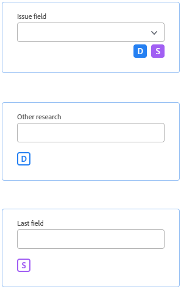
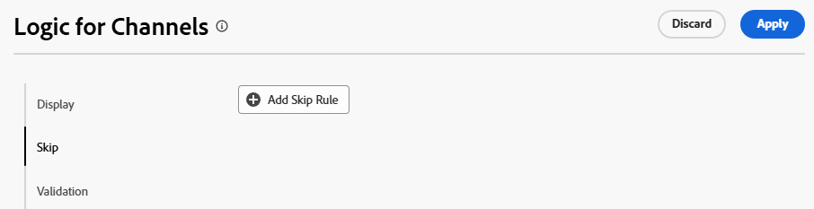
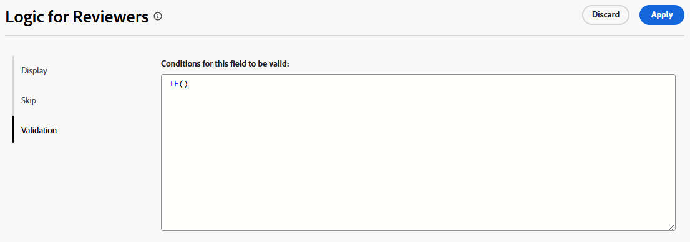

# Aggiungere regole logiche a campi e moduli personalizzati

{{highlighted-preview}}

Le regole logiche consentono di personalizzare ulteriormente i campi nel modulo.

È ad esempio possibile visualizzare o saltare campi o sezioni in un modulo personalizzato in base alle scelte effettuate da un utente durante la compilazione.

>[!NOTE]
>
>La logica si applica solo all’interno di un modulo e non può essere basata su selezioni da un modulo diverso.

## Requisiti di accesso

+++ Espandi per visualizzare i requisiti di accesso per la funzionalità descritta in questo articolo.

<table style="table-layout:auto"> 
 <col> 
 <col> 
 <tbody> 
  <tr> 
   <td>Pacchetto Adobe Workfront</td> 
   <td> <p>Per applicare la visualizzazione avanzata, il valore predefinito, la formattazione condizionale o la logica di modificabilità: Workflow Prime o versione successiva</p>
         <p>Per applicare tutti gli altri tipi di logica: qualsiasi pacchetto Workfront o Workflow</p> </td> 
  </tr> 
  <tr> 
   <td>Licenza di Adobe Workfront</td> 
   <td><p>Standard</p>
       <p>Piano</p></td>
  </tr> 
  <tr> 
   <td>Configurazioni del livello di accesso</td> 
   <td> <p>Accesso amministrativo ai moduli personalizzati</p> </td> 
  </tr>  
 </tbody> 
</table>

Per informazioni, consulta [Requisiti di accesso nella documentazione di Workfront](/help/quicksilver/administration-and-setup/add-users/access-levels-and-object-permissions/access-level-requirements-in-documentation.md).

+++

## Icone indicatore logico

I moduli personalizzati visualizzano icone per indicare quando viene applicata la logica ai campi.

<span class="preview">Fare clic su **Mostra logica** nell&#39;intestazione di Progettazione moduli per visualizzare o nascondere le icone per i diversi tipi di logica dei campi.</span>

| Icona | Definizione |
| --- | --- |
|  | Il campo è il campo di destinazione in cui viene applicata la logica di visualizzazione. Se nel modulo viene effettuata una selezione specifica, viene visualizzato questo campo. |
|  | Il campo è il campo di riferimento per la logica di visualizzazione. Una selezione o un valore specifico in questo campo visualizza il campo di destinazione. |
|  | Il campo è il campo di destinazione in cui viene applicata la logica di salto. Una selezione o un valore specifico in questo campo ignora altri campi e passa direttamente al campo di riferimento. |
|  | Il campo è il campo di riferimento per la logica di salto. Se nel campo di destinazione viene effettuata una selezione specifica, il modulo passa a tale campo e i campi intermedi sono nascosti. |
|  | Il campo è il campo di destinazione in cui viene applicata la logica di convalida. Una selezione o un valore specifico nel campo di riferimento determina se la convalida non riesce. Il campo di destinazione e il campo di riferimento possono essere gli stessi per la logica di convalida. |
|  | Il campo è il campo di riferimento per la logica di convalida. Una selezione o un valore specifico in questo campo determina se la convalida non riesce nel campo di destinazione. Il campo di destinazione e il campo di riferimento possono essere gli stessi per la logica di convalida. |
|  | <span class="preview">Il campo è il campo di destinazione in cui viene applicata la logica del valore predefinito. Il valore predefinito viene determinato da una selezione o da un valore specifico nel campo di riferimento. Il campo di destinazione e il campo di riferimento possono essere gli stessi per la logica del valore predefinito.</span> |
|  | <span class="preview">Il campo è il campo di riferimento per la logica del valore predefinito. Una selezione o un valore specifico in questo campo determina il valore predefinito nel campo di destinazione. Il campo di destinazione e il campo di riferimento possono essere gli stessi per la logica del valore predefinito.</span> |
|  | <span class="preview">Il campo è il campo di destinazione in cui viene applicata la logica di formattazione. La formattazione viene determinata da una selezione o da un valore specifico nel campo di riferimento. Il campo di destinazione e il campo di riferimento possono essere gli stessi per la logica di formattazione.</span> |
|  | <span class="preview">Il campo è il campo di riferimento per la logica di formattazione. Una selezione o un valore specifico in questo campo determina la formattazione del campo di destinazione. Il campo di destinazione e il campo di riferimento possono essere gli stessi per la logica di formattazione.</span> |
|  | <span class="preview">Il campo è il campo di destinazione in cui viene applicata la logica di modificabilità. Il campo può essere modificabile o di sola lettura quando vengono soddisfatte le condizioni definite. Il campo di destinazione e il campo di riferimento possono essere gli stessi per la logica di modificabilità.</span> |
|  | <span class="preview">Il campo è il campo di riferimento per la logica di modificabilità. Quando le condizioni definite vengono soddisfatte in questo campo, la logica viene applicata al campo di destinazione. Il campo di destinazione e il campo di riferimento possono essere gli stessi per la logica di modificabilità.</span> |

<!--  -->

Solo per visualizzare e saltare la logica, seleziona un campo per visualizzare le regole di logica esistenti nelle impostazioni del campo.


## Considerazioni per l’utilizzo della logica di visualizzazione e della logica di salto

* Per aggiungere la logica di visualizzazione a un campo personalizzato, a un widget o a un&#39;interruzione di sezione, è necessario posizionare almeno un campo a scelta multipla (pulsanti di scelta, elenco a discesa o caselle di controllo) prima di inserirlo nel modulo.
Per informazioni sui campi personalizzati e i widget nei moduli personalizzati, vedere [Creare un modulo personalizzato](/help/quicksilver/administration-and-setup/customize-workfront/create-manage-custom-forms/form-designer/design-a-form/design-a-form.md).
* Non è possibile aggiungere logica di salto a un widget o a un’interruzione di sezione. È possibile aggiungerlo solo a un campo a scelta multipla (pulsanti di scelta, menu a discesa o caselle di controllo).
* Non è possibile applicare la logica di visualizzazione o di salto per mostrare o nascondere le scelte di un campo con più opzioni. Ad esempio, non è possibile limitare le scelte visualizzate per un campo a discesa, un gruppo di caselle di controllo o un campo Pulsante di scelta in base alla logica di visualizzazione o salto di un altro campo.
* È possibile aggiungere logica di visualizzazione e logica di salto a un campo personalizzato se si verificano tutte le condizioni seguenti relative al campo personalizzato:

   * È un campo a scelta multipla (pulsanti di scelta, menu a discesa o caselle di controllo)
   * È preceduto da un campo a scelta multipla
   * È seguito da un altro campo personalizzato

* Quando si copiano i moduli con la logica di visualizzazione o salta, la logica viene copiata nel nuovo modulo personalizzato.
* Durante la modifica di oggetti in blocco, tutti i campi personalizzati vengono visualizzati nella casella Modifica oggetti, inclusi i campi ignorati o nascosti.
* Quando crei una regola di logica di visualizzazione per un modulo personalizzato, tieni presente quanto segue:

   * Per impostazione predefinita, i campi personalizzati non inclusi in un’istruzione di logica di visualizzazione vengono visualizzati in un modulo personalizzato.
   * Puoi creare istruzioni logiche di visualizzazione a più campi.
   * Se a tutti i campi di un’interruzione di sezione è applicata una logica di visualizzazione e questi sono tutti nascosti come risultato della logica, l’intera sezione sarà nascosta nel modulo personalizzato.

## Aggiungere logica di visualizzazione a un modulo personalizzato

La logica di visualizzazione definisce quali campi personalizzati vengono visualizzati nel modulo quando l’utente seleziona un valore specifico in un campo a scelta multipla. La logica viene aggiunta al campo di destinazione, che viene visualizzato solo quando il valore è selezionato.

>[!NOTE]
>
><span class="preview">Questa procedura descrive la modalità di base per la logica di visualizzazione. È disponibile anche la logica di visualizzazione avanzata. Per ulteriori informazioni, vedere [Aggiungere una logica di visualizzazione avanzata a un modulo personalizzato](#add-advanced-display-logic-to-a-custom-form), in questo articolo.</span>

{{step-1-to-setup}}

1. Fare clic su **Forms personalizzato**.
1. Crea un nuovo modulo personalizzato o apri un modulo esistente. Per ulteriori dettagli, vedere [Creare un modulo personalizzato](/help/quicksilver/administration-and-setup/customize-workfront/create-manage-custom-forms/form-designer/design-a-form/design-a-form.md).
1. Aggiungi i campi al modulo in base alle esigenze. Almeno un campo a scelta multipla (pulsante di opzione, elenco a discesa o casella di controllo) deve essere posizionato prima del campo di destinazione che verrà visualizzato.
1. Selezionare il campo di destinazione e fare clic su **Aggiungi logica**.
1. Selezionare la scheda **Visualizzazione** nel generatore di logica.
1. Fai clic su **Aggiungi regola di visualizzazione**.

   

1. Segui i passaggi seguenti per creare l’istruzione logica nel generatore.

   1. La prima opzione consiste nel scegliere il campo di definizione. Questo è il campo con il valore di selezione che visualizza la destinazione. Deve essere un campo a scelta multipla.
   1. La seconda opzione consiste nel scegliere il valore di selezione. Sono disponibili solo i valori già definiti per quel campo.
   1. La terza opzione è **Selezionato** o **Non selezionato**. Scegliendo **Selezionato**, quando il valore è selezionato, viene visualizzato il campo di destinazione. La scelta di **Non selezionato** indica che quando nel campo di definizione viene selezionato un altro valore, viene visualizzato il campo di destinazione.
   1. Per aggiungere una regola **And** all&#39;istruzione logica, fare clic su **Aggiungi regola** direttamente sotto la regola appena creata. Segui le stesse istruzioni per generare la regola. Affinché il campo di destinazione venga visualizzato, è necessario che siano soddisfatte tutte le regole AND.

      

   1. Per aggiungere una regola **Or** all&#39;istruzione di logica, fare clic su **Aggiungi regola** nella parte inferiore del generatore di logica. Quindi, fai clic su **Aggiungi regola** all&#39;interno dell&#39;area O e segui le stesse istruzioni per generare la regola. Quando viene soddisfatta una regola Or, viene visualizzato il campo di destinazione.

1. Fare clic su **Applica** al termine della creazione dell&#39;istruzione logica.

   Le icone della logica di visualizzazione vengono aggiunte al campo di destinazione e al campo di definizione nel progettista del modulo.

<div class="preview">

## Aggiungere una logica di visualizzazione avanzata a un modulo personalizzato

La logica di visualizzazione avanzata per i campi modulo personalizzati consente di creare una logica complessa utilizzando le formule. È possibile applicare questa logica ai seguenti tipi di campo: testo a riga singola, paragrafo, testo con formattazione, elenco a discesa a selezione singola, elenco a discesa a selezione multipla, ricerca esterna, ricerca esterna a selezione multipla, riferimento al campo nativo, typeahead, calcolato, data, gruppo di caselle di controllo e pulsanti di scelta.

>[!NOTE]
>
>Questa procedura descrive la modalità avanzata per la logica di visualizzazione. È disponibile anche la logica di visualizzazione di base. Per ulteriori informazioni, vedere [Aggiungere la logica di visualizzazione a un modulo personalizzato](#add-display-logic-to-a-custom-form), in questo articolo.

### Esempi

È possibile utilizzare una logica di visualizzazione avanzata per controllare la visibilità delle sezioni dei moduli personalizzati in base ai ruoli utente e alla visibilità di un campo in base allo stato di un altro campo.

Alla sezione predefinita del modulo non viene applicata alcuna logica, in modo che sia sempre visibile a tutti gli utenti.

Utilizzando la condizione seguente, la sezione Risorse richieste viene visualizzata solo quando un utente con il ruolo di Responsabile risorse visualizza il modulo.

```IF($$USER.{roleID}="123abc", true)```

```123abc``` rappresenta l&#39;ID ruolo del Responsabile risorse.


La stessa condizione con un ID ruolo diverso viene applicata alla sezione Indicatori prestazioni chiave finanziari progetto per definire che solo il ruolo di Financial Advisor può visualizzare la sezione.

Utilizzando la condizione seguente, il campo KPI venduto diventa visibile solo al termine del progetto. Questa logica viene applicata direttamente al campo anziché a una sezione del modulo. Non è necessario specificare quale ruolo può visualizzare il campo, in quanto è già definito nella sezione in cui si trova il campo.

```IF({status}="CPL", true)```


### Definire la logica di visualizzazione avanzata

{{step-1-to-setup}}

1. Fare clic su **Forms personalizzato**.
1. Crea un nuovo modulo personalizzato o apri un modulo esistente. Per ulteriori dettagli, vedere [Creare un modulo personalizzato](/help/quicksilver/administration-and-setup/customize-workfront/create-manage-custom-forms/form-designer/design-a-form/design-a-form.md).
1. Aggiungi i campi al modulo in base alle esigenze.
1. Selezionare il campo a cui applicare la logica e fare clic su **Aggiungi logica**.
1. Selezionare la scheda **Visualizzazione** nel generatore di logica.
1. Attiva **Modalità avanzata**.

   Questa opzione può essere attivata automaticamente, per i campi che non supportano la modalità semplice di logica di visualizzazione.

   

1. Crea la condizione di visualizzazione nell’editor.

   Per ulteriori informazioni sui calcoli e sulle espressioni, vedere [Aggiungere campi calcolati a un modulo](/help/quicksilver/administration-and-setup/customize-workfront/create-manage-custom-forms/form-designer/design-a-form/add-a-calculated-field.md) e [Panoramica delle espressioni di dati calcolati](/help/quicksilver/reports-and-dashboards/reports/calc-cstm-data-reports/calculated-data-expressions.md).

1. Fai clic su **Applica**.

   La logica viene applicata al campo e l’icona della logica di visualizzazione viene aggiunta nel progettista del modulo.

   >[!NOTE]
   >
   >La logica di visualizzazione avanzata non è supportata nella modalità di anteprima di Progettazione moduli.

</div>

## Aggiungere la logica di salto a un modulo personalizzato

La logica di salto definisce i campi modulo personalizzati che vengono saltati quando l’utente seleziona un valore specifico in un campo a scelta multipla. I campi ignorati sono nascosti nel modulo. La logica viene applicata al campo di definizione in cui viene effettuata la selezione, non ai campi saltati.

{{step-1-to-setup}}

1. Fare clic su **Forms personalizzato**.
1. Crea un nuovo modulo personalizzato o apri un modulo esistente. Per ulteriori dettagli, vedere [Creare un modulo personalizzato](/help/quicksilver/administration-and-setup/customize-workfront/create-manage-custom-forms/form-designer/design-a-form/design-a-form.md).
1. Aggiungi i campi al modulo in base alle esigenze. Il campo di definizione per la logica di salto deve essere un campo a scelta multipla (pulsante di scelta, elenco a discesa o casella di controllo).
1. Seleziona il campo di definizione e fai clic su **Aggiungi logica** in basso a sinistra nella schermata.
1. Seleziona la scheda **Ignora** nel generatore di logica.
1. Fai clic su **Aggiungi regola di salto**.

   

1. Segui i passaggi seguenti per creare l’istruzione logica nel generatore.

   1. Il campo di definizione viene visualizzato nel generatore. È il campo a cui hai selezionato la logica di salto.
   1. La prima opzione consiste nel scegliere il valore di selezione. Sono disponibili solo i valori già definiti per il campo.
   1. La seconda opzione è **Selezionato** o **Non selezionato**. La scelta di **Selezionato** implica che quando il valore è selezionato, il campo di destinazione viene visualizzato e i campi intermedi vengono ignorati. La scelta di **Non selezionato** indica che quando nel campo di definizione viene selezionato un altro valore, viene visualizzato il campo di destinazione e i campi intermedi vengono ignorati.
   1. La terza opzione è il campo di destinazione o il punto in cui passare. Selezionare un nome di campo o **Fine modulo**. Potrebbe essere necessario fare clic sulla parola &quot;vuoto&quot; prima di selezionare un&#39;opzione.

      

   1. Per aggiungere una regola **Or** all&#39;istruzione di logica, fare clic su **Aggiungi regola** nella parte inferiore del generatore di logica. Quindi, seleziona le opzioni seguendo le stesse istruzioni per creare la regola. Quando viene soddisfatta una regola **Or**, viene visualizzato il campo di destinazione.

1. Fare clic su **Applica** al termine della creazione dell&#39;istruzione logica.

   Le icone di salto della logica vengono aggiunte al campo di destinazione e al campo di definizione nel progettista del modulo.

<div class="preview">

## Aggiungere la logica del valore predefinito a un modulo personalizzato

La logica dei valori predefiniti consente di configurare i valori predefiniti per i campi modulo personalizzati utilizzando le formule. Il valore predefinito viene visualizzato quando vengono soddisfatte le condizioni definite. Un valore predefinito può essere un valore statico o dinamico che fa riferimento ad altri campi all&#39;interno dell&#39;oggetto. Anche se il valore predefinito può fare riferimento ad altri campi, non verrà modificato con la modifica di altri campi del modulo.

Puoi applicare la logica avanzata del valore predefinito ai seguenti tipi di campi: testo a riga singola, paragrafo, elenco a discesa a selezione singola, elenco a discesa a selezione multipla, ricerca esterna, ricerca esterna a selezione multipla. riferimento campo nativo, typeahead, gruppo di caselle di controllo e pulsanti di scelta.

>[!TIP]
>
>Un valore predefinito viene applicato una sola volta a un campo personalizzato quando il modulo personalizzato viene allegato all’oggetto. Se la formula del valore predefinito dipende dal valore di un altro campo, il valore nell&#39;altro campo deve esistere già quando il modulo personalizzato viene allegato.

>[!NOTE]
>
>La logica dei valori standard predefiniti nel progettista di moduli esiste ancora. Se entrambi i tipi vengono applicati allo stesso campo, la logica avanzata ha la precedenza. Per informazioni sulla logica standard dei valori predefiniti, vedere [Aggiungere pulsanti di scelta, gruppi di caselle di controllo e menu a discesa](/help/quicksilver/administration-and-setup/customize-workfront/create-manage-custom-forms/form-designer/design-a-form/design-a-form.md#add-radio-buttons-checkbox-groups-and-drop-downs) in [Creare un modulo personalizzato](/help/quicksilver/administration-and-setup/customize-workfront/create-manage-custom-forms/form-designer/design-a-form/design-a-form.md).

### Esempio

Utilizzando la formula seguente, il campo a discesa a selezione multipla a cui viene applicata la logica estrae il relativo valore predefinito dalla descrizione del progetto quando lo stato del progetto è Pianificazione.

```
IF({status} = 'PLN', ARRAY({description}, ','))
```

Quando il modulo personalizzato viene allegato a un progetto e lo stato del progetto è Pianificazione, il valore del campo Descrizione progetto viene utilizzato come valore predefinito nel campo a selezione multipla. Poiché si tratta di un campo a selezione multipla, è possibile inserire più valori quando i valori corrispondono alla descrizione. Se il valore della descrizione non corrisponde a nessuna delle opzioni per la selezione multipla, il campo a selezione multipla non avrà un valore predefinito e l’utente può selezionare un valore dal menu a discesa.

### Definire la logica del valore predefinito

1. Fare clic su **Forms personalizzato**.
1. Crea un nuovo modulo personalizzato o apri un modulo esistente. Per ulteriori dettagli, vedere [Creare un modulo personalizzato](/help/quicksilver/administration-and-setup/customize-workfront/create-manage-custom-forms/form-designer/design-a-form/design-a-form.md).
1. Aggiungi i campi al modulo in base alle esigenze.
1. Selezionare il campo a cui applicare la logica e fare clic su **Aggiungi logica**.
1. Selezionare la scheda **Valore predefinito** nel generatore di logica.

   

1. Crea la condizione del valore predefinito nell’editor.

   Per ulteriori informazioni sui calcoli e sulle espressioni, vedere [Aggiungere campi calcolati a un modulo](/help/quicksilver/administration-and-setup/customize-workfront/create-manage-custom-forms/form-designer/design-a-form/add-a-calculated-field.md) e [Panoramica delle espressioni di dati calcolati](/help/quicksilver/reports-and-dashboards/reports/calc-cstm-data-reports/calculated-data-expressions.md).

1. Fai clic su **Applica**.

   La logica viene applicata al campo nel progettista del modulo.

   >[!NOTE]
   >
   >La logica dei valori predefiniti non è supportata nella modalità di anteprima di Progettazione moduli.

</div>

## Aggiungere una logica di convalida a un modulo personalizzato

La logica di convalida viene creata utilizzando le formule e può essere resa semplice o complessa in base alle esigenze. La convalida può essere basata sui valori di altri campi o sullo stato degli oggetti ed è possibile fornire un messaggio di errore per i casi in cui la convalida non riesce.

Se il campo con la logica applicata soddisfa le condizioni di convalida definite quando un utente compila il modulo personalizzato, il campo viene evidenziato e viene visualizzato il messaggio di errore.

È possibile applicare la logica di convalida ai seguenti tipi di campo: testo a riga singola, paragrafo, elenco a discesa a selezione singola, elenco a discesa a selezione multipla, ricerca esterna a selezione multipla, ricerca esterna a selezione multipla, completamento automatico, data, gruppo di caselle di controllo e pulsanti di scelta.

### Esempi

Utilizzando la condizione seguente, il campo Budget visualizza un messaggio sotto il campo quando l’utente immette un valore che attiva il messaggio. Ad esempio, se il valore immesso è negativo, viene visualizzato il primo messaggio. Se l’utente tenta di cambiare lo stato del progetto impostandolo su Corrente prima di immettere un valore di budget, viene visualizzato il secondo messaggio.

```
IF({DE:Budget Field} < 0,
     "Budget cannot be negative",
     IF({DE:Budget Field} == 0 && {status} == "CUR", "Budget must be specified before moving to Current status")
)
```

Un altro semplice esempio è che un campo numero di telefono deve contenere un certo numero di cifre per essere valido.

Un altro esempio per la convalida basata su altri campi è un campo relativo alle dimensioni della sala riunioni (piccolo, medio o grande) e un campo separato relativo al numero di partecipanti alla riunione. Il numero di persone per ogni dimensione della stanza è indicato nella formula di convalida. Se il numero di partecipanti immessi è eccessivo per la sala riunioni selezionata, viene visualizzato il messaggio di errore.

Per ulteriori esempi di logica di convalida, vedere [Esempi di logica avanzata nei moduli personalizzati](/help/quicksilver/administration-and-setup/customize-workfront/create-manage-custom-forms/form-designer/design-a-form/advanced-logic-examples.md).

### Definire la logica di convalida

{{step-1-to-setup}}

1. Fare clic su **Forms personalizzato**.
1. Crea un nuovo modulo personalizzato o apri un modulo esistente. Per ulteriori dettagli, vedere [Creare un modulo personalizzato](/help/quicksilver/administration-and-setup/customize-workfront/create-manage-custom-forms/form-designer/design-a-form/design-a-form.md).
1. Aggiungi i campi al modulo in base alle esigenze.
1. Selezionare il campo a cui applicare la logica e fare clic su **Aggiungi logica**.
1. Selezionare la scheda **Convalida** nel generatore di logica.

   

1. Crea la condizione di convalida nell’editor, incluso il messaggio di errore da visualizzare quando la convalida non viene soddisfatta.

   Per ulteriori informazioni sui calcoli e sulle espressioni, vedere [Aggiungere campi calcolati a un modulo](/help/quicksilver/administration-and-setup/customize-workfront/create-manage-custom-forms/form-designer/design-a-form/add-a-calculated-field.md) e [Panoramica delle espressioni di dati calcolati](/help/quicksilver/reports-and-dashboards/reports/calc-cstm-data-reports/calculated-data-expressions.md).

1. Fai clic su **Applica**.

   La logica viene applicata al campo nel progettista del modulo.

   >[!NOTE]
   >
   >La logica di convalida non è supportata nella modalità di anteprima di Progettazione moduli.

<div class="preview">

## Aggiungere logica di formattazione a un modulo personalizzato

La logica di formattazione evidenzia un valore di campo quando soddisfa le condizioni definite. La formattazione applicata funzionerà su più campi contemporaneamente.

È possibile applicare la logica di formattazione ai seguenti tipi di campo: testo a riga singola, paragrafo, elenco a discesa a selezione singola, elenco a discesa a selezione multipla, ricerca esterna a selezione multipla, ricerca esterna a selezione multipla, completamento automatico, calcolo, data, gruppo di caselle di controllo e pulsanti di scelta.

La formattazione applicata ai moduli personalizzati è distinta dalla formattazione applicata agli elenchi e ai report. Per informazioni sulla formattazione dei report, vedere [Utilizzare la formattazione condizionale nelle visualizzazioni](/help/quicksilver/reports-and-dashboards/reports/reporting-elements/use-conditional-formatting-views.md).

### Esempio

Utilizzando la condizione seguente, il campo Budget appare rosso quando l&#39;utente immette un valore pari o superiore a 1000. Il campo appare giallo quando l’utente immette un valore pari o superiore a 500.

Per aggiungere una definizione di formattazione al passaggio del mouse, utilizza il campo Istruzioni nel modulo personalizzato. Ad esempio, un messaggio nel campo Budget potrebbe indicare &quot;Immettere un budget entro un intervallo ragionevole. I valori superiori a 500 sono un avviso e quelli superiori a 1000 sono considerati troppo elevati.&quot;

```
IF(
     {DE:Budget Field} >=1000,
     FORMAT($$NEGATIVE),
     IF({DE:Budget Field} >= 500, FORMAT($$NOTICE))
)
```

### Definire la logica di formattazione

{{step-1-to-setup}}

1. Fare clic su **Forms personalizzato**.
1. Crea un nuovo modulo personalizzato o apri un modulo esistente. Per ulteriori dettagli, vedere [Creare un modulo personalizzato](/help/quicksilver/administration-and-setup/customize-workfront/create-manage-custom-forms/form-designer/design-a-form/design-a-form.md).
1. Aggiungi i campi al modulo in base alle esigenze.
1. Selezionare il campo a cui applicare la logica e fare clic su **Aggiungi logica**.
1. Selezionare la scheda **Formattazione** nel generatore di logica.

   

1. Crea la condizione di formattazione nell’editor.

   È possibile aggiungere fino a cinque regole di formattazione per campo.

   Le opzioni di colore per l&#39;evidenziazione dei campi sono:

   * `$$POSITIVE (green)`
   * `$$INFORMATIVE (blue)`
   * `$$NEGATIVE (red)`
   * `$$NOTICE (orange)`

   Le opzioni di formattazione del testo sono:

   * `$$BOLD`
   * `$$ITALIC`
   * `$$UNDERLINE`

   È possibile utilizzare un solo colore per funzione, insieme a un massimo di tre opzioni di formattazione del testo aggiuntive. Se non viene specificata alcuna opzione colore, viene applicato il colore predefinito del sistema.

   Per ulteriori informazioni sui calcoli e sulle espressioni, vedere [Aggiungere campi calcolati a un modulo](/help/quicksilver/administration-and-setup/customize-workfront/create-manage-custom-forms/form-designer/design-a-form/add-a-calculated-field.md) e [Panoramica delle espressioni di dati calcolati](/help/quicksilver/reports-and-dashboards/reports/calc-cstm-data-reports/calculated-data-expressions.md).

1. Fai clic su **Applica**.

   La logica viene applicata al campo nel progettista del modulo.

   >[!NOTE]
   >
   >La logica di formattazione non è supportata nella modalità di anteprima di Progettazione moduli.

</div>

<div class="preview">

## Aggiungere una logica di modificabilità a un modulo personalizzato

La logica di modificabilità determina se un campo modulo personalizzato può essere modificato o se è di sola lettura. Questa logica viene creata utilizzando formule e, quando il campo soddisfa le condizioni definite, può essere impostata come modificabile o di sola lettura.

È possibile applicare la logica di modificabilità ai seguenti tipi di campo: testo a riga singola, paragrafo, testo con formattazione, elenco a discesa a selezione singola, elenco a discesa a selezione multipla, ricerca esterna, ricerca esterna a selezione multipla, typeahead, data, gruppo di caselle di controllo e pulsanti di scelta.

### Esempio

Utilizzando la formula seguente, il campo con logica applicata è modificabile solo quando in un altro campo denominato Radio è selezionata l’opzione Abilitato.

```
IF({DE:Radio} = "Enabled", true)
```

Utilizzando la formula seguente, il campo Descrizione può essere modificato solo se è vuoto. Una volta immesso, il valore diventa di sola lettura.

```
IF(ISBLANK({DE:Description}), true)
```

Utilizzando la formula seguente, il campo con logica applicata è modificabile solo quando un utente con il ruolo di Responsabile risorse visualizza il modulo.

```
IF($$USER.{role}.{name}="Resource Manager", true)
```

### Definire la logica di modificabilità

{{step-1-to-setup}}

1. Fare clic su **Forms personalizzato**.
1. Crea un nuovo modulo personalizzato o apri un modulo esistente. Per ulteriori dettagli, vedere [Creare un modulo personalizzato](/help/quicksilver/administration-and-setup/customize-workfront/create-manage-custom-forms/form-designer/design-a-form/design-a-form.md).
1. Aggiungi i campi al modulo in base alle esigenze.
1. Selezionare il campo a cui applicare la logica e fare clic su **Aggiungi logica**.
1. Seleziona la scheda **Modificabilità** nel generatore di logica.

   

1. Crea la condizione di modificabilità nell’editor.

   Per ulteriori informazioni sui calcoli e sulle espressioni, vedere [Aggiungere campi calcolati a un modulo](/help/quicksilver/administration-and-setup/customize-workfront/create-manage-custom-forms/form-designer/design-a-form/add-a-calculated-field.md) e [Panoramica delle espressioni di dati calcolati](/help/quicksilver/reports-and-dashboards/reports/calc-cstm-data-reports/calculated-data-expressions.md).

1. Fai clic su **Applica**.

   La logica viene applicata al campo nel progettista del modulo.

   >[!NOTE]
   >
   >La logica di modificabilità non è supportata nella modalità di anteprima di Progettazione moduli.

</div>
