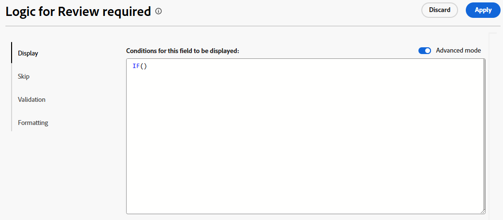

# Aggiungere regole logiche a campi e moduli personalizzati

Le regole logiche consentono di personalizzare ulteriormente i campi nel modulo.

È ad esempio possibile visualizzare o saltare campi o sezioni in un modulo personalizzato in base alle scelte effettuate da un utente durante la compilazione.

>[!NOTE]
>
>La logica si applica solo all’interno di un modulo e non può essere basata su selezioni da un modulo diverso.

## Requisiti di accesso

+++ Espandi per visualizzare i requisiti di accesso per la funzionalità in questo articolo.

<table style="table-layout:auto"> 
 <col> 
 <col> 
 <tbody> 
  <tr> 
   <td>Pacchetto Adobe Workfront</td> 
   <td><p>Qualsiasi</p></td> 
  </tr> 
  <tr> 
   <td>Licenza Adobe Workfront</td> 
   <td><p>Standard</p>
       <p>Piano</p></td>
  </tr> 
  <tr> 
   <td>Configurazioni del livello di accesso</td> 
   <td> <p>Accesso amministrativo ai moduli personalizzati</p> </td> 
  </tr>  
 </tbody> 
</table>

Per informazioni, consulta [Requisiti di accesso nella documentazione di Workfront](/help/quicksilver/administration-and-setup/add-users/access-levels-and-object-permissions/access-level-requirements-in-documentation.md).

+++

## Visualizzare e saltare le icone della logica

Nei moduli personalizzati vengono visualizzate icone per indicare quando viene applicata la logica di visualizzazione o di salto a determinati campi. Le icone di un campo nel progettista del modulo indicano che la logica viene applicata al campo.

| Icona | Posizione nel campo in Progettazione moduli | Definizione |
|--- |--- |--- |
|  | In basso a sinistra | Il campo è il campo di destinazione per la logica di visualizzazione. Se nel modulo viene effettuata una selezione specifica, viene visualizzato questo campo. |
|  | In basso a destra | Il campo definisce la logica di visualizzazione. Una selezione o un valore specifico in questo campo visualizza il campo di destinazione. |
|  | In basso a sinistra | Il campo è il campo di destinazione per la logica di salto. Se nel modulo viene effettuata una selezione specifica, il modulo passa a questo campo e i campi intermedi sono nascosti. |
|  | In basso a destra | Il campo definisce la logica di salto. Una selezione o un valore specifico in questo campo ignora altri campi e passa direttamente al campo di destinazione. |


Seleziona un campo a cui è applicata la logica per visualizzare le regole di logica esistenti nelle impostazioni del campo.


## Considerazioni per l’utilizzo della logica di visualizzazione e della logica di salto

* Per aggiungere la logica di visualizzazione a un campo personalizzato, a un widget o a un&#39;interruzione di sezione, è necessario posizionare almeno un campo a scelta multipla (pulsanti di scelta, elenco a discesa o caselle di controllo) prima di inserirlo nel modulo.
Per informazioni sui campi personalizzati e i widget nei moduli personalizzati, vedere [Creare un modulo personalizzato](/help/quicksilver/administration-and-setup/customize-workfront/create-manage-custom-forms/form-designer/design-a-form/design-a-form.md).
* Non è possibile aggiungere logica di salto a un widget o a un’interruzione di sezione. È possibile aggiungerlo solo a un campo a scelta multipla (pulsanti di scelta, menu a discesa o caselle di controllo).
* Non è possibile applicare la logica di visualizzazione o di salto per mostrare o nascondere le scelte di un campo con più opzioni. Ad esempio, non è possibile limitare le scelte visualizzate per un campo a discesa, un gruppo di caselle di controllo o un campo Pulsante di scelta in base alla logica di visualizzazione o salto di un altro campo.
* È possibile aggiungere logica di visualizzazione e logica di salto a un campo personalizzato se si verificano tutte le condizioni seguenti relative al campo personalizzato:

   * È un campo a scelta multipla (pulsanti di scelta, menu a discesa o caselle di controllo)
   * È preceduto da un campo a scelta multipla
   * È seguito da un altro campo personalizzato

* Quando si copiano i moduli con la logica di visualizzazione o salta, la logica viene copiata nel nuovo modulo personalizzato.
* Durante la modifica di oggetti in blocco, tutti i campi personalizzati vengono visualizzati nella casella Modifica oggetti, inclusi i campi ignorati o nascosti.
* Quando crei una regola di logica di visualizzazione per un modulo personalizzato, tieni presente quanto segue:

   * Per impostazione predefinita, i campi personalizzati non inclusi in un’istruzione di logica di visualizzazione vengono visualizzati in un modulo personalizzato.
   * Puoi creare istruzioni logiche di visualizzazione a più campi.
   * Se a tutti i campi di un’interruzione di sezione è applicata una logica di visualizzazione e questi sono tutti nascosti come risultato della logica, l’intera sezione sarà nascosta nel modulo personalizzato.

## Aggiungere logica di visualizzazione a un modulo personalizzato

La logica di visualizzazione definisce quali campi personalizzati vengono visualizzati nel modulo quando l’utente seleziona un valore specifico in un campo a scelta multipla. La logica viene aggiunta al campo di destinazione, che viene visualizzato solo quando il valore è selezionato.

<!--
>[!NOTE]
>
><span class="preview">This procedure describes the basic mode for display logic. Advanced display logic is also available. For more information, see [Add advanced display logic to a custom form](#add-advanced-display-logic-to-a-custom-form), in this article.</span>
-->

{{step-1-to-setup}}

1. Fare clic su **Forms personalizzato**.
1. Crea un nuovo modulo personalizzato o apri un modulo esistente. Per ulteriori dettagli, vedere [Creare un modulo personalizzato](/help/quicksilver/administration-and-setup/customize-workfront/create-manage-custom-forms/form-designer/design-a-form/design-a-form.md).
1. Aggiungi i campi al modulo in base alle esigenze. Almeno un campo a scelta multipla (pulsante di opzione, elenco a discesa o casella di controllo) deve essere posizionato prima del campo di destinazione che verrà visualizzato.
1. Selezionare il campo di destinazione e fare clic su **Aggiungi logica**.
1. Selezionare la scheda **Visualizzazione** nel generatore di logica.
1. Fai clic su **Aggiungi regola di visualizzazione**.

   

1. Segui i passaggi seguenti per creare l’istruzione logica nel generatore.

   1. La prima opzione consiste nel scegliere il campo di definizione. Questo è il campo con il valore di selezione che visualizza la destinazione. Deve essere un campo a scelta multipla.
   1. La seconda opzione consiste nel scegliere il valore di selezione. Sono disponibili solo i valori già definiti per quel campo.
   1. La terza opzione è **Selezionato** o **Non selezionato**. Scegliendo **Selezionato**, quando il valore è selezionato, viene visualizzato il campo di destinazione. La scelta di **Non selezionato** indica che quando nel campo di definizione viene selezionato un altro valore, viene visualizzato il campo di destinazione.
   1. Per aggiungere una regola **And** all&#39;istruzione logica, fare clic su **Aggiungi regola** direttamente sotto la regola appena creata. Segui le stesse istruzioni per generare la regola. Affinché il campo di destinazione venga visualizzato, è necessario che siano soddisfatte tutte le regole AND.

      

   1. Per aggiungere una regola **Or** all&#39;istruzione di logica, fare clic su **Aggiungi regola** nella parte inferiore del generatore di logica. Quindi, fai clic su **Aggiungi regola** all&#39;interno dell&#39;area O e segui le stesse istruzioni per generare la regola. Quando viene soddisfatta una regola Or, viene visualizzato il campo di destinazione.

1. Fare clic su **Applica** al termine della creazione dell&#39;istruzione logica.

   Le icone della logica di visualizzazione vengono aggiunte al campo di destinazione e al campo di definizione nel progettista del modulo.

<!--
<div class="preview">

## Add advanced display logic to a custom form

The advanced display logic for custom form fields allows you to build complex logic using formulas. You can apply this logic to the following field types: drop-down, radio button, checkbox, typeahead, single line text, paragraph text, date field, text with formatting, and calculated fields.

### Examples

You can use advanced display logic to control the visibility of custom form sections based on user roles and the visibility of a field based on another field's status.

No logic is applied to the default section on the form, so it is always visible to all users.

Using the following condition, the Resources Required section is only displayed when a user with the job role of Resource Manager views the form.

```IF($$USER.{roleID}="123abc", true)```

Note that ```123abc``` represents the role ID of the Resource Manager.


The same condition with a different role ID is applied to the Project Financial KPIs section to define that  only the Financial Advisor role can view the section.

Using the following condition, the Sold KPI field only becomes visible when the project is complete. This logic is applied directly to the field instead of to a form section. There is no need to specify which role can view the field, because that is already defined in the section that the field is in.

```IF({status}="CPL", true)```


### Define advanced display logic

{{step-1-to-setup}}

1. Click **Custom Forms**.
1. Create a new custom form or open an existing form. See [Create a custom form](/help/quicksilver/administration-and-setup/customize-workfront/create-manage-custom-forms/form-designer/design-a-form/design-a-form.md) for details.
1. Add fields to the form as needed.
1. Select the field to apply logic to, and click **Add Logic**.
1. Select the **Display** tab on the logic builder.
1. Turn on **Advanced mode**.
   
   This option might be turned on automatically, for fields that do not support the simple mode of display logic.

   

1. Build the display condition in the editor.

   For more information about calculations and expressions, see [Add calculated fields to a form](/help/quicksilver/administration-and-setup/customize-workfront/create-manage-custom-forms/form-designer/design-a-form/add-a-calculated-field.md) and [Overview of calculated data expressions](/help/quicksilver/reports-and-dashboards/reports/calc-cstm-data-reports/calculated-data-expressions.md).

1. Click **Apply**.
   
   The logic is applied to the field and the display logic icon is added in the form designer.

</div>
-->

## Aggiungere la logica di salto a un modulo personalizzato

La logica di salto definisce i campi modulo personalizzati che vengono saltati quando l’utente seleziona un valore specifico in un campo a scelta multipla. I campi ignorati sono nascosti nel modulo. La logica viene applicata al campo di definizione in cui viene effettuata la selezione, non ai campi saltati.

{{step-1-to-setup}}

1. Fare clic su **Forms personalizzato**.
1. Crea un nuovo modulo personalizzato o apri un modulo esistente. Per ulteriori dettagli, vedere [Creare un modulo personalizzato](/help/quicksilver/administration-and-setup/customize-workfront/create-manage-custom-forms/form-designer/design-a-form/design-a-form.md).
1. Aggiungi i campi al modulo in base alle esigenze. Il campo di definizione per la logica di salto deve essere un campo a scelta multipla (pulsante di scelta, elenco a discesa o casella di controllo).
1. Seleziona il campo di definizione e fai clic su **Aggiungi logica** in basso a sinistra nella schermata.
1. Seleziona la scheda **Ignora** nel generatore di logica.
1. Fai clic su **Aggiungi regola di salto**.

   

1. Segui i passaggi seguenti per creare l’istruzione logica nel generatore.

   1. Il campo di definizione viene visualizzato nel generatore. È il campo a cui hai selezionato la logica di salto.
   1. La prima opzione consiste nel scegliere il valore di selezione. Sono disponibili solo i valori già definiti per il campo.
   1. La seconda opzione è **Selezionato** o **Non selezionato**. La scelta di **Selezionato** implica che quando il valore è selezionato, il campo di destinazione viene visualizzato e i campi intermedi vengono ignorati. La scelta di **Non selezionato** indica che quando nel campo di definizione viene selezionato un altro valore, viene visualizzato il campo di destinazione e i campi intermedi vengono ignorati.
   1. La terza opzione è il campo di destinazione o il punto in cui passare. Selezionare un nome di campo o **Fine modulo**. Potrebbe essere necessario fare clic sulla parola &quot;vuoto&quot; prima di selezionare un&#39;opzione.

      

   1. Per aggiungere una regola **Or** all&#39;istruzione di logica, fare clic su **Aggiungi regola** nella parte inferiore del generatore di logica. Quindi, seleziona le opzioni seguendo le stesse istruzioni per creare la regola. Quando viene soddisfatta una regola **Or**, viene visualizzato il campo di destinazione.

1. Fare clic su **Applica** al termine della creazione dell&#39;istruzione logica.

   Le icone di salto della logica vengono aggiunte al campo di destinazione e al campo di definizione nel progettista del modulo.

## Aggiungere una logica di convalida a un modulo personalizzato

La logica di convalida viene creata utilizzando le formule e può essere resa semplice o complessa in base alle esigenze. La convalida può essere basata sui valori di altri campi o sullo stato degli oggetti ed è possibile fornire un messaggio di errore per i casi in cui la convalida non riesce.

Se il campo con la logica applicata soddisfa le condizioni di convalida definite quando un utente compila il modulo personalizzato, il campo viene evidenziato e viene visualizzato il messaggio di errore.

È possibile applicare la logica di convalida ai seguenti tipi di campi: testo a riga singola, paragrafo, elenco a discesa a selezione singola, elenco a discesa a selezione multipla, ricerca esterna, completamento automatico, data, gruppo di caselle di controllo e pulsanti di scelta.

### Esempi

Utilizzando la condizione seguente, il campo Budget visualizza un messaggio sotto il campo quando l’utente immette un valore che attiva il messaggio. Ad esempio, se il valore immesso è negativo, viene visualizzato il primo messaggio. Se l’utente tenta di cambiare lo stato del progetto impostandolo su Corrente prima di immettere un valore di budget, viene visualizzato il secondo messaggio.

```
IF({DE:Budget Field} < 0,
     "Budget cannot be negative",
     IF({DE:Budget Field} == 0 && {status} == "CUR", "Budget must be specified before moving to Current status")
)
```

Un altro semplice esempio è che un campo numero di telefono deve contenere un certo numero di cifre per essere valido.

Un altro esempio per la convalida basata su altri campi è un campo relativo alle dimensioni della sala riunioni (piccolo, medio o grande) e un campo separato relativo al numero di partecipanti alla riunione. Il numero di persone per ogni dimensione della stanza è indicato nella formula di convalida. Se il numero di partecipanti immessi è eccessivo per la sala riunioni selezionata, viene visualizzato il messaggio di errore.

Per ulteriori esempi di logica di convalida, vedere [Esempi di logica avanzata nei moduli personalizzati](/help/quicksilver/administration-and-setup/customize-workfront/create-manage-custom-forms/form-designer/design-a-form/advanced-logic-examples.md).

### Definire la logica di convalida

{{step-1-to-setup}}

1. Fare clic su **Forms personalizzato**.
1. Crea un nuovo modulo personalizzato o apri un modulo esistente. Per ulteriori dettagli, vedere [Creare un modulo personalizzato](/help/quicksilver/administration-and-setup/customize-workfront/create-manage-custom-forms/form-designer/design-a-form/design-a-form.md).
1. Aggiungi i campi al modulo in base alle esigenze.
1. Selezionare il campo a cui applicare la logica e fare clic su **Aggiungi logica**.
1. Selezionare la scheda **Convalida** nel generatore di logica.

   

1. Crea la condizione di convalida nell’editor, incluso il messaggio di errore da visualizzare quando la convalida non viene soddisfatta.

   Per ulteriori informazioni sui calcoli e sulle espressioni, vedere [Aggiungere campi calcolati a un modulo](/help/quicksilver/administration-and-setup/customize-workfront/create-manage-custom-forms/form-designer/design-a-form/add-a-calculated-field.md) e [Panoramica delle espressioni di dati calcolati](/help/quicksilver/reports-and-dashboards/reports/calc-cstm-data-reports/calculated-data-expressions.md).

1. Fare clic su **Applica**.

   La logica viene applicata al campo nel progettista del modulo.

   >[!NOTE]
   >
   >La logica di convalida non è supportata nella modalità di anteprima di Progettazione moduli.

<!--
<div class="preview">

## Add formatting logic to a custom form

Formatting logic highlights a field value when it meets the defined conditions. The applied formatting will work on multiple fields at once.

You can apply formatting logic to the following field types: single line text, paragraph, single-select dropdown, multi-select dropdown, external lookup, typeahead, calculated, date, checkbox group, and radio buttons.

Formatting applied to custom forms is separate from formatting applied to lists and reports. For information on report formatting, see [Use conditional formatting in views](/help/quicksilver/reports-and-dashboards/reports/reporting-elements/use-conditional-formatting-views.md).

### Example

Using the following condition, the Budget field appears red when the user enters a value of 1000 or more. The field appears yellow when the user enters a value of 500 or more.

To add a hover-over definition of the formatting, use the Instructions field in the custom form. For example, a message on the Budget field could say "Please enter a budget within a reasonable range. Values over 500 are a warning notice, and above 1000 is considered too high."

```
IF(
     {DE:Budget Field} >=1000,
     FORMAT($$NEGATIVE),
     IF({DE:Budget Field} >= 500, FORMAT($$NOTICE))
)
```

### Define formatting logic

{{step-1-to-setup}}

1. Click **Custom Forms**.
1. Create a new custom form or open an existing form. See [Create a custom form](/help/quicksilver/administration-and-setup/customize-workfront/create-manage-custom-forms/form-designer/design-a-form/design-a-form.md) for details.
1. Add fields to the form as needed.
1. Select the field to apply logic to, and click **Add Logic**.
1. Select the **Formatting** tab on the logic builder.

   

1. Build the formatting condition in the editor.

   You can add up to five formatting rules per field.

   The field highlighting color options are:

   * `$$POSITIVE (green)`
   * `$$INFORMATIVE (blue)`
   * `$$NEGATIVE (red)`
   * `$$NOTICE (orange)`
   
   The text formatting options are:
   
   * `$$BOLD`
   * `$$ITALIC`
   * `$$UNDERLINE`

   Only one color option may be used per function, along with up to three additional text formatting options. If no color option is specified, the system's default color is applied.

   For more information about calculations and expressions, see [Add calculated fields to a form](/help/quicksilver/administration-and-setup/customize-workfront/create-manage-custom-forms/form-designer/design-a-form/add-a-calculated-field.md) and [Overview of calculated data expressions](/help/quicksilver/reports-and-dashboards/reports/calc-cstm-data-reports/calculated-data-expressions.md).

1. Click **Apply**.
   
   The logic is applied to the field in the form designer.

</div>
-->
