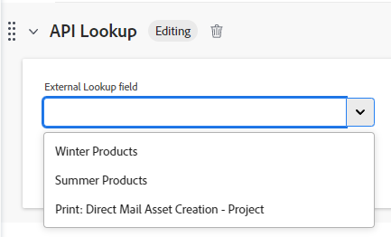

# Esempi di campo di ricerca esterna in un modulo personalizzato

Un campo di ricerca esterno in un modulo personalizzato chiama un’API esterna e restituisce i valori come opzioni in un campo a discesa. Gli utenti che utilizzano l’oggetto a cui è associato il modulo personalizzato possono selezionare una o più di queste opzioni dal menu a discesa.

Questo articolo fornisce esempi di utilizzo del campo di ricerca esterna per chiamare la stessa istanza di Workfront o un’API pubblica. È inoltre possibile utilizzare la funzione di ricerca esterna per comunicare con un sistema esterno come Jira, Salesforce o ServiceNow.

Per ulteriori informazioni sull&#39;aggiunta di un campo di ricerca esterna a un modulo personalizzato e ulteriori definizioni dei componenti di ricerca esterni, vedere [Creare un modulo personalizzato](/help/quicksilver/administration-and-setup/customize-workfront/create-manage-custom-forms/form-designer/design-a-form/design-a-form.md).

## Requisiti di accesso

+++ Espandi per visualizzare i requisiti di accesso per la funzionalità in questo articolo.

<table style="table-layout:auto"> 
 <col> 
 <col> 
 <tbody> 
  <tr> 
   <td>Pacchetto Adobe Workfront</td> 
   <td>
Qualsiasi
</td> 
  </tr> 
  <tr> 
   <td>Licenza Adobe Workfront</td> 
   <td>
Standard

       
Piano
</td>
  </tr> 
  <tr> 
   <td>Configurazioni del livello di accesso</td> 
   <td> 
Accesso amministrativo ai moduli personalizzati
 </td> 
  </tr>  
 </tbody> 
</table>

Per informazioni, consulta [Requisiti di accesso nella documentazione di Workfront](/help/quicksilver/administration-and-setup/add-users/access-levels-and-object-permissions/access-level-requirements-in-documentation.md).

+++

## Configurare un campo di ricerca esterna per la stessa istanza di Workfront

È possibile utilizzare la funzione di ricerca esterna per inserire nel modulo personalizzato i dati dell’istanza di Workfront.

Quando un utente accede al campo nel modulo personalizzato, nell’elenco delle opzioni visualizza solo ciò che dispone delle autorizzazioni per visualizzare in Workfront. Ad esempio, se mostri un elenco di progetti, l’utente vedrà solo i progetti condivisi con lui.

### Utilizzare i valori dei campi nativi di Workfront nella ricerca esterna

Questo esempio illustra come chiamare l’API Workfront e compilare un elenco di progetti in un campo di ricerca esterna, filtrati per stato utilizzando il valore del campo personalizzato &quot;Query di stato&quot; e un termine di ricerca tramite $$QUERY.

1. Apri il modulo personalizzato.
1. Nella parte sinistra dello schermo, trovare **Ricerca esterna** e trascinarlo in una sezione dell&#39;area di lavoro.
1. Immetti l&#39;**etichetta** e il **nome** per il campo.
1. Seleziona il **Formato** per il campo.
1. Immetti la chiamata API nel campo **URL API di base**.

   * Utilizzare $$HOST per fare riferimento alla stessa istanza di Workfront in cui si trova il modulo personalizzato.
   * Utilizzare $$QUERY per filtrare dinamicamente i risultati in base all&#39;input dell&#39;utente.

   **Esempio di chiamata API**
   `$$HOST/attask/api/v15.0/project/search?status={DE:Status Query}&description=$$QUERY`

1. Rivedi **Dipendenze** per i campi a cui si fa riferimento nella chiamata API.

   Un campo di dipendenza può essere qualsiasi campo personalizzato o nativo disponibile sull&#39;oggetto. Ad esempio, quando si crea un modulo personalizzato per i gruppi che include un campo di ricerca esterno, i campi di dipendenza possono includere qualsiasi campo disponibile in un gruppo.

   In questo esempio, `{DE:Status Query}` verrà sostituito dinamicamente con il valore del campo personalizzato &quot;Query di stato&quot; per il gruppo corrente. Pertanto, quando il modulo viene allegato al Gruppo A, `{DE:Status Query}` viene sostituito con il valore impostato nel campo &quot;Status Query&quot; per tale gruppo.

1. Selezionare il **metodo HTTP**.

   Probabilmente sarà **Get**.

1. Immetti il **percorso JSON** per ottenere i risultati dalla chiamata API.

   **Esempio**
   `$.data[*].name`

   >[!NOTE]
   >
   >**Informazioni sull&#39;intestazione** non necessarie per una chiamata alla stessa istanza di Workfront.

1. Fare clic su **Applica**.

   

   Quando il modulo personalizzato viene aggiunto a un oggetto Workfront (in questo esempio, un progetto), ha un aspetto simile al seguente.

   

   

### Utilizzare i valori dei campi personalizzati nella ricerca esterna

Questo esempio mostra come chiamare l’API Workfront e inserire i dati da un campo personalizzato nel campo di ricerca esterno. Il campo personalizzato di esempio è denominato &quot;Colori personalizzati&quot;.

1. Apri il modulo personalizzato.
1. Nella parte sinistra dello schermo, trovare **Ricerca esterna** e trascinarlo in una sezione dell&#39;area di lavoro.
1. Immetti l&#39;**etichetta** e il **nome** per il campo.
1. Seleziona il **Formato** per il campo.
1. Immetti la chiamata URL API nel campo **URL API di base**.

   **Esempio**
   `$$HOST/attask/api/v18.0/PORT/search?ID={portfolioID}&fields=parameterValues`

1. Rivedi **Dipendenze** per i campi a cui fa riferimento il campo di ricerca nell&#39;API.

   Un campo dipendenza può essere un qualsiasi campo personalizzato o nativo esistente nella pagina dei dettagli dell&#39;oggetto.

1. Selezionare il **metodo HTTP**.

   Probabilmente sarà **Get**.

1. Immetti il **percorso JSON** per ottenere i risultati dalla chiamata API.

   **Esempio**
   `$.data[*].parameterValues.["DE:Combo Colors"]`

   * &quot;parameterValues&quot; si riferisce a qualsiasi campo personalizzato in Workfront per l’oggetto su cui ti trovi.
   * In questo esempio, &quot;DE:Combo Colors&quot; è il campo personalizzato specifico contenente i valori che si desidera recuperare.

   >[!NOTE]
   >
   >**Informazioni sull&#39;intestazione** non necessarie per una chiamata alla stessa istanza di Workfront.

1. Fare clic su **Applica**.

   Quando il modulo personalizzato viene aggiunto a un oggetto Workfront, tutti i valori nel campo &quot;Colori combinati&quot; vengono visualizzati nel menu a discesa del campo di ricerca Esterno.

## Impostare un campo di ricerca esterna per l&#39;API di pianificazione di Workfront

Nell&#39;API di Workfront Planning è disponibile un endpoint per la ricerca dei record in base all&#39;ID del tipo di record tramite il metodo Get. È possibile utilizzare questo endpoint per fare riferimento ai record di Planning nei campi di ricerca esterna.

* **URL API di base:** `$$HOST/maestro/api/v1/records/search?recordTypeId={recordTypeID}`
* **Metodo HTTP:** Get
* **Percorso JSON:** `$.records[*].data.{fieldID}`

  **{fieldID}** è il campo da visualizzare nei risultati della ricerca esterna nel modulo personalizzato per gli utenti finali.

Per ulteriori informazioni, vedere [Workfront Planning API](/help/quicksilver/planning/general/planning-api-basics.md).

## Configurare un campo di ricerca esterno per un’API pubblica

Puoi utilizzare la Ricerca esterna per richiamare un’API pubblica esterna e recuperare dati.

Questo esempio mostra come chiamare un&#39;API di paesi (ad esempio <https://api.first.org/data/v1/countries>) in modo da non dover codificare tutti i nomi dei paesi nelle opzioni a discesa.

1. Apri il modulo personalizzato.
1. Nella parte sinistra dello schermo, trovare **Ricerca esterna** e trascinarlo in una sezione dell&#39;area di lavoro.
1. Immetti l&#39;**etichetta** e il **nome** per il campo.
1. Seleziona il **Formato** per il campo.
1. Immetti la chiamata URL API nel campo **URL API di base**.

   * È possibile aggiungere $$QUERY per implementare il filtro delle query per gli utenti finali.

   **Esempi**
Elenca tutti i paesi: <https://api.first.org/data/v1/countries>

   Consente all&#39;utente di cercare qualsiasi paese nel campo a discesa: <https://api.first.org/data/v1/countries?q=$$QUERY>

   Consente all&#39;utente di cercare un paese in un&#39;area geografica: <https://api.first.org/data/v1/countries?region={DE:Region}&q=$$QUERY>

   * Le aree disponibili sono definite in un campo personalizzato separato in Workfront.
   * Quando l’utente seleziona un’area nel modulo, il campo di ricerca Esterna mostra solo i paesi di tale area (quale paese si trova in quale area è definita nell’API). L’utente può anche cercare un paese nell’area selezionata.

1. Rivedi **Dipendenze** per i campi a cui fa riferimento il campo di ricerca nell&#39;API.

   Un campo dipendenza può essere un qualsiasi campo personalizzato o nativo esistente nella pagina dei dettagli dell&#39;oggetto.

   In questo esempio, `{DE:Region}` verrà sostituito con il valore del campo personalizzato Regione.

1. Selezionare il **metodo HTTP**.

   Probabilmente sarà **Get**.

1. Immetti il **percorso JSON** per ottenere i risultati dalla chiamata API.

   Questa opzione consente di estrarre i dati dal JSON restituito dall’URL API. Serve come modo per selezionare quali valori dall’interno del JSON appariranno nelle opzioni a discesa.

   **Esempio**
   `$.data[*].country`

1. (Facoltativo) Fai clic su **Aggiungi intestazione** e digita o incolla la coppia chiave-valore richiesta per l&#39;autenticazione con l&#39;API.

   >[!NOTE]
   >
   >I campi Intestazione non rappresentano un luogo sicuro in cui archiviare le credenziali. È necessario prestare attenzione a ciò che si immette e si salva.

1. (Facoltativo) Seleziona **Elenco a discesa a selezione multipla** per consentire all&#39;utente di selezionare più di un valore nel menu a discesa.

1. Fare clic su **Applica**.

   

   Quando il modulo personalizzato viene aggiunto a un oggetto Workfront (in questo esempio, un progetto), ha un aspetto simile al seguente.

   

   

## Casi d’uso aggiuntivi per campi di ricerca esterni

Esistono molti altri casi d’uso per la creazione di una ricerca esterna.

**Caso d&#39;uso:** Sostituisci i campi typeahead perché possono causare problemi con il reporting.
**Soluzione:** Utilizzare una chiamata API per gli oggetti esistenti nel sistema.

Esempio di URL API di base per i modelli, per sostituire un campo typeahead:
`$$HOST/attask/api/v17.0/tmpl/search?isActive=true&name_Sort=asc`

**Caso d&#39;uso:** crea campi a discesa con altre funzionalità (ad esempio, il campo di ricerca Esterna contiene il ritorno a capo automatico).
**Soluzione:** utilizzare una chiamata API a oggetti esistenti nel sistema oppure creare un nuovo oggetto e utilizzare una chiamata API a questo oggetto.

**Caso d&#39;uso:** Definisci un modo per gli utenti di mantenere i propri campi al di fuori dell&#39;area dei moduli personalizzati. Imposta il campo di ricerca Esterna e puoi assegnare agli utenti gli oggetti che lo compongono. Questa opzione è adatta per i campi e i team di manutenzione elevati.
**Soluzione:** creare un nuovo oggetto e utilizzare una chiamata API a questo oggetto.

**Caso d&#39;uso:** integrazione con oggetti esterni a Workfront. Ad esempio, accedere a un altro sistema per ottenere il nome di ogni utente, anziché essere limitati in un campo typeahead.
**Soluzione:** automazione webhook/Fusion per la connessione ad altri sistemi.

