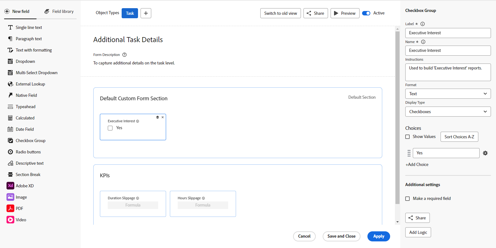

# Panoramica di Progettazione moduli

È possibile utilizzare il nuovo progettista di moduli per progettare un modulo personalizzato che gli utenti possono allegare a un oggetto Workfront. Gli utenti che lavorano sull’oggetto possono compilare il modulo personalizzato per fornire informazioni sull’oggetto.

Il nuovo progettista di moduli dispone di una nuova area di lavoro in stile area di lavoro che consente di visualizzare contemporaneamente i campi, l&#39;area di lavoro e le impostazioni dei campi. Consente inoltre di trascinare i campi all&#39;interno delle sezioni durante la progettazione del modulo.

## Come accedere al progettista del modulo

Un pulsante nella parte superiore sia del nuovo progettista di moduli che del generatore di moduli legacy consente di passare da una versione all’altra.

## Nuova funzionalità disponibile con il progettista del modulo

Con il nuovo form designer è stata aggiunta la possibilità di:

* **Copiare un campo**: è ora possibile copiare i campi esistenti facendo clic sull&#39;icona Copia nei campi direttamente dall&#39;area di lavoro.

* **Modifica le dimensioni per il testo descrittivo**: ora puoi assegnare dimensioni piccole, medie o grandi ai campi Testo descrittivo. È inoltre possibile utilizzarli nella stessa riga con altri campi.

* **Utilizza una sezione predefinita**: se il creatore del modulo non ha aggiunto una sezione nella parte superiore del modulo, nell&#39;area di lavoro è ora visibile una sezione predefinita, in modo che gli utenti possano modificare le autorizzazioni per i campi a cui non è assegnata alcuna sezione personalizzata.

  >[!NOTE]
  >
  >La sezione Default non è visibile all&#39;interno degli oggetti dopo che il modulo è stato associato all&#39;oggetto.

* **Utilizza un campo di ricerca esterno**: questo tipo di campo chiama un&#39;API esterna e restituisce i valori come opzioni in un campo a discesa.

## Funzionalità rimossa dal progettista del modulo

Sono state rimosse le seguenti funzionalità dall’interno del progettista del modulo:

* Le impostazioni del modulo sono ora disponibili nella parte superiore dell’area di lavoro

* Traccia le modifiche dei campi nei feed di aggiornamento

  >[!NOTE]
  >
  >È possibile trovare questa opzione in Configurazione > Interfaccia > Aggiorna feed

