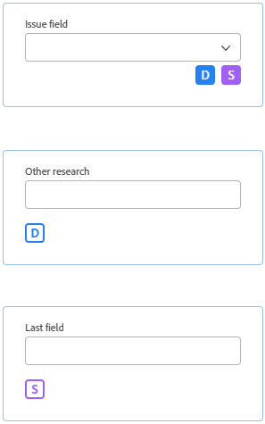

# Panoramica di Progettazione moduli

È possibile utilizzare il nuovo progettista di moduli per progettare un modulo personalizzato che gli utenti possono allegare a un oggetto Workfront. Gli utenti che lavorano sull’oggetto possono compilare il modulo personalizzato per fornire informazioni sull’oggetto.

Il nuovo progettista di moduli dispone di una nuova area di lavoro in stile area di lavoro che consente di visualizzare contemporaneamente i campi, l&#39;area di lavoro e le impostazioni dei campi. Consente inoltre di trascinare i campi all&#39;interno delle sezioni durante la progettazione del modulo.

<!-- add screenshot when field settings empty state is ready -->

## Come accedere al nuovo progettista di moduli

È disponibile un nuovo pulsante nella parte superiore sia del nuovo progettista di moduli che del generatore di moduli legacy. Puoi utilizzare questo pulsante per passare dal generatore legacy al nuovo designer.

## Nuova funzionalità disponibile con il progettista del modulo

Con il nuovo form designer è stata aggiunta la possibilità di

* **Copiare un campo**: ora puoi copiare i campi esistenti facendo clic sull’icona Copia sui campi direttamente dall’area di lavoro.

* **Modificare le dimensioni per il testo descrittivo**: ora puoi assegnare dimensioni piccole, medie o grandi ai campi Testo descrittivo. È inoltre possibile utilizzarli nella stessa riga con altri campi.

* **Usa una sezione predefinita**: se il creatore del modulo non ha aggiunto una sezione nella parte superiore del modulo, nell’area di lavoro è ora visibile una sezione predefinita che consente agli utenti di regolare le autorizzazioni per i campi ai quali non è assegnata alcuna sezione personalizzata.

  >[!NOTE]
  >
  >La sezione predefinita non è visibile all&#39;interno degli oggetti dopo che il modulo è stato allegato all&#39;oggetto.

## Funzionalità in arrivo

I seguenti elementi non sono attualmente disponibili nel progettista del modulo, ma verranno aggiunti a breve:

* Logica di visualizzazione/salto

* Filtra per campi typeahead

>[!IMPORTANT]
>
>Le configurazioni esistenti per la logica e i filtri di digitazione non saranno interessate quando si utilizza il nuovo progettista di moduli.

### Logica di visualizzazione/salto

Sebbene non sia ancora possibile aggiungere la logica di visualizzazione/salto durante la progettazione di un nuovo modulo personalizzato, è possibile visualizzare la logica di visualizzazione/salto esistente nei moduli creati nel generatore di moduli legacy.

Le icone di un campo nel progettista del modulo indicano che la logica viene applicata al campo.

Il  in basso a sinistra indica che il campo è il campo di destinazione per la logica di visualizzazione (se nel modulo viene effettuata una selezione specifica, questo campo viene visualizzato). Il  in basso a destra significa che il campo viene utilizzato per definire la logica di visualizzazione (una selezione o un valore specifico di questo campo visualizzerà il campo di destinazione).

Il  in basso a sinistra indica che il campo è il campo di destinazione per la logica di salto (se nel modulo viene effettuata una selezione specifica, il modulo passa a questo campo). Il  in basso a destra significa che il campo viene utilizzato per definire la logica di salto (una selezione o un valore specifico in questo campo salterà altri campi e passerà direttamente al campo di destinazione).

Quando si seleziona un campo a cui è applicata la logica, vengono visualizzate le regole di logica esistenti nelle impostazioni del campo.

## Funzionalità rimossa dal progettista del modulo

Sono state rimosse le seguenti funzionalità dall’interno di Forms Designer:

* Impostazioni modulo, Condivisione modulo, Schede Condivisione campo

   * Le impostazioni del modulo sono ora disponibili nella parte superiore dell’area di lavoro

   * Scheda principale Condivisione modulo e scheda secondaria Condivisione campo

  >[!NOTE]
  >
  >Puoi controllare la condivisione di moduli e campi dalla scheda Configurazione > Forms personalizzato > Forms o Campi.

* Traccia le modifiche dei campi nei feed di aggiornamento
  >[!NOTE]
  >
  >È possibile trovarlo in Configurazione > Interfaccia > Aggiorna feed
