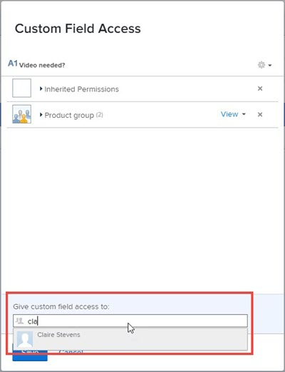

# Configurare la condivisione per campi e widget personalizzati

Per impostazione predefinita, quando si aggiunge un nuovo campo personalizzato o widget a un modulo personalizzato, chiunque nel sistema con accesso ai moduli personalizzati può modificare le proprietà di tale elemento, ad esempio l’etichetta e il nome. Puoi cambiare questa impostazione controllando con chi può essere condiviso.

Per informazioni sui campi personalizzati e i widget nei moduli personalizzati, vedere [Creare un modulo personalizzato](/help/quicksilver/administration-and-setup/customize-workfront/create-manage-custom-forms/form-designer/design-a-form/design-a-form.md).

## Requisiti di accesso

+++ Espandi per visualizzare i requisiti di accesso per la funzionalità descritta in questo articolo.

<table style="table-layout:auto"> 
 <col> 
 <col> 
 <tbody> 
  <tr> 
   <td>Pacchetto Adobe Workfront</td> 
   <td>
Qualsiasi
</td> 
  </tr> 
  <tr> 
   <td>Licenza di Adobe Workfront</td> 
   <td>
Standard

       
Piano
</td>
  </tr> 
  <tr> 
   <td>Configurazioni del livello di accesso</td> 
   <td> 
Accesso amministrativo ai moduli personalizzati
 </td> 
  </tr>  
 </tbody> 
</table>

Per informazioni, consulta [Requisiti di accesso nella documentazione di Workfront](/help/quicksilver/administration-and-setup/add-users/access-levels-and-object-permissions/access-level-requirements-in-documentation.md).

+++

<!--

## Configure sharing a custom field or widget from the list of forms

{{step-1-to-setup}}

1. In the left panel, click **Custom Forms**.
1. Click **Fields** to open the Fields area.
1. Select the item you want to configure sharing for, then click .
1. In the Custom Field Access box that displays, specify who you want to share the item with and how you want to share it:

   1. Near the lower-left corner of the **Custom Field Access** box, under **Give custom field access to**, start typing the name of a user, team, job role, group, or company you want to share the item with, then click the name when it appears.

      

   1. If you want to be more specific about how you want to share the item, click the drop-down list to the right of the name, then use any of the following options:

      

      <table style="table-layout:auto"> 
       <col> 
       <col> 
       <tbody> 
        <tr> 
         <td role="rowheader">View it</td> 
         <td> 
You can click <strong>Advanced Settings</strong> to specify whether you want the user or users to be able to use their access to add the item to a custom form or share it with other users.
 </td> 
        </tr> 
        <tr> 
         <td role="rowheader">Manage it</td> 
         <td> 
Allows access to edit the custom field and to see it in the Field Library and on the page where you build custom forms.
 
You can click <strong>Advanced Settings</strong> to specify whether you want the user or users to be able to use their access to delete the item from the system or share it with other users.
 </td> 
        </tr> 
       </tbody> 
      </table>   

1. (Optional) Repeat the previous step to add other names to the list and configure their options.
1. (Optional) Click the gear icon  in the top-right corner if you want to choose a system-wide sharing option for the field.

   Not all of the following options display in this drop-down menu at the same time. For example, the second one displays only when one of the other two are selected.

   * **Make this editable system-wide so that everyone in Workfront can edit it** (the default option)

     When you add a custom field or widget and you don't limit sharing for it, everyone in the system who has access to custom forms can view it and edit its properties.
   
   * **Remove system-wide edit access**

     Limits access to only those whom you added to the list. 
   
   * **Make this visible system-wide so that everyone in Workfront can see it**

1. Click **Save**.

-->

## Configurare la condivisione di un campo personalizzato o di un widget

{{step-1-to-setup}}

1. Nel pannello a sinistra, fai clic su **Forms personalizzato**.
1. Per condividere da un elenco di moduli e campi:

   1. Fare clic su **Campi** per aprire l&#39;area Campi.
   1. Seleziona il campo da condividere, quindi fai clic sull&#39;icona .

1. Per condividere da Progettazione moduli:
   1. Aprire un modulo personalizzato o crearne uno nuovo.
   1. Nella finestra di progettazione del modulo, seleziona il campo da condividere, quindi fai clic su **Condividi** nell&#39;area di modifica campi a destra.

1. Nella casella Condivisione, in **Concedi l&#39;accesso al campo a**, inizia a digitare il nome dell&#39;utente, del team, della mansione, del gruppo, della società o del profilo aziendale con cui vuoi condividere l&#39;elemento, quindi premi **Invio** quando viene visualizzato il nome.
1. Per informazioni più specifiche sulla condivisione dell&#39;elemento, fare clic sul menu a discesa a destra del nome, quindi utilizzare una delle opzioni seguenti:

   * **Visualizzazione**: fare clic sull&#39;icona **Impostazioni avanzate**  per specificare se si desidera che gli utenti possano aggiungere l&#39;elemento a un modulo personalizzato o condividerlo con altri utenti.
   * **Gestisci**: consente l&#39;accesso per modificare il campo personalizzato e visualizzarlo sia nella raccolta campi che nel progettista del modulo. Fare clic sull&#39;icona **Impostazioni avanzate**  per specificare se si desidera che gli utenti possano eliminare l&#39;elemento dal sistema o condividerlo con altri utenti.

1. (Facoltativo) Ripeti i passaggi 5-6 per aggiungere altri nomi all’elenco e configurarne le opzioni.
1. (Facoltativo) Scegli un’opzione di condivisione a livello di sistema per il campo:

   * **Tutti nel sistema possono modificare** (opzione predefinita)

     Quando si aggiunge un campo personalizzato o un widget e non si limita la condivisione, tutti gli utenti del sistema che hanno accesso ai moduli personalizzati possono visualizzarlo e modificarne le proprietà.

   * **Tutti nel sistema possono visualizzare**

     Tutti gli utenti del sistema che hanno accesso ai moduli personalizzati possono visualizzare il campo, ma non modificarlo.

   * **Accesso consentito solo agli invitati**

     Limita l’accesso solo a quelli aggiunti all’elenco.

   

1. Fai clic su **Salva**.

## Accesso ereditato a campi e widget personalizzati quando viene condiviso un modulo personalizzato

Quando qualcuno condivide un modulo personalizzato con un gruppo, una mansione, un team, una società o un profilo aziendale, i destinatari ereditano l’accesso in visualizzazione a tutti i campi personalizzati e i widget presenti nel modulo. Questo livello di accesso agli elementi nel modulo viene sempre mantenuto, in modo che il modulo possa funzionare per i destinatari come previsto dalla persona che lo ha creato. Ciò vale anche per i destinatari che dispongono dell’accesso di modifica al modulo.

Puoi scoprire chi ha ereditato l’accesso a un campo personalizzato o a un widget e rimuoverne l’accesso.

>[!NOTE]
>
>Se un destinatario dispone dell’accesso in gestione a un campo personalizzato o a un widget nel modulo personalizzato condiviso, tale accesso viene mantenuto per il destinatario.

### Scopri chi ha ereditato l’accesso a un campo o a un widget personalizzato {#find-out-who-has-inherited-access-to-a-custom-field-or-widget}

{{step-1-to-setup}}

1. Nel pannello a sinistra, fai clic su **Forms personalizzato**.
1. Fai clic su **Campi**, quindi seleziona il campo, l&#39;immagine o il widget di accesso.
1. Nella casella visualizzata fare clic su **Autorizzazioni ereditate** e visualizzare i nomi visualizzati.
1. Fare clic su **Annulla**.

### Rimuovere l&#39;accesso a un campo personalizzato o a un widget in un modulo personalizzato condiviso {#remove-access-to-a-custom-field-or-widget-in-a-custom-form-that-was-shared}

Se devi rimuovere l’accesso a un campo personalizzato o a un widget in un modulo personalizzato condiviso, devi annullare la condivisione del modulo. Per istruzioni, vedere la sezione [Rimuovere l&#39;accesso a un modulo personalizzato](/help/quicksilver/administration-and-setup/customize-workfront/create-manage-custom-forms/share-access-to-a-custom-form.md#remove-access-to-a-custom-form) nell&#39;articolo [Condividere un modulo personalizzato](/help/quicksilver/administration-and-setup/customize-workfront/create-manage-custom-forms/share-access-to-a-custom-form.md).

