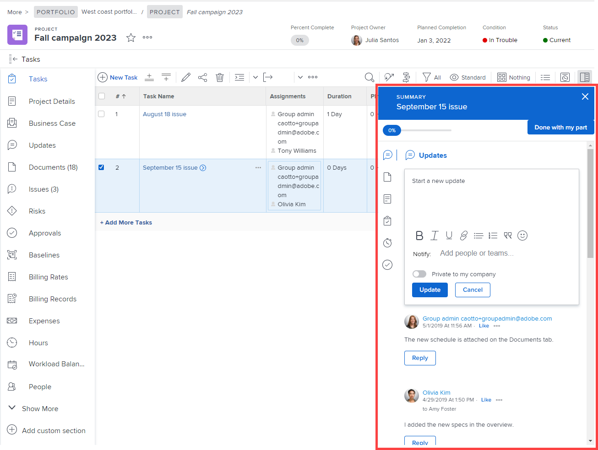

# Personalizzare la visualizzazione Dettagli utilizzando un modello di layout

<!--The highlighted information on this page refers to functionality not yet generally available. It is available for all customers in the Preview environment and for a select group of customers in the Production environment.-->

In qualità di amministratore di Adobe Workfront, puoi utilizzare un modello di layout per determinare quali informazioni vengono visualizzate quando un utente fa clic sull&#39;icona Dettagli  nel pannello a sinistra durante la visualizzazione di un&#39;attività, un problema, un documento, un programma o un portfolio.

<!--
or billing record
-->

È inoltre possibile modificare l&#39;ordine di visualizzazione delle informazioni. Ad esempio, per tutte le attività visualizzate dagli utenti, è possibile spostare le informazioni personalizzate di Forms nella parte superiore della visualizzazione Dettagli per tutte le attività visualizzate dagli utenti.

Per informazioni sulla creazione di modelli di layout, vedere [Creare e gestire modelli di layout](../use-layout-templates/create-and-manage-layout-templates.md).

Per informazioni sui modelli di layout per i gruppi, vedere [Creare e modificare i modelli di layout di un gruppo](../../../administration-and-setup/manage-groups/work-with-group-objects/create-and-modify-a-groups-layout-templates.md).

Dopo aver configurato un modello di layout, è necessario assegnarlo agli utenti affinché le modifiche apportate siano visibili agli altri utenti. Per informazioni sull&#39;assegnazione di un modello di layout agli utenti, vedere [Assegnare gli utenti a un modello di layout](../use-layout-templates/assign-users-to-layout-template.md).

Le modifiche apportate alla visualizzazione Dettagli per un oggetto determinano inoltre la disponibilità e l&#39;ordine dei campi visualizzati dagli utenti nelle aree seguenti:

* Caselle &quot;Crea oggetto&quot;, ad esempio Crea attività

  

* Schermate &quot;Modifica oggetto&quot; durante la modifica di un oggetto, come Modifica attività, Modifica problema e Modifica progetto

  

* Quando si modificano oggetti in blocco, viene visualizzata la schermata Modifica oggetti. Attualmente questo è supportato per la modifica in blocco di progetti.

  

* Pannello di riepilogo  per elenchi di attività e problemi

  

  >[!NOTE]
  >
  >Le modifiche apportate ai modelli di layout influiscono sull&#39;ordine e sulla disponibilità dei campi nel pannello Riepilogo solo per le attività e i problemi assegnati all&#39;utente connesso.

* Caselle di conversione, ad esempio le caselle Converti problema in attività o Converti problema in progetto.

  

Per informazioni sui modelli di layout per i gruppi, vedere [Creare e modificare i modelli di layout di un gruppo](../../../administration-and-setup/manage-groups/work-with-group-objects/create-and-modify-a-groups-layout-templates.md).

## Requisiti di accesso

+++ Espandi per visualizzare i requisiti di accesso per la funzionalità in questo articolo.

<table style="table-layout:auto"> 
 <col> 
 <col> 
 <tbody> 
  <tr> 
   <td>Pacchetto Adobe Workfront</td> 
   <td>
Qualsiasi
</td> 
  </tr> 
  <tr> 
   <td>Licenza Adobe Workfront</td> 
   <td>
Standard

       
Piano
</td>
  </tr> 
  </tr> 
  <tr> 
   <td>Configurazioni del livello di accesso</td> 
   <td> 
Per eseguire questi passaggi a livello di sistema, è necessario disporre del livello di accesso Amministratore di sistema.

        
Per eseguirli per un gruppo, è necessario essere un manager di tale gruppo.
 </td> 
  </tr> 
 </tbody> 
</table>

Per informazioni, consulta [Requisiti di accesso nella documentazione di Workfront](/help/quicksilver/administration-and-setup/add-users/access-levels-and-object-permissions/access-level-requirements-in-documentation.md).

+++

## Personalizzare gli elementi visualizzati dagli utenti nella visualizzazione Dettagli

1. Iniziare a lavorare su un modello di layout, come descritto in [Creare e gestire modelli di layout](../../../administration-and-setup/customize-workfront/use-layout-templates/create-and-manage-layout-templates.md).
1. Fai clic sulla freccia giù  in **Personalizza gli elementi visualizzati dagli utenti**, quindi fai clic su **Progetto**, **Attività**, **Problema**, **Programma** o **Portfolio.**
<!--
, or billing record
-->

1. Nella sezione **Dettagli** eseguire una delle operazioni seguenti per personalizzare la visualizzazione della visualizzazione Dettagli:

   * Trascina le intestazioni di sezione  per modificarne l&#39;ordine.
   * Abilita o disabilita le opzioni nelle varie aree, ad esempio **Panoramica**, **Finanza** e **Forms personalizzato**, per mostrarle o nasconderle.

     Se si nascondono tutti i campi in una di queste sezioni, l&#39;intera sezione viene nascosta.

     Tutti i campi sono attivati per impostazione predefinita. È possibile selezionare o deselezionare la casella di controllo **Seleziona tutto** in un&#39;area per visualizzare o nascondere tutti i campi in tale area.

   

1. Continuate a personalizzare il modello di layout.

   Oppure

   Se hai completato la personalizzazione, fai clic su **Salva**.

   >[!TIP]
   >
   >Puoi fare clic su Salva in qualsiasi momento per salvare l’avanzamento, quindi continuare a modificare il modello in un secondo momento.
