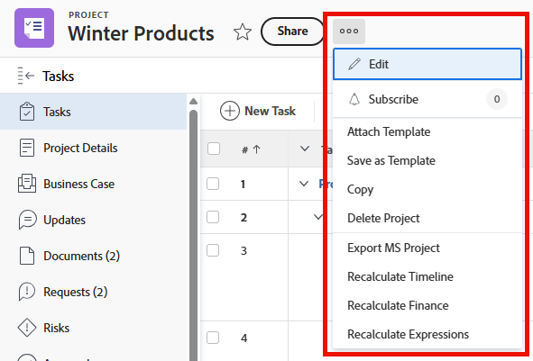

# Personalizzare il menu Altro utilizzando un modello di layout

{{highlighted-preview-article-level}}

È possibile utilizzare un modello di layout per determinare le opzioni visualizzate quando un utente fa clic sul menu Altro (il menu a tre punti ) durante la visualizzazione dei seguenti oggetti in Adobe Workfront: progetti, attività, problemi, portafogli e programmi.

Per informazioni sulla creazione di modelli di layout, vedere [Creare e gestire modelli di layout](../use-layout-templates/create-and-manage-layout-templates.md).

Per informazioni sui modelli di layout per i gruppi, vedere [Creare e modificare i modelli di layout di un gruppo](../../../administration-and-setup/manage-groups/work-with-group-objects/create-and-modify-a-groups-layout-templates.md).

Dopo aver configurato un modello di layout, è necessario assegnarlo agli utenti affinché le modifiche apportate siano visibili agli altri utenti. Per informazioni sull&#39;assegnazione di un modello di layout agli utenti, vedere [Assegnare gli utenti a un modello di layout](../use-layout-templates/assign-users-to-layout-template.md).

## Requisiti di accesso

+++ Espandi per visualizzare i requisiti di accesso per la funzionalità descritta in questo articolo.

<table style="table-layout:auto"> 
 <col> 
 <col> 
 <tbody> 
  <tr> 
   <td>Pacchetto Adobe Workfront</td> 
   <td>Qualsiasi</td> 
  </tr> 
  <tr> 
   <td>Licenza di Adobe Workfront</td> 
   <td>
Standard

       
Piano
</td>
  </tr> 
  </tr> 
  <tr> 
   <td>Configurazioni del livello di accesso</td> 
   <td> 
Per eseguire questi passaggi a livello di sistema, è necessario disporre del livello di accesso Amministratore di sistema.

        
Per eseguirli per un gruppo, è necessario essere un manager di tale gruppo.
 </td> 
  </tr> 
 </tbody> 
</table>

Per informazioni, consulta [Requisiti di accesso nella documentazione di Workfront](/help/quicksilver/administration-and-setup/add-users/access-levels-and-object-permissions/access-level-requirements-in-documentation.md).

+++

## Personalizzare il menu Altro per un&#39;area in Workfront

1. Iniziare a lavorare su un modello di layout, come descritto in [Creare e gestire modelli di layout](../../../administration-and-setup/customize-workfront/use-layout-templates/create-and-manage-layout-templates.md).
1. Nel menu a discesa **Personalizza gli utenti visualizzati**, fare clic sul nome di un tipo di oggetto o di un&#39;area di Workfront di cui si desidera personalizzare il menu Altro.
1. Fare clic su **Seleziona opzioni di menu**.
1. Nella casella **Seleziona opzioni menu** eseguire una delle operazioni seguenti per determinare gli elementi visualizzati dagli utenti nel menu Altro per l&#39;area Workfront o il tipo di oggetto selezionato:

   * Fai clic sulle icone **Mostra**  o **Nascondi**  per visualizzare o nascondere le sezioni nel pannello a sinistra. Non puoi nascondere elementi che non hanno un&#39;icona **Mostra** o **Nascondi**.

   * Trascina gli elementi  per modificarne l&#39;ordine nel pannello sinistro.

1. Fai clic su **Fine**.
