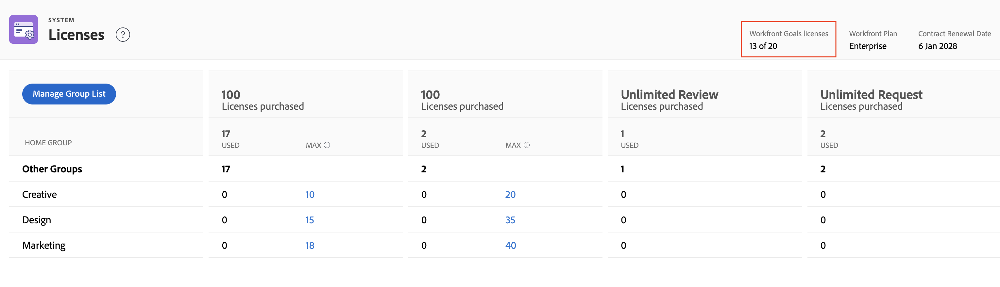

# Gestione delle licenze disponibili nel sistema

In qualità di amministratore di Adobe Workfront, puoi accedere a informazioni sul tuo account Workfront, tra cui il numero di licenze acquistate per la tua organizzazione e il numero di licenze attualmente in uso.

## Requisiti di accesso

Per eseguire i passaggi descritti in questo articolo, è necessario disporre dei seguenti diritti di accesso:

<table style="table-layout:auto">
 <col> 
 <col> 
 <tbody> 
  <tr> 
   <td role="rowheader">piano Adobe Workfront</td> 
   <td>Qualsiasi</td> 
  </tr> 
  <tr> 
   <td role="rowheader">Licenza Adobe Workfront</td> 
   <td>Piano</td> 
  </tr> 
  <tr> 
   <td role="rowheader">Configurazioni a livello di accesso</td> 
   <td> 
Devi essere un amministratore Workfront. Per ulteriori informazioni, consulta <a href="../../administration-and-setup/add-users/configure-and-grant-access/grant-a-user-full-administrative-access.md" class="MCXref xref">Concedere a un utente pieno accesso amministrativo</a>.
 
<b>NOTA</b>: Se non disponi ancora dell’accesso, chiedi all’amministratore Workfront se ha impostato ulteriori restrizioni nel livello di accesso. Per informazioni su come un amministratore Workfront può modificare il livello di accesso, consulta <a href="../../administration-and-setup/add-users/configure-and-grant-access/create-modify-access-levels.md" class="MCXref xref">Creare o modificare livelli di accesso personalizzati</a>.
 </td> 
  </tr> 
 </tbody> 
</table>

## Visualizza le licenze della tua organizzazione

Il numero di licenze utilizzate in uso viene aggiornato automaticamente quando si assegnano livelli di accesso agli utenti aggiunti a Workfront. Per ulteriori informazioni, consulta [Aggiungi utenti](../../administration-and-setup/add-users/create-and-manage-users/add-users.md).

Per visualizzare le informazioni sulla licenza nel sistema:

1. Fai clic sul pulsante **Menu principale** icona  nell’angolo in alto a destra di Adobe Workfront, quindi fai clic su **Configurazione** .

1. Nella parte inferiore del pannello di sinistra, fai clic su **Sistema** > **Licenze**.

   Per ulteriori informazioni sulle licenze elencate in questa pagina, consulta [Panoramica sulle licenze legacy](../../administration-and-setup/add-users/access-levels-and-object-permissions/wf-licenses.md).

   >[!NOTE]
   >
   >Le licenze di prova sono disponibili solo per i clienti che hanno acquistato il componente aggiuntivo a pagamento per Workfront Proof oltre alla propria licenza Workfront. Per informazioni su questo componente aggiuntivo, consulta [Prova Workfront](../../workfront-proof/workfront-proof.md).

1. (Condizionale) Se viene visualizzato il messaggio **Per impostare un massimo, è necessario aggiungere un gruppo home**, aggiungi un gruppo home nel sistema come spiegato nella sezione . [Aggiungere o rimuovere un gruppo home nella pagina Licenze](#add-or-remove-a-home-group-to-the-licenses-page) in questo articolo.

## Visualizza informazioni sulle licenze per i componenti aggiuntivi Workfront

Nella schermata sottostante, **5 di 10 titoli di prova** indica che questa organizzazione dispone del componente aggiuntivo Workfront Proof a pagamento e sta attualmente utilizzando 5 delle 10 licenze Workfront Proof acquistate.

Se la tua organizzazione ha acquistato obiettivi Workfront, le informazioni sulla licenza per questo prodotto vengono visualizzate anche qui. In questo caso, puoi visualizzare le seguenti informazioni:

* Numero totale di licenze Workfront Obiettivi acquistate dalla tua azienda
* Il numero di licenze Workfront Obiettivi associate agli utenti. Si tratta del numero di utenti a cui è stato concesso almeno l’accesso Visualizza agli obiettivi nel loro livello di accesso.

Per informazioni sugli obiettivi di Workfront, vedi [Panoramica sugli obiettivi di Adobe Workfront](../../workfront-goals/goal-management/wf-goals-overview.md). Per informazioni sull&#39;accesso agli obiettivi di Workfront, vedi [Concedere l’accesso agli obiettivi di Adobe Workfront](../../administration-and-setup/add-users/configure-and-grant-access/grant-access-goals.md)

>[!NOTE]
>
>Workfront ti consente di assegnare più licenze di Workfront Obiettivi che hai acquistato. Tuttavia, quando assegni più licenze rispetto a quanto consentito dal tuo contratto Workfront Obiettivi, un account manager Workfront ti contatterà per informarti che hai superato il numero contrattuale.

<!--
If an organization has other paid add-on products, their license information also displays here. If the organization doesn't have any paid add-on products, nothing displays here. (Drafted this because not sure this is accurate: Scenario Planner is an add-on product and its licenses are not displayed there.)
-->

>[!TIP]
>
>Gli utenti senza accesso amministrativo possono utilizzare un rapporto Gruppo per visualizzare il conteggio delle licenze. Nella scheda Rapporto , crea un nuovo rapporto di gruppo e aggiungi le colonne seguenti:>
>* Limite del tipo di licenza: Limite lavoratore
>* Limite del tipo di licenza: Limite pianificazione
>
>Per ulteriori informazioni sulla creazione di un rapporto, consulta [Creare un rapporto personalizzato](../../reports-and-dashboards/reports/creating-and-managing-reports/create-custom-report.md).

## Visualizza informazioni sulle assegnazioni di documenti e prove mensili

Le decisioni relative a prove e documenti sono limitate per tutte le licenze Workfront non pagate. I limiti vengono reimpostati mensilmente per utente.

>[!IMPORTANT]
>
>I limiti di bozza e decisione del documento non si applicano agli utenti su [licenze Workfront legacy e livelli di accesso](/help/quicksilver/administration-and-setup/add-users/access-levels-and-object-permissions/wf-licenses.md).

I limiti di decisione per ogni licenza variano a seconda del piano in uso. Puoi visualizzare l’assegnazione mensile in Configurazione > Licenze.

Per ulteriori informazioni sui limiti di bozza e decisione del documento, consulta [Panoramica su documenti e prove limitati per gli utenti non pagati](/help/quicksilver/review-and-approve-work/proof-doc-decision-limits.md).

## Aggiungere o rimuovere un gruppo home nella pagina Licenze {#add-or-remove-a-home-group-to-the-licenses-page}

Per utilizzare questa funzione è necessario un piano Workfront aziendale o aziendale. Per ulteriori informazioni sui vari piani disponibili, vedi [Piani Workfront.](https://www.workfront.com/plans)

Ogni utente può essere assegnato a un solo gruppo principale. Workfront fornisce un numero di licenze orientato al gruppo calcolando il numero di licenze assegnate e attualmente utilizzate in ogni Home Group.

Se viene visualizzato il messaggio **Per impostare un massimo, è necessario aggiungere un gruppo home** nella pagina Licenze è necessario aggiungere almeno un gruppo Home alla pagina Licenze.

>[!IMPORTANT]
>
>* Per gestire in modo efficace le licenze con i gruppi home, si consiglia di configurare gruppi home specifici per le unità business prima di aggiornare il numero massimo di licenze. Per ulteriori informazioni, consulta [Panoramica dei gruppi principali](../../administration-and-setup/manage-groups/groups-overview/home-groups.md).
>* È possibile aggiungere solo gruppi di primo livello come gruppi principali, non come sottogruppi. Se a un utente è assegnato un sottogruppo come gruppo principale, la relativa licenza viene aggiunta al conteggio delle licenze per il gruppo di livello superiore sopra tale sottogruppo.
>

Per aggiungere o rimuovere un gruppo principale alla pagina Licenze:

1. Fai clic sul pulsante **Menu principale** icona  nell’angolo in alto a destra di Adobe Workfront, quindi fai clic su **Configurazione** .

1. Nella parte inferiore del pannello di sinistra, fai clic su **Sistema** > **Licenze**.

1. Fai clic su **Gestisci elenco gruppi**.
1. Inizia a digitare il nome del gruppo di primo livello nel **Gruppi home** scatola.
1. Per aggiungere il gruppo, fare clic sul suo nome quando viene visualizzato.

   Oppure

   Per rimuovere il gruppo, fate clic sull&#39;icona X a destra del nome.

1. Fai clic su **Salva**.

In qualità di amministratore Workfront, puoi impostare il numero massimo di licenze per i gruppi principali per impedire a una business unit di utilizzare licenze Workfront acquistate per altre business unit. Per istruzioni, consulta [Imposta il numero massimo di licenze per un gruppo home](#set-the-maximum-license-count-for-a-home-group) in questo articolo.

## Imposta il numero massimo di licenze per un gruppo home {#set-the-maximum-license-count-for-a-home-group}

In qualità di amministratore di Workfront, puoi impostare il numero massimo di licenze per i gruppi principali di livello principale nel sistema. Questo consente di impedire a una business unit di utilizzare le licenze Workfront acquistate per altre business unit della tua organizzazione.

Per impostazione predefinita, il numero massimo di licenze è impostato su N/D, il che significa che non vi è alcun limite.

Gli amministratori dei gruppi possono visualizzare il numero di licenze assegnate e utilizzate in un gruppo Home che gestiscono. Per ulteriori informazioni, consulta [Visualizza il numero di licenze allocate e utilizzate in un gruppo nella nuova esperienza Adobe Workfront](../../administration-and-setup/manage-groups/create-and-manage-groups/view-number-licenses-allocated-used-group.md).

Per impostare il numero massimo di licenze per un gruppo Home:

1. Fai clic sul pulsante **Menu principale** icona  nell’angolo in alto a destra di Adobe Workfront, quindi fai clic su **Configurazione** .

1. Nella parte inferiore del pannello di sinistra, fai clic su **Sistema** > **Licenze**.

1. Individuare il gruppo home nell&#39;elenco.
1. In **Max** fare clic sul valore per il quale si desidera impostare un valore massimo.
1. Digitare il numero massimo, quindi premere Invio.

   

   >[!NOTE]
   >
   >Per ripristinare il valore di licenza massimo di un gruppo sul valore predefinito, non digitare 0. Elimina invece il numero nella casella. Impostando il valore massimo della licenza su 0 si indica che non sono presenti licenze assegnate a quel gruppo.
