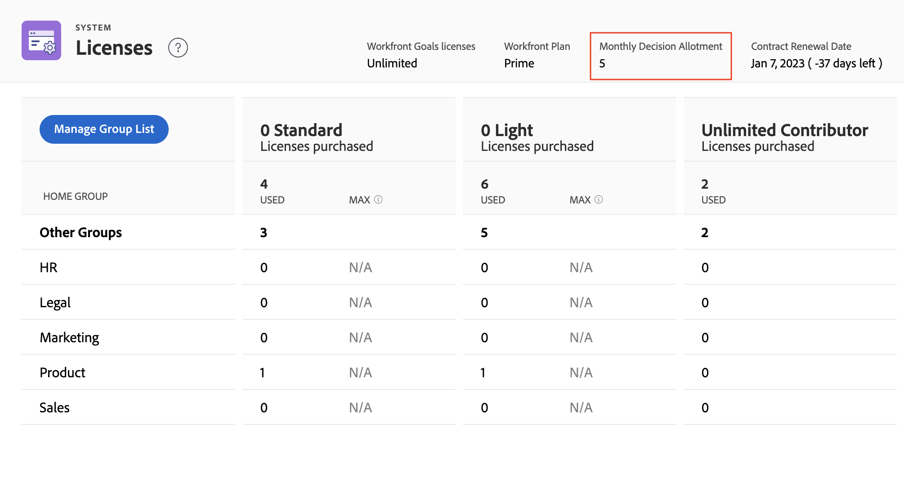

# Gestire le licenze disponibili nel sistema

<!-- Audited: 12/2023 -->

In qualità di amministratore Adobe Workfront, puoi accedere alle informazioni sul tuo account Workfront, incluso il numero di licenze acquistate per la tua organizzazione e il numero di quelle attualmente in uso.

## Requisiti di accesso

+++ Espandi per visualizzare i requisiti di accesso per la funzionalità descritta in questo articolo.

<table style="table-layout:auto"> 
 <col> 
 <col> 
 <tbody> 
  <tr> 
   <td role="rowheader">Pacchetto Workfront</td> 
   <td>
Qualsiasi
</td> 
  </tr> 
  <tr> 
   <td role="rowheader">Licenza di Adobe Workfront</td> 
   <td>
Standard
 
Piano
</td> 
  </tr> 
  <tr> 
   <td role="rowheader">Configurazioni del livello di accesso</td> 
   <td>È necessario essere un amministratore di Workfront. </td> 
  </tr> 
 </tbody> 
</table>

Per informazioni, consulta [Requisiti di accesso nella documentazione di Workfront](/help/quicksilver/administration-and-setup/add-users/access-levels-and-object-permissions/access-level-requirements-in-documentation.md).

>[!NOTE]
>
>Le seguenti istruzioni si applicano ai pacchetti Select, Prime e Ultimate.
>
>Per il pacchetto Select:
>
>1. Gli amministratori di sistema non possono impostare limiti per i gruppi home.
>2. Gli amministratori di sistema possono visualizzare solo il numero totale di licenze utilizzate in tutti i gruppi home.
>3. Gli amministratori dei gruppi non possono accedere alla pagina Licenze.
>
>Per i pacchetti Prime e Ultimate:
>
>1. Gli amministratori di sistema possono aggiungere i gruppi home alla pagina Licenze per visualizzare l&#39;utilizzo delle licenze in tali gruppi e possono anche impostare i limiti di licenza.
>2. Gli amministratori dei gruppi possono accedere alla pagina Licenze e visualizzare l&#39;utilizzo delle licenze nei gruppi gestiti che sono state aggiunte alla pagina Licenze dagli amministratori di sistema.
>3. Gli amministratori dei gruppi non possono visualizzare informazioni per altri gruppi home o aggiungere valori massimi.

+++

## Visualizzare le licenze della tua organizzazione

Il numero di licenze in uso viene aggiornato automaticamente quando si assegnano i livelli di accesso agli utenti aggiunti a Workfront. Per ulteriori informazioni, consulta [Aggiungere utenti](../../administration-and-setup/add-users/create-and-manage-users/add-users.md).

Per visualizzare le informazioni sulla licenza nel sistema:

{{step-1-to-setup}}

1. Nella parte inferiore del pannello a sinistra, fai clic su **Sistema** > **Licenze**.

   Per ulteriori informazioni sulle licenze elencate in questa pagina, consulta [Panoramica sulle licenze](../../administration-and-setup/add-users/access-levels-and-object-permissions/wf-licenses.md).

   >[!NOTE]
   >
   >Le licenze Proof sono disponibili solo per i clienti che hanno acquistato il componente aggiuntivo Workfront Proof a pagamento oltre alla licenza Workfront. Per informazioni su questo componente aggiuntivo, vedere [Workfront Proof: article index](../../workfront-proof/workfront-proof.md).

1. (Condizionale) Se viene visualizzato il messaggio **Per impostare un valore massimo, è necessario aggiungere un gruppo home**, aggiungere un gruppo home nel sistema come spiegato nella sezione [Aggiungere o rimuovere un gruppo home alla pagina Licenze](#add-or-remove-a-home-group-to-the-licenses-page) in questo articolo.

   >[!NOTE]
   >
   >Per i nuovi piani, il piano Seleziona non consente agli amministratori di visualizzare le licenze per gruppo home. Puoi visualizzare solo il numero complessivo di licenze utilizzate. I piani Prime e Ultimate consentono di impostare il numero massimo di licenze per Gruppo Home.

## Visualizzare informazioni sulle licenze per i componenti aggiuntivi di Workfront

Se la tua organizzazione dispone del componente aggiuntivo Workfront Proof a pagamento, vengono visualizzati il numero di licenze utilizzate e il numero di licenze disponibili. Ad esempio, **5 delle 10 licenze di verifica** indica che l&#39;organizzazione sta attualmente utilizzando 5 delle 10 licenze di Workfront Proof acquistate.

Se la tua organizzazione ha acquistato Workfront Goals, qui vengono visualizzate anche le informazioni sulla licenza per questo prodotto. In questo caso, puoi visualizzare le seguenti informazioni:

* Numero totale di licenze Workfront Goals acquistate dall&#39;azienda
* Il numero di licenze Workfront Goals associate agli utenti. Si tratta del numero di utenti a cui è stato concesso almeno l&#39;accesso in visualizzazione agli obiettivi nel livello di accesso.

Per informazioni sugli obiettivi di Workfront, vedere [Panoramica sugli obiettivi di Adobe Workfront](../../workfront-goals/goal-management/wf-goals-overview.md). Per informazioni sull&#39;accesso agli obiettivi di Workfront, vedere [Concedere l&#39;accesso agli obiettivi di Adobe Workfront](../../administration-and-setup/add-users/configure-and-grant-access/grant-access-goals.md).

>[!NOTE]
>
>Workfront consente di assegnare più licenze Workfront Goals acquistate. Tuttavia, quando assegni più licenze di quelle consentite dal tuo contratto Workfront Goals, un account manager Workfront ti contatterà per informarti che hai superato il numero contrattuale.
>

<!--
If an organization has other paid add-on products, their license information also displays here. If the organization doesn't have any paid add-on products, nothing displays here. (Drafted this because not sure this is accurate: Scenario Planner is an add-on product and its licenses are not displayed there.)
-->

>[!TIP]
>
>Gli utenti senza accesso amministrativo possono utilizzare un report Gruppo per visualizzare il conteggio delle licenze. Nella scheda Report, crea un nuovo report di gruppo e aggiungi le seguenti colonne:
>
>* Limite tipo di licenza: limite lavoratore
>* Limite tipo di licenza: limite planner
>
>Per ulteriori informazioni sulla creazione di un report, vedere [Creare un report personalizzato](../../reports-and-dashboards/reports/creating-and-managing-reports/create-custom-report.md).

## Visualizza le informazioni sulle allocazioni con prova mensile e con decisione documentale

>[!IMPORTANT]
>
>I limiti di decisione per prove e documenti si applicano solo agli utenti delle nuove licenze. Per ulteriori informazioni, consulta [Panoramica delle nuove licenze](/help/quicksilver/administration-and-setup/add-users/how-access-levels-work/licenses-overview.md).

Le decisioni su prove e documenti sono limitate per tutte le licenze Workfront non a pagamento. I limiti vengono ripristinati per utente ogni mese.

I limiti di decisione per ciascuna licenza variano a seconda del piano su cui ti trovi. Puoi visualizzare la tua assegnazione mensile in Configurazione > Licenze.

Per ulteriori informazioni sui limiti di prova e di decisione del documento, consulta [Panoramica sui documenti limitati e sulla decisione della prova per utenti non a pagamento](/help/quicksilver/review-and-approve-work/proof-doc-decision-limits.md).

## Aggiungere o rimuovere un gruppo Home alla pagina Licenze {#add-or-remove-a-home-group-to-the-licenses-page}

Ogni utente può essere assegnato a un solo gruppo home. Workfront fornisce un conteggio delle licenze orientato al gruppo calcolando quante licenze sono allocate e attualmente utilizzate in ciascun Gruppo home.

Se viene visualizzato il messaggio **Per impostare un valore massimo, è necessario aggiungere un gruppo home** nella pagina Licenze, è necessario aggiungere almeno un gruppo home alla pagina Licenze.

>[!IMPORTANT]
>
>* Per gestire in modo efficace le licenze con i gruppi home, consigliamo di configurare gruppi home specifici per le business unit prima di aggiornare il numero massimo di licenze. Per ulteriori informazioni, vedere [Panoramica sui gruppi home](../../administration-and-setup/manage-groups/groups-overview/home-groups.md).
>* È possibile aggiungere come gruppi iniziali solo i gruppi di livello superiore, non i sottogruppi. Se a un utente è assegnato un sottogruppo come gruppo home, la licenza viene aggiunta al conteggio delle licenze per il gruppo di livello superiore al di sopra di tale sottogruppo.
>

Per aggiungere o rimuovere un gruppo Home alla pagina Licenze:

{{step-1-to-setup}}

1. Nella parte inferiore del pannello a sinistra, fai clic su **Sistema** > **Licenze**.

1. Fai clic su **Gestisci elenco gruppi**.
1. Iniziare a digitare il nome del gruppo di primo livello nella casella **Gruppi home**.
1. Per aggiungere il gruppo, fai clic sul suo nome quando viene visualizzato.

   Oppure

   Per rimuovere il gruppo, fai clic sull&#39;icona X a destra del suo nome.

1. Fai clic su **Salva**.

In qualità di amministratore Workfront, puoi impostare il numero massimo di licenze per i gruppi home per impedire a una Business Unit di utilizzare le licenze Workfront acquistate per altre Business Unit. Per istruzioni, consulta [Impostare il numero massimo di licenze per un gruppo home](#set-the-maximum-license-count-for-a-home-group) in questo articolo.

## Impostare il numero massimo di licenze per un gruppo home {#set-the-maximum-license-count-for-a-home-group}

In qualità di amministratore di Workfront, puoi impostare il numero massimo di licenze per i gruppi home di livello superiore nel tuo sistema. Ciò consente di impedire a una Business Unit di utilizzare le licenze Workfront acquistate per altre Business Unit all&#39;interno dell&#39;organizzazione.

Per impostazione predefinita, il numero massimo di licenze è impostato su N/D, il che significa che non esiste alcun limite.

Gli amministratori di gruppi possono visualizzare il numero di licenze allocate e utilizzate in un Gruppo predefinito che gestiscono. Per ulteriori informazioni, vedere [Visualizzare il numero di licenze allocate e utilizzate in un gruppo](../../administration-and-setup/manage-groups/create-and-manage-groups/view-number-licenses-allocated-used-group.md).

Per impostare il numero massimo di licenze per un gruppo home:

{{step-1-to-setup}}

1. Nella parte inferiore del pannello a sinistra, fai clic su **Sistema** > **Licenze**.

1. Individuare il Gruppo Home nell&#39;elenco.
1. Nella colonna **Max** del gruppo fare clic sul valore per il quale si desidera impostare un valore massimo.
1. Digita il numero massimo, quindi premi Invio.

   

   >[!NOTE]
   >
   >Per ripristinare il valore di licenza massimo di un gruppo al valore predefinito, non digitare 0. Eliminare invece il numero nella casella. L&#39;impostazione del valore massimo della licenza su 0 indica che non sono state allocate licenze a quel gruppo.
