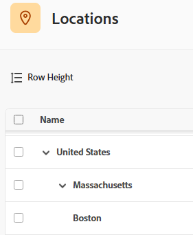

# Configurare le posizioni

{{preview-fast-release-general}}

Puoi configurare le posizioni predefinite disponibili per assegnare gli attributi ai ruoli nelle schede tariffa. In questo modo le schede dei tassi riflettono accuratamente i tassi di mercato in ogni località.

Le schede delle tariffe consentono all’organizzazione di gestire facilmente le tariffe di fatturazione per i progetti. Per ulteriori informazioni, vedere [Gestire le schede delle tariffe](/help/quicksilver/administration-and-setup/manage-enterprise-operations/manage-rate-cards.md) e [Definire gli attributi delle tariffe](/help/quicksilver/administration-and-setup/manage-enterprise-operations/define-rate-attributes.md).

## Requisiti di accesso

+++ Espandi per visualizzare i requisiti di accesso per la funzionalità descritta in questo articolo.

<table style="table-layout:auto"> 
 <col> 
 <col> 
 <tbody> 
  <tr> 
   <td>[!DNL Adobe Workfront] pacchetto</td> 
   <td>Flusso di lavoro Ultimate</td> 
  </tr> 
  <tr> 
   <td>[!DNL Adobe Workfront] licenza</td> 
   <td>[!UICONTROL Standard]</td>
  </tr> 
  <tr> 
   <td>Configurazioni del livello di accesso</td> 
   <td>[!UICONTROL Amministratore di sistema]</td> 
  </tr> 
 </tbody> 
</table>

Per informazioni, consulta [Requisiti di accesso nella documentazione di Workfront](/help/quicksilver/administration-and-setup/add-users/access-levels-and-object-permissions/access-level-requirements-in-documentation.md).

+++

## Aggiungi una posizione

{{step-1-to-setup}}

1. Nel pannello a sinistra, fai clic su [!UICONTROL **Percorsi**].
1. Nell&#39;ambiente di produzione, fare clic su [!UICONTROL **Aggiungi altre posizioni**] nella parte inferiore dell&#39;elenco.
   Nell&#39;ambiente di anteprima, fare clic su [!UICONTROL **Nuova riga**] nella parte inferiore dell&#39;elenco.

1. Immettere il nome e la descrizione della posizione.
1. Fai clic all’esterno della riga per salvare la posizione.
1. Per eliminare una posizione nell&#39;ambiente di produzione, selezionarla nell&#39;elenco e fare clic sull&#39;icona **Elimina** .
   Per eliminare una posizione nell&#39;ambiente di anteprima, selezionarla nell&#39;elenco e fare clic su [!UICONTROL **Elimina**] nella barra delle azioni nella parte inferiore della schermata.

>[!NOTE]
>
>Le posizioni associate alle mansioni su una scheda tariffe non possono essere eliminate.

## Aggiungi una posizione secondaria

È possibile aggiungere una posizione secondaria a una posizione esistente. Ad esempio, se disponi già di una località del Regno Unito, Londra potrebbe essere una località secondaria.

Sono consentiti tre livelli di ubicazioni secondarie. Paese, stato o provincia e città sono usi comuni delle ubicazioni secondarie.

Ogni posizione secondaria può essere aggiunta come attributo in una scheda tariffa allo stesso modo di una posizione di livello superiore, per definire la tariffa per una mansione specifica in quella posizione.

{{step-1-to-setup}}

1. Nel pannello a sinistra, fai clic su [!UICONTROL **Percorsi**].
1. Nell&#39;ambiente di produzione, selezionare un percorso esistente nell&#39;elenco e fare clic su [!UICONTROL **Aggiungi percorso secondario**].
   Nell&#39;ambiente di anteprima, selezionare una posizione esistente nell&#39;elenco e fare clic su [!UICONTROL **Aggiungi posizione secondaria**] nella barra delle azioni nella parte inferiore della schermata.

1. Immettere il nome e la descrizione della posizione.
1. Fare clic all&#39;esterno dell&#39;area di immissione per salvare la posizione.

   La posizione secondaria è rientrata sotto la posizione di livello superiore.

   Immagine di esempio nell’ambiente di produzione:
   

   Immagine di esempio nell&#39;ambiente di anteprima:
   

