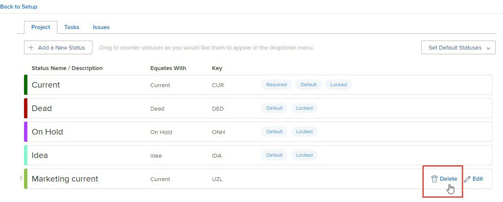

# Eliminare uno stato di gruppo

In qualità di amministratore di gruppo, è possibile eliminare uno stato per un gruppo gestito se non è configurato come stato obbligatorio o bloccato a livello di sistema o per un gruppo superiore nella gerarchia.

Se ci sono gruppi al di sopra del gruppo che gestisci, i loro amministratori possono farlo anche per il tuo gruppo. Lo stesso vale per gli amministratori di Workfront (per qualsiasi gruppo).

>[!NOTE]
>
>Non è possibile eliminare quanto segue:
>
>* Gli stati incorporati Planning, Current e Complete. È possibile aggiornare i loro nomi, modificarne i colori e bloccarli o sbloccarli, ma non è possibile eliminarli.
>* Stati in attesa di approvazione per almeno un oggetto associato al gruppo o uno dei suoi sottogruppi.

## Requisiti di accesso

Per eseguire i passaggi descritti in questo articolo, è necessario disporre dei seguenti elementi:

<table style="table-layout:auto"> 
 <col> 
 <col> 
 <tbody> 
  <tr> 
   <td role="rowheader">Piano Workfront*</td> 
   <td>Qualsiasi</td> 
  </tr> 
  <tr> 
   <td role="rowheader">Licenza Adobe Workfront*</td> 
   <td> 
Piano 
 
È necessario essere un amministratore del gruppo o un amministratore di Workfront. Per ulteriori informazioni, consulta <a href="../../../administration-and-setup/manage-groups/group-roles/group-administrators.md" class="MCXref xref">Amministratori di gruppo</a> e <a href="../../../administration-and-setup/add-users/configure-and-grant-access/grant-a-user-full-administrative-access.md" class="MCXref xref">Concedere a un utente pieno accesso amministrativo</a>.
 </td> 
  </tr> 
 </tbody> 
</table>

&#42;Per sapere quale piano o tipo di licenza hai, contatta il tuo amministratore Workfront.

## Eliminare uno stato di gruppo

1. Fai clic sul pulsante **Menu principale** icona  nell’angolo in alto a destra di Adobe Workfront, quindi fai clic su **Configurazione** .

1. Nel pannello a sinistra, fai clic su **Gruppi**.
1. Fai clic sul nome del gruppo di livello principale.
1. Nel pannello a sinistra fai clic su **Stati**.
1. Nell’elenco degli stati visualizzati, passa il cursore del mouse sullo stato da eliminare, quindi fai clic su **Elimina** quando appare all&#39;estrema destra.

   

1. Nella casella visualizzata, selezionare uno stato per designare uno stato di sostituzione per gli oggetti (progetti, attività, problemi e processi di approvazione) che utilizzavano lo stato che si sta eliminando.

   Sono disponibili solo gli stati che corrispondono allo stato che si sta eliminando. Ad esempio, se elimini uno stato che equivale a Corrente, puoi visualizzare solo gli stati che corrispondono a Corrente.

   Inoltre, lo stato visualizzato dipende dal fatto che lo stato da eliminare sia sbloccato o bloccato:

   * **Se è sbloccato**: Sono disponibili gli stati bloccati e sbloccati non nascosti.

      Oltre agli stati creati per il sottogruppo, sono inclusi anche gli stati ereditati dai gruppi a livello di sistema e di livello superiore.

   * **Se è bloccato**: Una delle seguenti affermazioni è vera:

      * Se sono presenti altri stati bloccati e non nascosti, sono disponibili solo quelli.
      * Se non è presente uno stato bloccato non nascosto, lo stato predefinito di Workfront è disponibile, anche se nascosto o sbloccato.

         Per informazioni sugli stati predefiniti di Workfront, consulta [Accedere all’elenco degli stati del progetto di sistema](../../../administration-and-setup/customize-workfront/creating-custom-status-and-priority-labels/project-statuses.md), [Accedere all&#39;elenco degli stati delle attività del sistema](../../../administration-and-setup/customize-workfront/creating-custom-status-and-priority-labels/task-statuses.md)e le informazioni sui 4 stati di problema richiesti in [Accedere all’elenco degli stati dei problemi del sistema](../../../administration-and-setup/customize-workfront/creating-custom-status-and-priority-labels/issue-statuses.md).

1. Fai clic su **Elimina stato**.

   Se lo stato eliminato era quello predefinito per quel tipo nel gruppo, viene sostituito lo stato di sostituzione.

   Se lo stato eliminato è stato impostato come stato predefinito del progetto nelle preferenze del progetto, la preferenza ora è impostata sullo stato di sostituzione.

## Quando un gruppo viene eliminato

Quando un gruppo viene eliminato e sostituito da un altro gruppo, tutti gli stati univoci che il gruppo eliminato aveva aggiunto agli stati del gruppo di sostituzione. Per ulteriori informazioni, consulta [Stati personalizzati in un gruppo spostato o eliminato](../../../administration-and-setup/manage-groups/manage-group-statuses/custom-statuses-in-group-moved-or-deleted.md).
