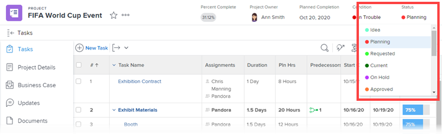

# Riordinare gli stati del gruppo

In qualità di amministratore del gruppo, è possibile modificare l’ordine di progetto, attività ed emettere stati per un gruppo gestito.

<!--
The system version of this snippet mentions a single group because a sysadmin call also reorder statuses there. Group admin version of this article is still needed.
-->

Se ci sono gruppi al di sopra del gruppo che gestisci, i loro amministratori possono farlo anche per il tuo gruppo. Lo stesso vale per gli amministratori di Workfront (per qualsiasi gruppo).

>[!NOTE]
>
>* Un amministratore Workfront può riordinare gli stati a livello di sistema. Questo non influisce sull’ordine degli stati all’interno dei gruppi.
>
>  Tuttavia, gli stati all’interno di un gruppo di livello superiore appena creato ereditano l’ordine degli stati a livello di sistema. Un nuovo sottogruppo eredita l’ordine degli stati del gruppo di un livello superiore.
>
>* È possibile riordinare gli stati bloccati. Per informazioni sugli stati bloccati, vedere [Creare o modificare uno stato di gruppo](../../../administration-and-setup/manage-groups/manage-group-statuses/create-or-edit-a-group-status.md).
>

## Requisiti di accesso

Per eseguire i passaggi descritti in questo articolo, è necessario disporre dei seguenti elementi:

<table style="table-layout:auto"> 
 <col> 
 <col> 
 <tbody> 
  <tr> 
   <td role="rowheader">piano Adobe Workfront* </td> 
   <td>Qualsiasi</td> 
  </tr> 
  <tr data-mc-conditions="SnippetConditions-wf-groups.groups"> 
   <td role="rowheader">Licenza Adobe Workfront*</td> 
   <td> 
Piano 
 
È necessario essere un amministratore del gruppo o un amministratore di Workfront. Per ulteriori informazioni, consulta <a href="../../../administration-and-setup/manage-groups/group-roles/group-administrators.md" class="MCXref xref">Amministratori di gruppo</a> e <a href="../../../administration-and-setup/add-users/configure-and-grant-access/grant-a-user-full-administrative-access.md" class="MCXref xref">Concedere a un utente pieno accesso amministrativo</a>.
 </td> 
  </tr> 
 </tbody> 
</table>

&#42;Per sapere quale piano o tipo di licenza hai, contatta il tuo amministratore Workfront.

## Ordine predefinito degli stati

Per impostazione predefinita, gli stati vengono visualizzati nell’ordine seguente:

<table style="table-layout:auto"> 
 <col> 
 <col> 
 <col> 
 <thead> 
  <tr> 
   <th width="33.33%">Progetto</th> 
   <th width="33.33%">Attività</th> 
   <th width="33.33%">Problema</th> 
  </tr> 
 </thead> 
 <tbody> 
  <tr> 
   <td> 
     
Attuali
 
     
Morto
 
     
 In sospeso 
 
     
 In Pianificazione 
 
     
 Completato 
 
     
 Richiesto 
 
     
 Approvato 
 
     
 Rifiutato 
 
     
 Idea 
 
   </td> 
   <td> 
     
Nuovo
 
     
In corso
 
     
Completato
 
   </td> 
   <td> 
     
Nuovo
 
     
In corso
 
     
Ri-Aperto
 
     
In attesa di Riscontro
 
     
In sospeso
 
     
Non Duplicabile
 
     
Chiuso
 
     
Risolto
 
     
Verifica Completata
 
     
Non Risolvibile
 
   </td> 
  </tr> 
 </tbody> 
</table>

## Riordinare gli stati per le attività e i progetti di un gruppo gestito

1. Fai clic sul pulsante **Menu principale** icona  nell’angolo in alto a destra di Adobe Workfront, quindi fai clic su **Configurazione** .

1. Nel pannello a sinistra, fai clic su **Gruppi**, quindi fai clic sul nome del gruppo.
1. Nel pannello a sinistra, fai clic su **Stati**.
1. Sopra l’elenco Stati visualizzato, fai clic sul pulsante **Progetti** o **Attività** scheda .

1. Trascina e rilascia gli stati nell’ordine desiderato.

   Il nuovo ordine di stato viene salvato automaticamente.

1. Per verificare il nuovo ordine di stato, passare a un&#39;attività o a un progetto associato al gruppo, fare clic sullo stato nell&#39;angolo in alto a destra e assicurarsi che gli stati visualizzati siano nell&#39;ordine configurato.

## Riordinare gli stati per i problemi

1. Fai clic sul pulsante **Menu principale** icona  nell’angolo in alto a destra di Adobe Workfront, quindi fai clic su **Configurazione** .

1. Nel pannello a sinistra, fai clic su **Gruppi**, quindi fai clic sul nome del gruppo.
1. Nel pannello a sinistra, fai clic su **Stati**.
1. Fai clic sul pulsante **Problemi** scheda .
1. (Facoltativo) Seleziona un tipo di problema (**Report bug**, **Cambia ordine**, **Problema** oppure **Richiesta**).

   >[!NOTE]
   >
   >* Non è possibile personalizzare l’ordine degli stati per l’elenco principale.
   >* È consigliabile ordinare gli stati per ogni tipo di problema allo stesso modo. Per ulteriori informazioni sui tipi di problemi, vedi [Configurare i tipi di richiesta](../../../administration-and-setup/set-up-workfront/configure-system-defaults/configure-request-types.md).

1. Trascina e rilascia gli stati nell’ordine desiderato.

   Il nuovo ordine di stato viene salvato automaticamente.

1. Per verificare il nuovo ordine di stato, passa a un problema associato al gruppo, fai clic sullo stato nell’angolo in alto a destra e assicurati che gli stati visualizzati siano nell’ordine configurato.
