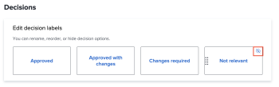

# Configurare le impostazioni di bozza predefinite

Queste impostazioni consentono di impostare valori predefiniti da applicare a tutte le nuove bozze create dagli utenti. Tuttavia, gli utenti possono ignorare la maggior parte di queste impostazioni durante la creazione di una bozza.

## Configurare le nuove impostazioni predefinite della bozza

1. Fai clic sul pulsante **Menu principale** icona  nell’angolo in alto a destra di Adobe Workfront, quindi fai clic su **Configurazione**.
1. Nel pannello a sinistra, fai clic su **Bozze** > **Impostazioni di bozza**.
1. In **Nuovi valori predefiniti di prova** configura le seguenti impostazioni:

   <table style="table-layout:auto"> 
    <col> 
    <col> 
    <tbody> 
     <tr> 
      <td role="rowheader" colspan="2"><b>Destinatari</b></td> 
     </tr> 
     <tr> 
      <td role="rowheader">Accesso obbligatorio</td> 
      <td> 
I revisori devono effettuare l'accesso utilizzando le proprie e-mail e password prima di poter visualizzare le bozze create nell'account dell'organizzazione. Quando è attivata, gli utenti non possono condividere la bozza con i revisori dei conti degli ospiti.
 
<b>IMPORTANTE</b>: Quando questa opzione è attivata, l’accesso è necessario per tutte le bozze appena create.
 </td> 
     </tr> 
     <tr> 
      <td role="rowheader">Copia il proprietario dalla bozza originale per le nuove versioni</td> 
      <td> 
Il proprietario della prima versione di una bozza è anche il proprietario di tutte le versioni consecutive della bozza, indipendentemente da chi crea queste versioni. Questa impostazione è attivata per impostazione predefinita.
 </td> 
     </tr> 
     <tr> 
      <td role="rowheader">Consenti agli utenti di eliminare i propri commenti in bozza</td> 
      <td>Gli utenti possono eliminare i propri commenti. Questa impostazione è attivata per impostazione predefinita.</td> 
     </tr> 
     <tr> 
      <td role="rowheader">Richiedi la firma elettronica per le decisioni </td> 
      <td> 
Ai decisori viene richiesto di immettere le credenziali di accesso di Workfront quando decidono in merito a una bozza.
 
<b>IMPORTANTE</b>: Quando è attivata, gli utenti non possono condividere la bozza con i revisori dei conti degli ospiti che non dispongono di credenziali di accesso.
 </td> 
     </tr> 
     <tr> 
      <td role="rowheader" colspan="2"><b>Scadenza</b></td> 
     </tr> 
     <tr> 
      <td role="rowheader">Imposta la scadenza predefinita</td> 
      <td> 
Il sistema applica questa scadenza a tutte le nuove bozze del tuo account che non dispongono di un flusso di lavoro automatizzato.
 </td> 
     </tr> 
     <tr> 
      <td role="rowheader">Notifica ai destinatari prima che la prova sia a rischio</td> 
      <td>I destinatari ricevono una notifica via e-mail prima che la prova sia considerata a rischio a seconda della scadenza specificata sopra.</td> 
     </tr> 
     <tr> 
      <td role="rowheader" colspan="2"><b>Notifiche e-mail</b></td> 
     </tr> 
     <tr> 
      <td role="rowheader">Notifica i destinatari quando vengono aggiunti a una bozza</td> 
      <td>I destinatari ricevono una notifica tramite e-mail quando vengono aggiunti a una bozza.</td> 
     </tr> 
    </tbody> 
   </table>

1. Fai clic su **Salva**.

## Configurare le decisioni di bozza

Gli utenti possono utilizzare le decisioni relative alle prove per indicare lo stato della bozza dopo la revisione.

>[!NOTE]
>
>La logica alla base delle decisioni relative alla bozza viene utilizzata per calcolare lo stato complessivo di un flusso di lavoro di bozza in presenza di più decisioni di vari livelli. Le decisioni &quot;Approvato&quot; e &quot;Approvato con le modifiche&quot; attivano la fase successiva in un flusso di lavoro automatico.

Per configurare le decisioni relative alle prove:

1. Fai clic sul pulsante **Menu principale** icona  nell’angolo in alto a destra di Adobe Workfront, quindi fai clic su **Configurazione**.
1. Nel pannello a sinistra, fai clic su **Bozze** > **Impostazioni di bozza**.
1. In **Decisioni** sezione, puoi

   1. **Rinomina la decisione**: Fare clic sul testo all&#39;interno della casella di decisione e iniziare a digitare la nuova etichetta di decisione.

      >[!TIP]
      >
      >Mantenere la logica di una decisione quando la si rinomina. Ad esempio, è possibile modificare la decisione predefinita Rifiutata in *Nuova versione richiesta*, ma non deve essere modificato in *Invia a stampanti*.

      

   1. **Ridisporre l&#39;ordine decisionale**: Trascina le caselle di decisione nell’ordine in cui desideri che vengano visualizzate nel visualizzatore di correzione.

      

   1. **Nascondere una decisione**: Passa il puntatore del mouse sulla casella di decisione e fai clic sull&#39;icona Nascondi nell&#39;angolo superiore destro.

      

1. (Facoltativo) Per tornare alle impostazioni predefinite di Workfront, fai clic su **Ripristina valori predefiniti**.
1. Fai clic su **Salva**.
