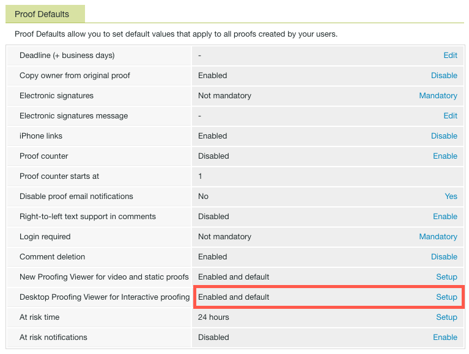

# Installare il Visualizzatore bozze desktop per l&#39;organizzazione

<!--Audited: 05/2024-->

Il Visualizzatore bozze desktop, progettato principalmente per la verifica del contenuto interattivo, è un&#39;applicazione che deve essere installata nel computer locale di ogni utente. In qualità di amministratore di Adobe Workfront o di Workfront Proof, puoi eseguire questa installazione.

## Requisiti di accesso

Per eseguire i passaggi descritti in questo articolo, è necessario disporre dei seguenti diritti di accesso:

<table style="table-layout:auto">
 <col> 
 <col> 
 <tbody> 
  <tr> 
   <td role="rowheader">piano Adobe Workfront</td> 
   <td> 
Piano corrente: Pro o superiore
 
oppure
 
Piano legacy: Premium o Select
 
Per ulteriori informazioni sulla verifica dell'accesso con i diversi piani, vedere <a href="../../../administration-and-setup/manage-workfront/configure-proofing/access-to-proofing-functionality.md" class="MCXref xref">Accesso alla funzionalità di verifica in Workfront</a>.
 </td> 
  </tr> 
  <tr> 
   <td role="rowheader">Licenza Adobe Workfront</td> 
   <td> 
Piano corrente: Lavoro o Piano
 
Piano legacy: qualsiasi (per l’utente deve essere abilitata la verifica)
 </td> 
  </tr> 
  <tr> 
   <td role="rowheader">Configurazioni del livello di accesso</td> 
   <td> 
Nel profilo di autorizzazione bozza deve essere selezionato Amministratore. Per ulteriori informazioni, consulta <a href="../../../administration-and-setup/manage-workfront/configure-proofing/configure-a-users-proofing-access.md" class="MCXref xref">Configurare l’accesso alle verifiche di un utente</a>.
 </td> 
  </tr> 
 </tbody> 
</table>

Per ulteriori dettagli sulle informazioni contenute in questa tabella, vedere [Requisiti di accesso nella documentazione di Workfront](/help/quicksilver/administration-and-setup/add-users/access-levels-and-object-permissions/access-level-requirements-in-documentation.md).

## Requisiti di sistema

Il Visualizzatore bozze desktop è supportato nei seguenti sistemi operativi:

* Windows 7 e versioni successive, 32 bit e 64 bit
* Mac OS X 10.9 e versioni successive, a 64 bit

## Prerequisiti

Per consentire agli utenti di utilizzare il Visualizzatore bozze desktop, è necessario configurare il sistema in modo che avvii il Visualizzatore bozze desktop come visualizzazione predefinita per le bozze interattive prima dell&#39;installazione.

## Configura il Visualizzatore bozze desktop come predefinito per le bozze interattive

Dopo aver installato il Visualizzatore bozze desktop per l’organizzazione, è possibile impostarlo come visualizzatore predefinito per le bozze interattive.

{{step1-to-proofing}}

1. Clic **Impostazioni account** nell&#39;angolo superiore destro di Workfront Proof, quindi fare clic sul pulsante **Impostazioni** scheda.

1. Sotto **Valori predefiniti bozza**, alla fine del **Visualizzatore bozze desktop per bozze interattive** riga, fai clic su **Configurazione**.

   

1. Clic **Abilitato e predefinito**, quindi fai clic su **Salva**.

## Installazione del visualizzatore di bozze per il desktop per gli utenti

* [Installazione del Visualizzatore bozze desktop in Mac](#installing-the-desktop-proofing-viewer-on-mac)
* [Installazione del Visualizzatore bozze desktop in Windows](#installing-the-desktop-proofing-viewer-on-windows)

### Installazione del Visualizzatore bozze desktop in Mac {#installing-the-desktop-proofing-viewer-on-mac}

1. Per scaricare l’app sul computer dell’utente, effettua una delle seguenti operazioni:

   * Se utilizzi l’ambiente Produzione, fai clic su [Download di produzione Mac per il visualizzatore di bozze desktop](https://assets.proofhq.com/nativeviewer/desktop_viewer/Workfront+Proof-2.1.19.pkg).
   * Se utilizzi l’ambiente di anteprima, fai clic su [Download dell&#39;anteprima di Mac per il visualizzatore di bozze desktop](https://assets.preview.proofhq.com/nativeviewer/desktop_viewer/Workfront+Proof+Preview-2.1.19.pkg).

1. Aprire il file appena scaricato per avviare l&#39;installazione.
1. Nella casella di installazione visualizzata, fare clic su **Continua**, quindi fai clic su **Installa**.

   

1. Accertati che ogni utente completi l’installazione aprendo una bozza interattiva dall’area Documenti di Workfront.

### Installazione del Visualizzatore bozze desktop in Windows {#installing-the-desktop-proofing-viewer-on-windows}

1. Per scaricare l’app sul computer dell’utente, effettua una delle seguenti operazioni:

   * Nell’ambiente di produzione, fai clic su [Download di Windows Production per il Visualizzatore bozze desktop](https://assets.proofhq.com/nativeviewer/desktop_viewer/Workfront+Proof+Setup+2.1.19.exe).
   * Nell’ambiente di anteprima, fai clic su [Download dell&#39;anteprima di Windows per il visualizzatore di bozze desktop](https://assets.preview.proofhq.com/nativeviewer/desktop_viewer/Workfront+Proof+Preview+Setup+2.1.19.exe).

1. Aprire il file appena scaricato per avviare l&#39;installazione.
1. Nella casella di avviso di protezione visualizzata fare clic su **Esegui**.

   

   Il Visualizzatore bozze desktop viene installato ed eseguito.

1. (Condizionale) Se installi l’applicazione utilizzando Internet Explorer, aggiorna la pagina di avvio nel browser dopo l’installazione dell’applicazione.
1. Accertati che ogni utente completi l’installazione aprendo una bozza interattiva dall’area Documenti di Workfront.
