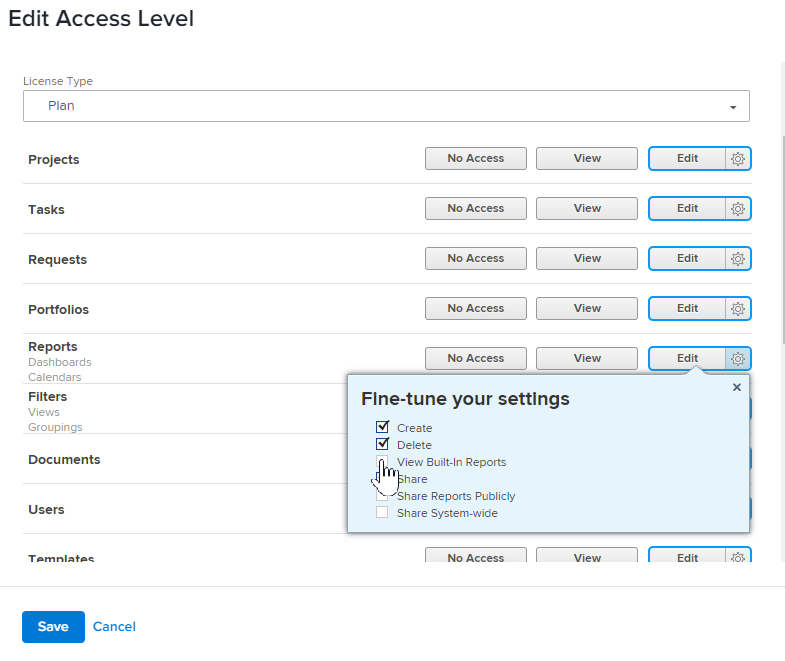

# Nascondere i rapporti incorporati

Adobe Workfront dispone di un ampio elenco di rapporti predefiniti a cui gli utenti possono accedere e visualizzare. In qualità di amministratore di Workfront, puoi modificare il livello di accesso di un utente per nascondere i rapporti incorporati in modo che gli utenti non possano accedervi.

## Requisiti di accesso

+++ Espandi per visualizzare i requisiti di accesso per la funzionalità in questo articolo.

Per eseguire i passaggi descritti in questo articolo, è necessario disporre dei seguenti diritti di accesso:

<table style="table-layout:auto"> 
 <col> 
 <col> 
 <tbody> 
  <tr> 
   <td role="rowheader">piano Adobe Workfront</td> 
   <td>Qualsiasi</td> 
  </tr> 
  <tr> 
  <tr> 
   <td role="rowheader">Licenza Adobe Workfront</td> 
   <td>
Nuovo: Standard

       
Oppure

       
Corrente: Piano
</td>
  </tr> 
  </tr> 
  <tr> 
   <td role="rowheader">Configurazioni del livello di accesso</td> 
   <td>[!UICONTROL Amministratore di sistema]</td>
  </tr> 
 </tbody> 
</table>

Per ulteriori dettagli sulle informazioni contenute in questa tabella, vedere [Requisiti di accesso nella documentazione di Workfront](/help/quicksilver/administration-and-setup/add-users/access-levels-and-object-permissions/access-level-requirements-in-documentation.md).

+++

## Nascondere i rapporti incorporati

{{step-1-to-setup}}

1. Fare clic su **Livelli di accesso**.
1. Seleziona il livello di accesso per il quale vuoi nascondere i report integrati, quindi fai clic su **Modifica**.
1. Per l&#39;oggetto **Reports**, fai clic sull&#39;icona **Settings** accanto al livello di accesso più alto disponibile, quindi deseleziona **Visualizza report incorporati**.

   

1. Fai clic su **Salva**.
