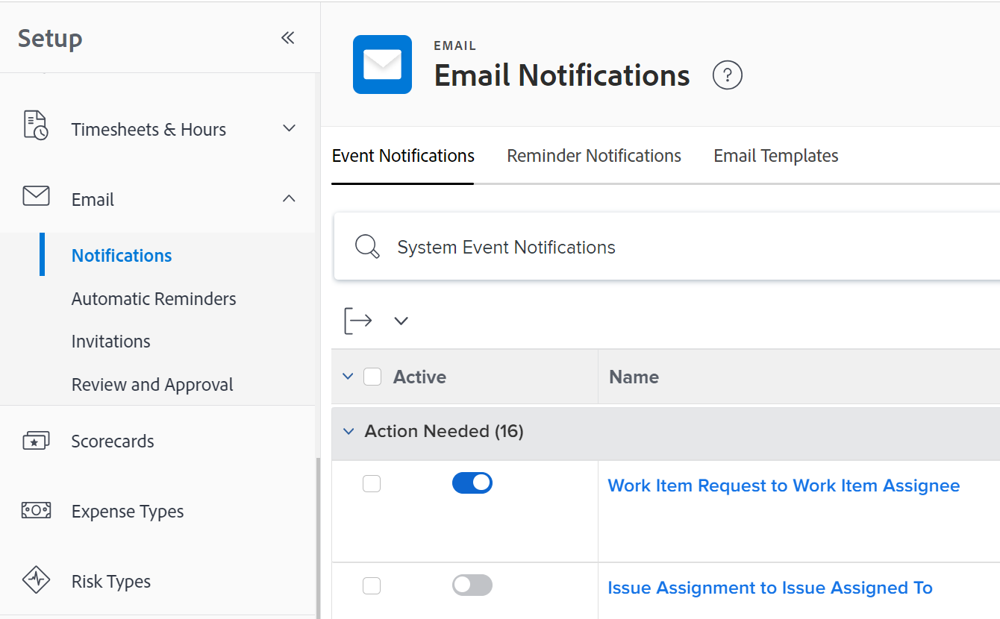

# Configurare le notifiche degli eventi per tutti nel sistema

<!-- Audited: 1/2024 -->

<!--DON'T DELETE, DRAFT OR HIDE THIS ARTICLE. IT IS LINKED TO THE PRODUCT, THROUGH THE CONTEXT SENSITIVE HELP LINKS-->

Le notifiche degli eventi attivano le e-mail agli utenti quando si verifica un determinato evento. In qualità di amministratore di Adobe Workfront o di utente con un livello di accesso alla Pianificazione, puoi configurare una notifica dell’evento per tutti gli utenti del sistema. La configurazione di una notifica di evento consiste nell’attivarla o disattivarla.

<!--Alina annotation on the word "all" in 2nd sentence: abive, drafted and remains QS only-->

A seconda dell’evento che abiliti e che l’utente mantenga abilitato sul proprio profilo, quando si verifica un evento gli utenti ricevono notifiche e-mail istantanee, giornaliere o entrambe.

Devi innanzitutto specificare quali notifiche desideri che tutti gli utenti ricevano nell’area Configurazione dell’istanza di Workfront. Dopo aver attivato una notifica nell’area Configura, questa viene visualizzata come attivata per ogni utente nella pagina del profilo.

Una volta attivate le notifiche nell’area Configura e visualizzate nelle pagine del profilo dell’utente, anche i singoli utenti o un altro utente con una licenza Pianificazione possono configurare le notifiche attivate in un profilo utente per controllare quali notifiche riceve un utente specifico e con quale frequenza. Per ulteriori informazioni, vedere [Modificare le proprie notifiche e-mail](../../../workfront-basics/using-notifications/activate-or-deactivate-your-own-event-notifications.md).

Per un elenco di tutte le notifiche di eventi attivabili e disattivabili, vedere [Tipi di notifica eventi](../../../administration-and-setup/manage-workfront/emails/event-notifications-available-in-wf.md).

Per informazioni sullo sblocco di una notifica evento in modo che gli amministratori dei gruppi possano configurarla per i loro gruppi, vedere [Sbloccare o bloccare la configurazione delle notifiche evento per tutti i gruppi](../../../administration-and-setup/manage-workfront/emails/unlock-configuration-of-event-notifications-for-groups.md) e [Visualizzare e configurare le notifiche evento per un gruppo](../../../administration-and-setup/manage-groups/create-and-manage-groups/view-and-configure-event-notifications-group.md).

## Requisiti di accesso

+++ Espandi per visualizzare i requisiti di accesso per la funzionalità in questo articolo.

Per eseguire i passaggi descritti in questo articolo, è necessario disporre dei seguenti diritti di accesso:

<table style="table-layout:auto"> 
 <col> 
 <col> 
 <tbody> 
  <tr> 
   <td role="rowheader">piano Adobe Workfront</td> 
   <td>Qualsiasi</td> 
  </tr> 
  <tr> 
   <td role="rowheader">Licenza Adobe Workfront</td> 
   <td> 
Nuovo: Standard

 
oppure
 

Corrente: Piano
 
</td> 
  </tr> 
  <tr> 
   <td role="rowheader">Configurazioni del livello di accesso</td> 
   <td> 
Planner o versione successiva, con accesso amministrativo per notifiche promemoria
 </td> 
  </tr> 
 </tbody> 
</table>

Per ulteriori dettagli sulle informazioni contenute in questa tabella, vedere [Requisiti di accesso nella documentazione di Workfront](/help/quicksilver/administration-and-setup/add-users/access-levels-and-object-permissions/access-level-requirements-in-documentation.md).

+++

## Configurare le notifiche degli eventi per tutti gli utenti

È necessario abilitare le notifiche nell’area Configurazione di Workfront prima che gli utenti possano abilitarle o disabilitarle nei loro profili individuali.

>[!TIP]
>
>Non è possibile attivare le notifiche per gli obiettivi di Workfront dall’area Configurazione. Gli utenti possono attivare queste notifiche solo nei loro profili. Gli utenti con licenze Plan possono attivarle per altri utenti. Per informazioni sull&#39;attivazione delle notifiche degli obiettivi di Workfront per gli utenti, vedere [Notifiche: Obiettivi](../../../workfront-basics/using-notifications/notifications-goals.md).

{{step-1-to-setup}}

1. Fai clic su **E-mail** > **Notifiche**.

   

1. Assicurati che la scheda **Notifiche evento** sia aperta.
1. Attiva o disattiva il pulsante a sinistra del nome dell&#39;evento.

   Per visualizzare lo stato di notifica predefinito per un evento, vedi [Notifiche evento](../../../workfront-basics/using-notifications/event-notifications.md).

1. (Facoltativo) Fai clic sul nome di una notifica di evento per personalizzare la riga dell’oggetto della notifica e-mail.

   Per ulteriori informazioni sulla personalizzazione dell&#39;oggetto delle notifiche e-mail, vedere [Personalizzare gli oggetti e-mail per le notifiche degli eventi](../../../administration-and-setup/manage-workfront/emails/custom-email-subjects-event-notification.md).

1. (Facoltativo) Se desideri sbloccare la configurazione per una notifica e-mail in modo che gli amministratori dei gruppi possano configurarla separatamente per i loro gruppi, fai clic sul pulsante  a destra della notifica per passare alla posizione sbloccata .

   Per ulteriori informazioni, vedere [Sbloccare o bloccare la configurazione delle notifiche degli eventi per tutti i gruppi](../../../administration-and-setup/manage-workfront/emails/unlock-configuration-of-event-notifications-for-groups.md).

Gli utenti possono personalizzare la frequenza di queste notifiche nel loro profilo utente.
