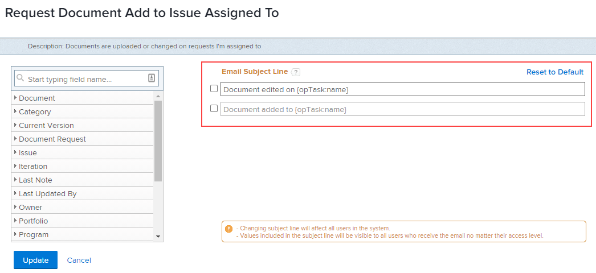

# Personalizzare gli oggetti e-mail per le notifiche degli eventi

Puoi personalizzare l’oggetto delle e-mail attivate dalle notifiche degli eventi:

La modifica dell’oggetto influisce su tutti gli utenti del sistema, indipendentemente dal livello di accesso del destinatario. Gli utenti visualizzano tutti gli oggetti e i campi inclusi nell’oggetto dell’e-mail.

Alcune notifiche di evento hanno più righe oggetto, il che significa che queste possono avere più soggetti e-mail in base alle loro funzionalità.

>[!IMPORTANT]
>
>Presta attenzione durante l’eliminazione dei campi predefiniti nei casi in cui le righe dell’oggetto fanno riferimento a più oggetti. Di seguito è riportato l’elenco delle notifiche degli eventi che contengono tali righe oggetto:
>
>* Qualcuno mi include in un aggiornamento diretto
>* Qualcuno include il mio team in un aggiornamento diretto
>* Commento elemento lavoro a Partecipanti argomento
>* Commento sull&#39;elemento di lavoro ad assegnatario elemento di lavoro
>

## Requisiti di accesso

Per eseguire i passaggi descritti in questo articolo, è necessario disporre dei seguenti diritti di accesso:

<table style="table-layout:auto"> 
 <col> 
 </col> 
 <col> 
 </col> 
 <tbody> 
  <tr> 
   <td role="rowheader">piano Adobe Workfront*</td> 
   <td>Qualsiasi</td> 
  </tr> 
  <tr> 
   <td role="rowheader">Licenza Adobe Workfront*</td> 
   <td>Piano</td> 
  </tr> 
  <tr> 
   <td role="rowheader">Configurazioni a livello di accesso*</td> 
   <td> 
Planner o superiore, con accesso amministrativo alle notifiche di promemoria
 
Per informazioni su come concedere a un utente del piano l'accesso amministrativo, vedere <a href="../../../administration-and-setup/add-users/configure-and-grant-access/grant-users-admin-access-certain-areas.md" class="MCXref xref">Consentire agli utenti l'accesso amministrativo a determinate aree</a>.
 </td> 
  </tr> 
 </tbody> 
</table>

&#42;Per informazioni sul piano, il tipo di licenza o l&#39;accesso, contattare l&#39;amministratore Workfront.

## Personalizzare le righe dell’oggetto dell’e-mail per le notifiche dell’evento {#customize-email-subject-lines-for-event-notifications}

1. Fai clic sul pulsante **Menu principale** icona  nell’angolo in alto a destra di Adobe Workfront, quindi fai clic su **Configurazione** .

1. Nel pannello a sinistra, fai clic su **E-mail** > **Notifiche**.

1. Fai clic sul pulsante **Notifiche degli eventi** scheda .
1. Fai clic sul nome della notifica dell’evento che desideri personalizzare per aprire la **Notifica evento** scatola.
1. In **Riga oggetto e-mail** modificare il testo e i campi, compresi i campi personalizzati, nell’oggetto dell’e-mail.

   I nomi dei campi aggiunti devono corrispondere alla sintassi del caso camel della nostra struttura di database. <!--For more information about how our objects and their fields are named in the Workfront database, see the [Adobe Workfront API](../../../wf-api/workfront-api.md).-->

1. Fai clic su **Aggiorna** per salvare le nuove righe oggetto delle e-mail.

## Personalizzare le righe dell’oggetto dell’e-mail per le e-mail con più oggetti

Alcune notifiche di evento hanno più righe oggetto, a seconda degli oggetti che attivano.

Ad esempio, &quot;Qualcuno mi include in un aggiornamento diretto&quot; ha due linee diverse di soggetti: il primo riguarda le attività, i problemi, le attività e i documenti modello (noti anche come &quot;referenceObject&quot;) e il secondo è per gli oggetti che consentono agli utenti di creare commenti, come portfolio, programma e così via (noti anche come &quot;topReferenceObject&quot;).

Se un utente viene incluso in una conversazione sull&#39;attività, sul problema, sull&#39;attività del modello o sul documento, verrà generato un messaggio e-mail con il primo oggetto. L’oggetto contiene &quot;referenceObject:name&quot; e il sistema definisce l’oggetto e visualizza il nome appropriato nel campo oggetto. La riga dell’oggetto dell’e-mail sarà simile alla seguente: &quot;Commento sull&#39;attività 123 su Project ABC.&quot;

Se viene aggiunta a una conversazione di progetto, viene generata un’e-mail con il secondo oggetto. Qui l’oggetto contiene &quot;topReferenceObject:name&quot; e di nuovo Workfront identifica l’oggetto a cui è stato fatto riferimento e restituisce tale nome invece di &quot;topReferenceObject:name&quot; nell’oggetto. La riga dell’oggetto dell’e-mail sarà simile alla seguente: &quot;Commento sul progetto ABC.&quot;

Per modificare l’oggetto dell’e-mail e aggiungere campi aggiuntivi a entrambe le righe dell’oggetto, consulta [Personalizzare le righe dell’oggetto dell’e-mail per le notifiche dell’evento](#customize-email-subject-lines-for-event-notifications) in questo articolo.

## Personalizzare l’oggetto dell’e-mail per le e-mail con più azioni

Alcune notifiche di evento dispongono anche di più soggetti e-mail per delineare le diverse azioni eseguite sugli oggetti.

Ad esempio, richiedere l’aggiunta di un documento a un problema è un evento che può attivare due e-mail diverse: uno per l’aggiunta del documento e uno per la modifica del documento.

Per modificare l’oggetto dell’e-mail e aggiungere campi aggiuntivi a entrambe le righe dell’oggetto, consulta [Personalizzare le righe dell’oggetto dell’e-mail per le notifiche dell’evento](#customize-email-subject-lines-for-event-notifications) in questo articolo.
