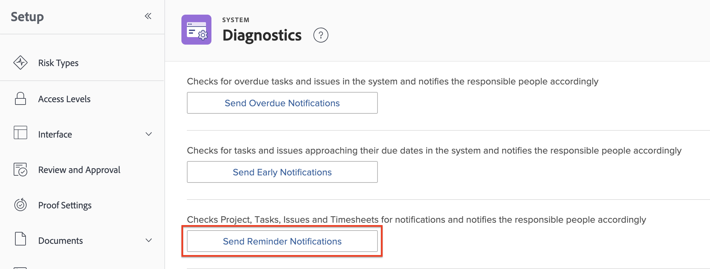

# Impostare le notifiche di promemoria

<!-- Audited: 1/2024 -->

In qualità di amministratore di Workfront, puoi creare notifiche promemoria per gli utenti e associarle a oggetti a cui desideri che gli utenti prestino particolare attenzione.

Le notifiche di tipo Promemoria generano e-mail che vengono inviate agli utenti in base a criteri specificati. Le notifiche di tipo Promemoria ricordano agli utenti di un&#39;azione che è necessario eseguire per un&#39;attività, un problema, un progetto o una scheda attività.

Dopo aver creato le notifiche promemoria, gli utenti possono associarle manualmente agli elementi di lavoro, ad esempio progetti, attività, problemi e schede attività. Per informazioni, vedere [Allegare una notifica promemoria a un oggetto](/help/quicksilver/workfront-basics/using-notifications/attach-reminder-notification-object.md).

<!--
DRAFTED IN FLARE:
An example of how this can be used would be helpful here and/or in the section 
<a href="../../../workfront-basics/using-notifications/wf-notifications.md#reminder-notifications" class="MCXref xref">Reminder notifications</a>
 in 
<a href="../../../workfront-basics/using-notifications/wf-notifications.md" class="MCXref xref">Adobe Workfront notifications</a>

-->

## Requisiti di accesso

+++ Espandi per visualizzare i requisiti di accesso per la funzionalità descritta in questo articolo.

<table style="table-layout:auto"> 
 <col> 
 <col> 
 <tbody> 
  <tr> 
   <td role="rowheader">Pacchetto Adobe Workfront</td> 
   <td>Qualsiasi</td> 
  </tr> 
  <tr> 
   <td role="rowheader">Licenza di Adobe Workfront</td> 
   <td> 
Standard 

Piano
 
</td> 
  </tr> 
  <tr> 
   <td role="rowheader">Configurazioni del livello di accesso</td> 
   <td> 
Planner o versione successiva, con accesso amministrativo alle notifiche promemoria
</td> 
  </tr> 
 </tbody> 
</table>

Per informazioni, consulta [Requisiti di accesso nella documentazione di Workfront](/help/quicksilver/administration-and-setup/add-users/access-levels-and-object-permissions/access-level-requirements-in-documentation.md).

+++

## Personalizzare l’e-mail di promemoria

Puoi personalizzare l’oggetto, il corpo e il HTML nell’e-mail di notifica del promemoria.

In alternativa, puoi utilizzare l’e-mail predefinita inclusa nella notifica del promemoria. L’e-mail predefinita utilizza il nome della notifica del promemoria come oggetto dell’e-mail e il nome dell’oggetto nel corpo dell’e-mail, incluso l’evento che ha attivato la notifica.

Se desideri personalizzare l’e-mail di promemoria, devi creare un modello e-mail e allegarlo alla notifica del promemoria.

Per informazioni sulla creazione di un modello e-mail, vedere [Configurare i modelli e-mail](../../../administration-and-setup/manage-workfront/emails/configure-email-templates.md).

## Creare una notifica di promemoria

{{step-1-to-setup}}

1. Fai clic su **E-mail** > **Notifiche** > **Notifiche promemoria**.

   

1. Fai clic su **Nuova notifica promemoria**.

1. Nell&#39;elenco a discesa fare clic sul tipo di oggetto che si desidera associare alla notifica del promemoria.

   Ad esempio, se si desidera allegare una notifica promemoria a una scheda attività, fare clic su **Scheda attività**.

1. Nella casella **Nuova notifica promemoria** visualizzata, specifica le informazioni seguenti.

   <table style="table-layout:auto"> 
    <col> 
    <col> 
    <tbody> 
     <tr> 
      <td role="rowheader">Nome notifica promemoria</td> 
      <td>Specificare un nome per la notifica del promemoria.</td> 
     </tr> 
     <tr> 
      <td role="rowheader">Periodo idoneo</td> 
      <td> 
Specifica il numero di ore, giorni lavorativi, giorni (giorni di calendario), settimane o mesi prima o dopo la data nel campo <strong>Timing</strong>.
 
<b>NOTA</b>:  
        <ul> 
         <li> 
Le notifiche di promemoria iniziano 24 ore dopo la data specificata e una volta soddisfatti tutti i criteri.
 </li> 
         <li> 
Le notifiche di promemoria per progetti, attività e problemi si attivano ogni notte a mezzanotte, ora di montagna negli Stati Uniti. Tutti gli oggetti idonei per una notifica di promemoria da quel giorno attivano una notifica agli utenti designati poco dopo tale momento.
 </li> 
         <li> 
I promemoria della scheda attività si basano sul fuso orario dell'organizzazione e sulla Data di fine, sulla Data di inizio o sulla Data ultimo aggiornamento della scheda attività. I fusi orari dei singoli utenti non influiscono sugli orari delle notifiche dei promemoria.
 
      </li> 
        </ul> 
 </td> 
     </tr> 
     <tr> 
      <td role="rowheader">Timing</td> 
      <td> 
Seleziona l’evento che attiva la notifica di promemoria da programmare.
 
Se la notifica di promemoria è destinata a progetti, attività o problemi, le opzioni disponibili sono relative alla Data di completamento o alla Data di inizio. La notifica di promemoria tiene conto della marca temporale sulle date di completamento e di inizio dei progetti, delle attività e dei problemi.

   
Se la notifica di promemoria è destinata alle schede orario, le opzioni disponibili sono relative alla Data di fine, alla Data di inizio o alla Data ultimo aggiornamento. La notifica promemoria per le schede attività tiene conto della data di fine, inizio e ultima data di aggiornamento della scheda attività. La scheda attività inizia alla mezzanotte del giorno della data di inizio (12.00) e termina immediatamente prima della mezzanotte della data di fine (23.59).

   
<b>NOTA</b>

      
Le notifiche dei promemoria della scheda attività vengono distribuite una sola volta ogni 24 ore.
 
Quando configuri più notifiche di promemoria entro un periodo di 24 ore, Workfront invia un'e-mail di notifica con tutti i promemoria inclusi nella notifica.

      
Ad esempio, se configuri tre notifiche promemoria in modo che vengano attivate 10 ore prima, 2 ore prima e 1 ora prima della scadenza, i tre promemoria verranno tutti combinati nella stessa notifica se si verificano durante lo stesso giorno.
 
Tuttavia, se imposti una notifica di promemoria per 26 ore prima e un’altra per 1 ora prima di una data di scadenza, gli utenti riceveranno due notifiche separate. 

   </td> 
     </tr> 
     <tr> 
      <td role="rowheader">Criteri</td> 
      <td> 
Selezionare i criteri per qualificare la notifica di promemoria da programmare. Reminder notifications are not scheduled unless the criteria selection is met.
 
A seconda del tipo di oggetto selezionato nel passaggio 4, sono disponibili le seguenti opzioni di criteri:
 
       <ul> 
        <li><strong>Incompleto nei progetti correnti:</strong> <i>(Disponibile per promemoria attività e problemi)</i> La notifica promemoria è pianificata per essere inviata solo quando lo stato dell'oggetto a cui è associata la notifica promemoria non è Completo e lo stato del progetto è Corrente.</li> 
        <li><strong>Tutti i promemoria nei progetti correnti:</strong> <i>(Disponibile per i promemoria relativi a attività ed emissioni)</i> La notifica del promemoria è programmata per essere inviata indipendentemente dallo stato dell'oggetto e solo quando lo stato del progetto a cui è associata la notifica del promemoria è Corrente.</li> 
        <li><strong>Progetti incompleti:</strong> <i>(Disponibile per i promemoria del progetto)</i> La notifica del promemoria è programmata per essere inviata quando lo stato del progetto è tutt'altro che Completo.</li> 
        <li><strong>Tutti i progetti:</strong> <i>(disponibile per i promemoria del progetto)</i> La notifica del promemoria è programmata per essere inviata indipendentemente dallo stato del progetto.</li> 
        <li><strong>Schede attività aperte:</strong> <i>(Disponibile per i promemoria della scheda attività)</i> La notifica del promemoria è programmata per essere inviata quando lo stato della scheda attività è Aperto.</li> 
        <li><strong>Schede attività inviate:</strong> <i>(Disponibile per i promemoria della scheda attività)</i> La notifica del promemoria è programmata per essere inviata quando lo stato della scheda attività è Inviato.</li> 
        <li><strong>Apri scheda orario o meno di 40 ore alla settimana:</strong> <i>(Disponibile per i promemoria della scheda orario)</i> La notifica del promemoria è pianificata per essere inviata quando lo stato della scheda orario è Aperto o quando la scheda orario ha registrato meno di 40 ore.</li> 
        <li><strong>Modello e-mail:</strong> dal menu a discesa, seleziona un modello e-mail da allegare al promemoria. Per informazioni su come creare un modello e-mail, consultare <a href="../../../administration-and-setup/manage-workfront/emails/configure-email-templates.md" class="MCXref xref">Configurare i modelli e-mail</a>.</li> 
       </ul> </td> 
     </tr> 
     <tr> 
      <td role="rowheader">Destinatari</td> 
      <td>
A seconda dell’oggetto a cui si riferisce la notifica del promemoria, seleziona uno dei seguenti tipi di utenti a cui desideri ricevere la notifica:

      <ul>
      <li>Assegnato a</li>
      <li>Immesso da</li>
      <li>Team di progetto (tutti gli utenti del team di progetto ricevono il promemoria)</li>
      <li>Assegnatari di task dipendenti (gli utenti assegnati a task dipendenti ricevono il promemoria)</li>
      <li>Proprietario progetto</li>
      <li>Assegnato a (gli utenti assegnati a un'attività o a un problema ricevono il promemoria)</li>
      <li>Proprietario scheda orario</li>
      <li>Progetti non completati</li>
      <li>Gestore del proprietario scheda orario</li></ul>
      </td> 
     </tr> 
    </tbody> 
   </table>

1. Fai clic su **Salva**.
1. Attach the reminder notification to a work item, as described in [Attach a reminder notification to an object](../../../workfront-basics/using-notifications/attach-reminder-notification-object.md).

## Ricevi una notifica di promemoria

Quando la condizione viene soddisfatta sull’elemento a cui è allegata la notifica del promemoria, viene attivata una notifica e-mail all’utente definito nella notifica del promemoria.

Per ulteriori informazioni sulla ricezione di notifiche di promemoria, consulta la sezione [Notifiche di promemoria](../../../workfront-basics/using-notifications/wf-notifications.md#reminder-notifications) nelle [notifiche di Adobe Workfront](../../../workfront-basics/using-notifications/wf-notifications.md).

## Verifica recapito notifiche promemoria

Le notifiche di tipo Promemoria vengono attivate ogni notte a mezzanotte, ora di montagna. Tutti gli oggetti idonei per una notifica di promemoria attivano una notifica agli utenti designati poco dopo.

Per fare in modo che le notifiche dei promemoria vengano attivate manualmente, è necessario che la condizione per il promemoria sia soddisfatta.\
Ad esempio, se un promemoria è impostato per essere attivato un’ora dopo la data di completamento pianificata di un progetto, tale ora deve essere trascorsa tra la data in cui è stato impostato il promemoria e ora. Qualsiasi progetto per il quale erano state superate le date di completamento pianificate prima dell’attivazione del promemoria non attiverà una notifica.

Per attivare manualmente una notifica di promemoria:

{{step-1-to-setup}}

1. Fai clic su **Sistema** > **Diagnostica** nell&#39;angolo inferiore sinistro di Workfront.

1. Fai clic su **Invia notifiche promemoria** e attendi la conferma dell&#39;invio nella parte superiore della schermata.

   Gli utenti designati nella notifica del promemoria ricevono un messaggio e-mail.

