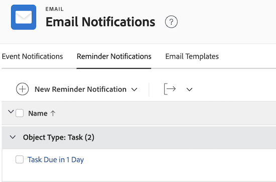

# Impostare le notifiche di promemoria

<!-- Audited: 1/2024 -->

Le notifiche di promemoria inviano e-mail ai destinatari in base a criteri specificati. È possibile associare manualmente le notifiche di promemoria agli elementi di lavoro, ad esempio progetti, attività, problemi e schede orario.

<!--
DRAFTED IN FLARE:
An example of how this can be used would be helpful here and/or in the section 
<a href="../../../workfront-basics/using-notifications/wf-notifications.md#reminder-notifications" class="MCXref xref">Reminder notifications</a>
 in 
<a href="../../../workfront-basics/using-notifications/wf-notifications.md" class="MCXref xref">Adobe Workfront notifications</a>

-->

## Requisiti di accesso

Per eseguire i passaggi descritti in questo articolo, è necessario disporre dei seguenti diritti di accesso:

<table style="table-layout:auto"> 
 <col> 
 <col> 
 <tbody> 
  <tr> 
   <td role="rowheader">piano Adobe Workfront</td> 
   <td>Qualsiasi</td> 
  </tr> 
  <tr> 
   <td role="rowheader">Licenza Adobe Workfront</td> 
   <td> 
Nuovo: Standard 

 
oppure
 

Corrente: Piano
 
</td> 
  </tr> 
  <tr> 
   <td role="rowheader">Configurazioni del livello di accesso</td> 
   <td> 
Planner o versione successiva, con accesso amministrativo per notifiche promemoria
</td> 
  </tr> 
 </tbody> 
</table>

Per ulteriori dettagli sulle informazioni contenute in questa tabella, vedere [Requisiti di accesso nella documentazione di Workfront](/help/quicksilver/administration-and-setup/add-users/access-levels-and-object-permissions/access-level-requirements-in-documentation.md).

## Personalizzare l’e-mail di promemoria

Puoi personalizzare l’oggetto, il corpo e il HTML nell’e-mail di notifica del promemoria.

In alternativa, puoi utilizzare l’e-mail predefinita inclusa nella notifica del promemoria. L’e-mail predefinita utilizza il nome della notifica del promemoria come oggetto dell’e-mail e il nome dell’oggetto nel corpo dell’e-mail, incluso l’evento che ha attivato la notifica.

Se desideri personalizzare l’e-mail di promemoria, devi creare un modello e-mail e allegarlo alla notifica del promemoria.

Per informazioni su come creare un modello e-mail, consulta [Configurare i modelli e-mail](../../../administration-and-setup/manage-workfront/emails/configure-email-templates.md).

## Creare una notifica di promemoria

{{step-1-to-setup}}

1. Clic **E-mail** > **Notifiche** > **Avvisi di Promemoria**.

   

1. Clic **Nuovo Avviso di Promemoria**.

1. Nell&#39;elenco a discesa fare clic sul tipo di oggetto che si desidera associare alla notifica di promemoria.

   Ad esempio, se desideri allegare una notifica di promemoria a una scheda orario, fai clic su **Scheda orario**.

1. In **Nuovo Avviso di Promemoria** nella casella visualizzata, specificare le seguenti informazioni.

   <table style="table-layout:auto"> 
    <col> 
    <col> 
    <tbody> 
     <tr> 
      <td role="rowheader">Nome notifica promemoria</td> 
      <td>Specificare un nome per la notifica di promemoria.</td> 
     </tr> 
     <tr> 
      <td role="rowheader">Periodo idoneo</td> 
      <td> 
Specifica il numero di ore, giorni lavorativi, giorni (giorni di calendario), settimane o mesi prima o dopo la data nella <strong>Tempistica</strong> campo.
 
<b>NOTA</b>:  
        <ul> 
         <li> 
Le notifiche di promemoria iniziano 24 ore dopo la data specificata e una volta soddisfatti tutti i criteri.
 </li> 
         <li> 
Le notifiche di promemoria per progetti, attività e problemi si attivano ogni notte a mezzanotte, ora di montagna negli Stati Uniti. Tutti gli oggetti idonei per una notifica di promemoria da quel giorno attivano una notifica agli utenti designati poco dopo tale momento.
 </li> 
         <li> 
Le notifiche di promemoria per le schede orario vengono inviate all’ora specificata in base al fuso orario e alla data di fine della scheda orario, alla data di inizio o alla data dell’ultimo aggiornamento.
 </li> 
        </ul> 
 </td> 
     </tr> 
     <tr> 
      <td role="rowheader">Timing</td> 
      <td> 
Seleziona l’evento che attiva la notifica di promemoria da programmare.
 
Se la notifica di promemoria è destinata a progetti, attività o problemi, le opzioni disponibili sono relative alla Data di completamento o alla Data di inizio. La notifica di promemoria tiene conto della marca temporale sulle date di completamento e di inizio dei progetti, delle attività e dei problemi.

   
Se la notifica di promemoria è destinata alle schede orario, le opzioni disponibili sono relative alla Data di fine, alla Data di inizio o alla Data ultimo aggiornamento. La notifica del promemoria per le schede orario tiene conto della marca temporale delle date di fine, inizio e ultimo aggiornamento della scheda orario. La scheda orario inizia a mezzanotte del giorno della data di inizio (12:00) e termina subito prima di mezzanotte della data di fine (23:59).

   
<b>NOTA</b>

      
Le notifiche dei promemoria delle schede orario vengono distribuite solo una volta ogni 24 ore.
 
Quando imposti più notifiche di promemoria entro un periodo di 24 ore, Workfront invia un’e-mail di notifica con tutti i promemoria inclusi nella notifica.

      
Ad esempio, se configuri tre notifiche di promemoria in modo che vengano attivate 10 ore prima, 2 ore prima e 1 ora prima di una data di scadenza, tutti e tre i promemoria verranno combinati nella stessa notifica se si verificano durante lo stesso giorno.
 
Tuttavia, se imposti una notifica di promemoria per 26 ore prima e un’altra per 1 ora prima di una data di scadenza, gli utenti riceveranno due notifiche separate. 

   </td> 
     </tr> 
     <tr> 
      <td role="rowheader">Criteri</td> 
      <td> 
Selezionare i criteri per qualificare la notifica di promemoria da programmare. Le notifiche di promemoria non vengono pianificate a meno che la selezione dei criteri non sia soddisfatta.
 
A seconda del tipo di oggetto selezionato nel passaggio 4, sono disponibili le seguenti opzioni di criteri:
 
       <ul> 
        <li><strong>Incompleto nei progetti correnti:</strong> <i>(Disponibile per promemoria attività e problemi)</i> La notifica di promemoria è pianificata per essere inviata solo quando lo stato dell'oggetto a cui è associata la notifica di promemoria non è Completo e lo stato del progetto è Corrente.</li> 
        <li><strong>Tutto nei progetti correnti:</strong> <i>(Disponibile per promemoria attività e problemi)</i> La notifica di promemoria è pianificata per essere inviata indipendentemente dallo stato dell'oggetto e solo quando lo stato del progetto a cui è associata la notifica di promemoria è Corrente.</li> 
        <li><strong>Progetti non Completati:</strong> <i>(Disponibile per i promemoria dei progetti)</i> La notifica di promemoria è pianificata per essere inviata quando lo stato del progetto è diverso da Completo.</li> 
        <li><strong>Tutti i progetti:</strong> <i>(Disponibile per i promemoria dei progetti)</i> La notifica di promemoria è pianificata per essere inviata indipendentemente dallo stato del progetto.</li> 
        <li><strong>Schede orario aperte:</strong> <i>(Disponibile per i promemoria delle schede orario)</i> La notifica di promemoria è pianificata per essere inviata quando lo stato della scheda orario è Aperto.</li> 
        <li><strong>Schede orario inviate:</strong> <i>(Disponibile per i promemoria delle schede orario)</i> La notifica di promemoria è pianificata per essere inviata quando lo stato della scheda orario è Inviato.</li> 
        <li><strong>Scheda orario aperta o meno di 40 ore a settimana:</strong> <i>(Disponibile per i promemoria delle schede orario)</i> La notifica di promemoria è pianificata per essere inviata quando lo stato della scheda orario è Aperto o quando la scheda orario ha registrato meno di 40 ore.</li> 
        <li><strong>Modello e-mail:</strong> Dall’elenco a discesa, seleziona un modello e-mail da allegare al promemoria. Per informazioni su come creare un modello e-mail, consulta <a href="../../../administration-and-setup/manage-workfront/emails/configure-email-templates.md" class="MCXref xref">Configurare i modelli e-mail</a>.</li> 
       </ul> </td> 
     </tr> 
     <tr> 
      <td role="rowheader">Destinatari</td> 
      <td>Seleziona i tipi di utenti a cui desideri inviare la notifica. Consente di selezionare tra vari soggetti interessati all'oggetto, ad esempio proprietario, approvatore o assegnatario.</td> 
     </tr> 
    </tbody> 
   </table>

1. Fai clic su **Salva**.
1. Allegare la notifica di promemoria a un elemento di lavoro, come descritto in [Allegare una notifica di promemoria a un oggetto](../../../workfront-basics/using-notifications/attach-reminder-notification-object.md).

## Ricevi una notifica di promemoria

Quando la condizione viene soddisfatta sull’elemento a cui è allegata la notifica del promemoria, viene attivata una notifica e-mail all’utente definito nella notifica del promemoria.

Per ulteriori informazioni sulla ricezione delle notifiche di promemoria, vedere [Notifiche promemoria](../../../workfront-basics/using-notifications/wf-notifications.md#reminder-notifications) sezione in [Notifiche Adobe Workfront](../../../workfront-basics/using-notifications/wf-notifications.md).

## Consegna notifiche promemoria test

Le notifiche di promemoria vengono attivate ogni notte a mezzanotte, ora di montagna. Tutti gli oggetti idonei per una notifica di promemoria attivano una notifica agli utenti designati poco dopo.

Per fare in modo che le notifiche dei promemoria vengano attivate manualmente, è necessario che la condizione per il promemoria sia soddisfatta.\
Ad esempio, se un promemoria è impostato per essere attivato un’ora dopo la data di completamento pianificata di un progetto, tale ora deve essere trascorsa tra la data in cui è stato impostato il promemoria e ora. Qualsiasi progetto con date di completamento pianificate passate prima dell’attivazione del promemoria non attiverà una notifica.

Per attivare manualmente una notifica di promemoria:

{{step-1-to-setup}}

1. Clic **Sistema** > **Diagnostica** nell&#39;angolo inferiore sinistro di Workfront.

1. Clic **Invia Avvisi di Promemoria** e attendi la conferma, nella parte superiore della schermata, dell’invio.

   Gli utenti designati nella notifica del promemoria ricevono un messaggio e-mail.

