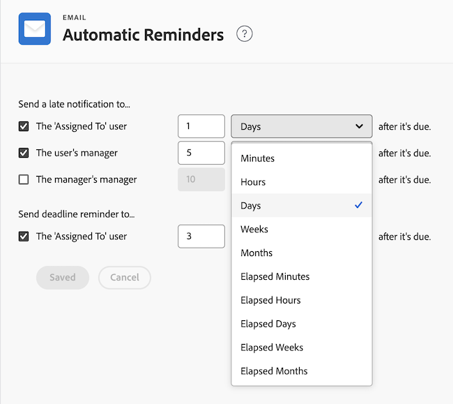

# Impostare promemoria automatici

<!--DON'T DELETE, DRAFT OR HIDE THIS ARTICLE. IT IS LINKED TO THE PRODUCT, THROUGH THE CONTEXT SENSITIVE HELP LINKS.-->

In qualità di amministratore di Adobe Workfront, puoi impostare promemoria automatici per attivare le notifiche e-mail quando tutte le attività o i problemi sono in scadenza, in ritardo o in prossimità della data di completamento pianificata. Dopo aver configurato queste impostazioni, gli utenti non possono disattivare i promemoria automatici.

Per le notifiche in ritardo, l’e-mail viene inviata ogni notte fino al completamento dell’attività o del problema.

Un promemoria automatico può essere inviato a uno o più dei seguenti:

* Gli utenti assegnati a un’attività o a un problema
* Responsabile immediato dell’utente
* Il manager del manager immediato

>[!NOTE]
>
>Non puoi modificare il contenuto o la riga dell’oggetto dell’e-mail attivata da un promemoria automatico.

## Requisiti di accesso

Per eseguire i passaggi descritti in questo articolo, è necessario disporre dei seguenti diritti di accesso:

<table style="table-layout:auto"> 
 <col> 
 <col> 
 <tbody> 
  <tr> 
   <td role="rowheader">piano Adobe Workfront</td> 
   <td>Qualsiasi</td> 
  </tr> 
  <tr> 
   <td role="rowheader">Licenza Adobe Workfront</td> 
   <td>Piano</td> 
  </tr> 
  <tr> 
   <td role="rowheader">Configurazioni del livello di accesso</td> 
   <td> 
Amministratore di sistema
 </td> 
  </tr> 
 </tbody> 
</table>

## Impostare promemoria automatici

1. Fai clic sull&#39;icona  del **menu principale** nell&#39;angolo superiore destro di Adobe Workfront, quindi fai clic su **Configurazione** .

1. Fai clic su **E-mail** >**Promemoria automatici**.

1. Nell&#39;area **Invia una notifica in ritardo a**, selezionare una delle opzioni seguenti:

   <table>
    <tr>
        <td>L'utente "Assegnato a"</td>
        <td>Seleziona questa opzione se desideri che l’utente assegnato a un’attività o a un problema riceva una notifica in ritardo relativa al ritardo del suo elemento di lavoro.</td>
        <td></td>
    </tr>
    <tr>
        <td>Il manager dell'utente</td>
        <td>Selezionare questa opzione se si desidera che il manager dell'utente riceva una notifica di ritardo relativa al ritardo dell'elemento di lavoro del referente diretto.</td>
        <td></td>
    </tr>
    <tr>
        <td>Il manager del manager</td>
        <td>Selezionare questa opzione se si desidera che il manager immediato riceva una notifica di ritardo relativa a un elemento di lavoro di uno degli utenti del referente diretto in ritardo.</td>
        <td></td>
    </tr>
    <tr>
        <td>L'utente "Assegnato a"</td>
        <td>Nell'area <b>Invia promemoria scadenza a</b>. Selezionare questa opzione se si desidera che l'utente assegnato a un'attività o a un problema riceva una notifica relativa all'elemento di lavoro che si avvicina alla data di scadenza.</td>
        <td></td>
    </tr>
</table>

1. Selezionare l&#39;ora per l&#39;invio del promemoria automatico selezionando la quantità di tempo precedente o successiva alla data di scadenza dell&#39;elemento di lavoro.

   L’ora viene calcolata a partire dalla Data di completamento pianificata dell’attività o del problema.

   Specifica il numero di minuti, ore, giorni, settimane o mesi per aggiungere il tempo alla data di completamento pianificata delle attività o dei problemi. Seleziona **Minuti trascorsi**, **Ore trascorse**, **Giorni trascorsi** o **Settimane trascorse** per aggiungere l&#39;ora che include i fine settimana, le festività e le ore non lavorative come indicato nella pianificazione.

   Ad esempio, se un&#39;attività viene assegnata il venerdì e ha una durata di 3 giorni, la data di completamento dell&#39;attività viene impostata per il lunedì (supponendo che sabato e domenica siano un fine settimana). Se l&#39;attività ha una durata di 3 giorni (non trascorsa), la data di completamento dell&#39;attività viene impostata su Mercoledì.

   

1. Fai clic su **Salva**.

## Ricevi promemoria automatici

Se sei l’entità designata in una notifica di Promemoria automatico, ricevi un’e-mail quando viene rispettata la scadenza specificata. Per le notifiche in ritardo, l’e-mail viene inviata ogni notte fino al completamento dell’attività o del problema.

Le attività con determinati tipi di relazione possono essere consegnate dopo la data di inizio specificata, anche se sono scadute. Ad esempio, se un&#39;attività ha un predecessore con una relazione Fine-Inizio (fs), non verrà inclusa nell&#39;e-mail, anche se è stata superata la data di inizio specificata, perché non è possibile avviare l&#39;attività fino al completamento del predecessore.

Per ulteriori informazioni sulla ricezione di e-mail di Promemoria automatici, consulta la sezione [Promemoria automatici](../../../workfront-basics/using-notifications/wf-notifications.md#automatic-reminders) nelle [notifiche Adobe Workfront](../../../workfront-basics/using-notifications/wf-notifications.md).

## Invia promemoria automatici

I promemoria automatici vengono inviati non appena viene rispettata l’ora selezionata dall’amministratore di Workfront.

Se desideri attivare manualmente l’invio dei promemoria automatici, utilizza la funzione Diagnostica. Per ulteriori informazioni sull&#39;accesso e l&#39;utilizzo di Diagnostica in Workfront, vedere [Utilizzare Diagnostica per attivare i processi automatizzati](../../../administration-and-setup/manage-workfront/run-diagnostics/use-diagnostics-to-trigger-automated-processes.md).
