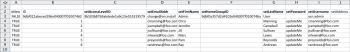
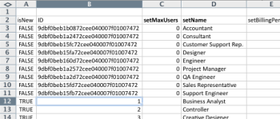

# Scenario Kick-Start: preparazione di Kick-Start per società, gruppo, ruolo e utente

Quando si inizia a implementare Adobe Workfront, anziché inserire manualmente i dati, è possibile importare l’elenco dei clienti, i reparti interni, le mansioni e le informazioni utente.

## Requisiti di accesso

+++ Espandi per visualizzare i requisiti di accesso per la funzionalità in questo articolo.

Per eseguire i passaggi descritti in questo articolo, è necessario disporre dei seguenti diritti di accesso:

<table style="table-layout:auto"> 
 <col> 
 <col> 
 <tbody> 
  <tr> 
   <td role="rowheader">piano Adobe Workfront</td> 
   <td>Qualsiasi</td> 
  </tr> 
  <tr> 
   <td role="rowheader">Licenza Adobe Workfront</td> 
   <td>
   
 Nuovo: Standard

   oppure
   
Corrente: Piano
</td> 
  </tr> 
  <tr> 
   <td role="rowheader">Configurazioni del livello di accesso</td> 
   <td>[!UICONTROL Amministratore di sistema]</td> 
  </tr> 
 </tbody> 
</table>

Per ulteriori dettagli sulle informazioni contenute in questa tabella, vedere [Requisiti di accesso nella documentazione di Workfront](/help/quicksilver/administration-and-setup/add-users/access-levels-and-object-permissions/access-level-requirements-in-documentation.md).

+++

## Cosa si può importare

Nella tabella seguente vengono visualizzate le società, i gruppi e i ruoli da importare:

| Aziende | Gruppi | Mansioni |
|---|---|---|
| Acme, Co 
Workfront, Inc. 
_La tua azienda_ 
XYZ, Inc. | Finanz 
IT 
Marketing 
Vendite | Analista aziendale 
Creative controller 
Designer 
Responsabile risorse 
Master Scrum 
Redattore tecnico 
Web Developer |

{style="table-layout:auto"}

I nomi dei ruoli devono essere univoci. Impossibile importare i ruoli di lavoro esistenti.

Nelle tabelle seguenti vengono visualizzati gli utenti da importare e diversi attributi utente per ciascuno di essi:

### Utente 1

| Attributo | Valore |
|---|---|
| **Nome** | Chris |
| **Cognome** | Manning |
| **Nome utente/E-mail** | mailto:cmanning@foo.com |
| **Password** | updateMe |
| **Accesso** | Membro team |
| **Società** | &lt;*Società>* |
| **Gruppo Predefinito** | Marketing |
| **Mansione** | Analista aziendale |

{style="table-layout:auto"}

### Utente 2

| Attributo | Valore |
|---|---|
| **Nome** | Jennifer |
| **Cognome** | Campbell |
| **Nome utente/E-mail** | jcampbell@foo.com |
| **Password** | updateMe |
| **Accesso** | Project Manager |
| **Società** | &lt;*Società>* |
| **Gruppo Predefinito** | Marketing |
| **Mansione** | Project Manager |

{style="table-layout:auto"}

### Utente 3

| Attributo | Valore |
|---|---|
| **Nome** | Jill |
| **Cognome** | Sullivan |
| **Nome utente/E-mail** | jsullivan@foo.com |
| **Password** | updateMe |
| **Accesso** | Help Desk |
| **Società** | &lt;*Società>* |
| **Gruppo Predefinito** | Vendite |
| **Mansione** | Agente di vendita |

{style="table-layout:auto"}

### Utente 4

| Attributo | Valore |
|---|---|
| **Nome** | Marc |
| **Cognome** | Lewis |
| **Nome utente/E-mail** | mlewis@foo.com |
| **Password** | updateMe |
| **Accesso** | Manager portfolio |
| **Società** | &lt;*Società>* |
| **Gruppo Predefinito** | Finanz |
| **Mansione** | Controller |

{style="table-layout:auto"}

### Utente 5

| Attributo | Valore |
|---|---|
| **Nome** | Pam |
| **Cognome** | Reynolds |
| **Nome utente/E-mail** | preynolds@foo.com |
| **Password** | updateMe |
| **Accesso** | Project Manager |
| **Società** | *Società>* |
| **Gruppo Predefinito** | Marketing |
| **Mansione** | IT |

{style="table-layout:auto"}

### Utente 6

| Attributo | Valore |
|---|---|
| **Nome** | Ray |
| **Cognome** | Andrews |
| **Nome utente/E-mail** | randrews@foo.com |
| **Password** | updateMe |
| **Accesso** | Amministratore |
| **Società** | *Società>* |
| **Gruppo Predefinito** | Responsabile risorse |
| **Mansione** | nessuno |

{style="table-layout:auto"}

## Scaricare un modello di Kick-Start

{{step-1-to-setup}}

1. Fai clic su **Sistema** > **Avvii** > **Importa dati.**

1. Fai clic su **Altre opzioni** per visualizzare l&#39;elenco completo delle opzioni di importazione.
1. Selezionare gli oggetti Livello di accesso, Società, Gruppo, Ruolo e Utente che si desidera importare.
1. Fai clic su **Scarica**.

## Inserisci informazioni sulla società

1. Apri il file **Workfront.xlsx** appena scaricato.

   >[!TIP]
   >
   >Quando si utilizzano fogli di dati molto grandi, può essere utile utilizzare lo strumento Blocca riquadro (o equivalente) dell’editor di fogli di calcolo per semplificare l’utilizzo del foglio di calcolo.

1. Vai al foglio **Società CMPY**.

   Deve essere vuoto, a meno che le aziende non siano già presenti nel sistema.

    

1. Immettere **TRUE** nella colonna **isNew**.

   Ripeti questa azione per ogni società aggiunta. In questo esempio, completa questa azione per le righe 3-6, perché vengono aggiunte quattro società.

   

1. Immetti un **ID** univoco.

   Immettere un ID per ogni riga. I numeri interi a partire da 1 funzionano bene quando si creano nuovi record.

   

1. Immettere i nomi di ciascun cliente nella colonna **setName**.

   

1. Passare al foglio **Gruppo**.

   A meno che non siano già stati creati gruppi in Workfront, in questo foglio deve essere visualizzato solo il Gruppo predefinito fornito con ogni account di Workfront.

    

1. Immettere **TRUE** nella colonna **isNew**.

   In base allo scenario, verranno importati 4 gruppi, quindi immetti **TRUE** nella colonna **isNew** per le righe dalla 4 alla 7.

1. Immetti un **ID** univoco.

   Immettere un ID per ogni riga. I numeri interi a partire da 1 funzionano bene quando si creano nuovi record.

   

1. Immettere i nomi di ogni reparto nella colonna **setName**.

   

1. Vai al foglio **Ruolo**.

   A meno che tu non abbia già creato o eliminato dei ruoli nel tuo account, in questo foglio dovrebbero essere visualizzati 8 ruoli forniti con ogni account di Workfront.

   

1. Immettere **TRUE** nella colonna **isNew**.

   In base allo scenario, verranno importati 7 Ruoli, quindi immetti **TRUE** nella colonna **isNew** per le righe da 12 a 18.

   

1. Immetti un **ID** univoco.

   Immettere un ID per ogni riga. I numeri interi a partire da 1 funzionano bene quando si creano nuovi record.

   

1. Immettere un nome per ogni ruolo nella colonna **setName**.

   

1. Fornisci ulteriori dettagli, se necessario.

   Includi tariffe di fatturazione, tariffe di costo e descrizioni per i Ruoli che stai creando, secondo necessità.

1. Passare al foglio **Utente**.

   A meno che tu non abbia già creato gli utenti nel tuo account, in questo foglio dovrebbe essere visualizzato solo l&#39;utente amministratore a cui è stato eseguito il provisioning con ogni account di Workfront.

    

1. Immettere **TRUE** nella colonna **isNew**.

   In base allo scenario, verranno importati 6 utenti, quindi immetti **TRUE** nella colonna **isNew** per le righe dalla 4 alla 9.

   

1. Immetti un **ID** univoco.

   Immettere un ID per ogni riga. I numeri interi a partire da 1 funzionano bene quando si creano nuovi record.

   

1. Immettere i nomi di ogni utente nelle colonne **setFirstName** e **setLastName**.

   

1. Impostare i valori di dettaglio immettendo i valori nelle colonne **setEmail**, **setPassword** e **setUsername**.

   

1. Specificare i valori del livello di accesso.

   Ad esempio, Chris Manning è un membro del team. Cercare l&#39;ID nel foglio **Livello di accesso ACSLVL** per il livello di accesso Membro del team. Copiare l&#39;ID e incollarlo nel foglio **USER** nella colonna **setAccessLevelID** della riga dell&#39;utente.

   Ripeti questo passaggio per ogni utente e livello di accesso.

    

1. Immettere i dettagli del Gruppo Predefinito dell&#39;utente.

   Secondo lo scenario, Chris Manning appartiene al gruppo Marketing. Nel foglio **Gruppo di gruppi**, individuare l&#39;ID del gruppo di marketing, copiarlo e incollarlo nel foglio **Utente** nella colonna **setHomeGroupID** della riga dell&#39;utente. &#x200B;Ripeti questo passaggio per ogni assegnazione di utenti e gruppi.

    

1. Inserisci i dettagli aziendali dell&#39;utente.

   Tutti gli utenti in questo scenario appartengono alla stessa società. Nel foglio **Società CMPY**, individua l&#39;ID per la società **La tua società**, copia l&#39;ID e, nella scheda **Utente**, incolla questo valore in ogni riga della colonna **setCompanyID**. &#x200B;

   Ripeti questo passaggio per ogni assegnazione di utenti e gruppi.

    

1. Immettere i dettagli della mansione dell&#39;utente.

   In base allo scenario, Chris Manning avrà il ruolo di Business Analyst. Nel foglio **Ruolo**, individuare l&#39;ID per il ruolo Analista business, copiarlo e incollarlo nel foglio **Utente** nella colonna **SetRoleID** della riga dell&#39;utente. &#x200B;Ripeti questo passaggio per ogni assegnazione di utenti e gruppi.

    

1. Compila gli altri dettagli utente, se necessario, quindi salva il file.
1. Importa il file di Excel.

   Segui le istruzioni fornite in [Importa dati in Adobe Workfront utilizzando un modello di avvio](/help/quicksilver/administration-and-setup/manage-workfront/using-kick-starts/import-data-via-kickstarts.md).

>[!NOTE]
>
>Gli utenti importati in Workfront vengono creati con lo stato Disattivato e In attesa di approvazione.
> 
>Se la tua organizzazione è stata migrata a Adobe Admin Console e un utente non esce dallo stato Disattivato e In attesa di approvazione entro pochi minuti, puoi aggiungere direttamente il batch di utenti a Adobe Admin Console.
>
>Per istruzioni, vedere [Gestione di più utenti | Caricamento CSV in blocco](https://helpx.adobe.com/it/enterprise/using/bulk-upload-users.html) nella documentazione di Adobe.
