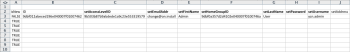
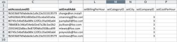
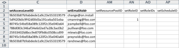

# Scenario Kick-Start: preparazione di Kick-Start per società, gruppo, ruolo e utente

Quando si inizia a implementare Adobe Workfront, anziché inserire manualmente i dati, è possibile importare l’elenco dei clienti, i reparti interni, le mansioni e le informazioni utente.

## Requisiti di accesso

+++ Espandi per visualizzare i requisiti di accesso per la funzionalità in questo articolo.

Per eseguire i passaggi descritti in questo articolo, è necessario disporre dei seguenti diritti di accesso:

<table style="table-layout:auto"> 
 <col> 
 <col> 
 <tbody> 
  <tr> 
   <td role="rowheader">piano Adobe Workfront</td> 
   <td>Qualsiasi</td> 
  </tr> 
  <tr> 
   <td role="rowheader">Licenza Adobe Workfront</td> 
   <td>
   
 Nuovo: Standard

   oppure
   
Corrente: Piano
</td> 
  </tr> 
  <tr> 
   <td role="rowheader">Configurazioni del livello di accesso</td> 
   <td>[!UICONTROL Amministratore di sistema]</td> 
  </tr> 
 </tbody> 
</table>

Per ulteriori dettagli sulle informazioni contenute in questa tabella, vedere [Requisiti di accesso nella documentazione di Workfront](/help/quicksilver/administration-and-setup/add-users/access-levels-and-object-permissions/access-level-requirements-in-documentation.md).

+++

## Cosa si può importare

Nella tabella seguente vengono visualizzate le società, i gruppi e i ruoli da importare:

<table style="table-layout:auto"> 
 <col> 
 <col> 
 <col> 
 <thead> 
  <tr> 
   <th><strong>Aziende</strong> </th> 
   <th><strong>Gruppi</strong> </th> 
   <th><strong>Ruoli</strong> </th> 
  </tr> 
 </thead> 
 <tbody> 
  <tr> 
   <td valign="top"> 
Acme, Co
 
Workfront, Inc.
 
<em>La tua azienda</em> 
 
XYZ, Inc.
 </td> 
   <td valign="top"> 
Finanz
 
IT 
 
Marketing 
 
Agente di Vendita
 </td> 
   <td valign="top"> 
Analista aziendale
 
Creatività controller
 
Designer
 
Responsabile risorse
 
Master Scrum
 
Redattore tecnico
 
Web Developer
 </td> 
  </tr> 
 </tbody> 
</table>

I nomi dei ruoli devono essere univoci. Impossibile importare i ruoli di lavoro esistenti.

Nelle tabelle seguenti vengono visualizzati gli utenti da importare e diversi attributi utente per ciascuno di essi:

### Utente 1

| **Nome** | Chris |
|---|---|
| **Cognome** | Manning |
| **Nome utente/E-mail** | mailto:cmanning@foo.com |
| **Password** | updateMe |
| **Accesso** | Membro team |
| **Società** | &lt;*Società>* |
| **Gruppo Predefinito** | Marketing |
| **Mansione** | Analista aziendale |

{style="table-layout:auto"}

### Utente 2

| **Nome** | Jennifer |
|---|---|
| **Cognome** | Campbell |
| **Nome utente/E-mail** | jcampbell@foo.com |
| **Password** | updateMe |
| **Accesso** | Project Manager |
| **Società** | &lt;*Società>* |
| **Gruppo Predefinito** | Marketing |
| **Mansione** | Project Manager |

{style="table-layout:auto"}

### Utente 3

| **Nome** | Jill |
|---|---|
| **Cognome** | Sullivan |
| **Nome utente/E-mail** | jsullivan@foo.com |
| **Password** | updateMe |
| **Accesso** | Help Desk |
| **Società** | &lt;*Società>* |
| **Gruppo Predefinito** | Agente di Vendita |
| **Mansione** | Agente di vendita |

{style="table-layout:auto"}

### Utente 4

| **Nome** | Marc |
|---|---|
| **Cognome** | Lewis |
| **Nome utente/E-mail** | mlewis@foo.com |
| **Password** | updateMe |
| **Accesso** | Manager portfolio |
| **Società** | &lt;*Società>* |
| **Gruppo Predefinito** | Finanz |
| **Mansione** | Controller |

{style="table-layout:auto"}

### Utente 5

| **Nome** | Pam |
|---|---|
| **Cognome** | Reynolds |
| **Nome utente/E-mail** | preynolds@foo.com |
| **Password** | updateMe |
| **Accesso** | Project Manager |
| **Società** | *Società>* |
| **Gruppo Predefinito** | Marketing |
| **Mansione** | IT |

{style="table-layout:auto"}

### Utente 6

| **Nome** | Ray |
|---|---|
| **Cognome** | Andrews |
| **Nome utente/E-mail** | randrews@foo.com |
| **Password** | updateMe |
| **Accesso** | Amministratore |
| **Società** | *Società>* |
| **Gruppo Predefinito** | Responsabile risorse |
| **Mansione** | nessuno |

{style="table-layout:auto"}

## Scaricare un modello di Kick-Start

{{step-1-to-setup}}

1. Fai clic su **Sistema** > **Avvii** > **Importa dati.**

1. Fai clic su **Altre opzioni** per visualizzare l&#39;elenco completo delle opzioni di importazione.
1. Selezionare gli oggetti Livello di accesso, Società, Gruppo, Ruolo e Utente che si desidera importare.

## Inserisci informazioni sulla società

1. Apri il file **Workfront.xlsx** appena scaricato.

   >[!TIP]
   >
   >Quando si utilizzano fogli di dati molto grandi, può essere utile utilizzare lo strumento Blocca riquadro (o equivalente) dell’editor di fogli di calcolo per semplificare l’utilizzo del foglio di calcolo.

1. Passare al foglio &#39;Società CMPY&#39;.

   Deve essere vuoto, a meno che le aziende non siano già presenti nel sistema. 

   

1. Specificare TRUE nella colonna **isNew**.
1. Ripeti questa azione per ogni società aggiunta. In questo esempio, completa questa azione per le righe 3-6, perché vengono aggiunte quattro società.

   

1. Specifica un ID univoco.

   Questa operazione deve essere eseguita per ogni riga della colonna ID. I numeri interi a partire da 1 funzionano bene quando si creano nuovi record.

   

1. Imposta un nome.

   Specificare i nomi di ciascun cliente nella colonna **setName**.

   

1. Passare al foglio Gruppo.

   A meno che non siano già stati creati gruppi in Workfront, in questo foglio deve essere visualizzato solo il Gruppo predefinito fornito con ogni account di Workfront.

    

1. Imposta la colonna **isNew**. In base allo scenario, verranno importati 4 gruppi, quindi specifica TRUE nelle righe da 4 a 7 per la colonna &#39;isNew&#39;.
1. Specifica un ID univoco.

   Questa operazione deve essere eseguita per ogni riga della colonna ID. I numeri interi a partire da 1 funzionano bene quando si creano nuovi record.

   

1. Imposta un nome.

   Specificare i nomi di ogni reparto nella colonna **setName**.

   

   Specificare le informazioni sul ruolo. Passare al foglio Ruolo.

1. A meno che tu non abbia già creato o eliminato dei ruoli nel tuo account, in questo foglio dovrebbero essere visualizzati 8 ruoli forniti con ogni account di Workfront.

   

1. Impostare l&#39;istruzione True.

   Sono in corso l’importazione di sette Ruoli, inserisci TRUE nelle righe da 12 a 18 per la colonna &quot;isNew&quot;.

   

1. Specifica un ID univoco.

   Questa operazione deve essere eseguita per ogni riga della colonna ID. I numeri interi a partire da 1 funzionano bene quando si creano nuovi record.

   

   

1. Specificare un nome per ogni ruolo digitandolo nella colonna setName.

   

1. Fornisci ulteriori dettagli, se necessario.

   Includi tariffe di fatturazione, tariffe di costo e descrizioni per i Ruoli che stai creando, secondo necessità.

1. Passare al foglio Utente per immettere le informazioni utente.

   A meno che tu non abbia già creato gli utenti nel tuo account, in questo foglio dovrebbe essere visualizzato solo l&#39;utente amministratore a cui è stato eseguito il provisioning con ogni account di Workfront.

    

1. Impostare il valore True specificando TRUE nelle righe da 4 a 9 per la colonna &#39;isNew&#39;, poiché vengono importati 6 utenti.

   

1. Imposta un ID univoco specificando un ID univoco in ogni riga per la colonna ID. In genere, i numeri interi a partire da 1 funzionano correttamente per i nuovi record.

   

1. Immettere i nomi di ogni utente nelle colonne &#39;setFirstName&#39; e &#39;setLastName&#39;.

   

1. Impostare i valori di dettaglio specificando i valori nelle colonne &#39;setEmail&#39;, &#39;setPassword&#39; e &#39;setUsername&#39;.

   

1. Specificare i valori del livello di accesso.

   Ad esempio, Chris Manning, membro del team, cerca l&#39;ID nel foglio Livello di accesso ACSLVL per il livello di accesso Membro del team. Copiare l&#39;ID negli Appunti e incollarlo nel foglio Utente nella colonna **setAccessLevelID** della riga di Chris.

   Ripeti questo passaggio per ogni utente e livello di accesso.

    

1. Specifica i dettagli del Gruppo Predefinito.

   Secondo lo scenario, Chris Manning appartiene al gruppo Marketing. Nel foglio Gruppo, individuare l&#39;ID del gruppo Marketing, copiarlo negli Appunti e incollarlo nella colonna **setHomeGroupID** della riga Chris. &#x200B;Ripeti questo passaggio per ogni assegnazione di utenti e gruppi.

    

1. Specifica i dettagli dell’azienda.

   Tutti gli utenti in questo scenario appartengono alla stessa società. Individuare l&#39;ID della società *La tua società *aziendale, copiare l&#39;ID negli Appunti e incollare questo valore in ogni riga della colonna &#39;setCompanyID&#39; nella scheda Utente&#x200B;

   Ripeti questo passaggio per ogni assegnazione di utenti e gruppi.

   

   

1. Specifica i dettagli della mansione.

   In base allo scenario, Chris Manning avrà il ruolo di Business Analyst. Nel foglio Ruolo individuare l&#39;ID per il ruolo Analista business, copiarlo negli Appunti e incollarlo nella colonna &#39;setRoleID&#39; della riga Chris. &#x200B;Ripeti questo passaggio per ogni assegnazione di utenti e gruppi.

   

   

1. Compila gli altri dettagli utente, se necessario, quindi salva il file.
1. Importa il file di Excel.

   Segui le istruzioni fornite in [Importa dati in Adobe Workfront utilizzando un modello di avvio](/help/quicksilver/administration-and-setup/manage-workfront/using-kick-starts/import-data-via-kickstarts.md).
