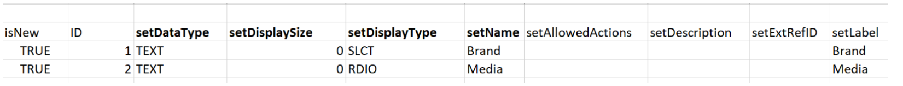

# Scenario Kick-Start: importare campi personalizzati con più opzioni in Workfront

{{highlighted-preview}}

Puoi importare campi personalizzati con più opzioni in Adobe Workfront utilizzando la funzionalità di avvio.

Di seguito sono riportati alcuni esempi di campi personalizzati con più opzioni:

* Elenco a discesa multi-selezione
* A discesa
* Checkboxe
* Pulsanti di scelta

Questi campi possono a volte avere molte (a volte centinaia) opzioni. L’importazione di questi file tramite la funzionalità di avvio rapido può farti risparmiare molto tempo, in qualità di amministratore di Workfront, e assicurarti di evitare gli errori.

>[!IMPORTANT]
>
>Per importare campi personalizzati con più opzioni utilizzando una funzione di avvio, è necessario seguire i passaggi descritti nelle sezioni seguenti nell’ordine indicato:
>
>1. Esporta dati personalizzati esistenti da Workfront (passaggio facoltativo)
>1. Esportare il modello di avvio per i dati personalizzati
>1. Compilare il foglio di calcolo Kick-Start di Excel
>1. Carica il foglio di calcolo Excel in Workfront

## Requisiti di accesso

+++ Espandi per visualizzare i requisiti di accesso per la funzionalità in questo articolo.

Per eseguire i passaggi descritti in questo articolo, è necessario disporre dei seguenti diritti di accesso:

<table style="table-layout:auto"> 
 <col> 
 <col> 
 <tbody> 
  <tr> 
   <td role="rowheader">piano Adobe Workfront</td> 
   <td>Qualsiasi</td> 
  </tr> 
  <tr> 
   <td role="rowheader">Licenza Adobe Workfront</td> 
   <td>
   
 Nuovo: Standard

   oppure
   
Corrente: Piano
</td> 
  </tr> 
  <tr> 
   <td role="rowheader">Configurazioni del livello di accesso</td> 
   <td>[!UICONTROL Amministratore di sistema]</td> 
  </tr> 
 </tbody> 
</table>

Per ulteriori dettagli sulle informazioni contenute in questa tabella, vedere [Requisiti di accesso nella documentazione di Workfront](/help/quicksilver/administration-and-setup/add-users/access-levels-and-object-permissions/access-level-requirements-in-documentation.md).

+++

## Esporta dati personalizzati esistenti da Workfront (passaggio facoltativo)

Se non si conosce la struttura del database di Workfront o se non si conosce il file di avvio richiesto da Workfront per importare le informazioni, è consigliabile esportare innanzitutto un file di avvio da Workfront con le informazioni esistenti, in modo analogo a quello dei campi che si desidera importare.

Ad esempio, se desideri importare moduli personalizzati o campi personalizzati, devi prima esportare un file di avvio con i dati personalizzati esistenti.

L’esportazione dei dati esistenti consente innanzitutto di analizzarli e vedere come devono essere formattati i nuovi dati.

Se si conoscono bene gli oggetti e la struttura del database di Workfront, è possibile continuare con la sezione seguente.

Per esportare dati esistenti da Workfront:

{{step-1-to-setup}}

1. Espandere **Sistema** nel menu a sinistra, quindi fare clic su **Esporta dati (Kick-Start)**.

1. Seleziona **Dati personalizzati** nella sezione **Cosa includere**.

   

1. Scegliere il file **.xlsx** nella sezione **Formato di download**.

   >[!TIP]
   >
   >A seconda della quantità di dati personalizzati disponibili nel sistema, l&#39;operazione potrebbe richiedere molto tempo.

1. Fai clic su **Scarica**. Un file .xlsx viene scaricato nel computer. Individualo e aprilo.

   

1. Esamina il file scaricato e prendi nota dei seguenti dettagli:

   * Il file contiene diversi fogli. Potrebbe non essere necessario conoscere le informazioni in ogni foglio, ma alcuni dei fogli verranno utilizzati per importare le informazioni. Prenditi un po’ di tempo per acquisire familiarità con il loro contenuto e in particolare con il formato del contenuto di ciascun foglio.
   * Presta particolare attenzione ai nomi delle colonne e al formato in cui vengono visualizzati i dati in ciascuna colonna.
   * Non è necessario modificare i nomi o l&#39;ordine delle colonne in nessuno dei fogli. Le intestazioni di colonna indicano i campi da compilare con le informazioni in ogni riga. Se l&#39;intestazione di colonna è in grassetto, si tratta di un campo obbligatorio, pertanto è necessario inserire informazioni in tale colonna.

   >[!IMPORTANT]
   >
   >Alcune intestazioni di colonna potrebbero non essere visualizzate in grassetto, ma potrebbero essere ancora necessarie.

   * Conserva il file scaricato per riferimento futuro e continua con la seguente sezione.

## Esportare il modello Kick-Start per i dati personalizzati

Dopo aver analizzato le informazioni sui campi personalizzati esistenti nel sistema, puoi scaricare un nuovo modello di avvio per l’importazione.

{{step-1-to-setup}}

1. Espandere **Sistema** nel menu a sinistra.

1. Fare clic su **Importa dati (Kick-Start)**.

1. Nell&#39;area **Scarica un foglio di calcolo Kick-Start vuoto**, selezionare la casella di controllo **Dati personalizzati** e fare clic su **Scarica**.

   

   Un file Kick-Start vuoto viene scaricato sul computer.

   >[!NOTE]
   >
   >Il numero di fogli nel file, i loro nomi e il numero e i nomi delle colonne in ciascun foglio devono essere identici a quelli della procedura di avvio scaricata nella sezione precedente che conteneva i dati personalizzati esistenti.

## Compilare il foglio di calcolo Kick-Start di Excel

Prima di popolare il foglio di calcolo Excel, scarica il modello di avvio come descritto nella sezione precedente.

>[!IMPORTANT]
>
>Non cercare di importare informazioni utilizzando un foglio di calcolo Excel ad hoc. Tutti i fogli di calcolo per l&#39;importazione di informazioni in Workfront mediante la funzionalità di avvio devono corrispondere al contenuto dei file scaricati da Workfront e descritti in questo articolo.

Per popolare il foglio di calcolo Excel con le informazioni per i nuovi campi personalizzati:

1. Aprire il foglio di calcolo di Excel scaricato nella sezione precedente e notare un certo numero di fogli. Ogni foglio rappresenta un oggetto nell&#39;applicazione.

   >[!INFO]
   >
   >Ad esempio, **Parametro** (che fa riferimento al campo personalizzato), **Opzione parametro** (che fa riferimento all&#39;opzione Campo personalizzato), **Categoria** (che fa riferimento al modulo personalizzato).
   >
   >È necessario scrivere i nomi degli oggetti e dei relativi attributi nel formato supportato dal database di Workfront.
   >
   >Per informazioni sul significato di questi oggetti, vedi il [Glossario della [!DNL Adobe Workfront] terminologia](../../../workfront-basics/navigate-workfront/workfront-navigation/workfront-terminology-glossary.md).
   >
   >Per informazioni sui nomi degli oggetti nel database di Workfront, vedere [API Explorer](../../../wf-api/general/api-explorer.md).
   >
   >

1. Verifica che le seguenti informazioni siano formattate correttamente:

   * La prima riga di ogni foglio deve rimanere vuota, altrimenti l’importazione genera un errore.
   * Le intestazioni di colonna in ciascun foglio rappresentano gli attributi degli oggetti che possono essere impostati durante un&#39;importazione. Tutte le intestazioni di colonna devono rimanere nello stesso ordine in cui si trovano quando si esporta il foglio e non possono essere rinominate.
   * Le intestazioni di colonna in grassetto sono campi obbligatori e devono avere un valore.

     >[!TIP]
     >
     >Alcune colonne sono obbligatorie anche se non sono in grassetto. Ad esempio, le colonne `isNew` e `ID` non sono in grassetto, ma sono campi obbligatori.

1. Selezionare il foglio `**PARAM Parameter`** e aggiungere informazioni sui nuovi campi personalizzati nelle seguenti colonne obbligatorie:

   * **`isNew`** = immetti **`TRUE`** in questa colonna per ogni riga che rappresenta un nuovo campo personalizzato. Indica che il campo è nuovo e non esiste in Workfront.

     >[!TIP]
     >
     >Se una riga rappresenta un campo esistente già in Workfront, immettere **`isNew`** = **`FALSE`**.

   * **`ID`** = deve essere un numero univoco per ogni riga che rappresenta un nuovo campo. È possibile utilizzare qualsiasi numero che inizia con 1, a condizione che ogni nuovo campo abbia un numero univoco.
   * **`setDataType`** = per ogni riga che rappresenta un nuovo campo, immettere il tipo di dati supportato dal campo. Il Tipo di dati deve essere immesso così come apparirebbe nel database. Selezionare uno dei tipi di dati seguenti:
      * **`NMBR`** per numero
      * **`CURC`** per la valuta
      * **`TEXT`** per testo
   * `**setDisplaySize**`= la dimensione di visualizzazione (&#39;**setDisplaySize**&#39;) per i campi personalizzati con più opzioni è sempre 0.
   * **`setDisplayType`** = per ogni riga che rappresenta un nuovo campo, immettere il tipo di visualizzazione del campo. Il Tipo di visualizzazione deve essere immesso come apparirebbe nel database.

     Per i campi personalizzati con più opzioni, seleziona una delle seguenti opzioni:

      * **`MULT`** per elenco a discesa a selezione multipla
      * **`SLCT`** per elenco a discesa
      * **`RDIO`** per pulsanti di scelta
      * **`CHCK`** per le caselle di controllo

     >[!TIP]
     >
     >Per trovare le informazioni relative al tipo di dati e al tipo di visualizzazione, fare riferimento a [API Explorer](../../../wf-api/general/api-explorer.md), espandere l&#39;oggetto **Parameter** e cercare questi attributi nella scheda **fields**.

   * **`setName`** = immetti il nome dei campi personalizzati da visualizzare in Workfront.

     >[!INFO]
     >
     >Ad esempio, è possibile importare due campi personalizzati, denominati _Brand_, un campo casella di controllo e _Media_, un campo pulsante di scelta.

   * Le colonne **`setName`** e **`setValue`** in genere contengono le stesse informazioni e devono riflettere i nomi desiderati nell&#39;interfaccia Workfront per il nuovo campo.

   Il valore di un campo è il nome visualizzato nei rapporti, ad esempio, mentre il nome viene visualizzato nei moduli personalizzati allegati agli oggetti.

   Per ulteriori informazioni, vedere [Creare un modulo personalizzato](/help/quicksilver/administration-and-setup/customize-workfront/create-manage-custom-forms/form-designer/design-a-form/design-a-form.md).

   

1. Selezionare il foglio **`POPT Parameter Options`** e aggiungere informazioni sulle opzioni di ciascun campo personalizzato nelle colonne obbligatorie seguenti:

   * **`isNew`** = immetti **`TRUE`** in questa colonna per ogni riga che rappresenta una nuova opzione di campo.

     >[!TIP]
     >
     >    Se una riga rappresenta un&#39;opzione esistente, immettere **`isNew`** = **`FALSE`**.

   * **`ID`** = deve essere un numero univoco per ogni riga che rappresenta una nuova opzione. È possibile utilizzare qualsiasi numero che inizia con 1, purché ogni nuova opzione abbia un numero univoco.
   * **`setIsDefault`** = immetti `TRUE` per le opzioni che desideri visualizzare per impostazione predefinita e `FALSE` per tutte le altre opzioni, per ogni campo.  Ad esempio, vogliamo che _Nike_ sia l&#39;opzione predefinita per _Brand_ e _Print_ sia l&#39;opzione predefinita per _Media_.

     >[!TIP]
     >
     >Per ogni campo è disponibile una sola opzione predefinita.

   * **`setParameterID`** = le opzioni corrispondenti al campo personalizzato _Brand_ hanno **`setParameterID`** di 1 e le opzioni corrispondenti al _Media_ hanno **`setParameterID`**di 2. I fogli `PARAM` e `POPT` si incrociano per indicare le opzioni appartenenti a ciascun campo personalizzato.
   * **`setDisplayOrder`**= la colonna dell&#39;ordine di visualizzazione indica l&#39;ordine di visualizzazione delle opzioni nel campo personalizzato. Puoi iniziare con 1 e continuare in ordine crescente per tutte le opzioni, indipendentemente dai campi a cui apparterranno. La cosa importante qui è avere numeri univoci per ogni opzione.
   * Le colonne **`setLabel`** e `**setValue`** in genere contengono le stesse informazioni e devono riflettere i nomi desiderati nell&#39;interfaccia utente di Workfront. Il valore di un’opzione è il nome visualizzato nei rapporti, ad esempio, mentre l’etichetta viene visualizzata nei moduli personalizzati quando è associata a un oggetto. Per ulteriori informazioni, vedere [Creare un modulo personalizzato](/help/quicksilver/administration-and-setup/customize-workfront/create-manage-custom-forms/form-designer/design-a-form/design-a-form.md).
   * **`setIsHidden`** = immetti `TRUE` se vuoi che una delle opzioni sia nascosta.

   

1. (Facoltativo) Se si desidera anche creare un modulo personalizzato in cui aggiungere i nuovi campi in un secondo momento, selezionare il foglio **`CTGY Category`** e aggiornare le seguenti colonne obbligatorie per le informazioni del modulo personalizzato:

   * **`isNew`** = immetti **`TRUE`** in questa colonna per ogni riga che rappresenta un nuovo modulo personalizzato.
   * **`ID`** = immettere un numero univoco per ogni riga che rappresenta un nuovo modulo. È possibile utilizzare qualsiasi numero che inizia con 1, purché ogni nuova opzione o linea abbia un numero univoco.
   * **`setGroupID`** = aggiungere l&#39;ID gruppo per il proprio gruppo predefinito o qualsiasi altro gruppo del sistema di cui si desidera avere accesso al modulo. Questo è un campo obbligatorio.

   Per individuare il `ID` di un gruppo, è possibile creare un report del gruppo e aggiungere il campo `ID` nella visualizzazione oppure passare a un gruppo e trovare l&#39;URL del gruppo. L’ID gruppo si trova nell’URL della pagina del gruppo. Ad esempio, se l&#39;URL del gruppo è `https://companyName.my.workfront.com/group/575b000800467a6f66e747932c807464/members`, l&#39;ID gruppo è `575b000800467a6f66e747932c807464`.

   * **`setCatObjCode`**= codice oggetto per il tipo di oggetto per cui si desidera creare il modulo. Immettere un codice dalle seguenti opzioni:
      * **`CMPY`** per la società
      * **`TASK`** per l&#39;attività
      * **`PROJ`** per il progetto
      * **`PORT`** per Portfolio
      * **`PRGM`** per il programma
      * **`USER`** per l&#39;utente
      * **`DOCU`** per il documento
      * **`OPTASK`** per il problema
      * **`EXPNS`** per Spesa
      * **`ITRN`** per iterazione
      * **`BILL`** per i record fatturazione
      * **`GROUP`** per il gruppo

     >[!NOTE]
     >
     >Per i moduli con più oggetti, immetti il primo oggetto da selezionare durante la creazione di un modulo nell’interfaccia utente. Impostare ad esempio `setCatObjCode` su `TASK`, se si seleziona Attività nell&#39;interfaccia di Workfront e quindi Problema, Portfolio e così via, ma non si desidera che il modulo sia disponibile per i progetti.

   * **`setName`** = nome del modulo personalizzato che si desidera venga visualizzato nell&#39;interfaccia di Workfront.

     

1. Salvare il foglio di calcolo come file xls o xlsx nel computer. Il foglio di calcolo Excel è stato compilato ed è pronto per l&#39;importazione in Workfront.

## Carica il foglio di calcolo Excel in Workfront

Dopo aver eseguito i passaggi descritti nelle sezioni precedenti, continuare con quanto segue per caricare i nuovi campi e moduli in Workfront:

{{step-1-to-setup}}

1. Fare clic su **Sistema > Importa dati (Kick-Start)**.

1. Fai clic su **Scegli il file** nella sezione **Carica dati con foglio di calcolo di avvio**.

1. Cercare il foglio di calcolo Excel preparato, nel computer e selezionarlo quando lo si trova.

   

   Il file viene caricato automaticamente e viene visualizzata una notifica di completamento dell’importazione. A seconda della quantità di informazioni importate, questo passaggio potrebbe richiedere alcuni secondi o un minuto.

   I nuovi campi e moduli personalizzati sono ora disponibili nel sistema Workfront. Puoi trovarli nell’area Forms personalizzata di Configurazione.

   >[!NOTE]
   >
   >I nuovi moduli e i campi importati non sono ancora connessi. Il modulo viene importato senza campi personalizzati. È necessario aggiungere manualmente i campi al nuovo modulo personalizzato o a un altro modulo personalizzato esistente.

   Per informazioni sull&#39;aggiunta di campi ai moduli personalizzati, vedere [Creare un modulo personalizzato](/help/quicksilver/administration-and-setup/customize-workfront/create-manage-custom-forms/form-designer/design-a-form/design-a-form.md).

   

1. (Solo nell&#39;ambiente di produzione) Fai clic su **Carica**.

   Viene visualizzata una notifica di completamento dell’importazione. A seconda della quantità di informazioni importate, questo passaggio potrebbe richiedere alcuni secondi o un minuto.

   I nuovi campi e moduli personalizzati sono ora disponibili nel sistema Workfront. Puoi trovarli nell’area Forms personalizzata di Configurazione.

   >[!NOTE]
   >
   >I nuovi moduli e i campi importati non sono ancora connessi. Il modulo viene importato senza campi personalizzati. È necessario aggiungere manualmente i campi al nuovo modulo personalizzato o a un altro modulo personalizzato esistente.

   Per informazioni sull&#39;aggiunta di campi ai moduli personalizzati, vedere [Creare un modulo personalizzato](/help/quicksilver/administration-and-setup/customize-workfront/create-manage-custom-forms/form-designer/design-a-form/design-a-form.md).

1. (Condizionale) Se l’importazione non è andata a buon fine, viene visualizzato un messaggio di errore in cui viene indicato il problema. Cercare di identificare il campo, il foglio e il numero di riga in cui è stato riscontrato il problema e correggere le informazioni nel file di Excel. Provare quindi a importare il file un&#39;altra volta.

1. (Condizionale) A seconda del problema, come indicato nel messaggio di errore, alcune informazioni potrebbero essere già state importate. Prima di importare nuovamente il foglio, è necessario effettuare una delle seguenti operazioni:

   * Elimina le informazioni importate correttamente da Workfront dall’area Forms personalizzato, quindi apporta la correzione indicata dal messaggio di errore.
   * Indica che un campo o un modulo è già presente nel sistema per i campi o i moduli già importati, quindi apporta la correzione.
Per indicare che un campo o un modulo personalizzato è già in Workfront, è necessario assicurarsi che il campo `inNew` sia contrassegnato come `FALSE` nei fogli che contengono informazioni sul modulo (`CTGY`) o sul campo (`PARAM`) nel foglio di importazione di avvio.
