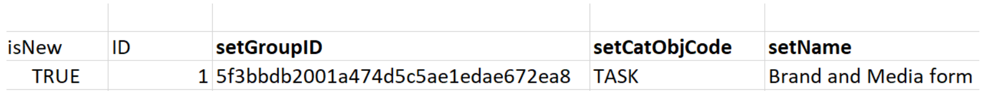
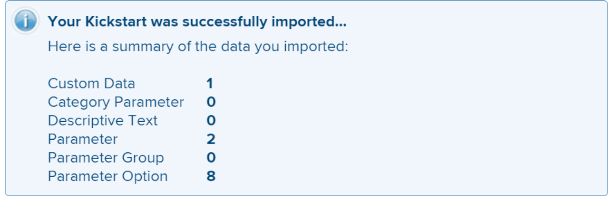

# Scenario Kick-Starts: Importare campi personalizzati con più opzioni in Workfront

È possibile importare campi personalizzati con più opzioni in Adobe Workfront utilizzando la funzionalità Avvio rapido .

Esempi di campi personalizzati con più opzioni sono:

* Elenco a discesa multi-selezione
* A discesa
* Checkboxe
* Bottoni Circolari

A volte questi campi possono avere molte (a volte centinaia) opzioni. L’importazione di questi elementi utilizzando la funzionalità Kick-Start consente di risparmiare molto tempo, in qualità di amministratore di Workfront, e di evitare errori.

>[!IMPORTANT]
>
>Per importare campi personalizzati con più opzioni mediante un avvio, è necessario seguire i passaggi descritti nelle sezioni seguenti, in questo ordine:
>
>1. Esporta dati personalizzati esistenti da Workfront (passaggio facoltativo)
>1. Esportare il modello di avvio rapido per i dati personalizzati
>1. Compilare il foglio di calcolo Excel Kick-Starts
>1. Caricare il foglio di calcolo Excel in Workfront

## Esporta dati personalizzati esistenti da Workfront (passaggio facoltativo)

Se non conosci la struttura del database Workfront o se non conosci il file di avvio richiesto da Workfront per importare le informazioni, ti consigliamo innanzitutto di esportare un file di avvio da Workfront con le informazioni esistenti, simile a quello dei campi che desideri importare.

Ad esempio, se desideri importare moduli personalizzati o campi personalizzati, devi prima esportare un file di avvio con dati personalizzati esistenti.

L’esportazione dei dati esistenti ti consente di analizzarli e di vedere come i nuovi dati devono essere formattati.

Se si conosce bene gli oggetti e la struttura del database Workfront, è possibile continuare con la sezione seguente.

Per esportare dati esistenti da Workfront:

1. Fai clic su **Menu principale > Configurazione** nell’angolo superiore destro dell’interfaccia Workfront.
1. Espandi la **Sistema** a sinistra, quindi fare clic su **Esportare i dati (Kick-Starts)**.

   

1. Seleziona **Dati personalizzati** in **Cosa includere** sezione .

   

1. Scegli **file .xlsx** in **Formato di download** sezione .

   >[!TIP]
   >
   >    A seconda della quantità di dati personalizzati nel sistema, questo potrebbe richiedere molto tempo.

   

1. Fai clic su **Scarica**. Un file .xlsx viene scaricato sul computer. Passa a e aprila.

   

1. Esamina il file scaricato e prendi nota dei seguenti dettagli:

   * Il file contiene diversi fogli. Potrebbe non essere necessario conoscere le informazioni in ogni foglio, ma utilizzerai alcuni dei fogli per importare le informazioni. Prenditi del tempo per acquisire familiarità con i loro contenuti e in particolare con il formato del contenuto in ogni foglio.
   * Presta particolare attenzione ai nomi delle colonne e al formato in cui vengono visualizzati i dati in ciascuna colonna.
   * Non è necessario modificare i nomi o l&#39;ordine delle colonne in nessuno dei fogli. Le intestazioni di colonna indicano i campi che è necessario compilare con le informazioni, in ogni riga. Se l’intestazione della colonna viene visualizzata in grassetto, si tratta di un campo obbligatorio, pertanto è necessario disporre di informazioni in tale colonna.
   >[!IMPORTANT]
   >
   >Alcune intestazioni di colonna potrebbero non essere visualizzate in grassetto, ma potrebbero essere comunque necessarie.

   * Mantieni il file scaricato per riferimento futuro e continua con la sezione seguente.

## Esporta il modello Kick-Starts per i dati personalizzati

Dopo aver analizzato le informazioni sui campi personalizzati esistenti nel sistema, puoi scaricare un nuovo modello di avvio per l’importazione.

1. Fai clic su **Menu principale > Configurazione** nell’angolo superiore destro dell’interfaccia Workfront.

1. Espandi la **Sistema** a sinistra.

1. Fai clic su **Importa dati (Kick-Starts)**.

   

1. In **Scarica un foglio di calcolo Kick-Start vuoto** area, scegli la **Dati personalizzati** seleziona e fai clic su **Scarica**.

   

   Un file di avvio vuoto viene scaricato nel computer.

   >[!NOTE]
   >
   >Il numero di fogli nel file, i loro nomi e il numero e i nomi delle colonne in ciascun foglio devono essere identici a quelli del riavvio scaricato nella sezione precedente che conteneva i dati personalizzati esistenti.

## Compilare il foglio di calcolo Excel Kick-Starts

Prima di compilare il foglio di calcolo excel, scarica il modello di avvio rapido come descritto nella sezione precedente.

>[!IMPORTANT]
>
>Non cercare di importare informazioni utilizzando un foglio di calcolo Excel ad hoc. Tutti i fogli di calcolo per importare informazioni in Workfront utilizzando la funzionalità di avvio rapido devono corrispondere al contenuto dei file scaricati da Workfront e descritti in questo articolo.

Per compilare il foglio di calcolo Excel con le informazioni per i nuovi campi personalizzati:

1. Apri il foglio di calcolo Excel scaricato nella sezione precedente e osserva alcuni fogli. Ogni foglio rappresenta un oggetto nell&#39;applicazione.

   >[!INFO]
   >
   >Ad esempio: **Parametro** (che fa riferimento al campo personalizzato), **Opzione parametro**(che fa riferimento all’opzione Campo personalizzato), **Categoria** (che fa riferimento a Modulo personalizzato).
   >
   >È necessario scrivere i nomi degli oggetti e i relativi attributi nel formato supportato dal database Workfront.
   >
   >Per informazioni sul significato di questi oggetti, vedere la [Glossario Workfront](../../../workfront-basics/navigate-workfront/workfront-navigation/workfront-terminology-glossary.md).
   >
   >Per informazioni sui nomi degli oggetti nel database Workfront, vedere la [Esplora API](../../../wf-api/general/api-explorer.md).
   >
   >

1. Assicurati che le seguenti informazioni siano formattate correttamente:

   * La prima riga di ogni foglio deve rimanere vuota, altrimenti l’importazione genera un errore.
   * Le intestazioni di colonna di ciascun foglio rappresentano gli attributi degli oggetti che possono essere impostati durante un’importazione. Tutte le intestazioni di colonna devono rimanere nello stesso ordine in cui vengono visualizzate quando si esporta il foglio e non possono essere rinominate.
   * Le intestazioni di colonna in grassetto sono campi obbligatori e devono avere un valore.

      >[!TIP]
      >
      >Alcune colonne sono obbligatorie anche se non sono in grassetto. Ad esempio, il `isNew` e `ID` le colonne non sono in grassetto, ma sono campi obbligatori.

1. Seleziona la `**PARAM Parameter`** e aggiungi informazioni sui nuovi campi personalizzati nelle seguenti colonne obbligatorie:

   * **`isNew`** = enter **`TRUE`** in questa colonna per ogni riga che rappresenta un nuovo campo personalizzato. Indica che il campo è nuovo e non esiste in Workfront.

      >[!TIP]
      >
      >    Se una riga rappresenta un campo esistente già in Workfront, immetti **`isNew`** = **`FALSE`**.

   * **`ID`** = deve essere un numero univoco per ogni riga che rappresenta un nuovo campo. È possibile utilizzare qualsiasi numero che inizia con 1, purché ogni nuovo campo abbia un numero univoco.
   * **`setDataType`** = per ogni riga che rappresenta un nuovo campo, immettere il tipo di dati supportato dal campo. Il tipo di dati deve essere immesso come apparirebbe nel database. Seleziona uno dei seguenti tipi di dati:
      * **`NMBR`** per Numero
      * **`CURC`** per valuta
      * **`TEXT`** per testo
   * `**setDisplaySize**`= dimensione del display (&#39;**setDisplaySize**&quot;) per qualsiasi campo personalizzato con più opzioni è sempre 0.
   * **`setDisplayType`** = per ogni riga che rappresenta un nuovo campo, immettere il tipo di visualizzazione del campo. Il tipo di visualizzazione deve essere immesso come apparirebbe nel database.

      Per i campi personalizzati con più opzioni, selezionare una delle opzioni seguenti:

      * **`MULT`** per menu a discesa con selezione multipla
      * **`SLCT`** a discesa
      * **`RDIO`** per pulsanti di scelta
      * **`CHCK`** per le caselle di controllo
      >[!TIP]
      >
      >Per trovare le informazioni sul tipo di dati e sul tipo di visualizzazione, fai riferimento alla [Esplora API](../../../wf-api/general/api-explorer.md), espandi **Parametro** e cercare questi attributi nella sezione **field** scheda .

   * **`setName`** = immetti il nome dei campi personalizzati come desideri che vengano visualizzati in Workfront.

      >[!INFO]
      >
      >Ad esempio, è possibile importare due campi personalizzati, denominati _Brand_, un campo casella di controllo e _Media_, un campo pulsante di scelta.

   * La **`setName`** e **`setValue`** in genere le colonne contengono le stesse informazioni e devono riflettere i nomi desiderati nell’interfaccia Workfront per il nuovo campo.
   Il valore di un campo è il nome visualizzato nei rapporti, ad esempio, mentre il nome viene visualizzato nei moduli personalizzati associati agli oggetti.

   Per ulteriori informazioni, consulta [Aggiungere un campo personalizzato a un modulo personalizzato](../../../administration-and-setup/customize-workfront/create-manage-custom-forms/add-a-custom-field-to-a-custom-form.md).

   

1. Seleziona la **`POPT Parameter Options`** e aggiungere informazioni sulle opzioni di ciascun campo personalizzato nelle colonne seguenti:

   * **`isNew`** = enter **`TRUE`** in questa colonna per ogni riga che rappresenta una nuova opzione di campo.

      >[!TIP]
      >
      >    Se una riga rappresenta un&#39;opzione esistente, immetti **`isNew`** = **`FALSE`**.

   * **`ID`** = deve essere un numero univoco per ogni riga che rappresenta una nuova opzione. Puoi utilizzare qualsiasi numero che inizia con 1, purché ogni nuova opzione abbia un numero univoco.
   * **`setIsDefault`** = enter `TRUE` per le opzioni da visualizzare per impostazione predefinita, e `FALSE` per tutte le altre opzioni, per ciascun campo.  Ad esempio, vogliamo _Nike_ come opzione predefinita per _Brand_ e _Stampa_ come opzione predefinita per _Media_.

      >[!TIP]
      >
      >Per ogni campo è disponibile una sola opzione predefinita.

   * **`setParameterID`** = le opzioni corrispondenti al _Brand_ i campi personalizzati hanno **`setParameterID`** 1 e le opzioni corrispondenti al _Media_ hanno un **`setParameterID`**2. La `PARAM` e `POPT` i fogli fanno riferimento incrociato per indicare quali opzioni appartengono a quale campo personalizzato.
   * **`setDisplayOrder`**= la colonna dell’ordine di visualizzazione indica l’ordine di visualizzazione delle opzioni nel campo personalizzato. Puoi iniziare con 1 e continuare in ordine crescente per tutte le opzioni, indipendentemente dai campi a cui appartengono. La cosa importante qui è avere numeri unici per ogni opzione.
   * La **`setLabel`** e `**setValue`** le colonne in genere contengono le stesse informazioni e devono riflettere i nomi desiderati nell’interfaccia utente di Workfront. Il valore di un’opzione è il nome visualizzato, ad esempio, nei rapporti, mentre l’etichetta viene visualizzata nei moduli personalizzati quando è collegata a un oggetto. Per ulteriori informazioni, consulta [Aggiungere un campo personalizzato a un modulo personalizzato](../../../administration-and-setup/customize-workfront/create-manage-custom-forms/add-a-custom-field-to-a-custom-form.md).
   * **`setIsHidden`** = enter `TRUE` se desideri che una qualsiasi delle opzioni sia nascosta.
   

1. (Facoltativo) Se desideri creare anche un modulo personalizzato in cui aggiungere i nuovi campi in un secondo momento, seleziona la  **`CTGY Category`** visualizza e aggiorna le seguenti colonne richieste per le informazioni sul modulo personalizzato:

   * **`isNew`** = enter **`TRUE`** in questa colonna per ogni riga che rappresenta un nuovo modulo personalizzato.
   * **`ID`** = immettere un numero univoco per ogni riga che rappresenta un nuovo modulo. È possibile utilizzare qualsiasi numero che inizia con 1, purché ogni nuova opzione o riga abbia un numero univoco.
   * **`setGroupID`** = aggiungere l&#39;ID gruppo per il gruppo home o qualsiasi altro gruppo nel sistema di cui si desidera avere accesso al modulo. Questo è un campo obbligatorio.
   Per scoprire il `ID` di un gruppo, puoi creare un rapporto di gruppo e aggiungere il `ID` in Visualizza oppure accedi a un gruppo e trova l’URL del gruppo. L&#39;ID gruppo sarà nell&#39;URL della pagina del gruppo. Ad esempio, se l’URL del gruppo è `https://companyName.my.workfront.com/group/575b000800467a6f66e747932c807464/members`, l&#39;ID gruppo è `575b000800467a6f66e747932c807464`.

   * **`setCatObjCode` **= codice dell’oggetto per il tipo di oggetto per il quale si desidera creare il modulo. Immetti un codice dalle seguenti opzioni:
      * **`CMPY`** per azienda
      * **`TASK`** per attività
      * **`PROJ`** per progetto
      * **`PORT`** per Portfolio
      * **`PRGM`** per programma
      * **`USER`** per utente
      * **`DOCU`** per il documento
      * **`OPTASK`** per problema
      * **`EXPNS`** per spese
      * **`ITRN`** per iterazione
      * **`BILL`** per i record di fatturazione
      * **`GROUP`** per gruppo
      >[!NOTE]
      >
      >Per i moduli con più oggetti, immettere il primo oggetto selezionato durante la creazione di un modulo nell’interfaccia utente. Ad esempio, imposta la `setCatObjCode` a `TASK`, se si seleziona Attività nell’interfaccia di Workfront e quindi Problema, Portfolio e così via, ma non si desidera che il modulo sia disponibile per Progetti.

   * **`setName`** = nome del modulo personalizzato come desiderato nell’interfaccia di Workfront.

      

1. Salva il foglio di calcolo come file .xls o .xlsx sul computer. Il foglio di calcolo Excel è stato compilato ed è ora pronto per l’importazione in Workfront.

## Caricare il foglio di calcolo Excel in Workfront

Dopo aver eseguito i passaggi descritti nelle sezioni precedenti, continua con quanto segue per caricare i nuovi campi e moduli in Workfront:

1. Fai clic su **Importare dati** **(Kick-Starts) **sotto il **Menu principale > Configurazione > Sistema** menu.

1. Fai clic su **Scegli file** nella sezione **Caricare dati con il foglio di calcolo Click-Start**.

1. Individuare il foglio di calcolo Excel preparato sul computer e selezionarlo quando lo si trova.  Quando il file viene riconosciuto da Workfront, il pulsante Carica diventa blu.
1. Fai clic su **Carica.**

   

1. Viene visualizzata una notifica dell’operazione di importazione completata. A seconda della quantità di informazioni che si sta importando, questo passaggio potrebbe richiedere alcuni secondi a un minuto.

   

   I nuovi campi e moduli personalizzati si trovano ora nel sistema Workfront. Puoi trovarli nell’area Personalizzato Forms di Configurazione.

   >[!NOTE]
   >
   >I nuovi moduli e i campi importati non sono ancora collegati. Il modulo viene importato senza campi personalizzati. È necessario aggiungere manualmente i campi al nuovo modulo personalizzato o a un altro modulo personalizzato esistente.

   Per informazioni sull’aggiunta di campi ai moduli personalizzati, consultare [Aggiungere un campo personalizzato a un modulo personalizzato](../../../administration-and-setup/customize-workfront/create-manage-custom-forms/add-a-custom-field-to-a-custom-form.md).

1. (Condizionale) Se l&#39;importazione non ha avuto esito positivo, viene visualizzato un messaggio di errore che informa del problema. Provare a identificare il campo, il foglio e il numero di riga in cui è stato rilevato il problema e correggere le informazioni nel file Excel, quindi provare a importare il file un&#39;altra volta.

   

1. (Condizionale) A seconda di quale sia il problema, come indicato nel messaggio di errore, alcune informazioni potrebbero essere già state importate. È necessario eseguire una delle operazioni seguenti prima di importare nuovamente il foglio:

   * Elimina le informazioni importate con successo da Workfront dall’area Personalizzato Forms, quindi apporta la correzione indicata dal messaggio di errore.
   * Indicare che un campo o un modulo è già incluso nel sistema per i campi o i moduli che hanno già importato, quindi eseguire la correzione.
Per indicare che in Workfront è già presente un campo o un modulo personalizzato, è necessario assicurarsi che la `inNew` campo contrassegnato come `FALSE` in fogli contenenti informazioni sul modulo (`CTGY`) o il campo (`PARAM`) nel foglio di importazione di avvio.
