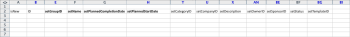

# Scenario Kick-Starts: preparazione semplice di progetti e operazioni di importazione

Descrive in dettaglio le impostazioni e i controlli disponibili per un progetto e un&#39;importazione di attività di base utilizzando il metodo Kick Start.

## Scenario

Il team di implementazione preferisce importare le informazioni sul progetto e sulle attività per i progetti attivi anziché inserire manualmente tali dati nel sistema.

* [Progetti](#projects)
* [Elenco attività](#task-list)

### Progetti {#projects}

Nella tabella seguente sono riportati quattro progetti e i relativi dettagli di base che devono essere mappati nei formati di file Avvio rapido.

Questo scenario presuppone che gli utenti siano già stati importati in Adobe Workfront. Se gli utenti non sono già in Workfront, assegna nomi diversi o completa lo scenario di avvio rapido con gli utenti prima di questo scenario.

1. Implementa Workfront.

   | Data di inizio pianificata | Oggi |
   |---|---|
   | Project Manager | Jennifer Campbell |
   | Sponsor del progetto | Marc Lewis |
   | Gruppo | Marketing |
   | Azienda | *Società* |

   {style=&quot;table-layout:auto&quot;}

1. Implementa il sistema HR.

   | Data di inizio pianificata | 14 luglio 2020XX |
   |---|---|
   | Project Manager | Pam Reynolds |
   | Sponsor del progetto | Marc Lewis |
   | Gruppo | Marketing |
   | Azienda | *Società* |

   {style=&quot;table-layout:auto&quot;}

1. Implementa il sistema di gestione dei documenti.

   | Data di inizio pianificata | 22 agosto 2020XX |
   |---|---|
   | Project Manager | Jennifer Campbell |
   | Sponsor del progetto | Ray Andrews |
   | Gruppo | IT |
   | Azienda | *Società* |

   {style=&quot;table-layout:auto&quot;}

1. Implementa Nuovo Sistema Calendario.

   | Data di inizio pianificata | 6 settembre 2020XX |
   |---|---|
   | Project Manager | Pam Reynolds |
   | Sponsor del progetto | Ray Andrews |
   | Gruppo | IT |
   | Azienda | *Società* |

   {style=&quot;table-layout:auto&quot;}

### Elenco attività {#task-list}

Nell&#39;elenco seguente vengono visualizzati elenchi di attività eccessivamente semplificati per i progetti. L’unica differenza tra i progetti è rappresentata dalle date di inizio e dai progressi compiuti in ciascun progetto.

I task padre ereditano la Durata, il Lavoro e la Percentuale di completamento dei task figlio. Non è necessario impostare tali valori affinché diventino attività di riepilogo.

>[!NOTE]
>
>Le istruzioni fornite in questo scenario non sono tanto esplicite quanto le istruzioni dettagliate fornite in [Scenario di partenza: Preparazione per azienda, gruppo, ruolo e avvio utente](../../../administration-and-setup/manage-workfront/using-kick-starts/kick-starts-scenario-company-group-role-user-prep.md). Il presupposto è che hai già imparato come cercare e copiare i valori dai fogli Azienda e Gruppo, quindi questi passaggi saranno menzionati, ma non descritti in modo specifico.

1. Configura.
1. Importa gli utenti.

   <table style="table-layout:auto"> 
    <col width="50%"> 
    <col width="50%"> 
    <tbody> 
     <tr> 
      <td role="rowheader">Assegnazione a</td> 
      <td>Ray Andrews</td> 
     </tr> 
     <tr> 
      <td role="rowheader">Attività principale</td> 
      <td>1</td> 
     </tr> 
     <tr> 
      <td role="rowheader">Durata</td> 
      <td>1 ora</td> 
     </tr> 
     <tr> 
      <td role="rowheader">Lavoro</td> 
      <td>1 ora</td> 
     </tr> 
     <tr> 
      <td role="rowheader">Percentuale completata</td> 
      <td> 
Workfront: 0%
 
HR: 100%
 
Documenti: 100%
 
Calendario: 100%
 </td> 
     </tr> 
    </tbody> 
   </table>

1. Imposta le autorizzazioni.

   <table style="table-layout:auto"> 
    <col width="50%"> 
    <col width="50%"> 
    <tbody> 
     <tr> 
      <td role="rowheader">Assegnazione a</td> 
      <td>Ray Andrews</td> 
     </tr> 
     <tr> 
      <td role="rowheader">Attività principale</td> 
      <td>1</td> 
     </tr> 
     <tr> 
      <td role="rowheader">Pred</td> 
      <td>2</td> 
     </tr> 
     <tr> 
      <td role="rowheader">Durata</td> 
      <td>1 ora</td> 
     </tr> 
     <tr> 
      <td role="rowheader">Lavoro</td> 
      <td>1 ora</td> 
     </tr> 
     <tr> 
      <td role="rowheader">Percentuale completata</td> 
      <td> 
Workfront: 0%
 
HR: 100%
 
Documenti: 100%
 
Calendario: 100%
 </td> 
     </tr> 
    </tbody> 
   </table>

1. Crea gruppi.

   <table style="table-layout:auto"> 
    <col width="50%"> 
    <col width="50%"> 
    <tbody> 
     <tr> 
      <td role="rowheader">Assegnazione a</td> 
      <td>Ray Andrews</td> 
     </tr> 
     <tr> 
      <td role="rowheader">Attività principale</td> 
      <td>1</td> 
     </tr> 
     <tr> 
      <td role="rowheader">Pred</td> 
      <td>4</td> 
     </tr> 
     <tr> 
      <td role="rowheader">Durata</td> 
      <td>2 giorni</td> 
     </tr> 
     <tr> 
      <td role="rowheader">Lavoro</td> 
      <td>4 ore</td> 
     </tr> 
     <tr> 
      <td role="rowheader">Percentuale completata</td> 
      <td> 
Workfront: 0%
 
HR: 100%
 
Documenti: 100%
 
Calendario: 25%
 </td> 
     </tr> 
    </tbody> 
   </table>

1. Prepara l&#39;addestramento.

   <table style="table-layout:auto"> 
    <col width="50%"> 
    <col width="50%"> 
    <tbody> 
     <tr> 
      <td role="rowheader">Assegnazione a</td> 
      <td>Chris Manning</td> 
     </tr> 
     <tr> 
      <td role="rowheader">Durata</td> 
      <td>2 giorni</td> 
     </tr> 
     <tr> 
      <td role="rowheader">Lavoro</td> 
      <td>4 ore</td> 
     </tr> 
     <tr> 
      <td role="rowheader">Percentuale completata</td> 
      <td> 
Workfront: 0%
 
HR: 100%
 
Documenti: 50%
 
Calendario: 100%
 </td> 
     </tr> 
    </tbody> 
   </table>

1. Creare politiche di supporto continue.

   <table style="table-layout:auto"> 
    <col width="50%"> 
    <col width="50%"> 
    <tbody> 
     <tr> 
      <td role="rowheader">Assegnazione a</td> 
      <td>Chris Manning</td> 
     </tr> 
     <tr> 
      <td role="rowheader">Durata</td> 
      <td>2 giorni</td> 
     </tr> 
     <tr> 
      <td role="rowheader">Lavoro</td> 
      <td>4 ore</td> 
     </tr> 
     <tr> 
      <td role="rowheader">Percentuale completata</td> 
      <td> 
Workfront: 0%
 
HR: 100%
 
Documenti: 50%
 
Calendario: 0%
 </td> 
     </tr> 
    </tbody> 
   </table>

1. Abbandono.

   | Pred | 1, 6, 7 |
   |---|---|

   {style=&quot;table-layout:auto&quot;}

1. Addestrare gli utenti.

   <table style="table-layout:auto"> 
    <col width="50%"> 
    <col width="50%"> 
    <tbody> 
     <tr> 
      <td role="rowheader">Assegnazione a</td> 
      <td>Chris Manning</td> 
     </tr> 
     <tr> 
      <td role="rowheader">Attività principale</td> 
      <td>8</td> 
     </tr> 
     <tr> 
      <td role="rowheader">Durata</td> 
      <td>1 giorno</td> 
     </tr> 
     <tr> 
      <td role="rowheader">Lavoro</td> 
      <td>2 ore</td> 
     </tr> 
     <tr> 
      <td role="rowheader">Percentuale completata</td> 
      <td> 
Workfront: 0%
 
HR: 0%
 
Documenti: 0%
 
Calendario: 0%
 </td> 
     </tr> 
    </tbody> 
   </table>

## Modello di download

Passa alla pagina Inizio clic. Selezionare gli oggetti Azienda, Gruppo, Progetto, Attività e Utente. Seleziona la casella di controllo Includi dati esistenti (fai questo per fare rapidamente riferimento agli ID azienda, gruppo e utente). Fai clic sul pulsante Scarica .

## Dettagli progetto di input

Apri il file Workfront.xlsx appena scaricato. Passare al foglio Progetto PROJ.

\
A meno che non siano già stati creati progetti in Workfront, questi devono essere vuoti.\

>[!NOTE]
>
>È consigliabile utilizzare lo strumento Blocca riquadri del foglio di calcolo e/o nascondere o rimuovere le colonne non necessarie per semplificare l’utilizzo del foglio. Tuttavia, fare attenzione a non rimuovere le colonne o le colonne richieste da utilizzare in seguito.

Imposta i valori per i seguenti campi del progetto:

* **Imposta èNuova colonna**
Inserisci TRUE nelle righe da 3 a 6 per la colonna isNew.
* **Imposta ID univoci**
Inserisci un ID univoco in ogni riga per la colonna ID. In genere, i numeri interi a partire da 1 funzionano bene quando si creano nuovi record.
* **Imposta nomi progetto**
Immetti i nomi di ciascun progetto nella colonna setName.
* **Imposta pianificazione progetto**

   Immetti l’ID della pianificazione da utilizzare nel campo setScheduleID

* **Imposta la data di inizio prevista del progetto**

   Immetti la data e l&#39;ora nella colonna setPlannedStartDate con l&#39;ora e la data in cui vuoi che inizi il progetto. Se lasciato vuoto, Workfront importa il progetto con la data del giorno corrente e una marca temporale della mezzanotte del giorno in questione in base al fuso orario del browser.

* **Imposta numeri attività**
Immettere i valori nella colonna setTaskNumber per controllare l&#39;ordine in cui verranno visualizzate le attività nel piano di progetto.
* **Specifica le date del progetto.**
Immettere la Data inizio pianificata per ciascun progetto nella colonna setPlannedStartDate.
* **Imposta altri dettagli necessari.**
Se necessario, compila altri dettagli, ad esempio una descrizione o lo stato corrente. Individua gli ID gruppo per ogni progetto nel foglio Gruppo GRUPPO e inseriscili nella colonna setGroupID per i rispettivi progetti. Cerca l&#39;ID società per i progetti nel foglio Società CMPY e inseriscilo nella colonna setCompanyID . Individua l&#39;ID utente per ogni proprietario del progetto nel foglio utente USER e inseriscilo nella colonna setOwnerID. Cerca l&#39;ID utente per ogni sponsor del progetto nel foglio Utente UTENTE e inseriscilo nella colonna setSponsorID .

>[!NOTE]
>
>È possibile individuare i valori accettabili per i campi Stato e Priorità esaminando le preferenze di stato e priorità per ciascun oggetto nell’area Configurazione flusso di lavoro di Workfront.

## Dettagli attività di input

È possibile aggiungere informazioni sulle attività del progetto mentre si importa il progetto tramite i primi passi.

Apri il file Workfront.xlsx appena scaricato. **Passare al foglio attività ATTIVITÀ.**

A meno che non siano già state create attività in Workfront, questo foglio deve essere vuoto.

Il modo più semplice per eseguire la mappatura delle attività consiste in un progetto alla volta (in particolare quando le attività sono le stesse su ciascun progetto). È quindi possibile copiare il piano attività per il primo progetto e apportare lievi modifiche al piano attività per i progetti successivi. Per i passaggi successivi si presuppone la creazione di attività solo per il progetto Implementa Workfront. In base allo scenario, importerai 9 attività per progetto, quindi inserisci TRUE nelle righe da 3 a 11 per la colonna isNew.

Impostare i valori per i campi attività seguenti:

* **Imposta ID**
Immetti un ID univoco in ogni riga della colonna ID.
* **Imposta nomi**
Immettere i nomi delle attività nella colonna setName.
* **Conferma ID progetto**
Immetti l’ID impostato per il progetto Implementare Workfront; controlla il foglio del progetto PROJ per assicurarti che sia l’ID corretto.
* **Imposta utenti**
Vai al foglio utente USER per cercare l&#39;ID per l&#39;utente assegnato a ogni attività e inserire questi valori nelle rispettive celle nella colonna setAssignedToID .
* **Identificare le relazioni tra attività**
Per le attività da 2 a 5, inserire un 1 nella colonna setParentID . Per l&#39;attività 9, inserire un 8 nella colonna setParentID . Nella colonna setPredecessorString, immettere il numero dell&#39;attività per ogni attività predecessore. Nei casi in cui un&#39;attività ha più predecessori, come l&#39;attività 8 in questo scenario, sarà necessario utilizzare una virgola per separare ogni ID attività predecessore. I predecessori possono essere definiti con un ritardo nelle relazioni non-Finish-Start utilizzando la struttura abbreviata descritta nell&#39;articolo Creazione di relazioni predecessori .
* **Imposta durata**
Impostare la durata di ogni attività inserendo il numero di ore, giorni, settimane o mesi per l&#39;attività nel campo setDuration. Quindi inserisci l&#39;unità di durata nel campo setDurationUnit .

   |  | Valore accettabile |
   |---|---|
   | Minuti | M |
   | Ore | H |
   | Giorni | Dsbld |
   | Settimane | M |
   | Mesi | G |

   I minuti possono anche essere rappresentati come frazione di un&#39;ora (ad esempio, minutets = 5 ore)

* Impostare la quantità di sforzo per ogni attività nel campo setWorkRequired . Quindi immettere l&#39;unità di lavoro nel campo setWorkUnit. Se il valore Work Required è diverso dalla durata, dovrai anche inserire una A nel campo setDurationType .

   | Tipo di Durata | Valore accettabile |
   |---|---|
   | Incarico Calcolato | A |
   | Lavoro Calcolato | M |
   | Impegno Aggiuntivo | Dsbld |
   | Semplice | S |

* Immettere la rappresentazione numerica completa della percentuale di completamento nel campo setPercentComplete per ogni attività. Questo valore non deve includere il simbolo di percentuale (%).
* Includi una descrizione e altri dettagli per ogni attività che crei, in base alle esigenze.

   

* Le colonne setPlannedStartDate e setTaskConstraint non vengono utilizzate per generare la timeline di questo progetto, in quanto ci affidiamo alle relazioni predecessori. È invece possibile immettere una data per ogni attività. In questo caso, assicurarsi anche di fornire un vincolo di attività valido nella colonna setTaskConstraint. Per informazioni dettagliate sui valori validi per questo campo, consultare il vincolo Attività e gli articoli correlati.

   Nel caso di questo scenario, il modo più semplice per creare le attività per gli altri progetti da importare è quello di copiare le attività appena definite e incollarle di seguito, a partire dalla riga 12. Poi:

   1. Rinumera i valori nella colonna ID.
   1. Aggiorna la colonna setProjectID al valore impostato per il progetto successivo.
   1. Aggiornare i valori setParentID e setPredecessorString per riflettere i nuovi ID assegnati alle attività del progetto.
   1. Aggiornare le assegnazioni delle attività e la percentuale di completamento.
   1. Ripetere questi passaggi per le attività del progetto successivo.

* **Importare il file Excel**

   Seguire le indicazioni fornite in [Importare dati in Adobe Workfront utilizzando un modello Click-Start](../../../administration-and-setup/manage-workfront/using-kick-starts/import-data-via-kickstarts.md).
